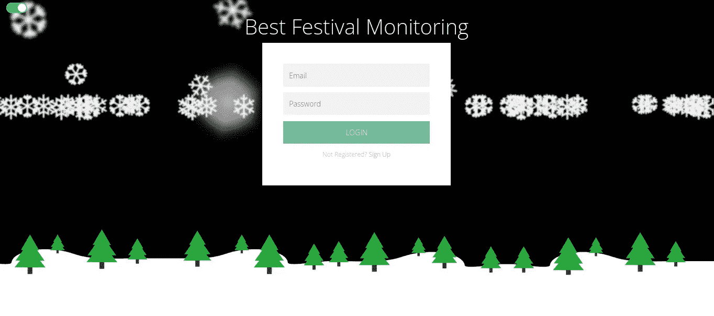
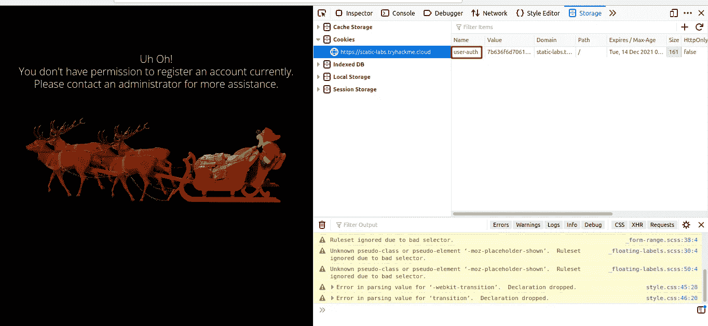
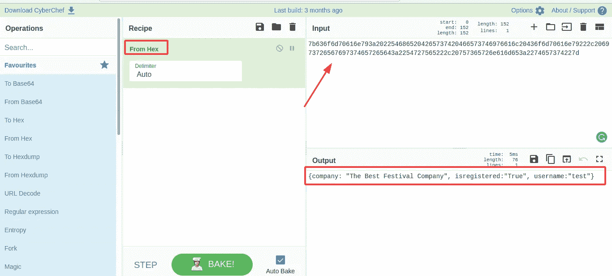
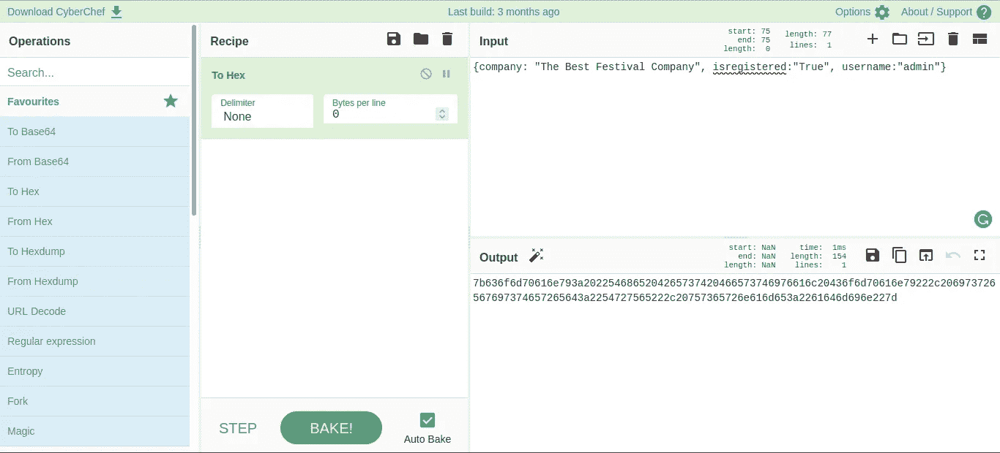
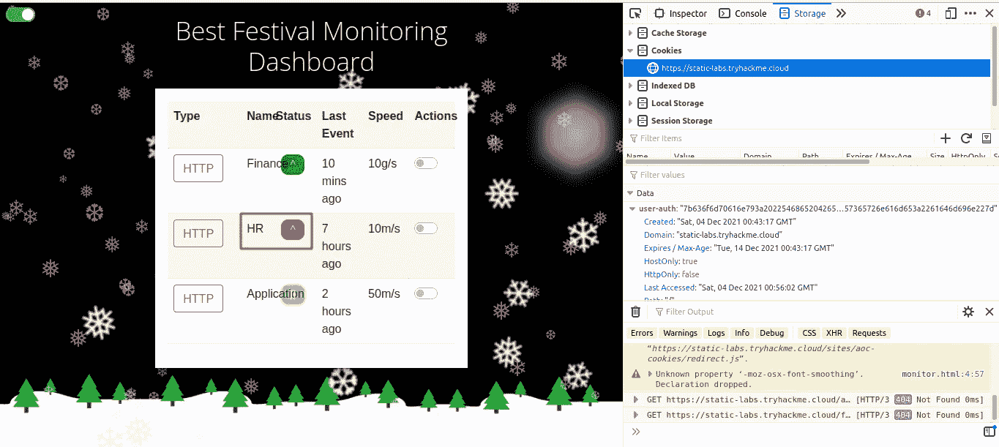
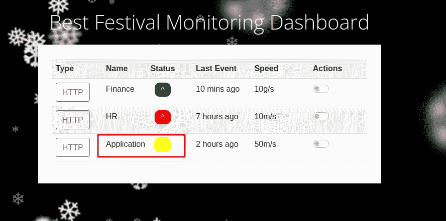

# [第二天]网络开发 Elf 人力资源问题|赛博 3 的到来(2021 年)

> 原文：<https://infosecwriteups.com/day-2-web-exploitation-elf-hr-problems-advent-of-cyber-3-2021-daeeaf71dd10?source=collection_archive---------0----------------------->

第二天，我们将学习认证旁路。

## **让我们绕过认证..**

1.在新的标签页中打开静态站点，[在这里](https://static-labs.tryhackme.cloud/sites/aoc-cookies/)。

> 只需点击**问题完成**

2.注册一个帐户，并使用浏览器中的开发工具验证 cookies。

为您的帐户创建的新 cookie 的名称是什么？

> 用户授权

登录后在页面中创建帐户并检查。

3.cookie 值使用了什么编码类型？

> 十六进制的

使用[https://gchq.github.io/CyberChef](https://gchq.github.io/CyberChef)来转换 Cookie 值。因为数字只有[0–9]和[a-f]，所以我选择了十六进制，它值:)

4.cookie 的数据以什么对象格式存储？

> JSON

5.操纵 cookie 并绕过登录门户。管理员 cookie 的价值是什么？(用户名=管理员)

> 7b 636 F6 d 70616 e 793 a 2022546865204265737420466573746976616 c 20436 f 6d 70616 e 79222 c 20697372656797374657265643 a 2254727565222 c 207575365726 e 616 e 616d 65。

从 JSON 转换成 Hex。

6.什么团队环境没有反应？

> 人力资源（部）

7.什么团队环境有网络预警？

> 应用

8.如果您想了解更多关于认证旁路的信息，我们建议您尝试一下这个房间[https://tryhackme.com/jr/authenticationbypass](https://tryhackme.com/jr/authenticationbypass)

> 只需点击**问题完成**

9.每天发布的任务变得越来越难(但仍然有演练视频指导)。明天再来参加第三天的任务，InsiderPHD 将录制一段视频演练！

> 点击**问题完成**

## 结论

通过更多的练习，确定你可以学到的编码值。而这个房间非常适合练习认证旁路知识。https://tryhackme.com/jr/authenticationbypass。

谢谢