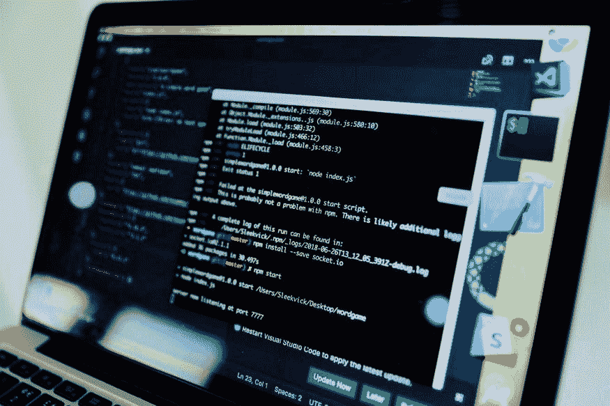
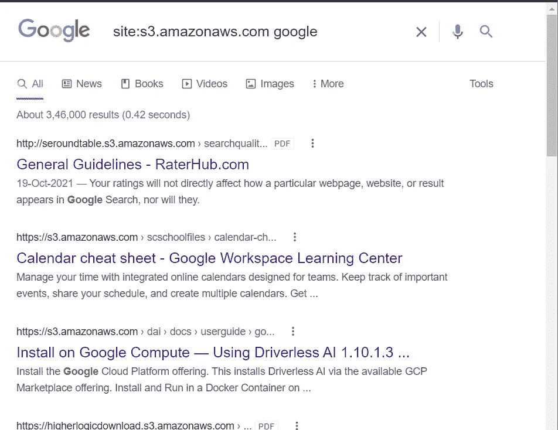
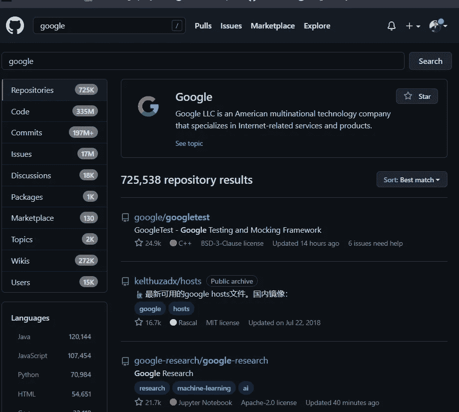

# 第 20 天，网络侦察或信息收集—第 5 部分# 100 天黑客攻击

> 原文：<https://infosecwriteups.com/day-20-web-reconnaissance-or-information-gathering-part-5-100daysofhacking-5392d48233db?source=collection_archive---------1----------------------->

获取第 1 天到第 19 天的所有资料，[**点击此处**](https://github.com/ayush098-hub/100DaysofHacking) 或 [**点击此处**](https://3xabyt3.medium.com/list/100daysofhacking-challenge-3db6061da4b1) **。**

在我们之前的博客中，我们了解了如何抓取任何网站，这有助于我们获得特定网站中可用的各种文件和目录。

让我们谈谈其他一些技巧:

## 第三方托管

一些网站在第三方托管服务中托管一些文件或图像，如亚马逊 S3 桶[简单存储服务]。组织支付一些钱来存储他们的文件。实际上，亚马逊 S3 是 AWS 的一项服务，当你了解云计算概念时，就会了解它。

如果一个组织使用 amazon s3，那么它可能包含一些隐藏文件、端点、日志、源代码和其他可能对我们有用的信息。

现在的问题是，我们如何找到使用它的任何公司的 amazon s3 bucket。所以，第一种方法是，我们可以使用谷歌呆子。

> 网站:s3.amazonaws.com 公司名称
> 
> 网站:amazonaws.com 公司名称

在这里，您可以看到，我们已经获得了许多结果，并且有许多文件托管在 s3 存储桶上。

一些公司使用自定义网址，因此，在这种情况下，公司从网址中删除 s3 或 aws，所以我们可以尝试一些其他搜索:-

> amazonaws s3 公司名称
> 
> 亚马逊铲斗公司 _ 名称
> 
> 亚马逊公司名称
> 
> s3 公司名称

另一种找到 s3 桶的方法是使用在线工具，**格雷哈特战争，**[https://buckets.grayhatwarfare.com/,](https://buckets.grayhatwarfare.com/,)这是一个在线搜索引擎，我们可以用它来找到公开暴露的 s3 桶。我们可以使用与目标相关的关键字，如目标名称、一些项目名称等。

我们可以用 https://github.com/nahamsec/lazys3 或者

我们可以用[https://github.com/eth0izzle/bucket-stream.git](https://github.com/eth0izzle/bucket-stream.git)这个也可以。

根据我的看法，我认为最好的方法是 google dorking。

现在来说说 github recon。

## Github 侦察

Github recon 的意思是，我们找到组织的 Github 存储库，并尝试搜索意外提交的敏感数据或对我们更有价值的信息。

我们也可以使用自动化工具 gitrob，[https://github.com/michenriksen/gitrob](https://github.com/michenriksen/gitrob)。

要安装 gitrob，[点击此处](https://medium.com/@pig.wig45/setting-up-gitrob-and-using-it-to-find-leaking-repository-of-an-employee-in-a-hackerone-private-e4c40da1bc85)

你可以阅读这个博客来了解更多关于 github recon 的信息

 [## GitHub Recon——真的很深

### 大家好，我知道我写博客的速度下降了，这是因为我忙于其他事情…

shahjerry33.medium.com](https://shahjerry33.medium.com/github-recon-its-really-deep-6553d6dfbb1f) 

今天到此为止，

感谢您抽出时间，我们将在下一篇文章中讨论不同的漏洞。

快乐学习📖祝你黑客愉快💻

# 🔈 🔈Infosec Writeups 正在组织其首次虚拟会议和网络活动。如果你对信息安全感兴趣，这是最酷的地方，有 16 个令人难以置信的演讲者和 10 多个小时充满力量的讨论会议。[查看更多详情并在此注册。](https://iwcon.live/)

 [## IWCon2022 - Infosec 书面报告虚拟会议

### 与世界上最优秀的信息安全专家建立联系。了解网络安全专家如何取得成功。将新技能添加到您的…

iwcon.live](https://iwcon.live/)