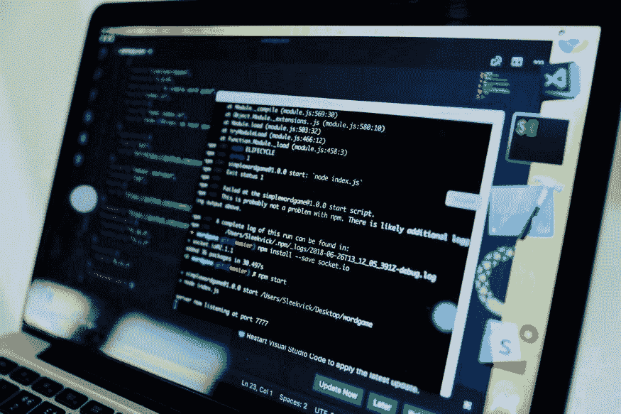
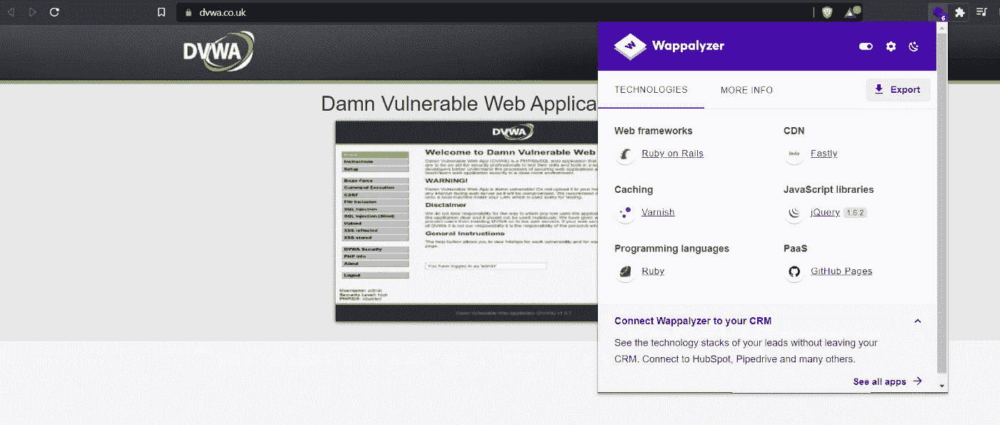
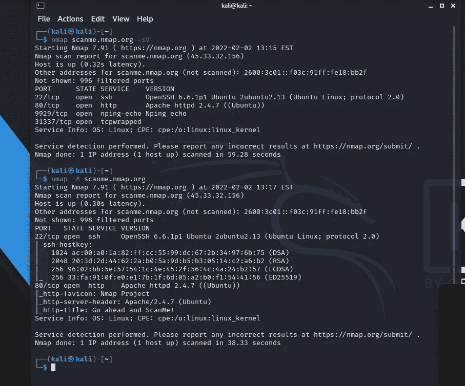

# 第 21 天，网络侦察或信息收集—第 6 部分# 100 天黑客攻击

> 原文：<https://infosecwriteups.com/day-21-web-reconnaissance-or-information-gathering-part-6-100daysofhacking-e6b65f48247e?source=collection_archive---------0----------------------->

获取第 1 天到第 20 天的所有资料，[**点击此处**](https://github.com/ayush098-hub/100DaysofHacking) 或 [**点击此处**](https://3xabyt3.medium.com/list/100daysofhacking-challenge-3db6061da4b1) **。**

在我们之前的博客中，我们了解了如何执行 s3 bucket recon 以及 GitHub recon。

让我们谈谈其他一些技巧:

## 技术堆栈指纹

**Wappalyzer** : Wappalyzer 是一个扩展，它向我们展示了在一个特定的 web 应用程序中使用了哪些技术，假设一个网站是用 java 构建的，那么安全研究员将试图找到与 Java 相关的漏洞，或者如果有 Apache 服务器，那么安全研究员将试图找到与 Apache 服务器相关的漏洞，或者如果有 Nginx 服务器或任何其他技术，他/她将试图找到该技术中的漏洞。现在让我们看看任何网站是如何制作的，例如:dvwa.co.uk

或者我们可以使用[https://builtwith.com](https://builtwith.com/)网站获得相同的。

dvwa 网站的结果

**whatweb:** Whatweb 是一个命令行实用程序，我们可以使用它来识别 web 技术，包括内容管理系统(CMS)、博客平台、统计/分析包、JavaScript 库、web 服务器和嵌入式设备。

我们还可以将 Nmap 与-sV 或-A 一起使用，以获得一些技术信息。

nmap scanme.nmap.org-sV

或者

**nmap-A scanme.nmap.org**

在这里，您可以看到我们获得了许多信息，例如正在使用哪些服务器和操作系统。正在使用 Apache 2.4.7 和 Linux。

此外，我们可以通过拦截请求从 burp 获得这些信息。

接下来，我们可以使用 waybackmachine 检查网站的历史。

**Waybackmachine:** 这可以用来检查网站早期的情况，从开始到现在，网站中添加了什么技术，什么新功能。

使用 Wayback 机器，您可以找到旧的端点、目录列表、被遗忘的子域、URL 和过时但仍在使用的文件。

**链接:**https://archive.org/web/

1999 年 11 月 google.com 的结果

同样，您可以将它用于您的目标网站，并检查添加了哪些新功能。

## 剪贴板

pastebin(https://pastebin.com/)是一个短期在线粘贴和存储文本的网站。人们用它来跨机器或与其他人共享文本。

我们也可以使用自动化工具，如 Paste Hunter([https://github.com/·凯夫特·赫米特/PasteHunter/](https://github.com/kevthehermit/PasteHunter/) )来扫描公开粘贴的数据。

谢谢你的时间，我们会在下一次见面！

快乐学习📖祝你黑客愉快💻

# 🔈 🔈Infosec Writeups 正在组织其首次虚拟会议和网络活动。如果你对信息安全感兴趣，这是最酷的地方，有 16 个令人难以置信的演讲者和 10 多个小时充满力量的讨论会议。[查看更多详情并在此注册。](https://iwcon.live/)

 [## IWCon2022 - Infosec 书面报告虚拟会议

### 与世界上最优秀的信息安全专家建立联系。了解网络安全专家如何取得成功。将新技能添加到您的…

iwcon.live](https://iwcon.live/)