# 第 22 天跨站点脚本—第 1 部分# 100 天黑客攻击

> 原文：<https://infosecwriteups.com/day-22-cross-site-scripting-part-1-100daysofhacking-a9fe6d3a59c8?source=collection_archive---------0----------------------->

获取第 1 天到第 21 天的所有资料，[**点击这里**](https://github.com/ayush098-hub/100DaysofHacking) 或者 [**点击这里**](https://3xabyt3.medium.com/list/100daysofhacking-challenge-3db6061da4b1) **。**

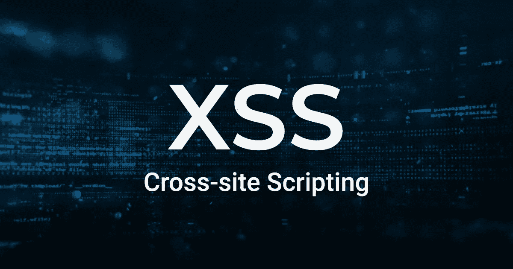

大家好，到目前为止，我们已经涵盖了许多网络侦察技术，关于 burp 套件和侦察时使用的许多工具，如 dirbuster，nmap 等。

从今天开始，我们将讨论 web 应用程序的不同漏洞。希望完成这个之后，我们还会学到一些法医技术。所以，让我们从第一个漏洞 XSS 开始，但在此之前，你应该知道什么是漏洞，如果你已经忘记了。

> **漏洞:-** 漏洞只不过是 web 应用程序的一个弱点，坏人或黑客可以通过它入侵您的 web 应用程序，并可以访问您的内部数据或敏感数据。

现在，我们将从第一个漏洞跨站点脚本开始。

# 跨站点脚本:-

跨站点脚本也称为 XSS，此漏洞属于客户端攻击的范畴。当攻击者在受害者的浏览器上执行自定义脚本时，就会出现此漏洞。当用户输入没有被净化或过滤时，攻击者可以执行代码，应用程序将所有脚本或代码作为合法代码处理。

在这种攻击的帮助下，攻击者可能会窃取 cookies、泄露个人信息、更改网站内容、或将用户重定向到恶意网站等。

## XSS 的基本情况:-

在这种攻击中，攻击者只需将可执行脚本注入用户查看的 HTML 页面。

因此，要进行这种攻击，你应该对 HTML 和 Javascript 有一个基本的了解，如果你不知道也不用担心，你可以很容易地从 w3 学校学习 HTML 和 Javascript 的基础知识。

[](https://www.w3schools.com/html/default.asp) [## HTML 教程

### 使用我们的“自己尝试”编辑器，您可以编辑 HTML 代码并查看结果:单击“自己尝试”…

www.w3schools.com](https://www.w3schools.com/html/default.asp) [](https://www.w3schools.com/js/default.asp) [## JavaScript 教程

### JavaScript 是世界上最流行的编程语言。JavaScript 是网络的编程语言…

www.w3schools.com](https://www.w3schools.com/js/default.asp) 

你不必深究这个，但是是的，你至少应该知道一些基础知识。

让我们用 html 创建一个简单的网页

```
<!DOCTYPE html>
<html lang="en">
<body>
<h1>Basics of XSS Part-1</h1>
<p>XSS is a vulnerability</p>
</body>
</html>
```

在上面的代码中，我们为标题使用了 h1 标签，为段落使用了 p 标签。

现在将这段代码保存为 index.html，然后在浏览器中打开它。

你会看到一个如下所示的网页

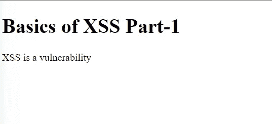

在这段 Html 代码中，我们还可以使用

让我们在上面的代码中添加一个脚本。

```
<!DOCTYPE html>
<html lang="en">
<body>
<h1>Basics of XSS Part-1</h1>
<p>XSS is a vulnerability</p>
<script>alert("XSS")</script>
</body>
</html>
```

当你重新加载你的网页时，这个脚本会弹出 xss，像这样嵌入在 HTML 文件中而不是从一个单独的文件中加载的脚本被称为内联脚本。

我们还可以通过调用不同的 js 文件来添加这个脚本，在这些文件中编写了相同的代码。

让我们创建一个简单的 xss.js 文件，并编写以下脚本:-

```
<script>alert(“xss”)</script>
```

然后在 HTML 中添加以下代码:-

```
<!DOCTYPE html>
<html lang="en">
<body>
<h1>Basics of XSS Part-1</h1>
<p>XSS is a vulnerability</p>
<script src="xss.js">
</script>
</body>
</html>
```

这段代码也会弹出 xss。

现在让我们创建一个表单，用户可以在其中输入电子邮件 id。

```
<!DOCTYPE html>
<html lang="en">
<body>
<h1>Basics of XSS Part-1</h1>
<p>XSS is a vulnerability</p>
<form action="welcome.php" method="get">  
    Email: <input type="text" name="email"/>  
    <input type="submit" value="visit"/>  
    </form>
</body>
</html>
```

welcome.php 法典

```
<?php  
$email=$_GET["email"];  
echo "Your email is:, $email";  
?>
```

 [## XSS 基础知识第一部分

### 编辑描述

passwdgen.000webhostapp.com](https://passwdgen.000webhostapp.com/name.html) 

访问上面的链接，你会得到如下所示的界面

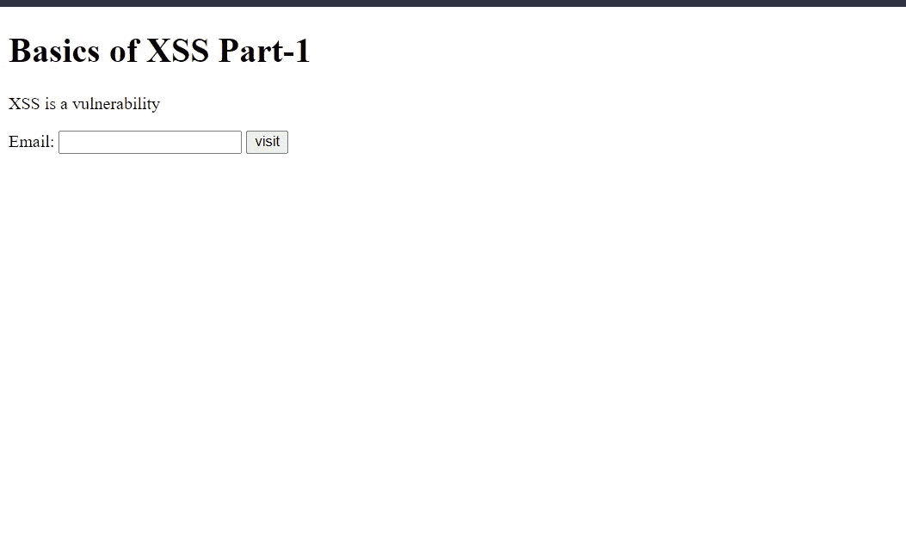

现在，您可以看到用户必须输入电子邮件地址，但如果在代码中用户输入没有被检查或清理，那么任何用户都可以输入任何内容，而不是电子邮件地址。

让我们输入任何电子邮件，然后看看我们会得到什么。

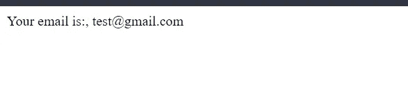

我们正在得到这个结果。

现在让我们输入简单的脚本:-

```
<script>alert(1)</script>
```


我们得到一个弹出窗口，如下所示。

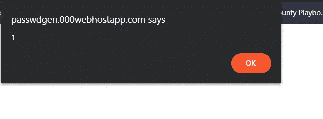

我们还可以通过输入以下简单的脚本将用户重定向到另一个网站

```
<script>location="[http://google.com](http://google.com)";</script>
```

进入后，您会看到用户将重定向到 google.com

为什么会发生这一切，这是因为输入没有被验证。

验证输入意味着应用程序检查用户输入是否符合特定标准。

净化输入意味着应用程序修改输入中的特殊字符，这些字符可用于修改 HTML 逻辑。

因此，在我们的例子中，代码验证和代码清理都没有完成，这就是为什么可能弹出一些东西或重定向用户。

这些只是为了你的理解，但在现实世界中，这并不容易。

我希望这是清楚的，现在让我们谈论 xss 的类型。

# XSS 的类型

## **存储的 XSS:**

存储 XSS 是一种 XSS，黑客或用户输入的任何脚本都会存储在数据库中。

让我们以一个应用程序的评论部分为例，假设用户在评论框中输入  ，并且该脚本被存储在数据库中，如果任何其他用户评论，那么该脚本也将执行，这意味着无论谁同时评论，该脚本也将执行。

**现实生活场景:-**

> 注:在[https://portswigger.net/](https://portswigger.net/)创建您的账户，然后访问[https://portswigger.net/web-security/learning-path](https://portswigger.net/web-security/learning-path)并点击 XSS。

单击下面的链接访问 portswigger 实验室:-

[](https://portswigger.net/web-security/cross-site-scripting/stored/lab-html-context-nothing-encoded) [## 实验室:将 XSS 存储到 HTML 上下文中，未进行任何编码|网络安全学院

### 练习利用现实目标的弱点。记录你从学徒到专家的进步。看哪里…

portswigger.net](https://portswigger.net/web-security/cross-site-scripting/stored/lab-html-context-nothing-encoded) 

访问实验室，然后点击查看帖子，下面是评论区。

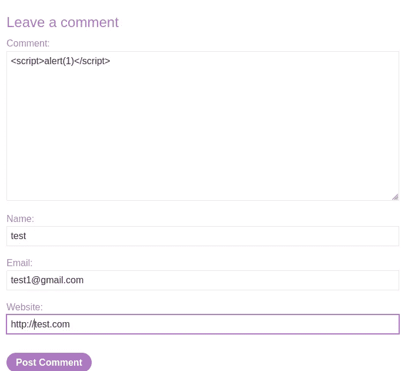

在注释中输入脚本，然后您的实验将被解决，但当您重新加载页面或任何其他用户将进入该页面时，他/她将得到如下所示的弹出窗口。

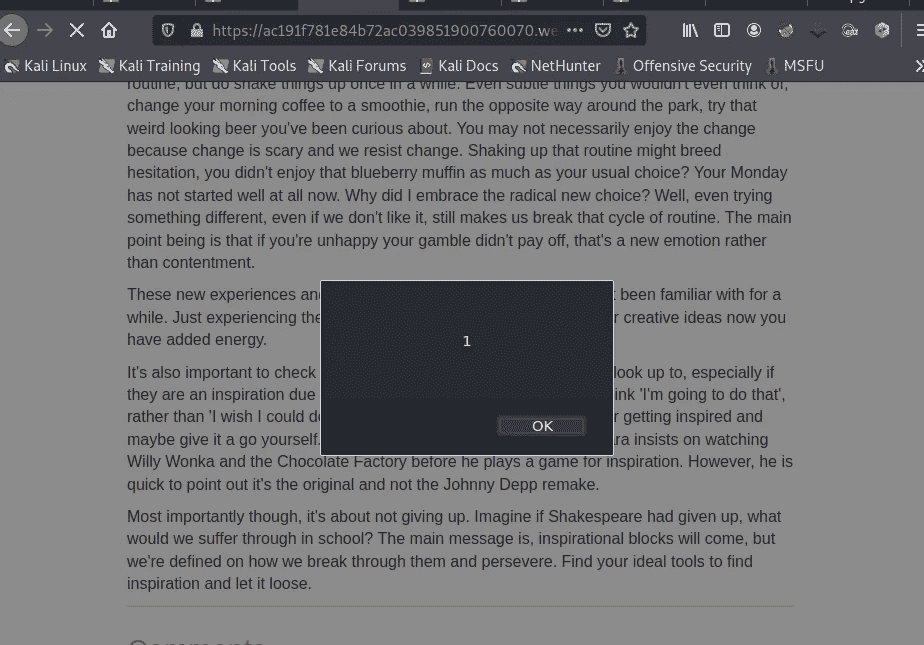

## **映 XSS:**

反射 XSS 是一种最简单的 XSS，其中用户输入被返回给用户，而不存储在数据库中。在上述情况下的电子邮件领域，我们正在输入一些脚本和弹出正在产生，这些是反映 XSS 的例子。

让我们来解决反射 xss 的实验室。

[](https://portswigger.net/web-security/cross-site-scripting/reflected/lab-html-context-nothing-encoded) [## 实验室:将 XSS 反射到 HTML 上下文中，没有任何编码|网络安全学院

### 练习利用现实目标的弱点。记录你从学徒到专家的进步。看哪里…

portswigger.net](https://portswigger.net/web-security/cross-site-scripting/reflected/lab-html-context-nothing-encoded) 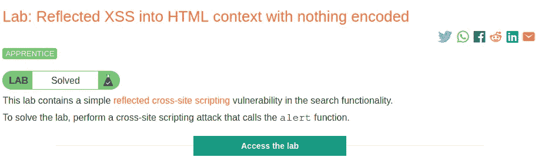

在描述中你可以看到我们已经通过调用警报功能执行了 XSS 攻击。

单击“访问实验室”或在新选项卡中打开它。

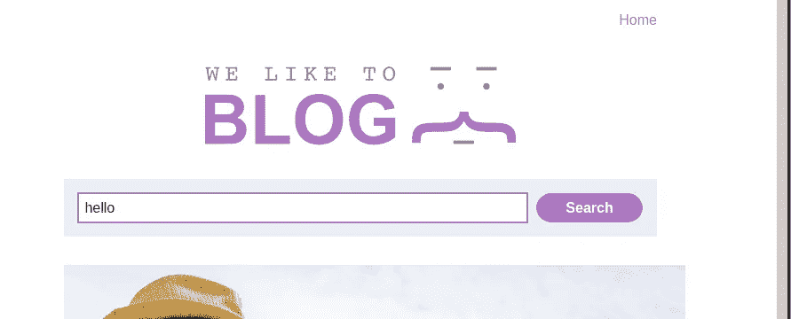

这里你可以看到有搜索功能。所以我们搜索一个关键字 hello，然后我们的 url 变成如下所示

[https://ACC 11 f 6 f1 f 53 b 6 BBC 0 b 425 fa 00 ea 0085 . we b-security-academy . net/？**搜索=你好**](https://acc11f6f1f53b6bbc0b425fa00ea0085.web-security-academy.net/?search=hello)

现在，我们可以输入任何脚本来代替 hello，让我们开始吧。

[https://ACC 11 f 6 f1 f 53 b 6 BBC 0 b 425 fa 00 ea 0085 . we b-security-academy . net/？ **search=**](https://acc11f6f1f53b6bbc0b425fa00ea0085.web-security-academy.net/?search=hello) <脚本>预警(‘反射访问’)</脚本>

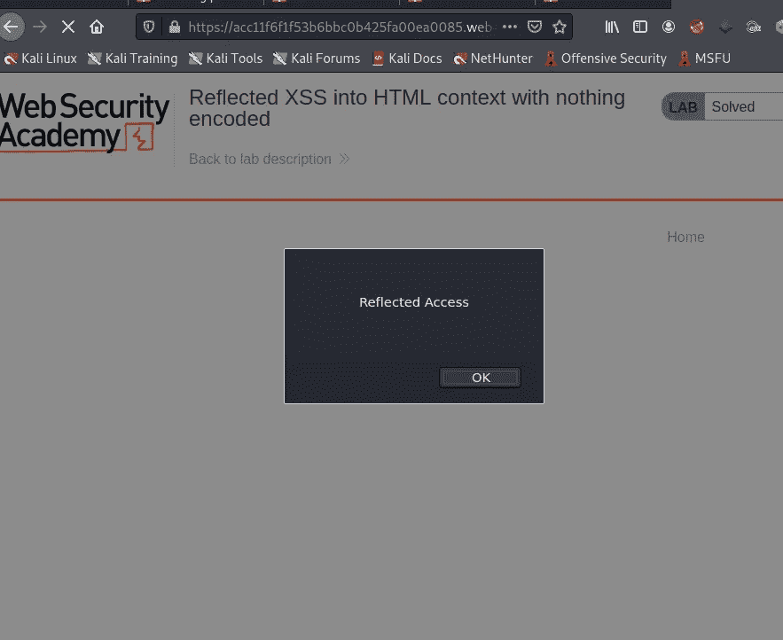

回车后，我们得到一个这样的弹出窗口。

## 基于 DOM 的 XSS:

基于 DOM 的 XSS 是另一种类型的 XSS，但是在深入研究之前，先了解什么是 DOM？

DOM 代表文档对象模型，它基本上是一个由浏览器以特定方式呈现网页的模型。DOM 代表网页的结构；它定义了每个 HTML 元素的基本属性和行为，并帮助脚本访问和修改页面内容。


来源:维基百科

在这里你可以看到一个 HTML 页面的基本结构。现在让我们来谈谈基于 DOM 的 XSS

因此，基于 DOM 的 XSS 直接针对网页的 DOM:这意味着它攻击客户端的本地副本，而不是在服务器上做一些事情。当页面获取用户提供的输入数据并根据该输入动态改变 DOM 时，攻击者就能够攻击 DOM。在这个基于 DOM 的 XSS 中，脚本不会被发送到服务器，所以服务器端不会发生任何变化。

基于 DOM 的 XSS 发生在 javascript 直接在浏览器中执行，无需加载任何新页面或向后端代码提交数据。当 JavaScript 代码作用于输入或用户交互时，就会执行。

要进入这个实验室:-[https://tryhackme.com/room/owasptop10](https://tryhackme.com/room/owasptop10)然后进入 xss 部分。

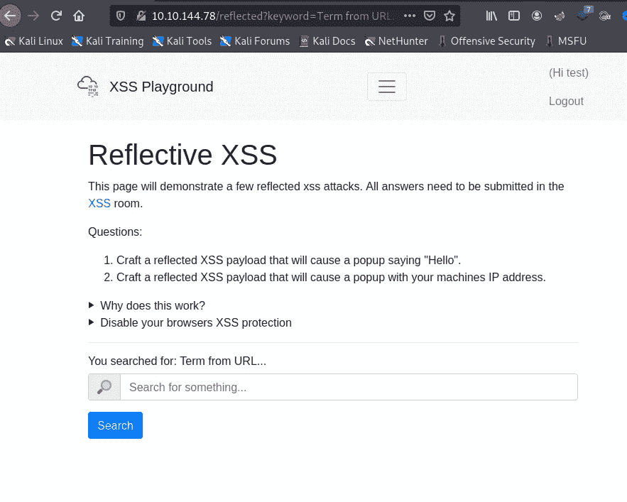

这是实验室界面，在这里我们将把 Xss playground 改为其他文本，如“**这里是多姆 XSS** ”。

为了实现这一点，我们可以很容易地在搜索栏中输入一些东西，所以要改变这一点，首先我们会看到源代码找到特定部分的 id 或类。

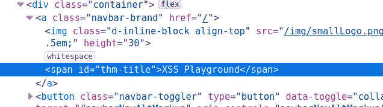

这里你可以看到标题是 thm-title。

因此，我们的脚本将是:-

```
<script>document.querySelector('#thm-title').textContent = 'Here is DOM XSS'</script>
```

只要在搜索栏输入这个。

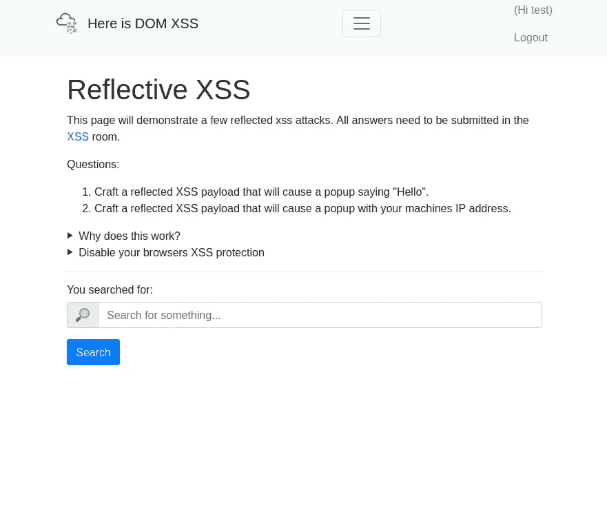

在这里你可以我们已经改变了这个网页的 DOM，但是在服务器上它是 XSS 游乐场，它是临时的。

所以今天就讲到这里，我们将在下一节讨论如何在现实生活的网站中寻找 xs。

快乐学习📖祝你黑客愉快💻

# 🔈 🔈Infosec Writeups 正在组织其首次虚拟会议和网络活动。如果你对信息安全感兴趣，这是最酷的地方，有 16 个令人难以置信的演讲者和 10 多个小时充满力量的讨论会议。[查看更多详情并在此注册。](https://iwcon.live/)

[](https://iwcon.live/) [## IWCon2022 - Infosec 书面报告虚拟会议

### 与世界上最优秀的信息安全专家建立联系。了解网络安全专家如何取得成功。将新技能添加到您的…

iwcon.live](https://iwcon.live/)