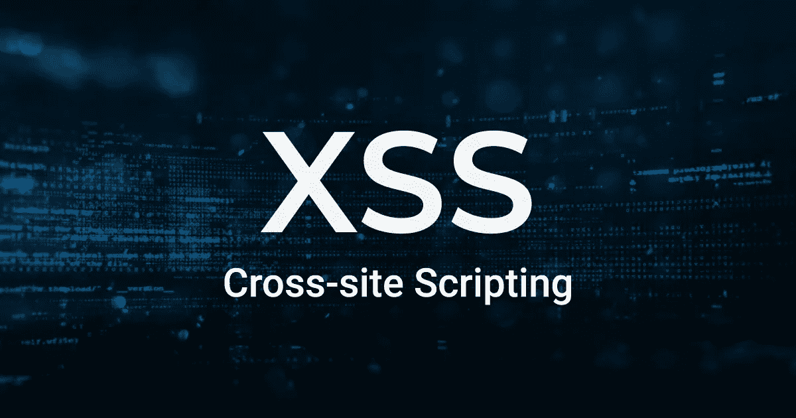

# 第 23 天跨站点脚本-第 2 部分# 100 天黑客攻击

> 原文：<https://infosecwriteups.com/day-23-hunting-for-xss-100daysofhacking-de0013042470?source=collection_archive---------3----------------------->

获取第 1 天到第 21 天的所有资料，[**点击这里**](https://github.com/ayush098-hub/100DaysofHacking) 或者 [**点击这里**](https://3xabyt3.medium.com/list/100daysofhacking-challenge-3db6061da4b1) **。**



大家好，在我们之前的博客中，我们讨论了 XSS 的基本知识，XSS 有哪些类型，现在在这个博客中，我们将讨论如何寻找 XSS，让我们开始吧。

在开始寻找任何漏洞之前，我们应该在后台打开打嗝。

## **第一步:**

现在，找到 XSS 的第一步是查找用户可以输入内容的输入字段，例如注册时的姓名字段或评论字段。我们应该检查我们的输入是否在响应或页面源代码中得到反映。

假设没有任何输入字段，我们无法输入我们的 XSS 有效负载，那么在这种情况下，假设有下拉菜单，那么我们也可以截取请求，然后在 burp 中插入我们的有效负载，然后转发请求。

## **第二步:**

识别应用程序中的输入字段后，我们可以开始在发现的输入点输入测试 XSS 有效负载。

众所周知，最基本的有效载荷:

```
<script>alert('xss')</script>
```

我们可以先插入这个，检查 pop 来不来。

除了脚本标记，我们还可以使用 img 标记，如下所示

```
">
```

这个有效负载首先关闭前一个标签。然后，它注入一个带有无效源 URL 的标记。一旦标签加载失败，它将运行 onerror 属性中指定的 JavaScript。

常见有效载荷:-

 [## XSS 滤波逃避- OWASP 小抄系列

### 收集了该项目的所有备忘单的网站。

cheatsheetseries.owasp.org](https://cheatsheetseries.owasp.org/cheatsheets/XSS_Filter_Evasion_Cheat_Sheet.html) 

另一种更有效测试 XSS 的方法是使用通用测试字符串，而不是 XSS 有效负载。插入一串在 XSS 有效负载中经常使用的特殊 HTML 字符，例如:> '

Learn about XSS polygot aslo: [https://web . archive . org/web/20190617111911/https://polyglot . innerht . ml/](https://web.archive.org/web/20190617111911/https://polyglot.innerht.ml/)

## 第三步:影响确认。

假设有一个警报代码，然后你看到一个弹出窗口，然后是 xss，或者如果有一个鼠标悬停在你的鼠标上，根据你的有效载荷发生了一些事情，然后是 XSS。

今天到此为止，下次我们将绕过技术。

快乐学习📖祝你黑客愉快💻

# 🔈 🔈Infosec Writeups 正在组织其首次虚拟会议和网络活动。如果你对信息安全感兴趣，这是最酷的地方，有 16 个令人难以置信的演讲者和 10 多个小时充满力量的讨论会议。[查看更多详情并在此注册。](https://iwcon.live/)

[](https://iwcon.live/) [## IWCon2022 - Infosec 书面报告虚拟会议

### 与世界上最优秀的信息安全专家建立联系。了解网络安全专家如何取得成功。将新技能添加到您的…

iwcon.live](https://iwcon.live/)