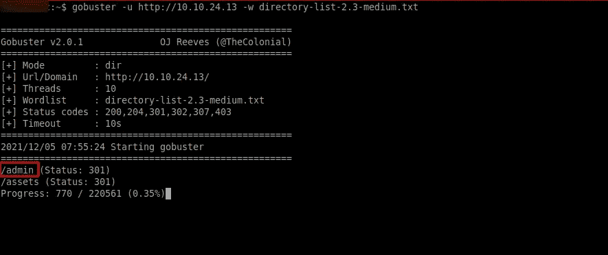
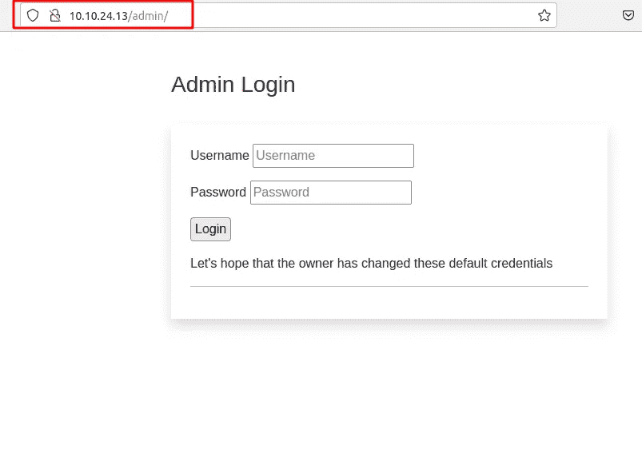
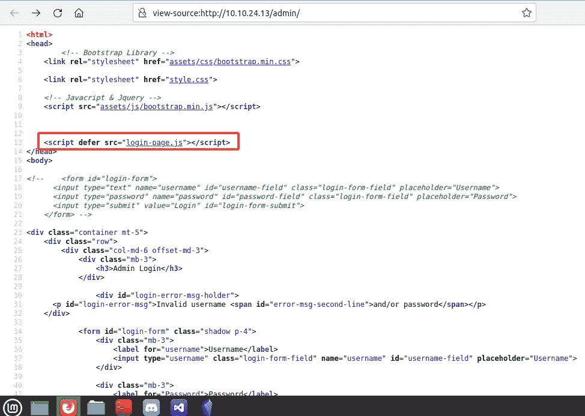
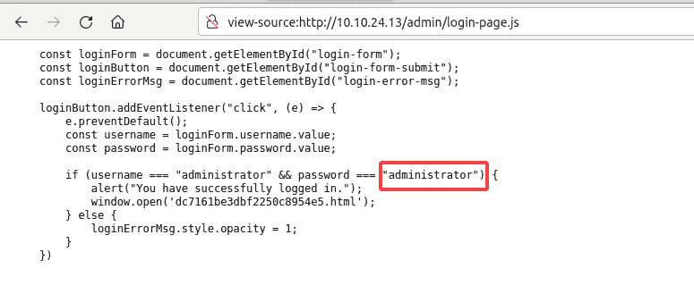
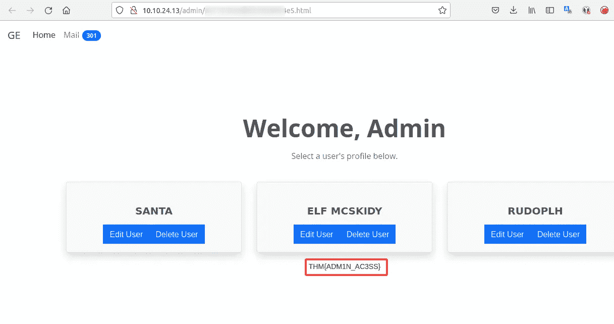

# [第 3 天]网络开发圣诞节停电|网络 3 (2021)来临

> 原文：<https://infosecwriteups.com/day-3-web-exploitation-christmas-blackout-advent-of-cyber-3-2021-f92cc4153e04?source=collection_archive---------1----------------------->

作为一个渗透测试者或防御者，我们必须有一种能力来观察缺失或隐藏的东西。今天我们将学习如何从系统中发现内容。

让我们来发现漏洞..

1.使用一个用于发现内容的通用单词列表，枚举 [http://MACHINE_IP](http://MACHINE_IP) 以找到管理员仪表板的位置。文件夹的名称是什么？

> 管理

我在目录里运行了暴走族。

我明白了。

2.在 web 浏览器中，在新发现的登录表单上为“管理员”用户尝试一些默认凭证。密码是什么？

> 管理人员

我正在查看页面源代码，发现了 javascript 文件。那非常有趣。

管理页面源

然后，程序员的错误是把密码和用户名放在代码中。

3.访问管理面板。国旗的价值是什么？

> THM{ADM1N_AC3SS}

只需用我之前得到的用户名和密码登录。

## 结论

在第三天，我们学习了 gobuster 来发现 web 目录并查看易受攻击的代码。如果你对这个挑战感兴趣，这里链接>【https://tryhackme.com/room/adventofcyber3 

你今天学到了什么吗？
继续前进，谢谢。