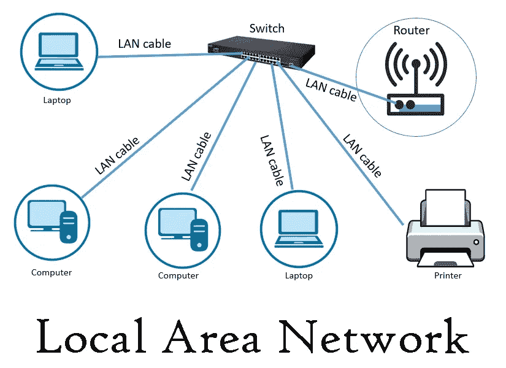
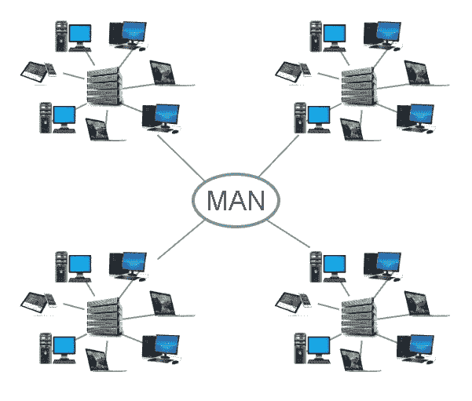
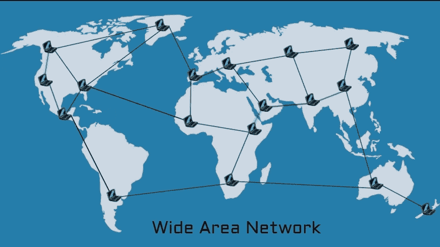
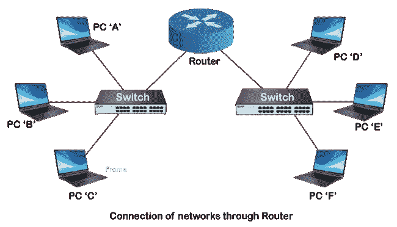

# 第 4 天，CN-网络拓扑# 100 黑客日

> 原文：<https://infosecwriteups.com/day-4-cn-network-topologies-100daysofhacking-d01377674623?source=collection_archive---------4----------------------->

**Day1 :** [安装 Kali Linux](/day-1-installing-kali-linux-100daysofhacking-eeb5954e0837)

**第二天:** [导航 Linux](https://3xabyt3.medium.com/day2-navigating-linux-100daysofhacking-44130f5983bf?source=user_profile---------0-------------------------------)

**第三天:** [电脑联网](/day3-computer-networks-100daysofhacking-1f9734b80313)

**Github:**[100 天黑客](https://github.com/ayush098-hub/100DaysofHacking)

大家好，我是 Ayush，如果你还没有看过之前的博客，请点击上面的链接来阅读，在上面我们讨论了重要的概念，这是以后的博客所必需的。

今天在这个博客中，我们将讨论一些其他的网络概念，如网络类型、子网划分等，让我们开始吧。

## 网络类型:

1.  **LAN:** LAN 代表局域网，是网络中最常见的，因为它覆盖了我们的家庭网络、办公室网络或任何咖啡店等小区域。假设你在一个计算机实验室，你的电脑通过一根叫做 RJ45 电缆的物理电缆连接，你正在访问互联网，所以这里有一个局域网连接。

**2。MAN:MAN 代表城域网，它覆盖的区域比 LAN 大，而且 MAN 通常由许多不同的 LAN 组成。**

**3。**广域网:广域网是指覆盖范围大于局域网和城域网的广域网，意味着它把一个城市与另一个城市或一个国家与另一个国家连接起来。

现在我希望这已经很清楚了，让我们来谈谈不同的局域网拓扑结构。但首先我们将讨论什么是拓扑。

## 网络拓扑:

网络拓扑基本上是指网络是如何构成的，或者每个设备应该如何相互连接，或者我们也可以说网络是如何安排发送方和接收方之间的通信的。

## 网络拓扑的类型:

在这里，我们将主要讨论局域网拓扑的类型，局域网如何以不同的方式进行布置。

**星型拓扑:**在星型拓扑中，每个设备都与一个中心网络设备相连，它可以是交换机或集线器。在这种拓扑结构中，所有信息都通过中央网络设备发送。

其中一个缺点是，假设中央网络设备出现故障，那么设备之间的通信将会停止。

模拟:

在上面的视频中，您可以看到所有 4 台 PC 都连接到一台交换机(网络设备将在后面讨论)，PC1 正在向 PC3 发送一些数据。

接下来我们将讨论总线拓扑。

**总线拓扑:**在总线拓扑中，每个设备都通过一根电缆连接，所有的通信都通过那根电缆进行，那根电缆被称为总线拓扑的主干。

在总线拓扑中，如果电缆断开，所有设备之间的连接将停止，并且如果任何一台计算机产生大量数据，总线拓扑也无法处理数据。

模拟:

在上面的视频中，您可以看到 PC0 通过不同的交换机向 PC3 发送数据。

**环形拓扑:**在环形拓扑中，所有设备都像环形一样相互连接，每个设备都连接到至少两个节点或 PC。

在环形网络中，数据包从一台设备传输到下一台设备，直到到达目的地。大多数环形拓扑只允许数据包单向传输，称为单向**环形网络。另一些允许数据向两个方向移动，称为双向**。****

**环形拓扑的主要缺点是，如果环中的任何单个连接断开，整个网络都会受到影响。**

**模拟:**

**在上面的视频中，您可以看到在交换机的帮助下，所有的 pc 都以环形连接在一起，pc1 在交换机的帮助下向 pc2 发送数据。**

**现在，我希望这 43 种拓扑结构对您来说已经很清楚了，接下来我们来谈谈不同的网络设备、交换机和集线器。**

****网络设备:****

**现在你可以在上面的任何地方看到我使用 Switch 将数据从一台电脑传输到另一台电脑。所以，现在我们将更详细地了解它。**

**交换机是一种网络设备，用于根据设备的 MAC 地址将数据准确地传输到给定的目的地。交换机跟踪什么设备连接到哪个端口，这就是为什么它不是将数据/数据包发送到所有连接的 PC，而是将数据发送到特定的设备。**

****路由器:**路由器也是一种联网设备，像两个局域网一样连接两个网络。**

****

**模拟:**

**在上面的视频中，你可以看到数据包是如何从一个网络发送到另一个网络的。**

**现在，我们的下一部分是子网划分，这基本上意味着将网络划分为不同的部分，让我们以街上的典型咖啡馆为例。这家咖啡馆将有两个网络:**

1.  **一个用于员工、收银机和设施的其他设备**
2.  **一个供公众用作热点**

**这里一个网络分为两部分。我们将在下一篇博客中看到更多细节。**

**我希望你喜欢这个 100 天的挑战，如果是的话，请写一篇评论，你应该对网络有很好的理解，这就是为什么我要写更多关于网络的东西。**

**感谢您的阅读，我们将在下一篇博客中见面。如果您有任何疑问，请在 instagram 上问我。**