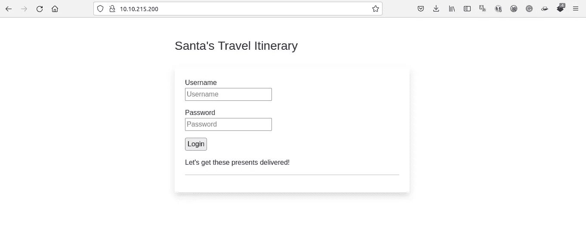
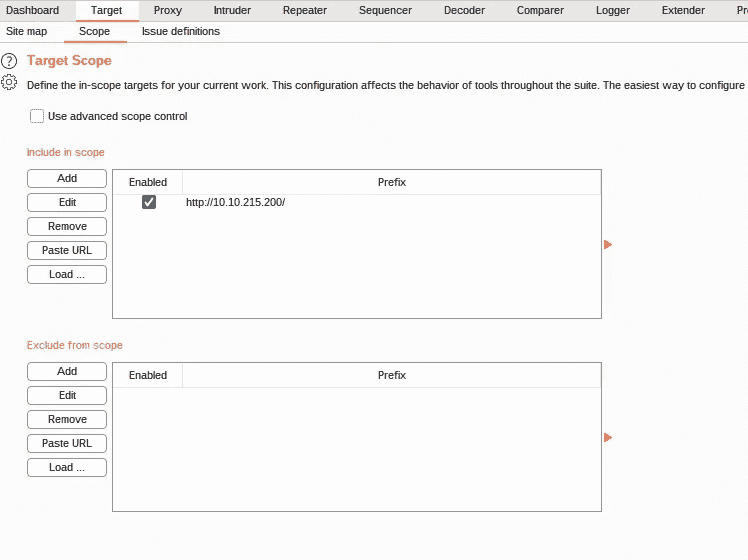
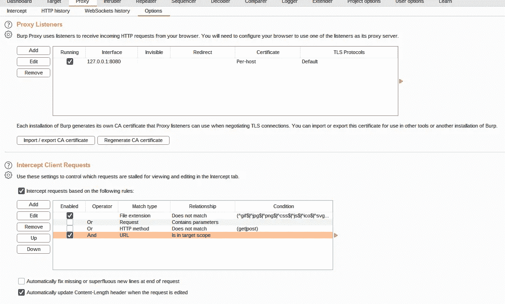
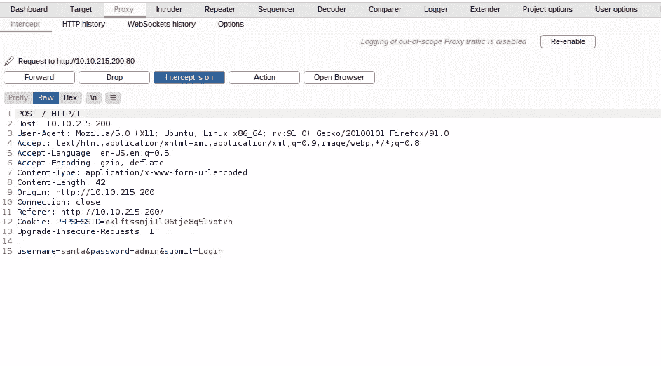
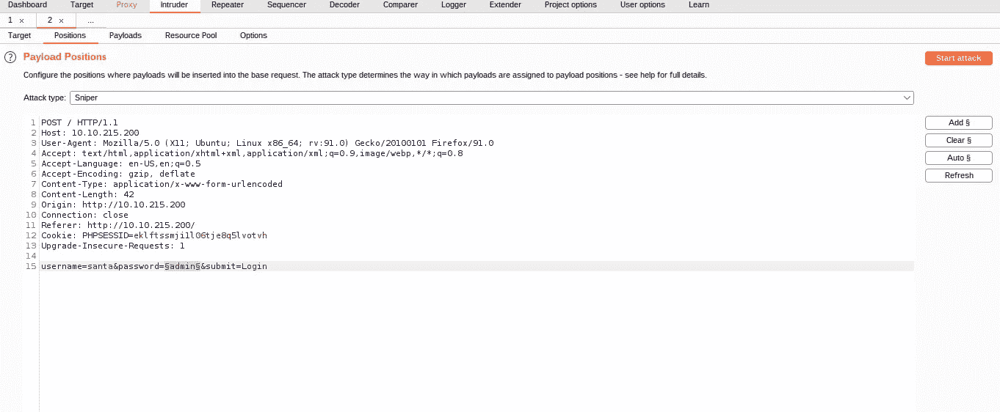
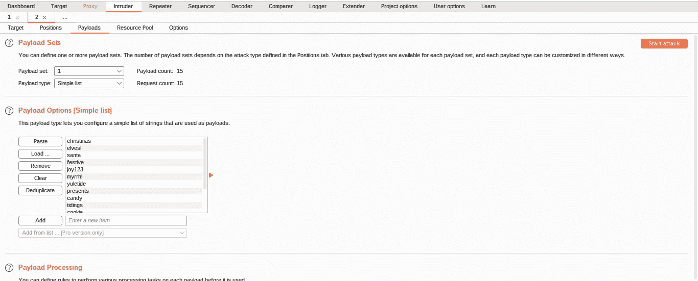
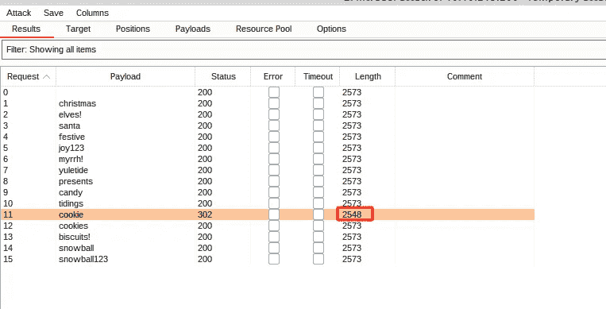
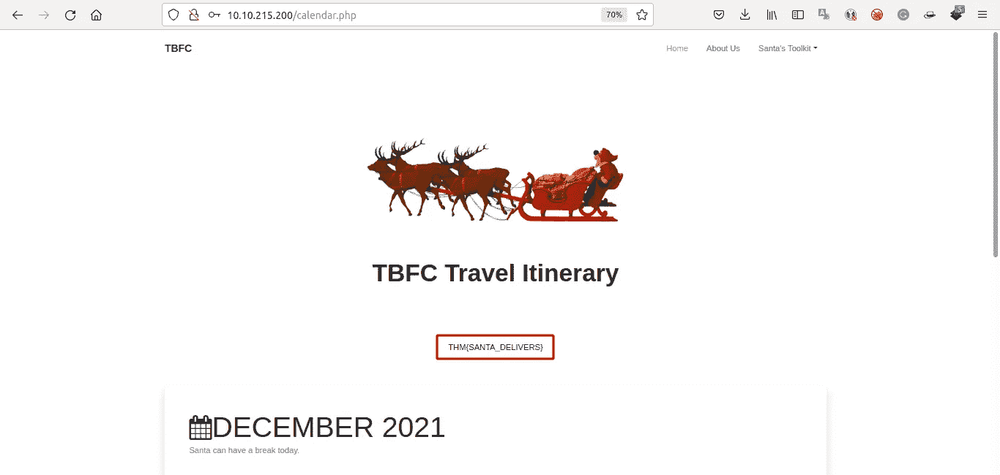

# [第 4 天]网络开发圣诞老人在后面跑|网络 3 的到来(2021 年)

> 原文：<https://infosecwriteups.com/day-4-web-exploitation-santas-running-behind-advent-of-cyber-3-2021-c1a62b418f87?source=collection_archive---------0----------------------->

## 打嗝套件实践

## 学习目标

在今天的任务中，我们将学习以下内容。

1.  了解身份验证及其用途
2.  理解什么是起毛
3.  了解什么是 Burp Suite，以及我们如何使用它来模糊登录表单以获得访问权限
4.  应用这些知识来检索圣诞老人的旅行路线

**让我们享受挑战** [**赛博 3**](https://tryhackme.com/room/adventofcyber3) **的来临。**

1.访问位于 [http://MACHINE_IP](http://MACHINE_IP) 的登录表单

> 点击**问题完成**

2.配置 Burp Suite 和 Firefox，提交一些虚拟凭证并拦截请求。使用入侵者攻击登录表单。

> 点击**问题完成**

3.您可以使用什么有效密码来访问“圣诞老人”帐户？

> 甜饼干

我试图拦截请求，并得到连接是未加密的，因为使用 http 作为协议。burpsuite 是一个非常方便的暴力破解登录表单的工具。

设置范围

添加范围以拦截客户端请求

我的拦截请求

发送给入侵者设置暴力攻击

我有来自 tryhackme 的简单单词表，

**导航到**[http://MACHINE _ IP/](http://MACHINE_IP/)**上的易受攻击的登录表单，使用**用户名“Santa”和 TryHackMe 攻击框上** `/root/Rooms/AoC3/Day4/passwords.txt`上的密码列表(或从[下载，此处](https://assets.tryhackme.com/additional/aoc2021/day4/passwords.txt)为您的有效载荷)将今天任务的材料应用到圣诞老人的旅程**上。

加载单词表

开始攻击，并得到一个独特的回应。

我尝试用这个关键字作为圣诞老人的密码登录。而且是**工作**。

4.圣诞老人行程中的旗帜是什么？

> THM {圣诞老人递送}

## **结论**

Burp suite 对初学者来说很棒，但是如果你想使用 python 或其他工具进行暴力攻击，这取决于你的偏好。如果你有兴趣了解更多关于打嗝套件的知识，请查看 TryHackMe 上的打嗝套件模块。

谢了。