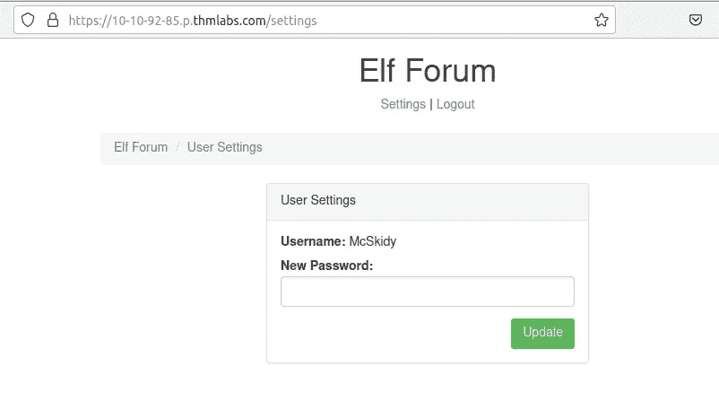
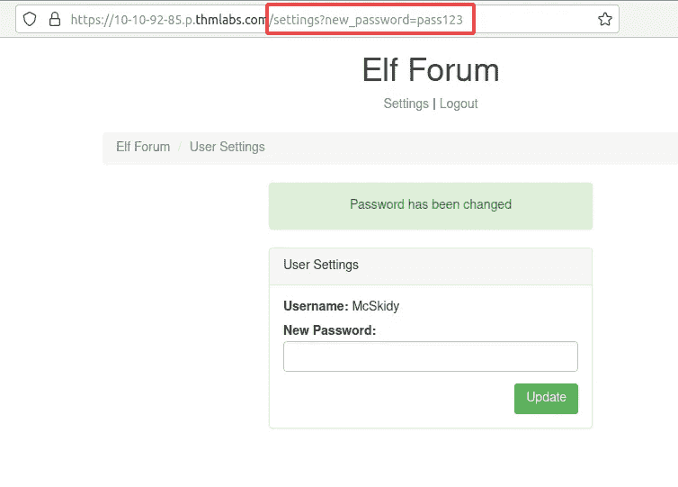
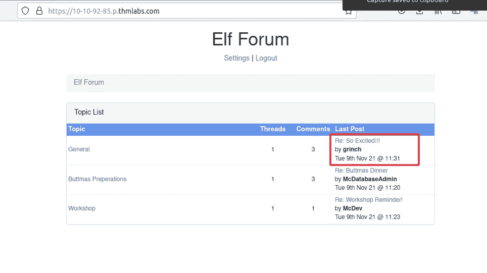
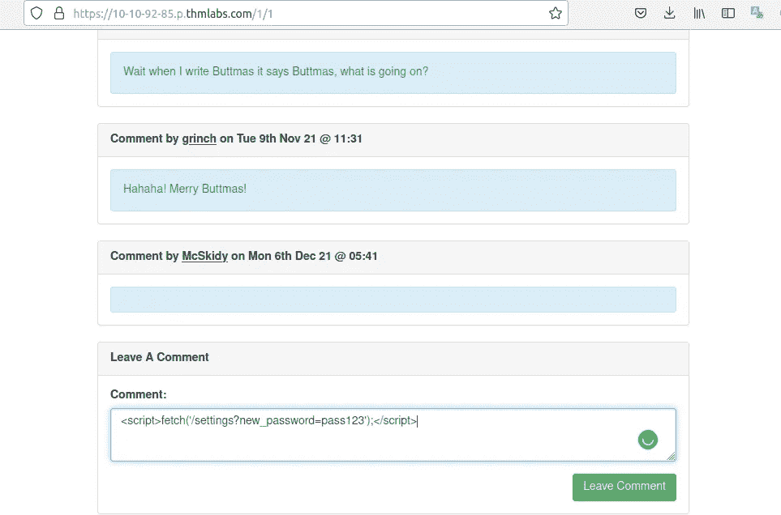
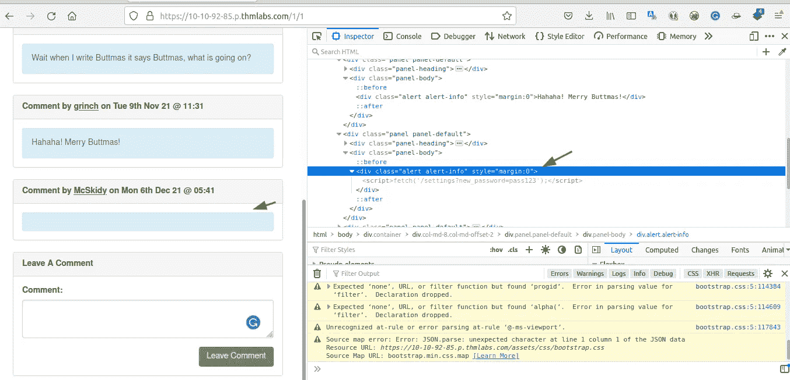
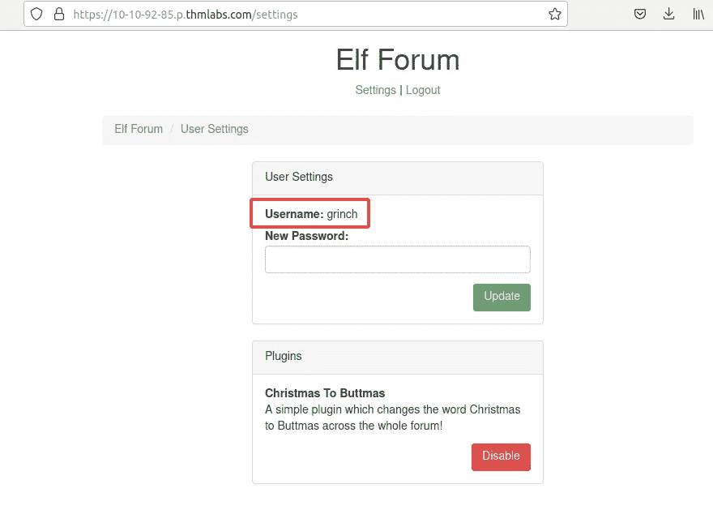
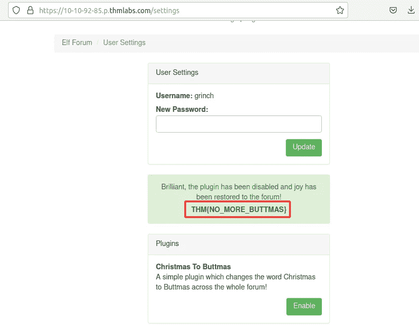

# [第 5 天]网络开发讨厌的精灵论坛|赛博 3 的来临(2021)

> 原文：<https://infosecwriteups.com/day-5-web-exploitation-pesky-elf-forum-advent-of-cyber-3-2021-de37f1e3344c?source=collection_archive---------1----------------------->

今天我们将学习 XSS(跨站点脚本)。跨站点脚本，在网络安全社区中被称为 XSS，被归类为注入攻击，恶意 JavaScript 被注入到 web 应用程序中，意图由其他用户执行。

**让我们解决挑战……**

只有一个问题，我们将重置 XSS 的管理员密码，并进入它。

1.  你禁用插件的时候得到了什么标志？

> THM{NO_MORE_BUTTMAS}

打开**链接**。

使用 tryhackme challenge 中的可用用户和密码登录。

尝试更改密码，看看会发生什么。

当你更改密码时，看看这个网址，每个点击这个链接的用户都会用 **pass123** 更改他们的密码。

现在我们将去一些论坛发帖，和 XSS 一起评论，并希望那个**格林奇**会打开那个帖子，这样我们的 XSS 就能很好地工作。

张贴我们的 XSS 有效载荷。

看看在源代码中发生了什么，我们有一个活动的脚本，并在页面打开时加载。

等一下，试着用 **grinch:pass123，**登录网站就可以了。

禁用插件，我们保存了网站，也获得了标志:d。

**结论**

XSS 是一个狡猾的攻击方法。就看你怎么用了。越多练习越好。感谢阅读。

🔈 🔈 **Infosec Writeups 正在组织其首次虚拟会议和网络活动。如果你对信息安全感兴趣，这是最酷的地方，有 16 个令人难以置信的演讲者和 10 多个小时充满力量的讨论会议。** [**查看更多详情，在此注册。**](http://iwcon.live)

 [## IWCon2022 - Infosec 书面报告虚拟会议

### 与世界上最优秀的信息安全专家建立联系。了解网络安全专家如何取得成功。将新技能添加到您的…

iwcon.live](https://iwcon.live/)