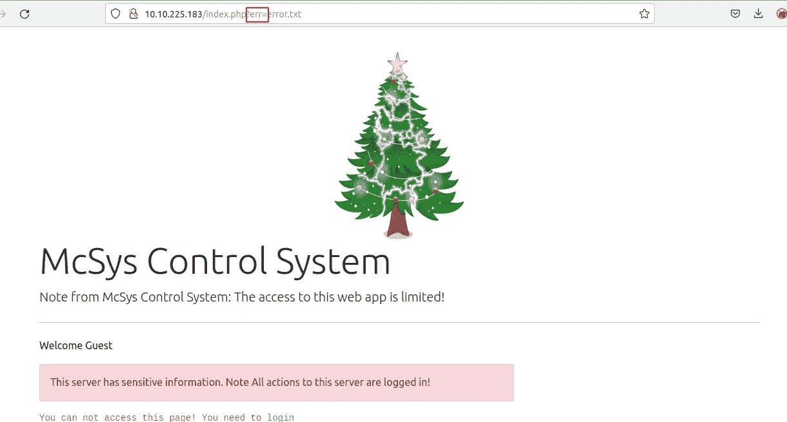
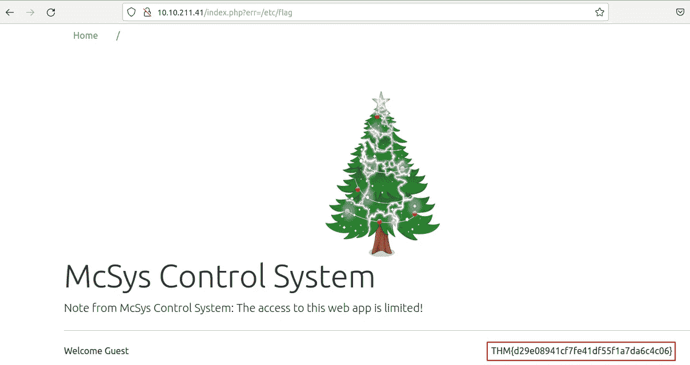
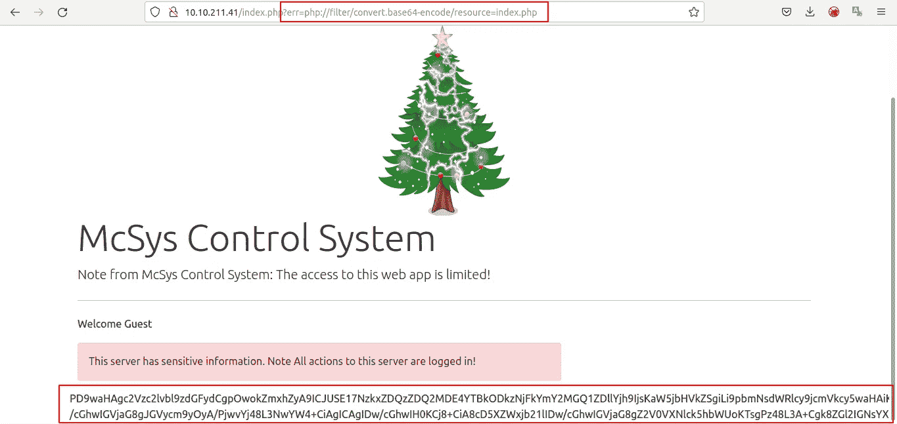
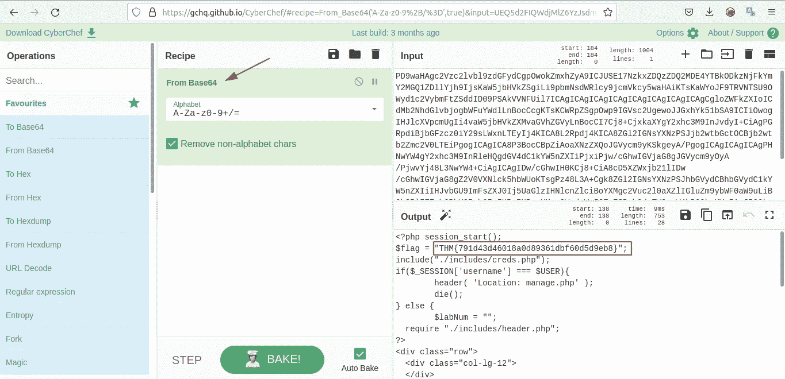
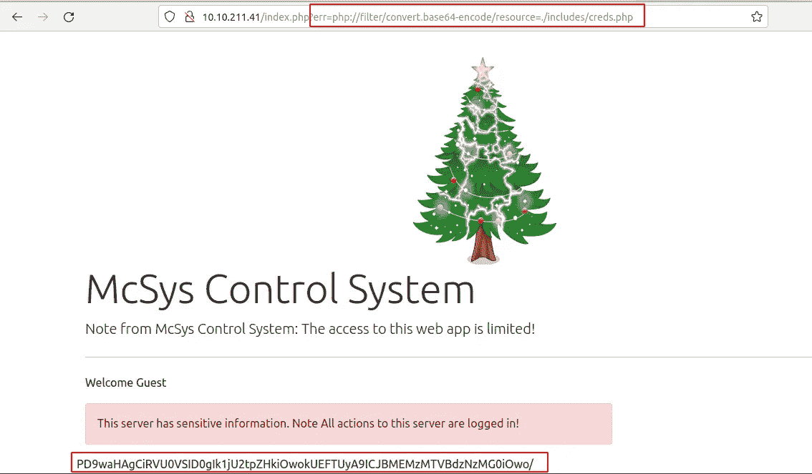
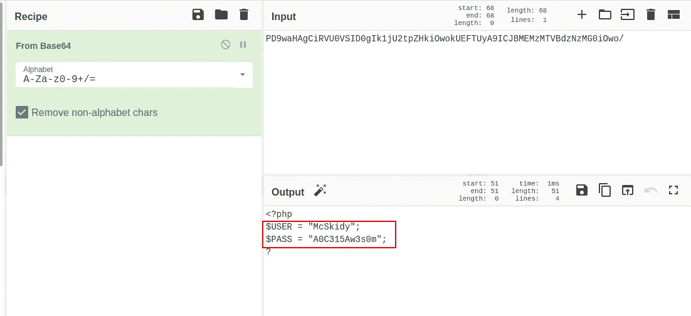
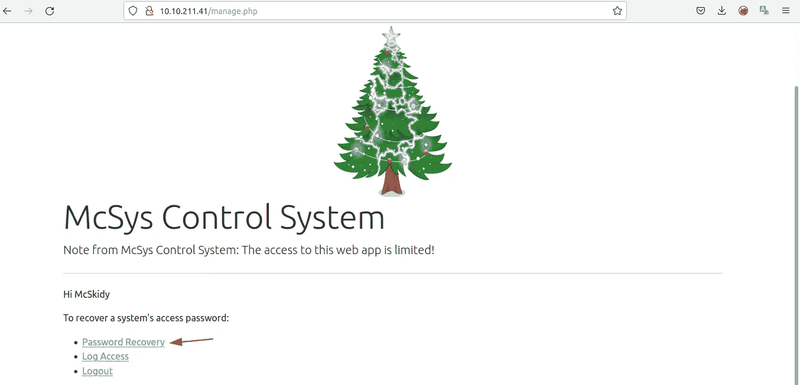
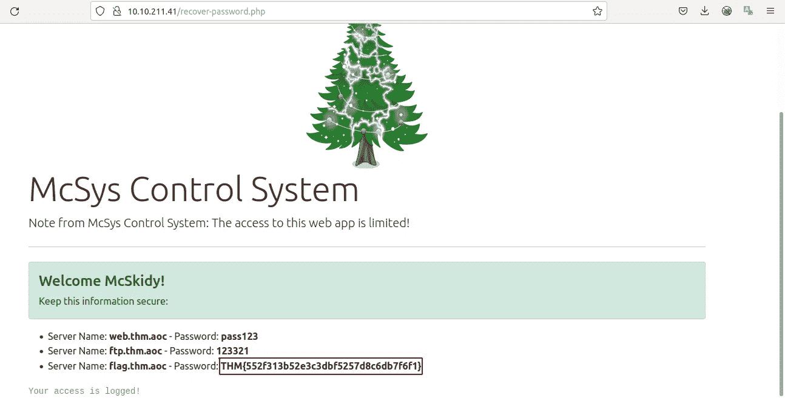
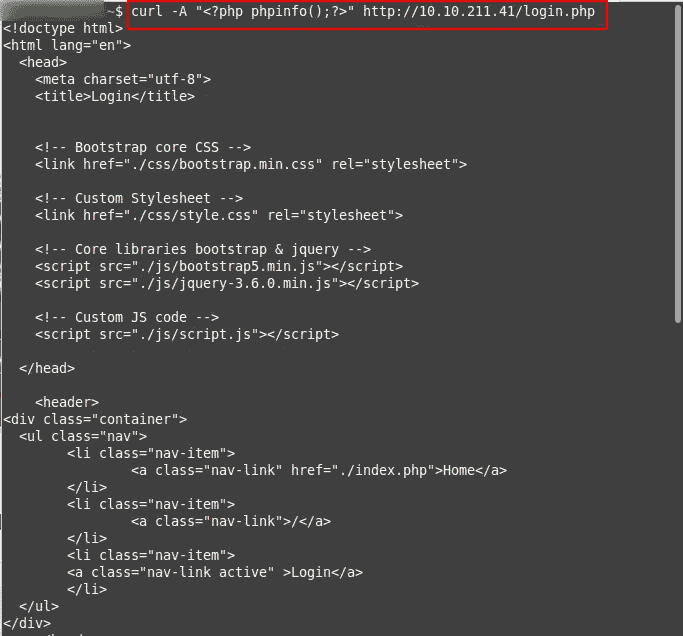
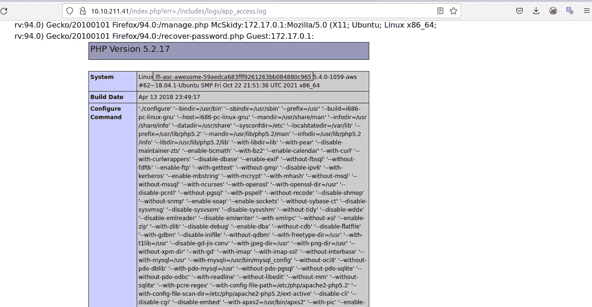

# [第 6 天]网络利用补丁管理很难|网络 3 的到来(2021 年)

> 原文：<https://infosecwriteups.com/day-6-web-exploitation-patch-management-is-hard-advent-of-cyber-3-2021-ed97027121cb?source=collection_archive---------1----------------------->

## 本地文件包含漏洞

在此任务中，我们将了解本地文件包含(LFI)漏洞的基本知识。此漏洞使我们能够从网站查看或修改文件。

**让我们来破解这个问题……**

1.部署连接的虚拟机并四处查看。我们的 web 应用程序的入口点是什么？

> 犯罪

只要打开网页。

2.使用入口点执行 LFI 来读取/etc/flag 文件。国旗是什么？

> THM { d29e 08941 cf 7 Fe 41 df 55 f1 a 7 da 6 C4 c 06 }

3.使用 PHP 过滤技术读取 index.php 的源代码。$flag 变量的值是什么？

> THM { 791 d43d 46018 a0d 89361 DBF 60 D5 d9 EB 8 }

用 **php 过滤器**和 LFI 技术打开文件，将文件转换成 base64 格式。

然后你可以用[网吧](https://gchq.github.io/CyberChef/)解码文本。

4.麦克斯基迪忘记了他的登录凭证。你能帮助他登录以恢复服务器的一个密码吗？

既然您已经阅读了 index.php，那么就有了一个登录凭证 PHP 文件的路径。使用 PHP 过滤技术读取其内容。用户名和密码是什么？

> McSkidy:A0C315Aw3s0m

从**index.php**我们看到代码包含了到**的链接。/includes/creds.php** ，而且很有意思。让我们将文件编码为 base64。

我们用赛博咖啡馆再次解码，就这样..

5.使用凭据登录 web 应用程序。帮助麦克斯基迪恢复服务器的密码。flag.thm.aoc 服务器的密码是多少？

> THM { 552 f 313 b 52 E3 C3 DBF 5257d 8 c 6 db 7 f 6 f 1 }

使用上一个问题中的凭据登录网站。

只需点击密码恢复链接，我们就可以获得标志。

6.web 应用程序记录所有用户的请求，只有授权用户才能读取日志文件。使用 LFI 通过日志文件页面获得 RCE。web 服务器的主机名是什么？日志文件的位置在**。/includes/logs/app _ access . log .**

> lfi-AOC-awesome-59 aed ca 683 fff 9261263 bb 084880 c 965

因为网站总是把访问日志保存在。/includes/logs/app_access.log，我们可以用 php 有效负载来更改用户代理。

之后，操纵 URL 来访问日志并在 web 中运行。主机名在系统的行中。

**结论**

当您使用 php 代码并连接到网站中的其他文件时，本地文件包含是一个漏洞。我们知道这是一个非常重要的漏洞，我在 **TryHackMe** 中有一个补救角色:

1.  使用最新版本更新系统和服务，包括 web 应用程序框架。
2.  关闭 PHP 错误，以避免泄漏应用程序的路径和其他潜在的泄露信息。
3.  web 应用程序防火墙(WAF)是帮助减轻 Web 应用程序攻击的好选择。
4.  如果您的 web 应用程序不需要，请禁用一些导致文件包含漏洞的 PHP 功能，如 allow_url_fopen on 和 allow_url_include。
5.  仔细分析 web 应用程序，只允许需要的协议和 PHP 包装器。
6.  永远不要相信用户输入，并确保针对文件包含实现正确的输入验证。
7.  实现文件名和位置的白名单以及黑名单。

如果您有兴趣了解有关文件包含漏洞的更多信息，请查看 TryHackMe 上的[文件包含室](https://tryhackme.com/room/fileinc)。

# 🔈 🔈Infosec Writeups 正在组织其首次虚拟会议和网络活动。如果你对信息安全感兴趣，这是最酷的地方，有 16 个令人难以置信的演讲者和 10 多个小时充满力量的讨论会议。[查看更多详情并在此注册。](https://iwcon.live/)

 [## IWCon2022 - Infosec 书面报告虚拟会议

### 与世界上最优秀的信息安全专家建立联系。了解网络安全专家如何取得成功。将新技能添加到您的…

iwcon.live](https://iwcon.live/)