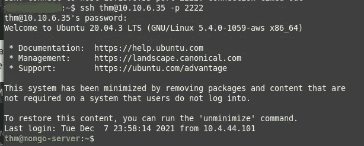
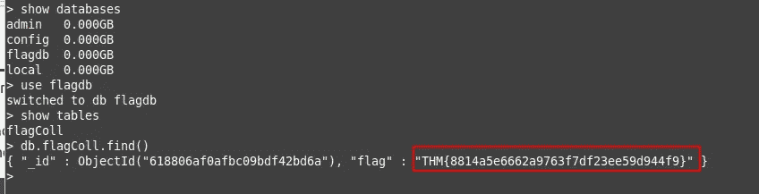
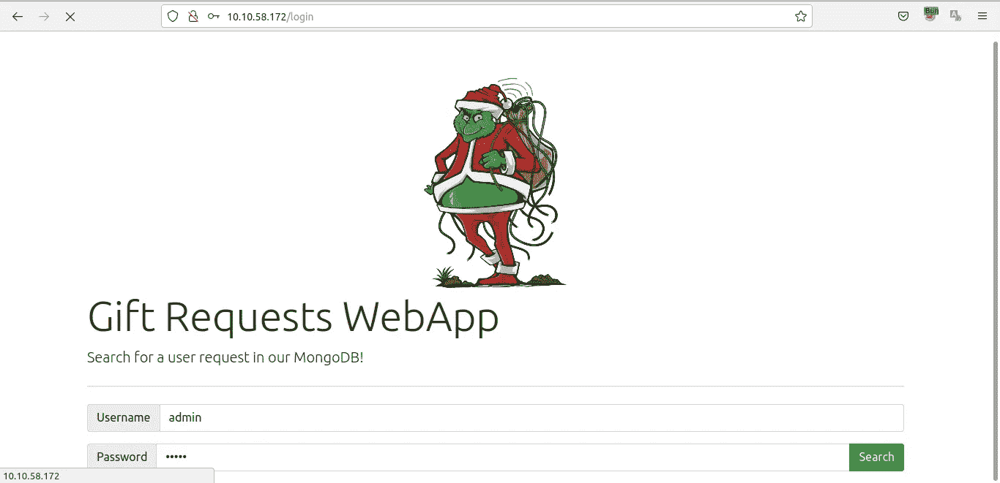
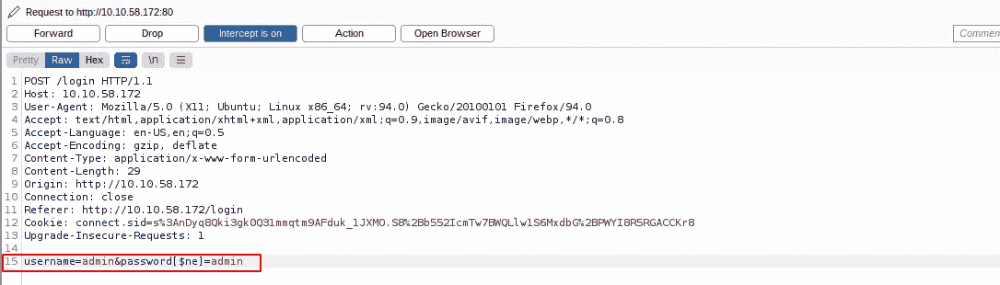
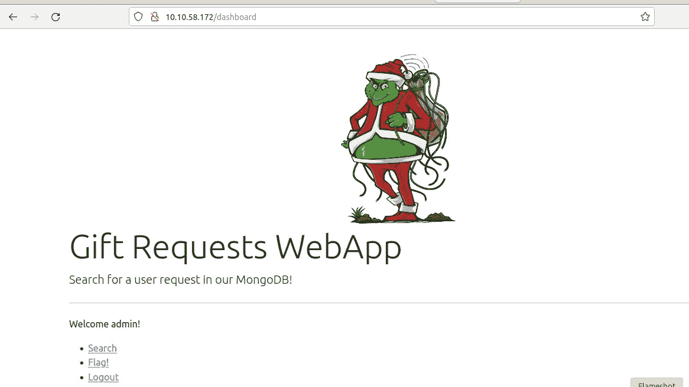
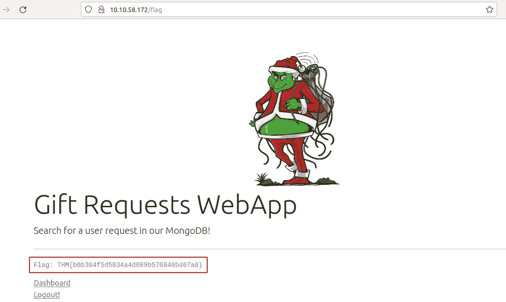
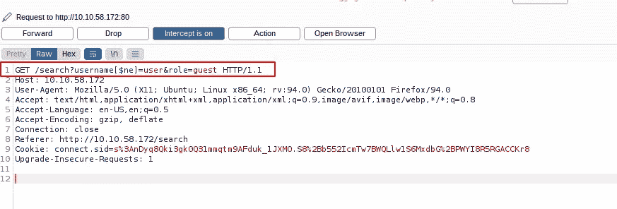
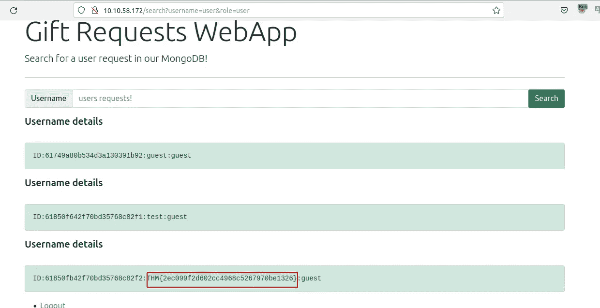
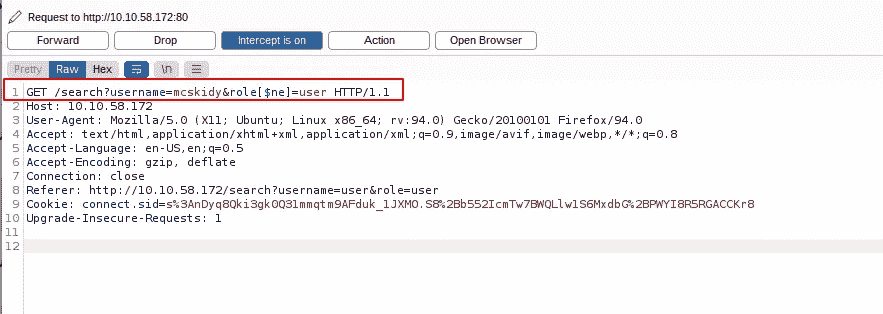
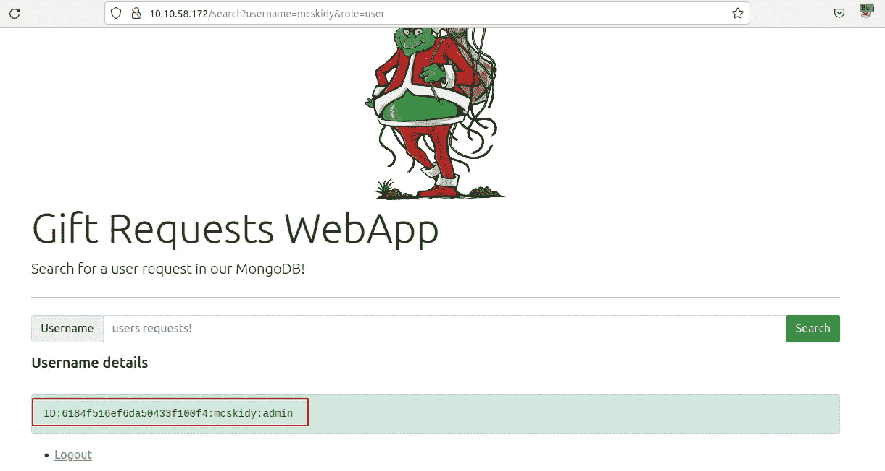

# [第 7 天]没有安全性的网络利用迁移|网络 3 的到来(2021 年)

> 原文：<https://infosecwriteups.com/day-7-web-exploitation-migration-without-security-advent-of-cyber-3-2021-7269c4cb7b9e?source=collection_archive---------5----------------------->

今天我们将学习 NoSql 注射，正如你所知道的，这是我第一次注射 NoSql，所以我从 tryhackme 学到了很多。

让我们注入 NoSql…

1.与 MongoDB 服务器交互以找到标志。国旗是什么？

> THM { 8814 a5e 6662 a 9763 f 7 df 23 ee 59d 944 f 9 }

因为 TryHackMe 在分屏交互方面有问题，我们可以用 ssh 和这个凭证( *thm:tryhackme* )进入服务器。

键入 **mongo** ，然后运行一些查询。

2.我们讨论了作为管理员如何绕过登录页面。你能以 admin 身份登录 Grinch Enterprise 控制的应用程序并检索标志吗？

使用 AoC3 第 4 天中提供的知识来设置和运行 Burp Suite 代理，以拦截登录页面的 HTTP 请求。然后修改 POST 参数。

> THM { b6b 304 f 5d 5834 a4 d 089 b 570840 b 467 a 8 }

拦截登录提交的请求，并放入 NoSql 注入。

注射成功了。

点击**标志！**链接，恭喜我们得到它。

3.登录后，使用礼品搜索页面列出所有具有来宾角色的用户名。国旗是什么？

> THM { 2 EC 099 f 2d 602 cc 4968 c 5267970 be 1326 }

和以前一样，拦截请求并注入 NoSql。

4.使用礼品搜索页面执行 NoSQL 注射并检索 mcskidy 记录。明细记录是什么？

> ID:6184 f 516 ef 6 da 50433 f100 f 4:mcskidy:admin

与之前相同，但参数不同。

最终得到这一切。

**结论**

NoSql 注入与 Sql 注入不同，但有相同的逻辑，我们可以进入它。

如果你有兴趣了解更多关于注入漏洞的知识，请查看 TryHackMe 上的 [SQL 注入](https://tryhackme.com/room/sqlinjectionlm)和[命令注入](https://tryhackme.com/room/oscommandinjection)室。

谢谢

# 🔈 🔈Infosec Writeups 正在组织其首次虚拟会议和网络活动。如果你对信息安全感兴趣，这是最酷的地方，有 16 个令人难以置信的演讲者和 10 多个小时充满力量的讨论会议。[查看更多详情并在此注册。](https://iwcon.live/)

 [## IWCon2022 - Infosec 书面报告虚拟会议

### 与世界上最优秀的信息安全专家建立联系。了解网络安全专家如何取得成功。将新技能添加到您的…

iwcon.live](https://iwcon.live/)