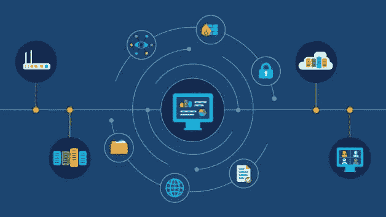
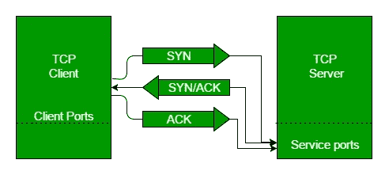
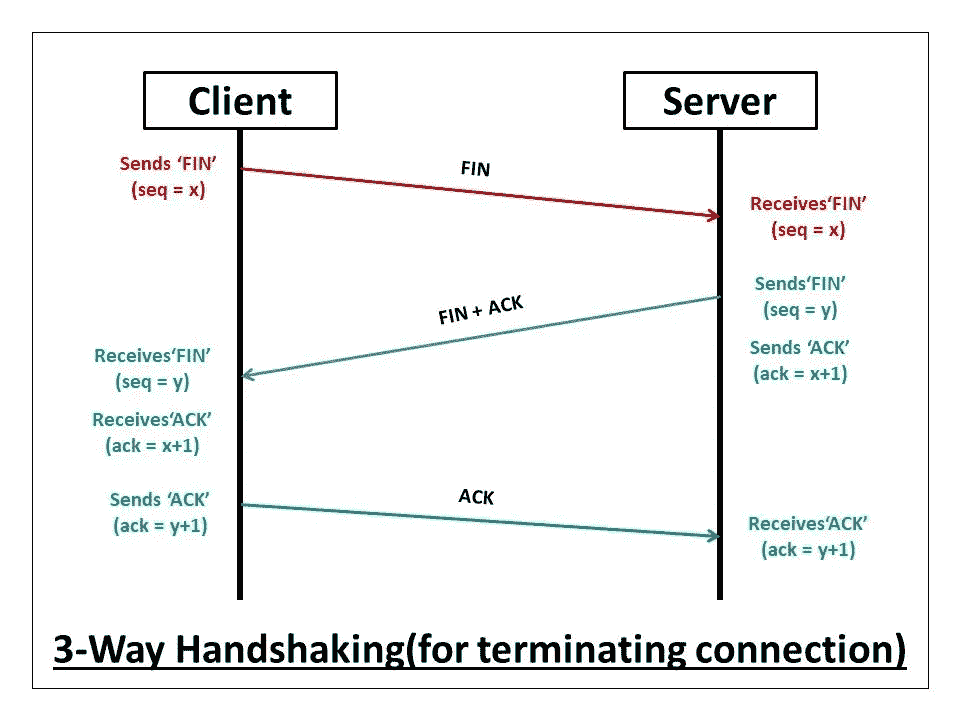
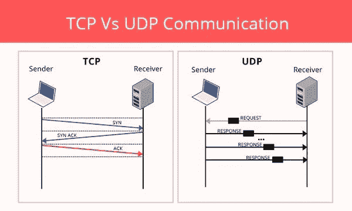

# 第 8 天 CN- TCP/UDP #100DaysofHacking

> 原文：<https://infosecwriteups.com/day-8-cn-tcp-udp-100daysofhacking-2584322871b1?source=collection_archive---------4----------------------->

**Day1 :** [安装 Kali Linux](/day-1-installing-kali-linux-100daysofhacking-eeb5954e0837)

**第二天:** [导航 Linux](https://3xabyt3.medium.com/day2-navigating-linux-100daysofhacking-44130f5983bf?source=user_profile---------0-------------------------------)

**第三天:** [电脑联网](/day3-computer-networks-100daysofhacking-1f9734b80313)

**第 4 天:** [网络拓扑](/day-4-cn-network-topologies-100daysofhacking-d01377674623)

**第 5 天:** [子网划分](https://3xabyt3.medium.com/day5-cn-subnetting-100daysofhacking-893346306e0d)

**第 6 天:** [ARP 和 DHCP](https://3xabyt3.medium.com/day6-cn-arp-and-dhcp-protocol-100daysofhacking-2eae786dc97b)

**第 7 天:** [OSI 和 TCP/IP 模型](/day-7-cn-osi-model-100daysofhacking-925c9e769a7d)

**Github:**[100 天黑客](https://github.com/ayush098-hub/100DaysofHacking)

大家好，我是 Ayush，如果你还没有看过之前的博客，请点击上面的链接来阅读，在上面我们讨论了重要的概念，这是以后的博客所必需的。

在我们之前的博客中，我们谈到了两种不同的模型，即 OSI 和 TCP/IP 模型，其中我们看到在不同的层中使用了许多不同的协议，如 http 用于应用层，tcp/udp 用于传输层等。所以今天我们将学习两个工作在传输层的协议 TCP 和 UDP，让我们开始吧。

# **TCP 协议:**

TCP 代表传输控制协议，它工作在两种模型的传输层。TCP 协议用于将数据或数据包从源传输到目的地，该协议面向连接。

面向连接意味着，在启动客户端和服务器之间的通信之前，该协议建立与服务器的连接。

让我们打个比方，假设你去一家咖啡店，首先你向服务员打招呼，然后服务员回答你好，先生，我能为你做什么，然后你回答我想要一个带可乐的比萨饼，然后服务员说好的，先生，需要 10 分钟，请稍等。

因此，这是一种面向连接的通信，首先双方相互确认，然后进行通信，最后关闭通信。

现在。使用 TCP 协议的主要原因是它能确保数据包是否到达目的地址。假设你正在发送一个包，但是有一个包丢失了，那么客户端再次向服务器发送一个请求，请求服务器再次发送这个包，直到它收到丢失的包。

因此，为了提供保证，在源和目的地之间建立 TCP 三次握手。

# **TCP 三次握手:**

## **TCP 打开连接:**

三次握手只不过是在传输数据之前在两个设备之间建立连接的过程。那么，现在让我们来看看这个过程。

当一台计算机运行 web 服务器，另一台计算机作为客户端(浏览器)运行时，当我们在浏览器上输入服务器的地址或网站地址时，它会向服务器发送一个 **SYN** (同步)数据包以启动连接，并通知服务器客户端可能会开始通信。如果服务器收到那个包，那么服务器用**SYN+ACK**synchoronization+确认包响应客户端，然后客户端发送一个 **ACK** 包给 web 服务器，然后我们接收网页。

此外，一个序列号也与 SYN、SYN+ACK 和 ACK 一起添加。

来源 GFG

## TCP 关闭连接

一旦客户端完成接收网页，它发送一个 Fin(完成)包。然后服务器用 ACK 和 Fin 响应，然后客户端用 ACK 响应。

毕业后

wireshark 中的演示:

在 aove 视频中，我只使用 nmap 向您展示了三次握手，不要想它，只需观察源如何首先发送 SYN 数据包，然后进一步处理。

你也可以通过观看这个 youtube 视频自己尝试一下，点击[这里](https://www.youtube.com/watch?v=4dSaAMZsPvw)。

现在希望 TCP 现在清楚了。

# UDP 协议:

UDP 代表用户数据报协议，它是一种无连接协议，这种协议不关心数据包是否到达目的地，但 TCP 协议关心。

让我们打个比方，假设有一群人，你想叫一个人，你一遍又一遍地喊他的名字，但你不知道你的声音是否到达那个人。

类似地，当你流式传输 youtube 视频时，我们需要快速处理数据包，这就是我们使用 UDP 的原因。

在 UDP 端，你可以看到一个请求在连续的响应被发送后被初始化。

感谢您花时间阅读本文，如果您有任何疑问，请在本博客上回复，我们将在下一篇中见面！

谢谢你，祝你黑客愉快！