# [第 8 天]约翰·哈蒙德圣诞老人的玩具袋特辑|网络 3 的来临(2021 年)

> 原文：<https://infosecwriteups.com/day-8-special-by-john-hammond-santas-bag-of-toys-advent-of-cyber-3-2021-8b9a04895096?source=collection_archive---------3----------------------->

我们将学习 Windows 中一些取证分析。

**让我们开始吧……**

1.看完上面的前提，启动附带的 Windows 分析机，在桌面的`SantasLaptopLogs`文件夹中找到转录日志。

如果您想要 RDP 到机器中，启动 AttackBox 并在终端中输入以下内容:xfreerdp/u:Administrator/p:Grinch 123！/v:MACHINE_IP —该计算机的凭据是作为用户名的 Administrator 和 grinch123！作为密码。

> 只需点击**问题完成**

每个转录日志都是一个简单的纯文本文件，可以在您选择的任何编辑器中打开。虽然文件名是随机的，但是通过查看修改日期或创建日期属性，或者文件扩展名之前的时间戳，您可以知道哪个日志“最先出现”!

我整理了日志，并在文件名的开头用一个数字给它重新命名。

打开第一个转录日志。您可以看到 PowerShell 中运行的所有命令和输出，比如`whoami`和`systeminfo`！

2.圣诞老人的笔记本电脑运行的是什么操作系统(“OS Name”)？

> 微软视窗 11 专业版

检查第一个日志文件，并在 **systeminfo** 命令下查看。

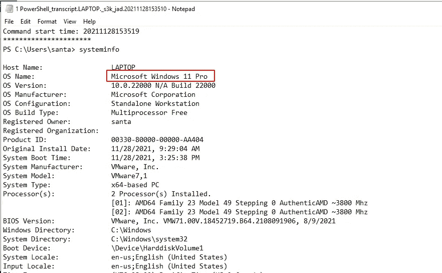

3.查看每个转录日志，了解笔记本电脑丢失后在其上执行了什么活动。在“第二”转录日志中，看起来好像是犯罪者创建了一个后门用户帐户！

新“后门”账户的密码是什么？

> 圣诞假期

我转到第二个转录日志，看到命令 **net 用户<用户名>密码> /add。**

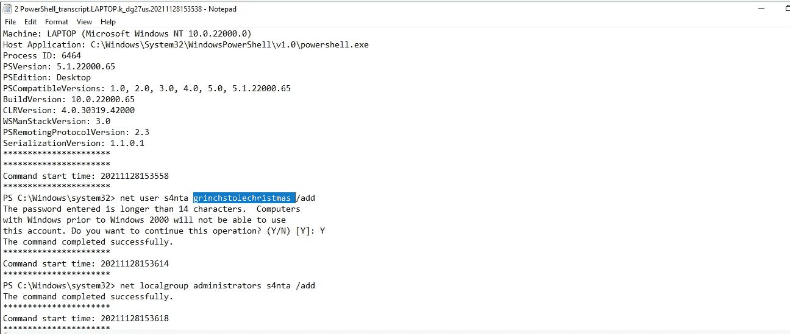

4.在其中一个转录日志中，坏演员在新的后门用户帐户下与目标进行交互，并将一个唯一的文件复制到桌面。在复制到桌面之前，原始文件的完整路径是什么？

> c:\ Users \ Santa \ AppData \ Local \ Microsoft \ Windows \ usr class . dat

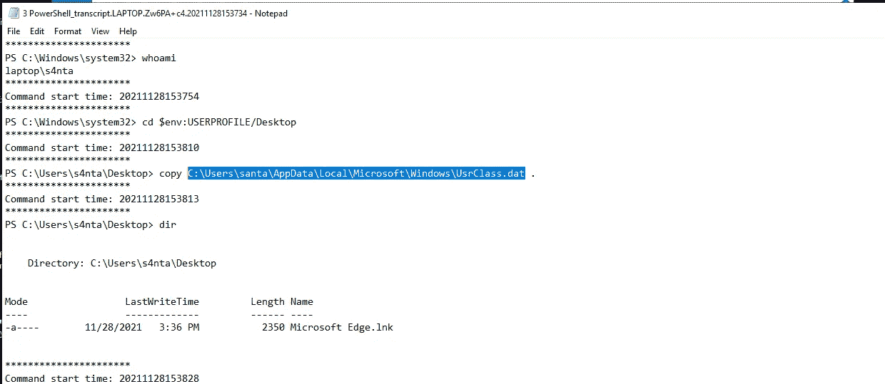

5.演员使用一个[二进制文件(LOLbin)来编码这个文件，然后通过查看输出文件来验证它是否成功。这个 LOLbin 叫什么？](https://lolbas-project.github.io/lolbas/Binaries/Certutil/)

> certutil.exe

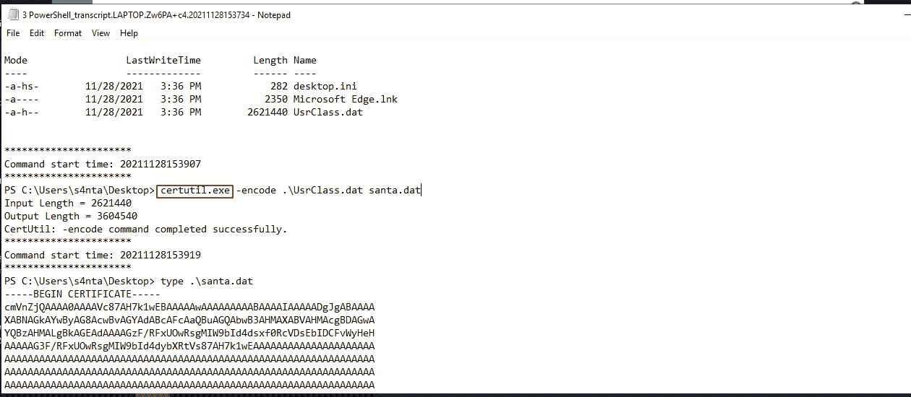

6.阅读以上内容，打开桌面文件夹中的`ShellBagsExplorer.exe`应用程序。

> 点击**问题完成**

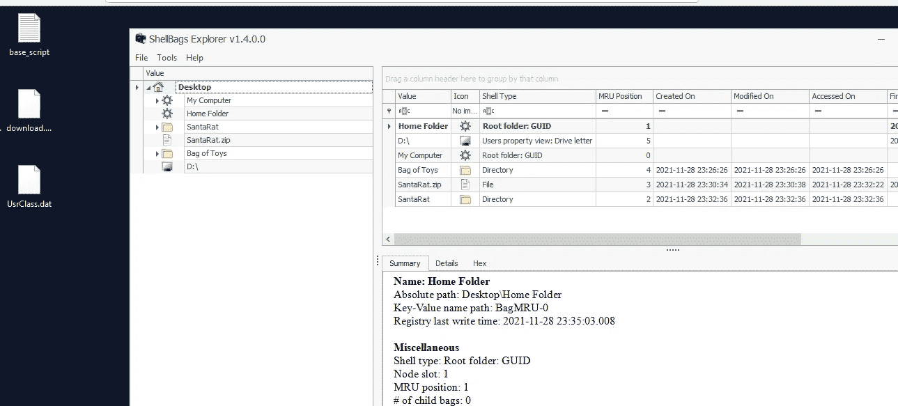

7.深入到文件夹中，看看你是否能找到任何可能表明我们如何更好地追踪这个圣诞老人到底是什么的东西。有哪些具体的文件夹名称提示我们，这可能是托管在代码共享平台上的可公开访问的软件？

> 。开源代码库

我们知道 github 是一个非常代码共享的平台。

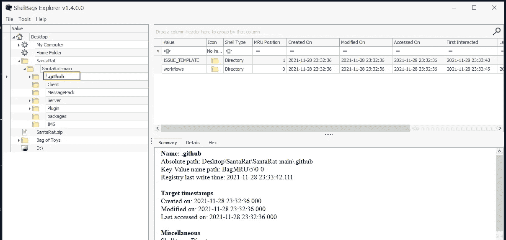

8.此外，桌面上还有一个名为“玩具袋”的独特文件夹！这一定是圣诞老人准备他的玩具收藏的地方，这肯定是演员可能已经妥协的敏感数据。在此文件夹中找到的文件的名称是什么？

> 玩具袋. zip

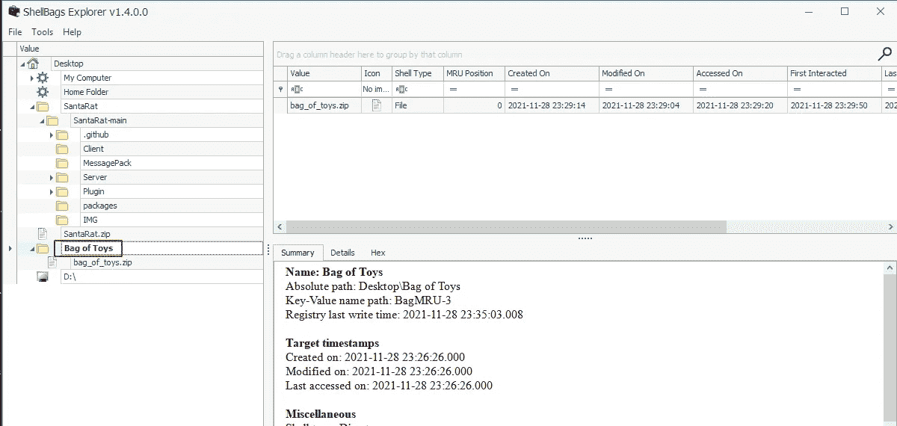

9.拥有 SantaRat 存储库的用户的名称是什么？

> 最古怪的

从那个文件夹的名字，我试着在 github 中搜索 SantaRat，我找到了这个:D

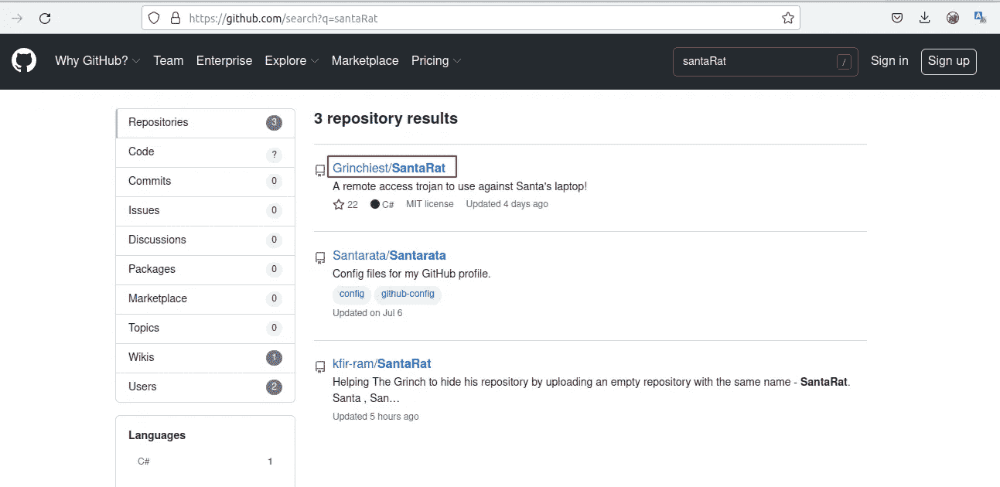

10.浏览该用户拥有的其他存储库。似乎与我们的调查特别相关的存储库的名称是什么？

> 玩具操作袋

潜入格林奇斯特的仓库，我发现了一个似乎与我们的调查特别相关的仓库。

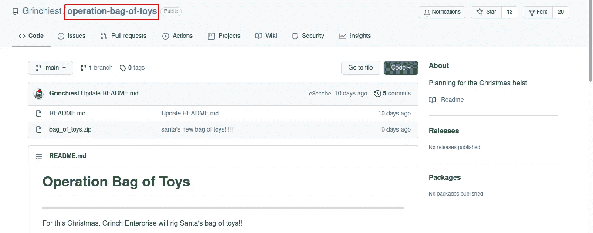

11.阅读此存储库中提供的信息。事实上，这位演员似乎已经妥协并篡改了圣诞老人的玩具包！您可以在转录日志中查看活动。看起来好像演员安装了一个特殊的工具来收集并最终取出玩具袋。安装了演员用来收集玩具袋的独特实用程序的可执行文件的名称是什么？

> uharc-cmd-install.exe

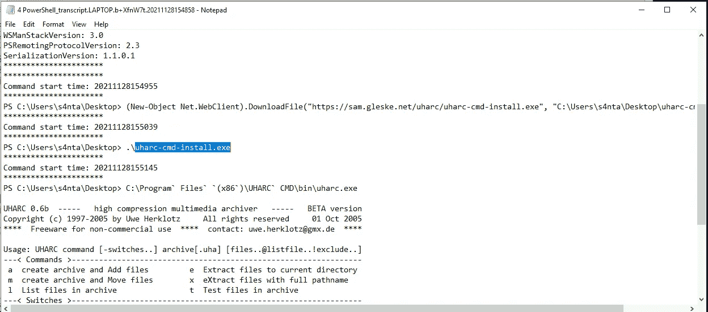

12.接下来，演员看起来已经把玩具袋里的所有东西都拿走了，并加入了新的东西，比如煤、霉菌、虫子等等！这些“恶意”文件的内容是什么(煤、霉菌和所有其他的)？

> 格林奇马斯

13.我们知道这位演员收集了原来的玩具袋。出现了一个小小的 OPSEC 错误，我们也许能找回圣诞老人的玩具包！查看 actor 的存储库，了解其计划的操作…在提交消息中，我们可以找到原始归档和密码！

> 点击**问题完成**

是..，漏洞是在公共平台键入密码，这是非常危险的。

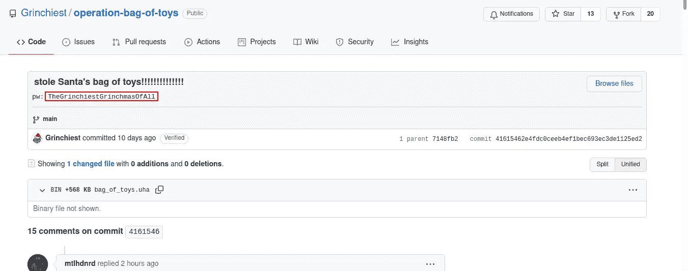

14.原始 bag_of_toys.uha 档案的密码是什么？(您不需要执行任何密码破解或暴力尝试)

> 格林奇瀑布

15.圣诞老人的玩具包里有多少原始文件？

> 228

用我们找到的最后一个密码打开存档，得到 bag_of_toys.uha 中的文件数。

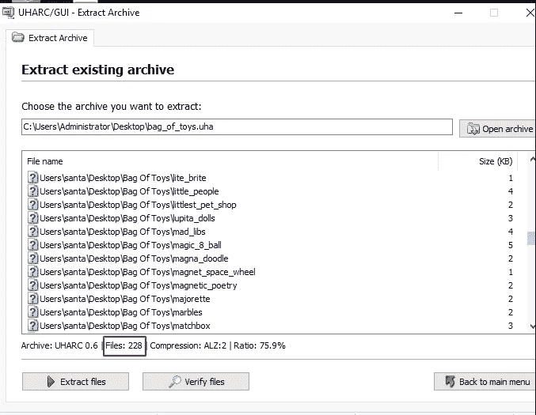

## **结论**

这部分是约翰·哈蒙德的特辑。如果您有兴趣了解更多关于 Windows 基础的知识，请查看 TryHackMe 上的 [Windows 基础](https://tryhackme.com/module/windows-fundamentals)模块。点击查看约翰·哈蒙德第八天[的演练视频。](https://www.youtube.com/watch?v=oGX7vLtjbic)

谢了。

# 🔈 🔈Infosec Writeups 正在组织其首次虚拟会议和网络活动。如果你对信息安全感兴趣，这是最酷的地方，有 16 个令人难以置信的演讲者和 10 多个小时充满力量的讨论会议。[查看更多详情并在此注册。](https://iwcon.live/)

 [## IWCon2022 - Infosec 书面报告虚拟会议

### 与世界上最优秀的信息安全专家建立联系。了解网络安全专家如何取得成功。将新技能添加到您的…

iwcon.live](https://iwcon.live/)