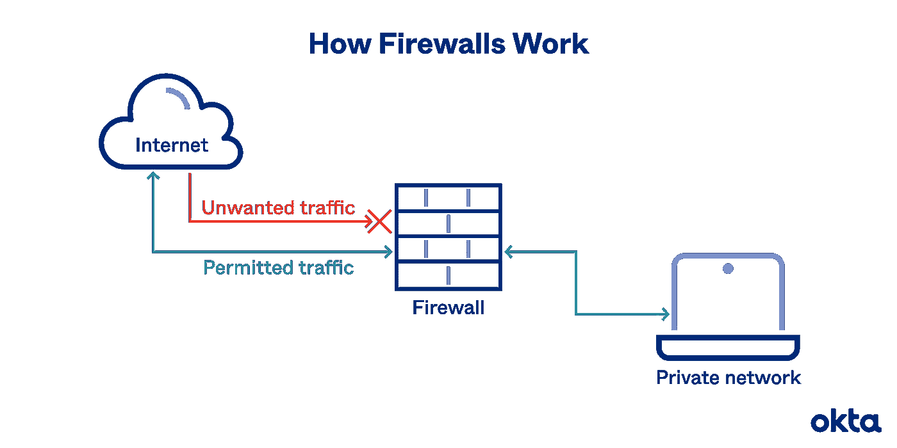
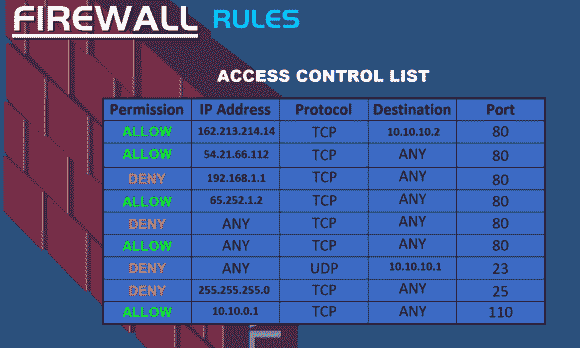
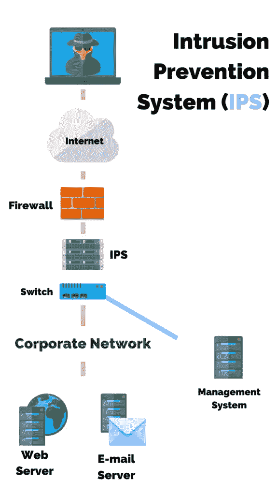

# 第 9 天 CN-网络安全设备#100DaysofHacking

> 原文：<https://infosecwriteups.com/day-9-cn-network-security-devices-100daysofhacking-b856b5ab092d?source=collection_archive---------2----------------------->

**Day1 :** [安装 Kali Linux](/day-1-installing-kali-linux-100daysofhacking-eeb5954e0837)

**第二天:** [导航 Linux](https://3xabyt3.medium.com/day2-navigating-linux-100daysofhacking-44130f5983bf?source=user_profile---------0-------------------------------)

**第三天:** [电脑联网](/day3-computer-networks-100daysofhacking-1f9734b80313)

**第 4 天:** [网络拓扑](/day-4-cn-network-topologies-100daysofhacking-d01377674623)

**第 5 天:** [子网划分](https://3xabyt3.medium.com/day5-cn-subnetting-100daysofhacking-893346306e0d)

**第 6 天:** [ARP 和 DHCP](https://3xabyt3.medium.com/day6-cn-arp-and-dhcp-protocol-100daysofhacking-2eae786dc97b)

**第 7 天:** [OSI 和 TCP/IP 模型](/day-7-cn-osi-model-100daysofhacking-925c9e769a7d)

**第 8 天:** [TCP 和 UDP](/day-8-cn-tcp-udp-100daysofhacking-2584322871b1)

**Github:**[100 天黑客](https://github.com/ayush098-hub/100DaysofHacking)

大家好，我是 Ayush，如果你还没有看过之前的博客，请点击上面的链接来阅读，在上面我们讨论了重要的概念，这是以后的博客所必需的。

在我们之前的博客中，我们讨论了两种不同的协议 TCP 和 UDP，我希望你能清楚，在今天的博客中，我们将讨论一些网络安全设备，如防火墙、ids、ips 等。

# **防火墙:**

每个人都知道防火墙，因为它是在 windows 系统中用来阻止主机中的可疑流量。

因此，防火墙只不过是一个软件或者你可以说是硬件网络设备，它监控流量并阻止内部私有网络和外部互联网之间的可疑或恶意流量。

防火墙充当内部专用网络和外部互联网之间的边界，因为它防止来自外部互联网的未经授权的数据访问。

如果所有入站和出站流量离开网络或进入网络，防火墙都会对其进行扫描

入站:进入网络的流量

出站:离开网络的流量。

资料来源:akta

防火墙最基本的功能是检查数据包，然后决定是否允许该数据包，这个决定是基于一些规则，这些规则也称为访问控制列表。

这些规则可以由网络管理员配置和确定。他/她决定允许哪些流量，不允许哪些流量。

该规则基于五个元组:

1.  源 IP
2.  目标 IP
3.  源端口
4.  目的港
5.  草案

假设您想要阻止某个特定的 IP，或者您想要阻止端口 21 而只允许端口 80，可以使用上述五元组来实现防火墙规则。

在上图中，您可以看到一些 IP 不允许进入网络，一些端口(如端口 23)不允许从专用网络外部访问。

# 防火墙的类型:

有两种类型的防火墙:

1.  **基于主机的防火墙** —它是一种软件防火墙，仅安装在计算机中，并且仅保护该计算机。在 windows 中，您可以搜索 windows defender 防火墙，第三方防火墙也在市场上，如 Maccafe，Quick heal 等。
2.  **基于网络的防火墙** —这种防火墙是硬件和软件的结合，它位于私有网络和公共互联网之间。这种防火墙保护整个网络，而不仅仅是单台计算机。路由器也有内置的防火墙。
3.  下一代防火墙:这是第三种类型的防火墙，比前两种更先进，它检查数据和应用程序。这里也有两个子类别。

1.无状态防火墙

2.全州火灾

 [## firewall.mp4

### 这是 Vimeo 上的“firewall.mp4 ”,是高质量视频和喜欢它们的人的家。

vimeo.com](https://vimeo.com/664915933) 

在上面的视频中，你可以看到，当在防火墙访问列表中 ICMP 数据包传输被拒绝时，我们无法 ping 服务器，但当我允许 ICMP 时，我们能够发送 ping 服务器。

# id:

资料来源:PurpleSec

IDS 代表入侵检测系统，这种类型的设备只是检测威胁并向负责人发送警报。

IDS 并不直接位于交换机和防火墙之间，而是

# IPS:

IPS 代表入侵防御系统，这种类型的设备检测威胁，防止或阻止它进入网络，并向负责人发送警报。

阅读更多关于 IDS 和 IPS[**https://purple sec . us/intrusion-detection-vs-intrusion-prevention-systems/**](https://purplesec.us/intrusion-detection-vs-intrusion-prevention-systems/)

谢谢你读到这里，我希望你已经了解了防火墙是如何工作的，以及关于入侵检测系统和入侵防御系统的基本概念，你可以在给定的链接上了解更多。

所以，再次感谢你，下次再见。

快乐学习，快乐黑客！