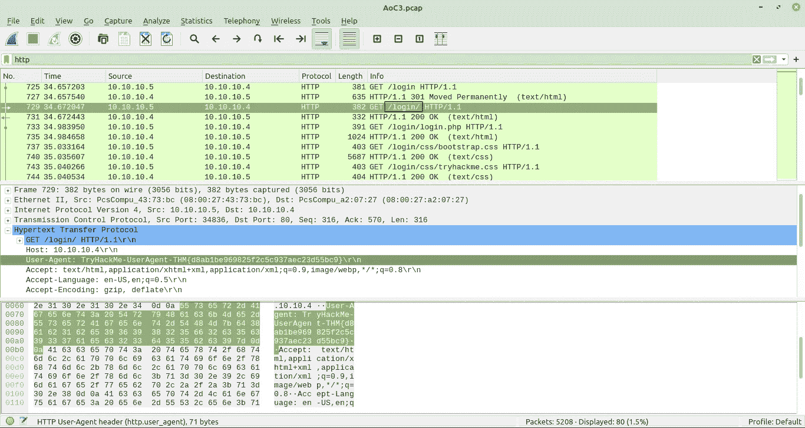
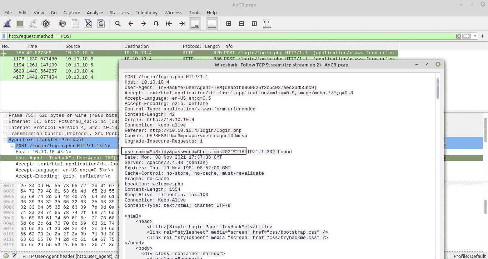
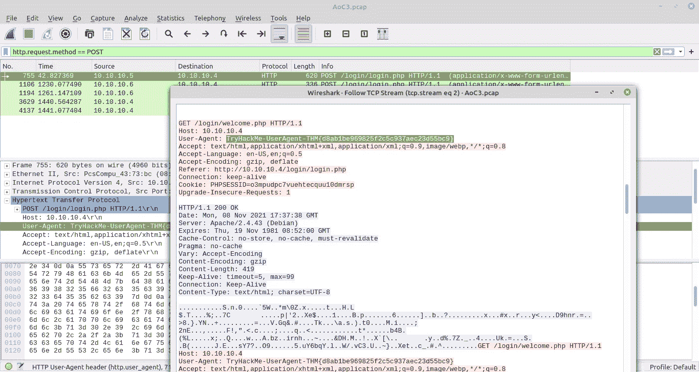
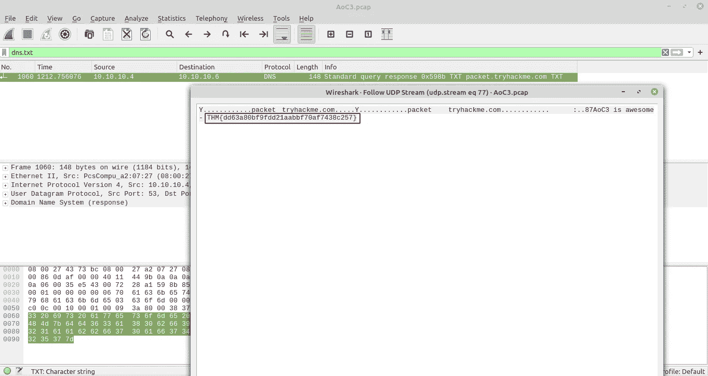
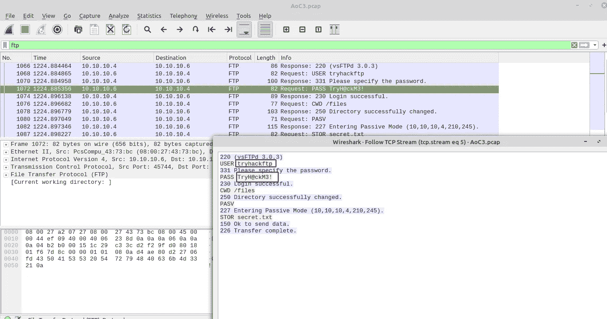
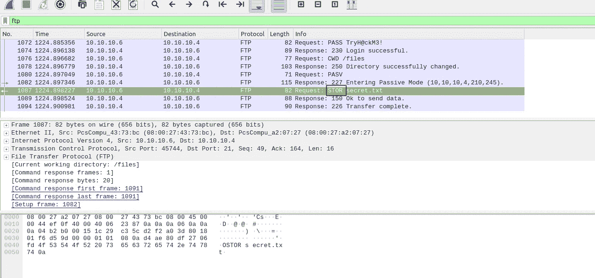
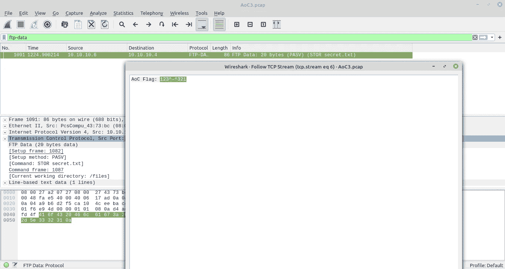

# [第 9 天]网络数据何去何从|网络 3 的到来(2021 年)

> 原文：<https://infosecwriteups.com/day-9-networking-where-is-all-this-data-going-advent-of-cyber-3-2021-8116e679455c?source=collection_archive---------4----------------------->

## 使用 Wireshark 进行基本网络分析

在此任务中，我将带您了解使用 [Wireshark](https://www.wireshark.org/) 执行基本数据包分析所需的技能和知识。

**让我们咬一下网络..**

1.在 HTTP # 1-GET requests 部分，在 web 服务器上找到了哪个目录？

> 注册

2.HTTP # 2-POST 部分登录页面中使用的用户名和密码是什么？

> 麦克斯基迪:2021 年圣诞节！

用**http . request . method = = POST**过滤，然后跟随 tcp 流。

3.在 HTTP # 2-POST 部分发送的用户代理的名称是什么？

> TryHackMe-user agent-THM { d 8 ab 1 be 969825 F2 C5 c 937 AEC 23d 55 BC 9 }

4.在 DNS 部分，有一个 TXT DNS 查询。DNS 查询消息中的标志是什么？

> THM { DD 63 a 80 BF 9 FD 21 AABB f 70 af 7438 c 257 }

用 **dns.txt** 过滤 wireshark

5.在 FTP 部分，FTP 登录密码是什么？

> TryH@ckM3！

6.在 FTP 部分，用来上传 secret.txt 文件的 FTP 命令是什么？

> 临床数据库

7.在 FTP 部分，secret.txt 文件的内容是什么？

> 123^-^321

使用 wireshark 中的 **ftp-data** 进行过滤。

**结论**

今天的主题是 Wireshark，它是网络流量分析中最强大的工具。更多地使用 wireshark 将使您更擅长过滤和网络流量分析。

谢谢