# 第二天，浏览 Linux——黑客 100 天

> 原文：<https://infosecwriteups.com/day2-navigating-linux-100daysofhacking-44130f5983bf?source=collection_archive---------1----------------------->

**Day1:** [安装 Kali Linux](/day-1-installing-kali-linux-100daysofhacking-eeb5954e0837)

大家好，我是 Ayush，如果你没有看过之前的博客，你可以点击上面的链接来阅读。

现在，在我们之前的文章中，我们已经成功地安装了 Kali Linux，今天我们将看到一些基本的命令，基本的目录，让我们开始吧。

> 安装 linux 后你要做的第一件事就是修改你的默认密码，你可以在终端中输入以下命令来打开终端点击: **ctrl+alt+T**
> 
> **命令:**密码

该命令将更改当前用户的密码，即 **kali。**

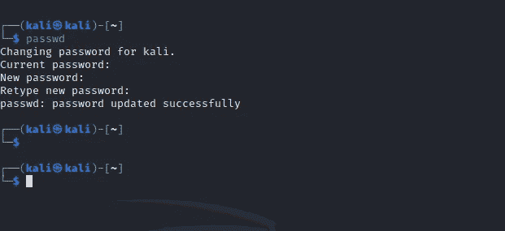

要在 Linux 中更改密码

## 默认用户

Kali Linux 包含两个默认用户‘Kali’和‘root’，在这两个用户中，root 用户比 kali 用户拥有更高的权限。

如果任何命令需要 root 权限，那么我们通常会借助 **sudo( *sudo 允许一个被授权的用户作为超级用户执行一个命令，或者另一个用户* )** 命令。

现在，要以 root 用户身份登录，您需要首先使用上面的命令更改 root 用户的密码，如图:

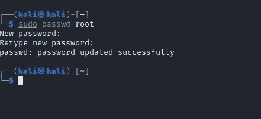

这里我使用了 sudo，因为我不能将 root 用户的密码更改为默认密码，这就是原因。

您可以通过输入****用户名:** root **密码:** you_know_it 以 root 身份登录。**

**或者您也可以通过终端应用 **su** 命令登录。**

**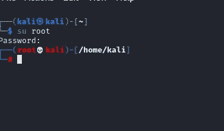**

> ****命令:su** (替换或切换用户的缩写)实用程序允许我们以另一个用户的权限运行**命令**，默认为根用户。如果你不提供任何用户，那么默认情况下，它会要求 root 用户输入密码。**

**现在，接下来我们将讨论 Linux 文件系统。**

## **Linux 文件系统:**

**众所周知，每个操作系统都有自己的文件系统，就像 Windows 有 NTFS 一样，类似地，Linux 也有名为 EXT4 的文件系统。**

**Linux 文件系统中有许多目录，第一个目录是根目录，现在我们将学习一些我们应该知道的常用目录。**

****/bin** —基础程序(ls、cd、cat 等。)**

****/sbin** —系统程序(fdisk、mkfs、sysctl 等)**

****/etc** —配置文件**

****/tmp** —临时文件(通常在启动时删除)**

****/usr/bin** —应用程序(apt、ncat、nmap 等。)**

****/usr/share** —应用支持和数据文件**

**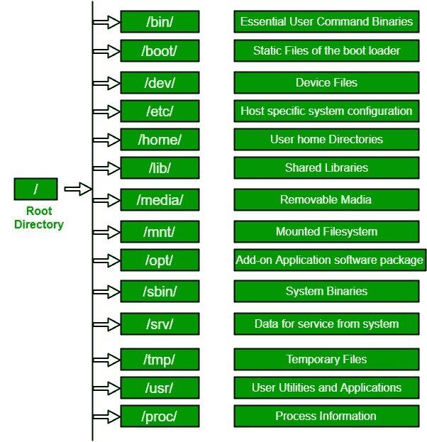**

**资料来源:GFG**

**在上图中，你可以看到 LFS 的详细结构。**

**现在，我们将学习一些基本命令**

## **基本命令**

**在 Linux 中，许多命令提供了称为手册或手册页的正式文档。要查看任何命令的描述，只需点击 **man cmd_name。****

**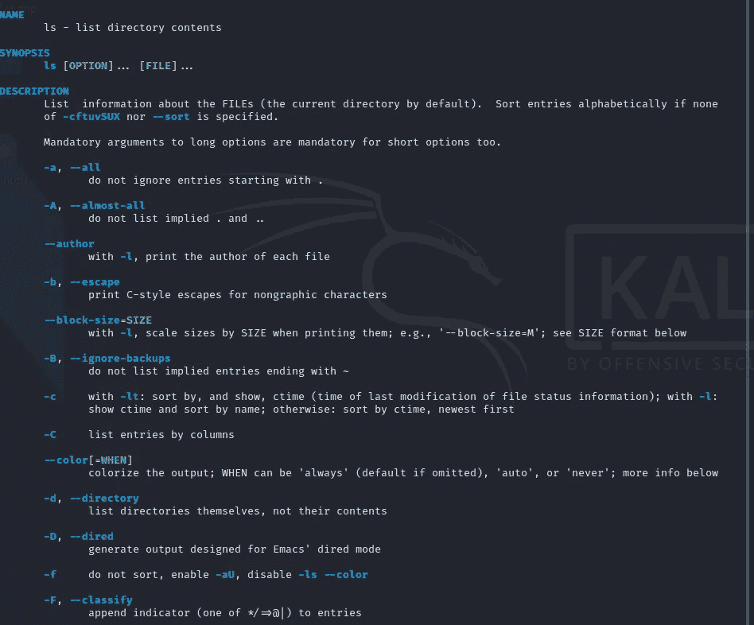**

**这是**男 ls** 的输出**

**从手册页，你可以看到我们可以使用或者我们也做**ls-help**的每一个标志的描述**

**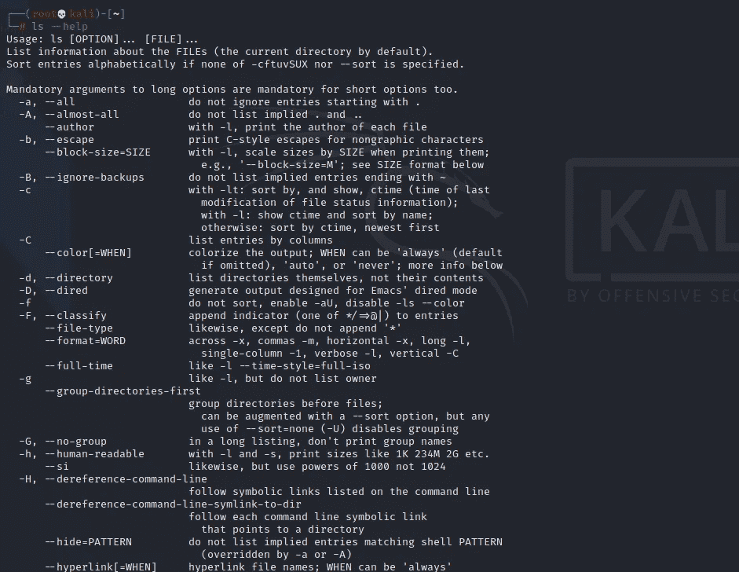**

****ls 输出—帮助****

**现在，您已经了解了如何自学不同的命令，但在此之前，我们先来谈谈不同的命令:**

> ****1。pwd:** pwd 代表当前工作目录，它告诉我们你当前在哪个目录下工作。**

**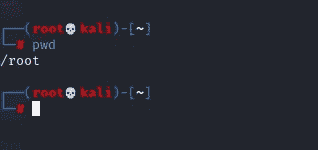**

> ****2。ls:** ls 代表列表目录(文件夹)，意味着它会显示哪些文件和文件夹存在于当前目录中。**

**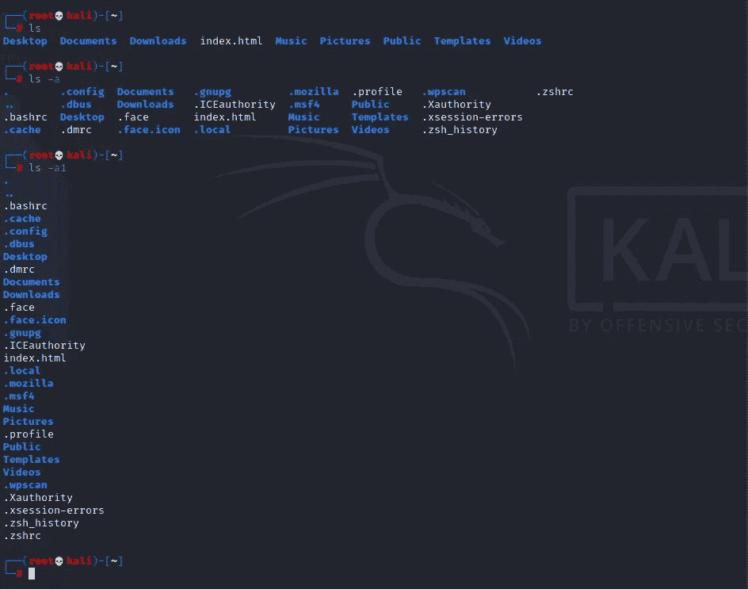**

**ls o/p**

**在上面的图像中，我们使用了简单的 ls，然后它显示了较少的文件夹，但是当我使用 ls -a 时，它显示了隐藏的目录，所以-a 选项用于查找隐藏的目录，而-a1 用于在同一行中获得结果。**

> ****3。cd:** cd 代表更改目录，意思是我们使用这个命令将目录从一个更改到另一个。**

**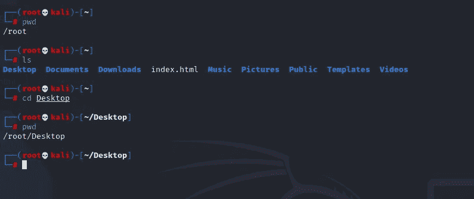**

**cd 命令 o/p**

**在上面你可以看到，首先我们在根目录，然后我们在 cd 命令的帮助下将目录从根目录更改为桌面。**

****记住在 Linux 桌面和桌面是不同的。****

****要回去:** cd../或者..**

****返回主目录:** cd ~**

> ****4。mkdir:** mkdir 代表创建目录，我们使用这个命令来创建新的目录。**

**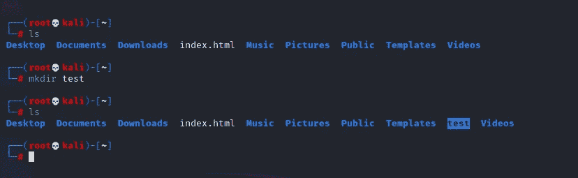**

**mkdir**

**要创建多个目录，我们可以这样做:**

**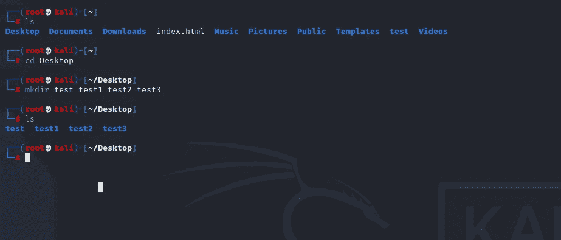**

> **5.rmdir——rmdir 代表删除目录，简单地说，我们用它来删除任何空的目录。**

**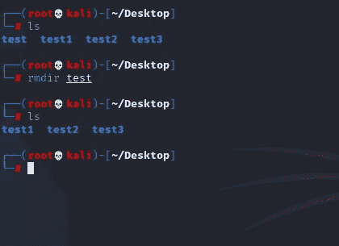**

**要删除非空目录，我们使用 **rm -rf 目录名**。**

> **6.触摸:触摸是一个命令，我们可以用它来创建任何文件。**

**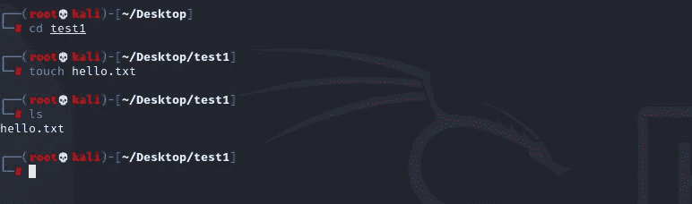**

**触摸 cmnd**

**要在 touch 命令中写入内容，我们使用 cat 后跟>(大于运算符)。**

> **7.创建、读取或写入文件。**

**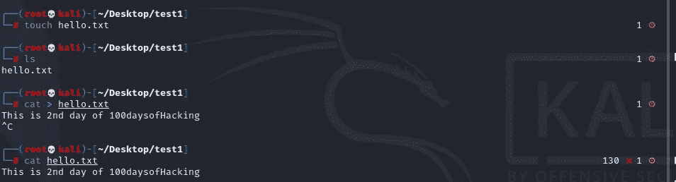**

**cat 命令**

> **8.rm —要删除文件，我们只需使用 rm 命令。**

**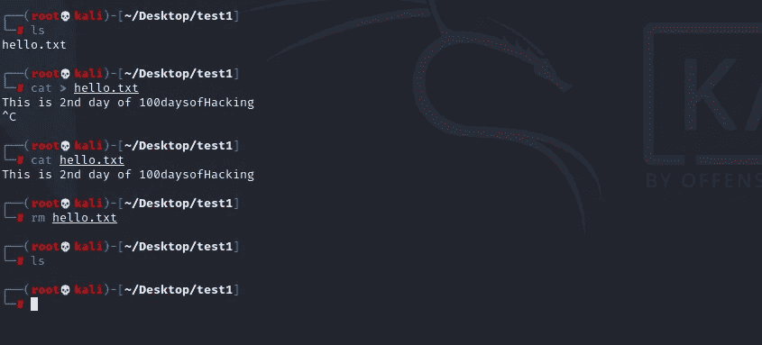**

**rm 命令**

> **9.cp:它用于复制文件和文件夹。**

****语法:cp 文件名/完整路径****

**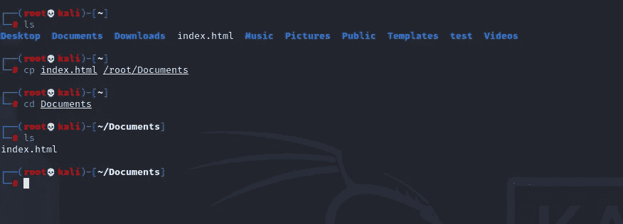**

**在上图中，你可以看到我们已经将 index.html 从主目录复制到文档中。**

**10.mv: mv 命令用于移动文件和目录。**

****语法 mv 文件名/完整路径****

**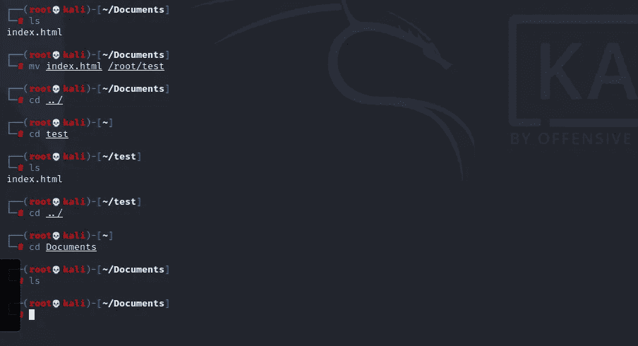**

**在上图中，你可以看到我们将 index.html 从文档移到了测试。**

**感谢你阅读到这里，我希望你喜欢这个博客，如果是的话，请点击拍手按钮，如果有任何疑问，只需在 Instagram 上 ping 我，[点击此处:)](https://instagram.com/_3xabyt3_)。**

> **您也可以查看我们的 github repos 的 [100DaysofHacking](https://github.com/ayush098-hub/100DaysofHacking) 。**

**所以再次感谢大家，Happy Hacking，下期撰文再见:)**