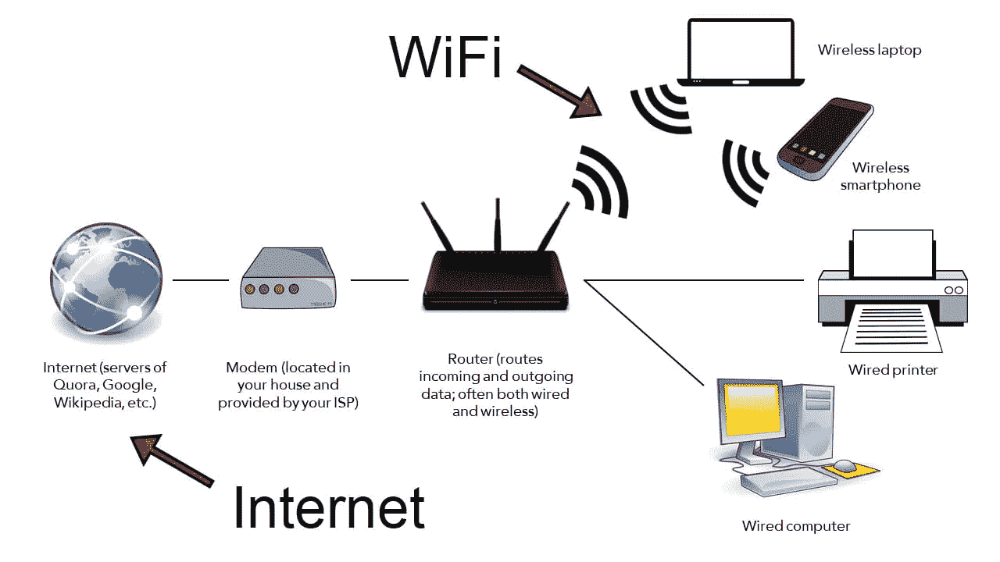
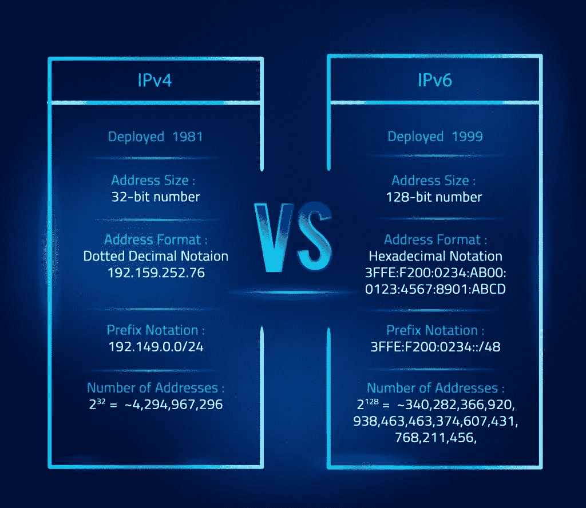
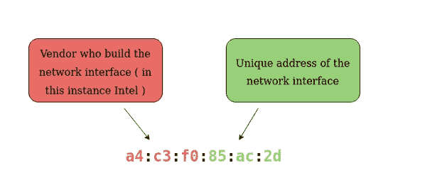
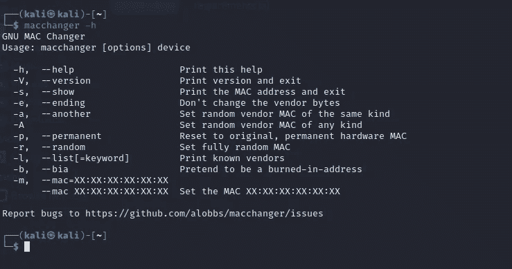
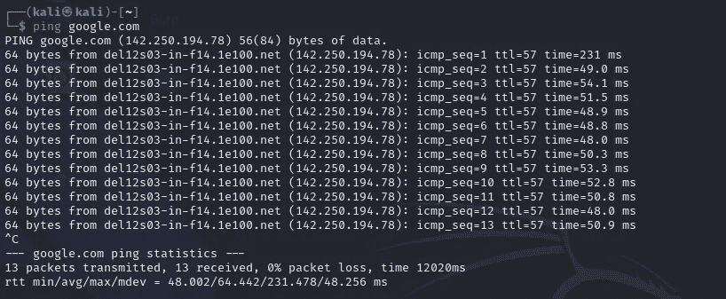

# 第三天，计算机网络——黑客 100 天

> 原文：<https://infosecwriteups.com/day3-computer-networks-100daysofhacking-1f9734b80313?source=collection_archive---------0----------------------->

**Day1 :** [安装 Kali Linux](/day-1-installing-kali-linux-100daysofhacking-eeb5954e0837)

**第二天:** [导航 Linux](https://3xabyt3.medium.com/day2-navigating-linux-100daysofhacking-44130f5983bf?source=user_profile---------0-------------------------------)

**Github:**[100 天黑客](https://github.com/ayush098-hub/100DaysofHacking)

大家好，我是 Ayush，如果你没有看过之前的博客，那么你可以点击上面的链接来阅读，在上面我们讨论了一些重要的概念。

今天在这个博客中，我们将学习计算机网络，因为在深入渗透测试或网络安全之前，你应该对计算机网络有很深的了解，所以我们将从头开始，让我们来学习一下。

# 什么是网络？

想到第一个答案是某种连接，因此联网就是当两台设备相互连接并相互通信或共享文件时，这两台设备之间就建立了网络，形成网络的过程称为联网。

从你的家到学校或办公室或大学，网络无处不在，当你将手机与 Wi-Fi 和其他设备连接时，一个简单的家庭网络就形成了，即所谓的 LAN(局域网)，我们稍后会谈到这一点。

在上图中，你可以看到许多设备都连接了 Wi-Fi，它们正在相互通信。

没有进展，让我们来谈谈互联网。

# 什么是互联网？

互联网是一个由许多小网络组成的巨大网络，其中小网络是私有网络，而将小网络连接到互联网的网络称为公共网络。

你可以在这里阅读更多关于互联网的历史。

接下来，我们来谈谈 IP 地址和 MAC 地址

# **什么是 IP 地址& MAC 地址？**

为了理解 IP 和 MAC，让我们打个比方，在每个房子里，每个人都有自己的名字和指纹，这个人是通过他的名字或指纹来识别的。假设在任何情况下，一个人改变了他的名字，但仍然可以通过他的指纹识别他，因为他不能改变他的指纹。

同样，在计算机网络中，每个设备都有自己的 IP 地址和 MAC 地址，用于在网络上识别它们。如果 IP 地址发生变化，也可以通过 MAC 识别设备。现在来说说 IP。

## IP 地址；网络地址

IP 地址代表互联网协议地址，正如我前面所说，它是用来识别或确定网络上的设备，每个设备都有自己的 IP 地址。

要了解你的设备 IP 地址，只需在谷歌中搜索[whatismiypaddress](https://whatismyipaddress.com/)，你就会得到你的 IP 地址。

IP 是一组 32 位的数字，分成四个十进制八位数。

我们举个例子，假设一个 IP **192.168.1.2**

这里 192 位于**第一个八位字节**，168 位于**第二个八位字节**，1 位于**第三个**八位字节，2 位于**第四个八位字节**。

每个二进制八位数的范围是从 0 到 255，因为当我们将任何 IP 转换为 8 位十进制时，每个二进制八位数的最大值可以是 255，这就是范围在 0 到 255 之间的原因。

《出埃及记》IP—1.1.1.1

binary _ Form:00000001000000100000010000000001

如果我们都是 1，那么每个二进制八位数就是 255。

要更清楚地了解二进制转换，请阅读这篇博客。

任何二进制八位数不能超过 255，如 192.162.256.1，这是一个无效的 IP。

现在你们中的许多人会认为 IP 地址是随机的，但事实并非如此，IP 地址是由[互联网地址分配机构](https://www.iana.org/) (IANA)提供的。

IP 地址有两种形式，一种是 IPV4，另一种是 IPV6，让我们看看两者的区别。

来源:技术大师中心

在上图中，你可以看到 IPv4 的地址数量是 2，比我们的总人口少，所以我们不能给每个人分配 IP，这就是为什么为了克服 IPv4 的不足，IPv6 使用了 2 个⁸地址。现在来说说 MAC 地址。

## **MAC 地址**

MAC 地址是一个 12 个字符长的十六进制数或 48 位，也用于识别网络上的设备。它也被称为物理地址。这个 MAC 地址被称为物理地址，因为它印在机器的网卡上。在 MAC 中，前半部分代表制造网卡的公司，后半部分是唯一的号码。

我们也可以在 linux 中更改我们的 mac 地址，这个过程被称为欺骗。

> 要了解 windows 和 linux 中的 IP 和 MAC，请输入以下命令:
> 
> Windows: ipconfig /all
> 
> Linux: ifconifg

要欺骗 MAC 地址:我们使用一个叫做 macchanger 的工具。

cmnd:sudo MAC changer-m**your _ MAC _ Address _ Choice**eth 0

etho0:这只是一个界面，要知道只需点击 ifconfig。

## 砰

Ping 是一个命令行工具，我们基本上使用它通过发送 ICMP(互联网消息协议数据包)来检查主机是否活动。

让我们做平 google.com

感谢你阅读到这里，我希望你喜欢这个博客，如果是的话，请点击拍手按钮，如果有任何疑问，只需在 instagram 上 ping 我， [click_here :)](https://instagram.com/_3xabyt3_) 。

现在我们将在下一篇关于网络概念的文章中见面。

黑客快乐！