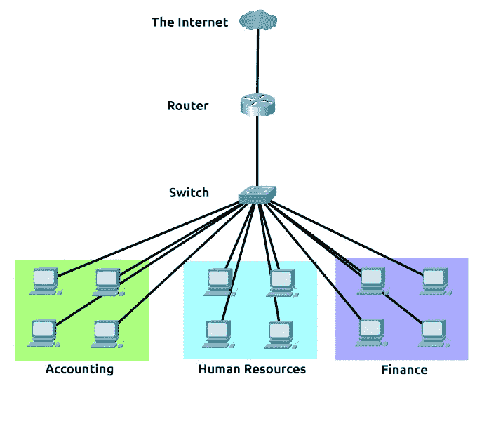
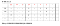
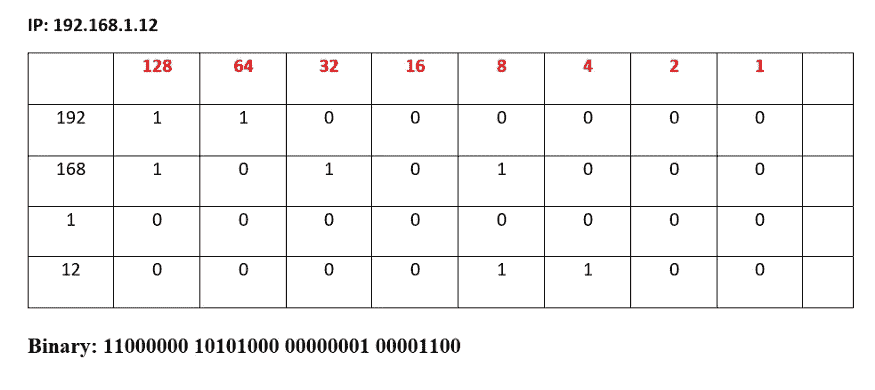
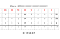
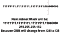
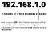
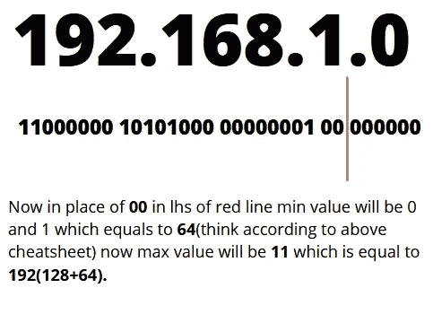
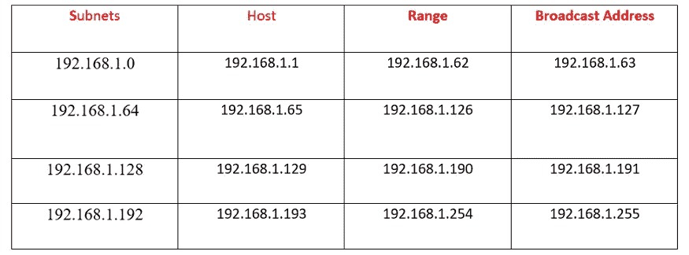

# 第 5 天 CN-子网划分# 100 天黑客攻击

> 原文：<https://infosecwriteups.com/day5-cn-subnetting-100daysofhacking-893346306e0d?source=collection_archive---------2----------------------->

**Day1 :** [安装 Kali Linux](/day-1-installing-kali-linux-100daysofhacking-eeb5954e0837)

**第二天:** [导航 Linux](https://3xabyt3.medium.com/day2-navigating-linux-100daysofhacking-44130f5983bf?source=user_profile---------0-------------------------------)

**第三天:** [电脑联网](/day3-computer-networks-100daysofhacking-1f9734b80313)

**第 4 天:** [网络拓扑](/day-4-cn-network-topologies-100daysofhacking-d01377674623)

**Github:**[100 天黑客](https://github.com/ayush098-hub/100DaysofHacking)

大家好，我是 Ayush，如果你还没有看过之前的博客，请点击上面的链接来阅读，在上面我们讨论了重要的概念，这是以后的博客所必需的。

今天在这个博客中，我们将讨论**子网划分**。

> *子网划分就是将网络分成不同的部分，假设您的商店或公司有一个网络，您想将您的网络分成 4 个部分，因此我们使用子网划分。*

在进入实际部分之前，你应该知道下面给出的备忘单，这将帮助你把 IP 转换成二进制和二进制转换成 IP。如果你知道 Ip 地址，你就会知道 IP 地址被分成 32 位的 1 和 0。

# 128 64 32 16 8 4 2 1 —备忘单

现在让我们举一个例子，假设你有一个 IP 192 . 168 . 1 . 12，它的二进制形式是 11000000 101000000000010000000100000001000000100001100

我们是如何做到这一点的，我们是在上述备忘单的帮助下做到的，看到了吗

这里 **192=128+64** ，那么我们就把 128 和 64 看成 1，其他看成 0。所以，192 的二进制形式将是 **11000000** 。接下来

168= **128+32+8** ，所以我们就把 128，32，64 看成 1，其他看成 0。所以，168 的二进制形式将是 **10101000**

1= **1** 所以二进制将是 **00000001**

12= **8+4** ，所以我们将 8 和 4 视为 1，其他视为 0。所以，二进制形式将是 **00001100** 。

我希望知道它应该是清楚的。

现在，接下来我们必须将二进制转换为 ip，我们将考虑相同的 IP，您只需添加显示 1 的数字，这将给出您的 IP，如下所示:

现在，我们完成了转换，我们将看到一个实际的子网划分部分，因此，让我们以一个网络: **192.168.1.0** 为例，我们必须将其划分为 4 个子网(4 个网络)。因此，这是重击 24 IP (/24)和/24 子网掩码将始终是 **255.255.255.0**

现在，**第一步**:把给定的 IP 和子网掩码地址转换成二进制:

**192 . 168 . 1 . 0 = 11000000 101000 000000001 00000000**

**255 . 255 . 255 . 0 = 111111111.11111111.0000000**

**第二步:**现在我们知道我们需要 4 个子网，然后根据子网的数量，我们使用一个公式 2^y，其中 y 是我们必须在子网掩码的最后一个八位位组中移动的位数。这里，在这种情况下，我们将使用 2 =4，因此我们将在子网的最后一个二进制八位数中移动 2 位，但如果我们需要 5 个子网，那么我们将使用 2 = 8，然后我们将移动 3 位(因为 5 小于 8)，但在这种情况下，它只有 2 位。

现在，我们将对网络 ID 做同样的事情，找到最后一个八位字节中的最小值，直到这条红线，然后将最小值添加到最大值。

现在我们将**在 IP 地址的最后一个八位字节中添加** **最小值**64，直到**最大值**192。

第一个子网:192.168.1.0

第二个子网:192.168.1.64

第三个子网:192.168.1.128

第四个子网:192.168.1.192

我希望你在这个博客中学到了一些新的东西，你也可以在互联网上阅读更多关于子会议的内容，或者只是在博客上做出回应，试图消除你的疑虑。

谢谢你的阅读。快乐学习！