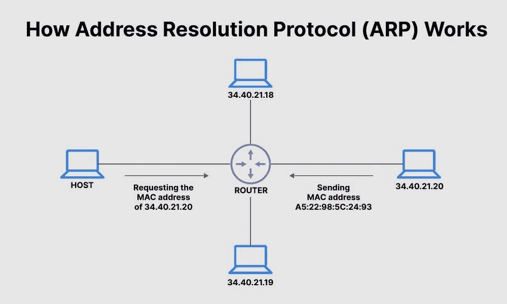
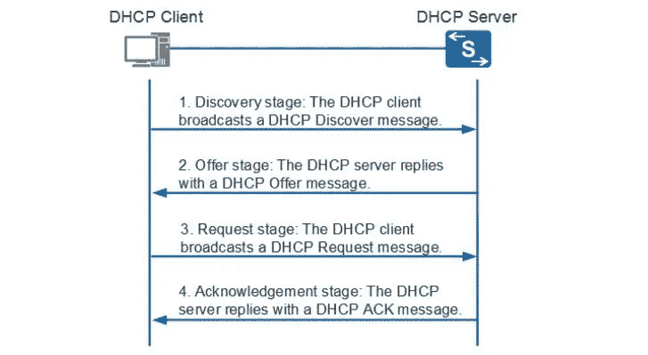

# 第 6 天 CN-ARP 和 DHCP 协议# 100 天黑客攻击

> 原文：<https://infosecwriteups.com/day6-cn-arp-and-dhcp-protocol-100daysofhacking-2eae786dc97b?source=collection_archive---------2----------------------->

**Day1 :** [安装 Kali Linux](/day-1-installing-kali-linux-100daysofhacking-eeb5954e0837)

**第二天:** [导航 Linux](https://3xabyt3.medium.com/day2-navigating-linux-100daysofhacking-44130f5983bf?source=user_profile---------0-------------------------------)

**第三天:** [电脑联网](/day3-computer-networks-100daysofhacking-1f9734b80313)

**第 4 天:** [网络拓扑](/day-4-cn-network-topologies-100daysofhacking-d01377674623)

**第 5 天:** [子网划分](https://3xabyt3.medium.com/day5-cn-subnetting-100daysofhacking-893346306e0d)

**Github:**[100 天黑客](https://github.com/ayush098-hub/100DaysofHacking)

大家好，我是 Ayush，如果你还没有看过之前的博客，请点击上面的链接来阅读，在上面我们讨论了重要的概念，这是以后的博客所必需的。

今天在这个博客中，我们将讨论两个重要的协议 **ARP 和 DHCP** 。

到目前为止，我们已经了解了计算机网络、不同网络拓扑、子网划分的基础知识，有一点很清楚，在网络中有两个标识符 **IP** 和 **MAC** 地址，用于标识网络上的任何设备。

# ARP:地址解析协议

**ARP:** ARP 代表地址解析协议，用于将设备 MAC 地址与 IP 地址相关联。

假设您正在将数据从您的计算机发送到网络上的另一台计算机，消息首先被发送到交换机，然后交换机将它转发到目的地，因此这里交换机决定 MAC 地址而不是 IP 地址。(到达交换机的数据包含 IP 和 MAC)

在上面的例子中，发送者知道 IP 地址和 MAC 地址，现在让我们看另一个场景，假设发送者不知道接收者的 MAC 地址，那么在这种情况下会发生什么？？？？

在这种情况下，发送方将向局域网内的所有设备广播一个 **ARP 请求**，询问设备谁分配了目的 IP 地址。因此，只有拥有特定 IP 地址的设备才会用他/她的 MAC 地址来响应。

资料来源:Fortinet

在上图中，你可以看到**发送者 34.40.21.17**正在询问**34.40.21.20**的 MAC 地址，然后**34.40.21.20**回复了他的 MAC 地址。ARP 协议就是这样工作的。

一旦设备接收到 MAC 地址，它就会存储在 ARP 缓存中。

> ARP-Cache 是将 IP 地址解析为 MAC 地址时创建的 ARP 条目的集合。每当我们试图将数据包/数据发送到 arp 缓存存储中的 MAC 地址的 IP 地址第一系统。如果没有条目，那么就采取我们上面看到的进一步行动。

要查看 ARP 缓存，您可以输入:

对于 windows:

> arp -a

还有一件事，每当发送者广播 MAC 的消息时，它被称为**ARP-请求**，每当接收者发送他的 MAC 给发送者时，它被称为**ARP-回复**

模拟:

ARP 协议模拟

在上面的视频中，您可以看到 PC1 想要向 PC2 发送消息，但是 PC1 没有任何 arp 条目，所以它向每个人发送广播消息，然后 PC2 用他/她的 MAC 地址进行响应，然后 MAC 地址被添加到 AP 表中，之后，对于每次通信，PC1 都不进行广播。

我希望看完上面的视频后，ARP 的概念已经很清楚了。现在，我们来谈谈 DHCP。

# DHCP:动态主机配置

DHCP 代表动态主机配置。

DHCP 被配置为网络上的 IP 服务，自动向客户端设备提供可用的 IP 地址。

在 DHCP 的帮助下，网络管理员无需手动分配 IP 地址。

工作:

当设备连接到网络时，如果它还没有被手动分配 IP 地址，它会发出请求 **(DHCP 发现)**来查看网络上是否有任何 DHCP 服务器。然后 DHCP 服务器回复一个设备可以使用的 IP 地址 **(DHCP Offer)** 。然后，设备发送回复，确认它需要所提供的 IP 地址 **(DHCP 请求)**，最后，DHCP 服务器发送回复，确认此操作已完成，设备可以开始使用 IP 地址 **(DHCP ACK)** 。

发现:在网络中找到 DHCP 服务器

提供:给客户，IP 地址。

请求:确认

ACK:设备可以开始使用 IP 地址

现在我希望 ARP 和 DHCP 你都清楚了。

感谢您花时间阅读本文，如果您有任何疑问，请在本博客上回复。

谢谢你，祝你黑客愉快！