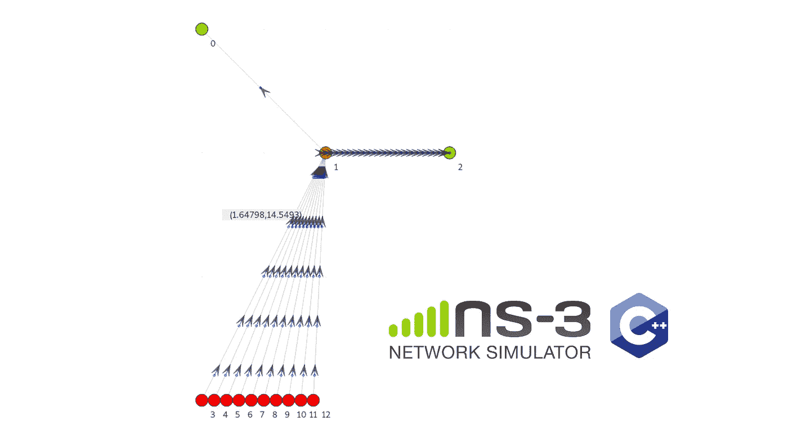
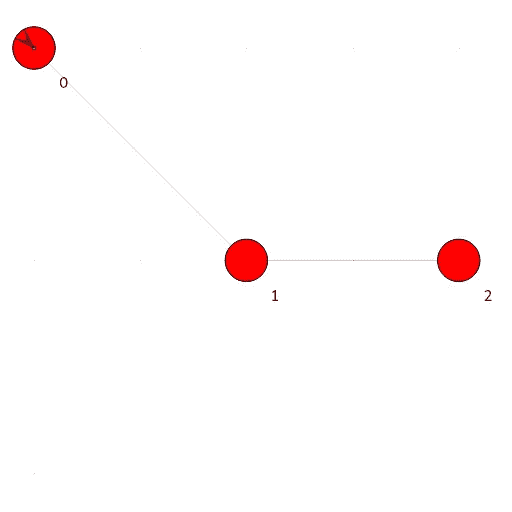
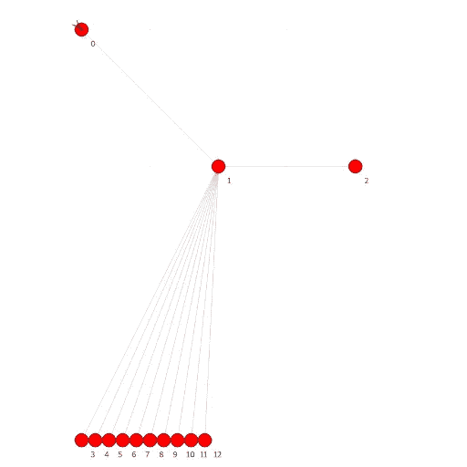
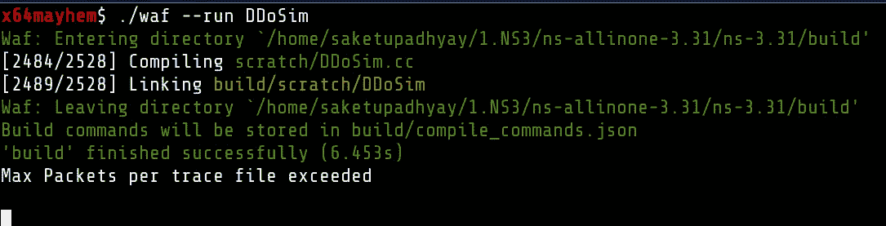
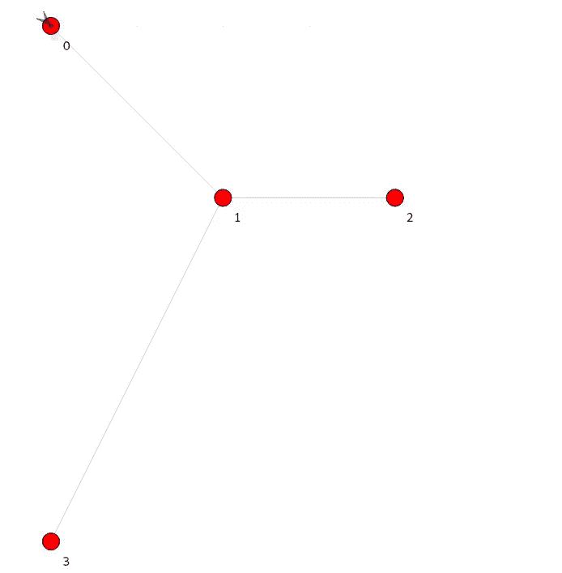
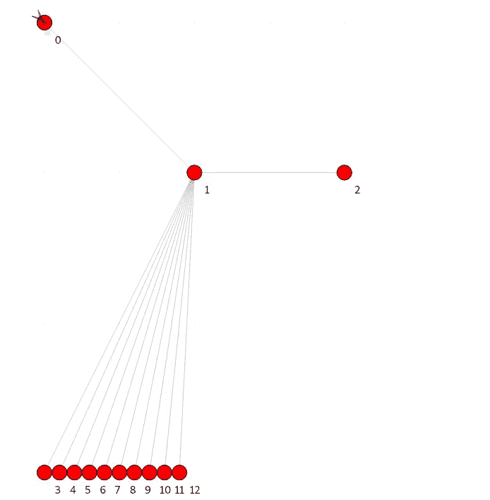

# NS-3 [C++]中的 DDoS 仿真

> 原文：<https://infosecwriteups.com/ddos-simulation-in-ns-3-c-12f031a7b38c?source=collection_archive---------0----------------------->

在 NS3 网络模拟器中模拟典型的 DDoS 攻击



**这是什么？**

本文是关于在 NS-3 离散事件网络模拟器中编写一个分布式拒绝服务攻击模拟程序。

**我们为什么需要它？**

因为你可以玩的基本概念的视觉表现更好，对吗？

**你能从哪里得到代码？**

作为社区项目的一部分，我正在 NS3 中收集/构建多个网络安全模拟和场景，并将它们记录在 GitHub 中

[](https://github.com/Saket-Upadhyay/ns3-cybersecurity-simulations) [## saket-Upadhyay/ns3-网络安全-模拟

### NS3 和 NetAnim 中常见的网络安全场景模拟[C++]

github.com](https://github.com/Saket-Upadhyay/ns3-cybersecurity-simulations) 

*查看* ***【模拟结果】*** *部分(接近文章末尾)以获得最终动画。*

# **如何？**

这就是这篇文章的全部内容。让我们开始吧。

## 创建基础模型

这种攻击的基本模型相对简单:我们有 3 个主要节点 Alice [n0](合法客户端)、Bob [ n2](服务器应用程序)以及中间的一个连接节点，比如 Dave [n1]。



合法连接模型

现在我们将添加尽可能多的我们想要攻击网络的机器人，让我们称它们为 Mallory [bi | i∈ (N)]。



10 个机器人的网络设置示例

> 机器人将淹没戴夫，以产生从 n1 到 n2 的网络拥塞。这将导致 Alice 和 Bob 之间的通信延迟延长，并最终拒绝 Alice 的资源。

# 代码[C++]

让我们首先包括所有需要的头。

```
#include <ns3/csma-helper.h>
#include "ns3/mobility-module.h"
#include "ns3/nstime.h"
#include "ns3/core-module.h"
#include "ns3/network-module.h"
#include "ns3/internet-module.h"
#include "ns3/point-to-point-module.h"
#include "ns3/applications-module.h"
#include "ns3/ipv4-global-routing-helper.h"
#include "ns3/netanim-module.h"
```

现在，我们定义一些全局配置，以便以后可以使用它们。

```
#define TCP_SINK_PORT 9000
#define UDP_SINK_PORT 9001

//experimental parameters
#define MAX_BULK_BYTES 100000
#define DDOS_RATE "20480kb/s"
#define MAX_SIMULATION_TIME 10.0

//Number of Bots for DDoS
#define NUMBER_OF_BOTS 10

NS_LOG_COMPONENT_DEFINE("DDoSAttack");
using namespace ns3;
```

现在，在典型的 main()函数中，我们将开始创建上面设计的基本模型。

## 创建节点

节点只不过是我们在设计阶段构建的通信点。

这将创建 3 个好节点和由*数量的机器人定义的一样多的机器人节点。*

```
//Legitimate connection bots
NodeContainer nodes;
nodes.Create(3);

//Nodes for attack bots
NodeContainer botNodes;
botNodes.Create(NUMBER_OF_BOTS);
```

## 连接节点

我们可以使用点对点助手类来连接不同的节点

```
// Define the Point-To-Point Links and their Paramters
PointToPointHelper pp1, pp2;
pp1.SetDeviceAttribute("DataRate", StringValue("100Mbps"));
pp1.SetChannelAttribute("Delay", StringValue("1ms"));

pp2.SetDeviceAttribute("DataRate", StringValue("100Mbps"));
pp2.SetChannelAttribute("Delay", StringValue("1ms"));
```

然后在节点中安装 P2P 设备以实际连接它们。*这里要记住的一点是，我们的机器人数量是动态的，我们不希望用户在改变数量时改变整个算法，所以我们可以在机器人中使用简单的 for 循环进行 P2P 安装。*

***我们将使用这些“for-loops ”,无论我们将什么东西分配或安装到 bot 节点。***

```
NetDeviceContainer d02, d12, botDeviceContainer[NUMBER_OF_BOTS];
d02 = pp1.Install(nodes.Get(0), nodes.Get(1));
d12 = pp1.Install(nodes.Get(1), nodes.Get(2));

for (int i = 0; i < NUMBER_OF_BOTS; ++i)
{
    botDeviceContainer[i] = pp2.Install(botNodes.Get(i), nodes.Get(1));
}
```

## IP 地址和互联网堆栈的分配

在这种情况下，我们对节点使用 IPv4 地址，并且可以通过 ipv4-helper 类进行设置。这将把我们的设备连接到虚拟互联网堆栈。

```
//Assign IP to bots
InternetStackHelper stack;
stack.Install(nodes);
stack.Install(botNodes);
Ipv4AddressHelper ipv4_n;
ipv4_n.SetBase("10.0.0.0", "255.255.255.252");

Ipv4AddressHelper a02, a12, a23, a34;
a02.SetBase("10.1.1.0", "255.255.255.0");
a12.SetBase("10.1.2.0", "255.255.255.0");

for (int j = 0; j < NUMBER_OF_BOTS; ++j)
{
    ipv4_n.Assign(botDeviceContainer[j]);
    ipv4_n.NewNetwork();
}

//Assign IP to legitimate nodes
Ipv4InterfaceContainer i02, i12;
i02 = a02.Assign(d02);
i12 = a12.Assign(d12);
```

## 在机器人中安装攻击者应用程序

现在，我们希望在节点中安装应用程序，以便它们可以与邻居通信。让我们创建攻击者应用程序。

在这种情况下，攻击者应用程序是简单的 UDP OnOff 发送程序，可以通过以下方式创建:

```
// DDoS Application Behaviour
OnOffHelper onoff("ns3::UdpSocketFactory", Address(InetSocketAddress(i12.GetAddress(1), UDP_SINK_PORT)));
onoff.SetConstantRate(DataRate(DDOS_RATE));
onoff.SetAttribute("OnTime", StringValue("ns3::ConstantRandomVariable[Constant=30]"));
onoff.SetAttribute("OffTime", StringValue("ns3::ConstantRandomVariable[Constant=0]"));
ApplicationContainer onOffApp[NUMBER_OF_BOTS];
```

然后，我们可以通过以下方式在每个 bot 节点中安装应用程序

```
//Install application in all bots
for (int k = 0; k < NUMBER_OF_BOTS; ++k)
{
    onOffApp[k] = onoff.Install(botNodes.Get(k));
    onOffApp[k].Start(Seconds(0.0));
    onOffApp[k].Stop(Seconds(MAX_SIMULATION_TIME));
}
```

## 客户应用程序

现在，客户端也需要应用程序堆栈来模拟来自服务器的通信。为此，我们将使用 BulkTCP 连接来模拟一些针对资源请求的大文件传输。

```
// Sender Application (Packets generated by this application are throttled)
BulkSendHelper bulkSend("ns3::TcpSocketFactory", InetSocketAddress(i12.GetAddress(1), TCP_SINK_PORT));
bulkSend.SetAttribute("MaxBytes", UintegerValue(MAX_BULK_BYTES));
ApplicationContainer bulkSendApp = bulkSend.Install(nodes.Get(0));
bulkSendApp.Start(Seconds(0.0));
bulkSendApp.Stop(Seconds(MAX_SIMULATION_TIME - 10)); 
```

## 服务器端 TCP 和 UDP 接收器

现在让我们在服务器上安装应用程序来接收这些数据包

```
// UDPSink on receiver side
PacketSinkHelper UDPsink("ns3::UdpSocketFactory",
                         Address(InetSocketAddress(Ipv4Address::GetAny(), UDP_SINK_PORT)));
ApplicationContainer UDPSinkApp = UDPsink.Install(nodes.Get(2));
UDPSinkApp.Start(Seconds(0.0));
UDPSinkApp.Stop(Seconds(MAX_SIMULATION_TIME));

// TCP Sink Application on server side
PacketSinkHelper TCPsink("ns3::TcpSocketFactory",
                         InetSocketAddress(Ipv4Address::GetAny(), TCP_SINK_PORT));
ApplicationContainer TCPSinkApp = TCPsink.Install(nodes.Get(2));
TCPSinkApp.Start(Seconds(0.0));
TCPSinkApp.Stop(Seconds(MAX_SIMULATION_TIME)); 
```

然后，我们可以通过以下方式填充 IP 路由表:

```
Ipv4GlobalRoutingHelper::PopulateRoutingTables();
```

这将为模拟准备好所有的网络连接和应用程序。

## 在 NetAnim 模块中设置动画

我们的主要结构已经完成，现在我们可以准备我们的模拟地面。

在节点中配置移动性:

```
//Simulation NetAnim configuration and node placement
MobilityHelper mobility;

mobility.SetPositionAllocator("ns3::GridPositionAllocator",
                              "MinX", DoubleValue(0.0), "MinY", DoubleValue(0.0), "DeltaX", DoubleValue(5.0), "DeltaY", DoubleValue(10.0),
                              "GridWidth", UintegerValue(5), "LayoutType", StringValue("RowFirst"));

mobility.SetMobilityModel("ns3::ConstantPositionMobilityModel");

mobility.Install(nodes);
mobility.Install(botNodes);
```

在模拟网格中放置节点:

```
AnimationInterface anim("DDoSim.xml");

ns3::AnimationInterface::SetConstantPosition(nodes.Get(0), 0, 0);
ns3::AnimationInterface::SetConstantPosition(nodes.Get(1), 10, 10);
ns3::AnimationInterface::SetConstantPosition(nodes.Get(2), 20, 10);

uint32_t x_pos = 0;
for (int l = 0; l < NUMBER_OF_BOTS; ++l)
{
    ns3::AnimationInterface::SetConstantPosition(botNodes.Get(l), x_pos++, 30);
}
```

我们差不多完成了，然后我们只需要在 NetAnim 中运行模拟和查看。

# 完整代码

# 模拟结果

让我们构建项目并检查我们的模拟。



之后，我们应该有 DDoSim.xml，我们可以加载到 NetAnim 中进行模拟。

## 带 1 个机器人



1 个机器人的 DDoS 模拟

这里我们可以看到对网速没有太大的干扰。并且 Alice 能够完成文件传输。

## 有 10 个机器人



10 个机器人的 DDoS 模拟

在这里，我们可以看到对网络速度的显著影响，第二个数据包之后的客户端在接收请求的资源时遇到困难。

# 结论

我们可以试验上述程序，增加或减少机器人的数量，带宽等，并观察对网络的影响。

我希望这将有助于您可视化 DDoS 并获得一些技术洞察力。

代码在 GNU 通用公共许可证 v3.0 下，所以只要引用得当，它可以在任何地方使用。

这就是本文的全部内容，我们将在下一篇文章中再见。

在那之前保持咖啡因！

## 资源

NS-3 Docs:https://www.nsnam.org/|[https://www.nsnam.org/docs/tutorial/html/](https://www.nsnam.org/docs/tutorial/html/)|[https://www.nsnam.org/documentation/](https://www.nsnam.org/documentation/)