# 深度 CTF 报道第 1 部分

> 原文：<https://infosecwriteups.com/deep-ctf-writeup-part-1-737e13f2118f?source=collection_archive---------3----------------------->

大家好，最近我们参加了深度 CTF。我们在 477 支队伍中排名第 29。这是一个危险风格的 CTF，包括 OSINT，Crypto，Reverse，Web 和 Misc。这对我们来说是一次很好的经历，我们在这个 CTF 中学到了新的东西。先说解决方案。

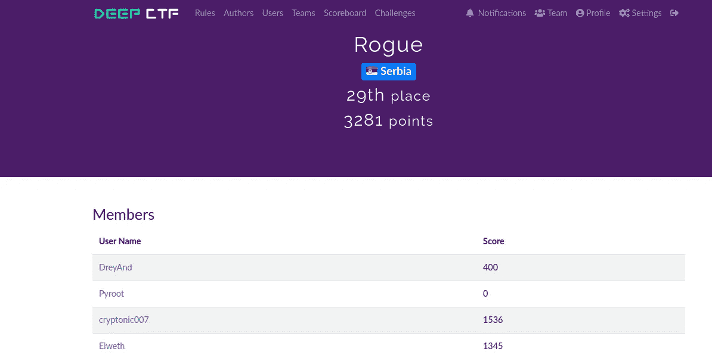

1.  **osit 类别:-**

我)。挑战名称—历史

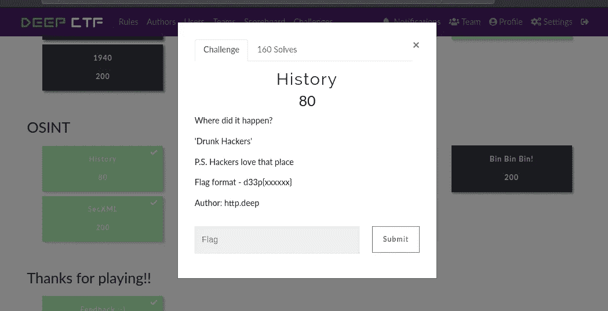

让我们搜索一下“喝醉的黑客”并找到一些位置。

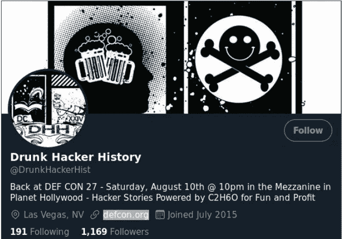

我们发现地点是 defcon.org。瞧，我们拿到旗子了。

**旗帜:d33p{defcon}**

ii)。挑战名称—技术

好的，我们有一个 ASN(自治系统号),它给出了受害者自治系统的信息，例如:注册日期，最大 IP 范围，IP 所有者和其他。让我们试着在上面做一个快速查找，看看我们能找到什么(记住，我们正在搜索一个顶级产品)。
所以我用 ASN 过滤器做了一个快速的 Shodan 查找:

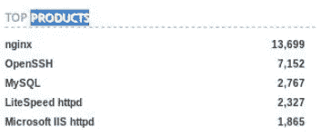

**Flag: d33p{nginx}**

iii)。挑战名称—生活

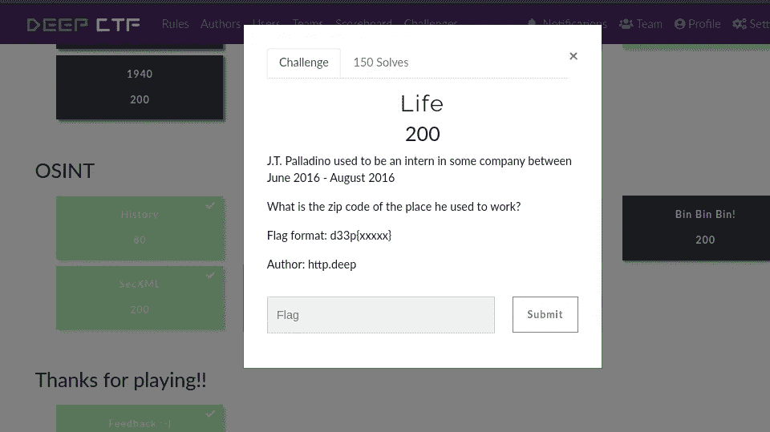

我搜索了一下 J.T.Palladino up，发现他的 LinkedIn 个人资料上写着他是 Data Quality a，2016 年 6 月-2016 年 8 月的实习生——看来是吻合的！

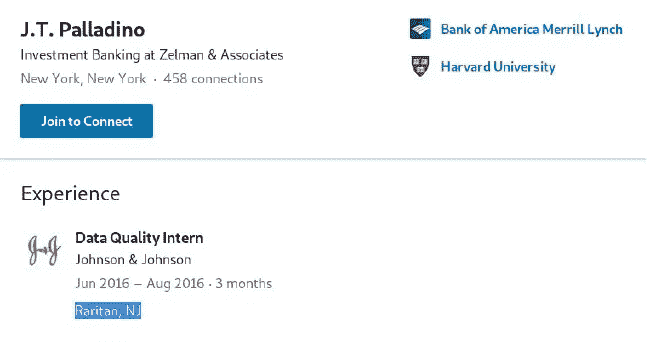

我们在那里看到一个位置——新泽西州**力登**

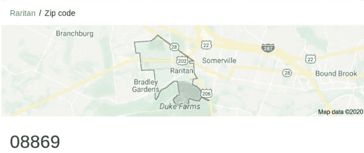

**标志:d33p{08869}**

四)。挑战名称—旅行者

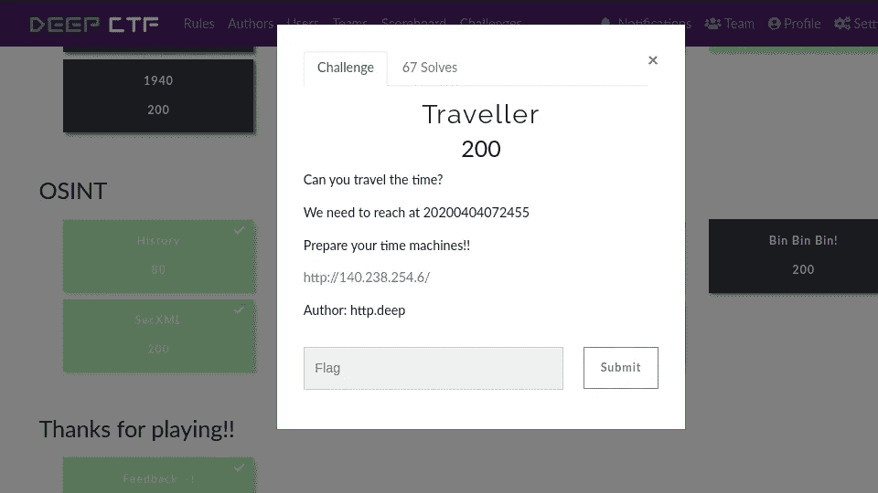

当我听说旅行时间的时候。我知道这里发生了什么，因为我在我的 Instagram 个人资料上发了一个帖子([@ drey codeing](http://twitter.com/dreycoding))。所以我们必须用 archive.org。Archive.org(也称为 WayBack machine)用于查找目标网站在 date 每次更改前后的快照。所以我们这里确实有一些日期(20200404072455)，所以我们解剖一下正常:
2020 . 04 . 04 07:24:55——现在可以理解了！让我们打开 archive.org。仅仅搜索 IP 并不能给出任何与此相关的信息，所以我总是首先搜索一些随机的知名网站。

例如[https://facebook.com](https://facebook.com)这样我就可以在以后使用高级
选项找到我需要的东西。

让我们找到我们的确切日期:

太好了！我们有标志-
zdmzchtjmg 5 ncjr 0 dww 0 dgkwbirfetb1 j 3 yzx 3 rynhyzbgwzzf 9 ingnrx 3 rpbuv 9
但是等等！它被编码了！让我们解码它，因为我假设它是 base64。
**Flag:d33p { c 0 ngr 4 tu l4ti on $ _ you ' v3 _ tr 4v 3 ll 3d _ b4ck _ timE }**

五)。挑战名称—1 还是 2？

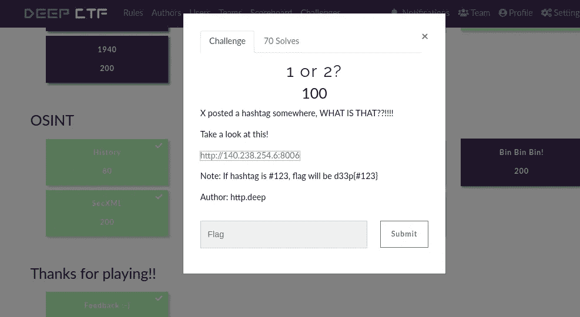

在浏览器中打开给定的 URL。你会发现一个损坏的图像。打开控制台并检查图像名称。

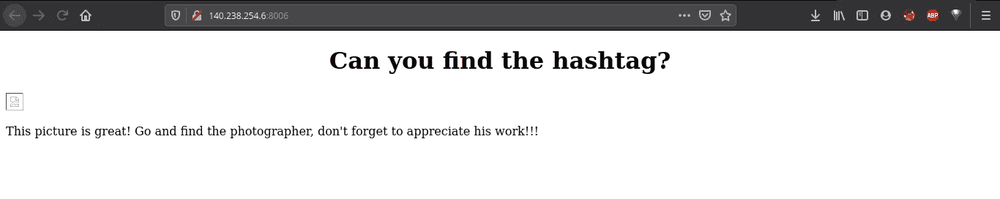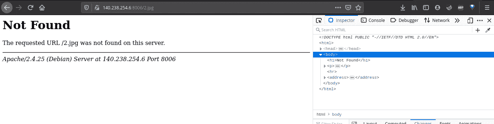

这是 2.jpg 的形象。当我们试图打开它，我们得到了一个错误。现在，用 1.jpg 重命名 2.jpg 并打开它。

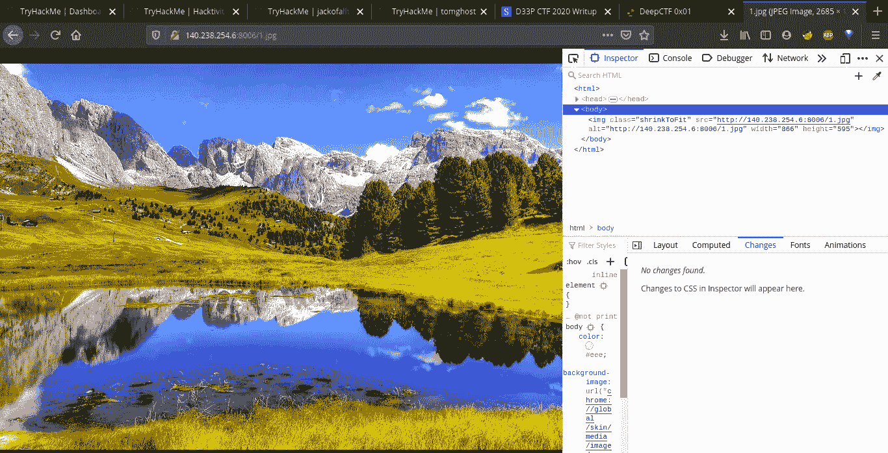

下载图像并使用 **Exiftool** 工具分析图像。

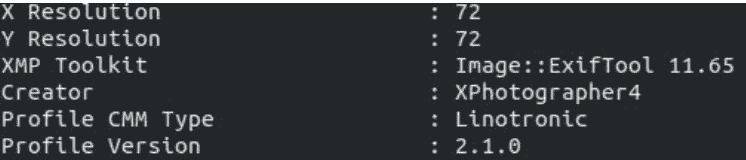

我们得到了创造者的名字。让我们在谷歌上搜索一下:XPhotographer4

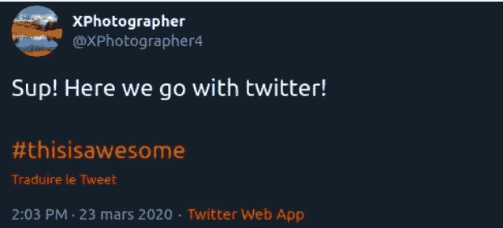

我们发现了一个同名的 twitter 账户。当你访问这个账户时，你会得到这个标签。加油..！我们找到了旗子。

**Flag:d33p { # this is awesome }**

vi)。挑战名称— SecXML

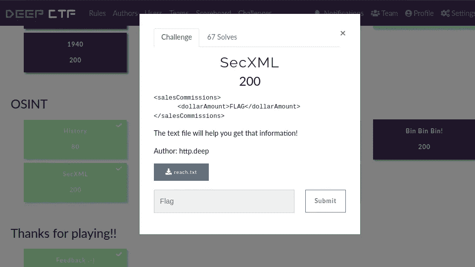

下载 reach.txt 你会发现一些文字。

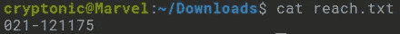

谷歌一下。你会发现一些网址。检查他们

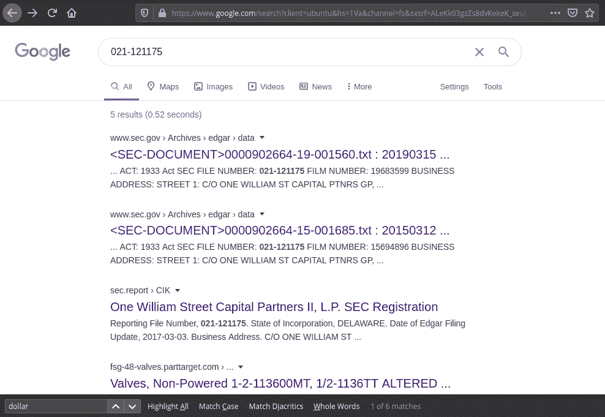

在这些网址中找到美元。

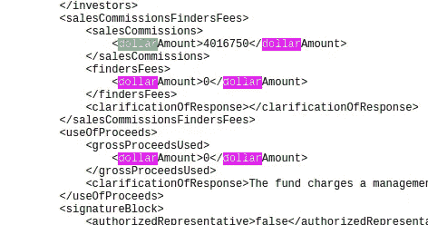

我想我们拿到旗子了。是的……我们拿到旗子了。

**旗帜:d33p{4016750}**

**2。反向分类**

I)质询名称—嵌套版本

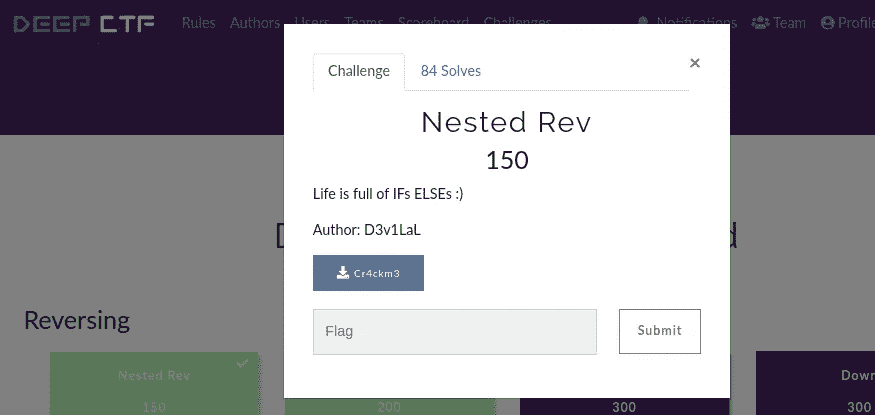

使用 Ghidra 工具打开给定的文件。它会列出所有的功能。

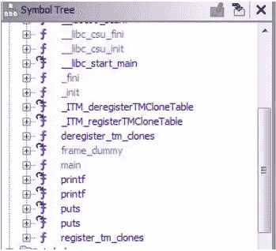

找到主函数。

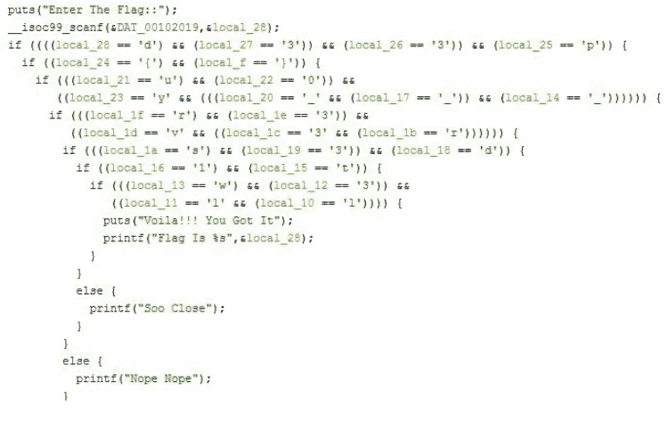

只需阅读条件即可获得标志。

**Flag:d33p { y0u _ R3 v3 rs3d _ 1t _ w3ll }**

ii)挑战名称— SkipMe

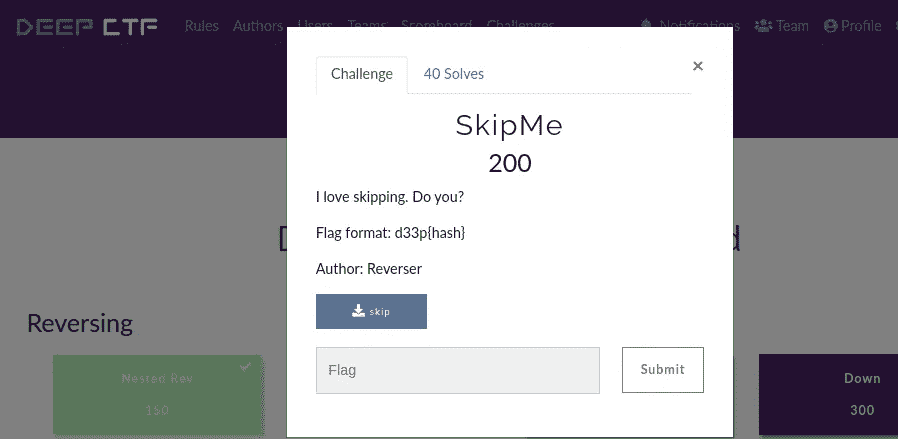

在 gdb 的帮助下打开给定文件。

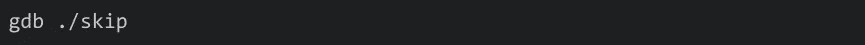

我们发现函数 finish 被调用来打印标志，所以让我们跳到这个连接点。

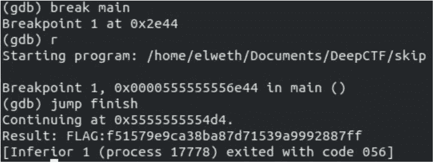

**Flag:d33p { f 51579 e 9 ca 38 ba 87d 71539 a 9992887 ff }**

**3。取证类别**

I)挑战名称—热身

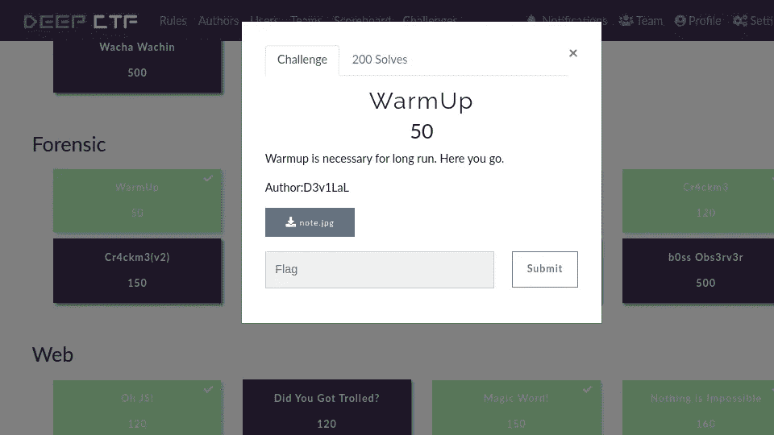

下载 jpg 文件。让我们检查图像中包含的数据。

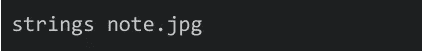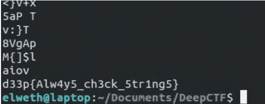

你会在 jpeg 文件的末尾找到这个标志。

ii)挑战名称—找到我

下载 jpeg 文件。作为一个挑战说，找到隐藏的东西，所以让我们尝试 Steghide 工具。使用作者的名字作为密码。

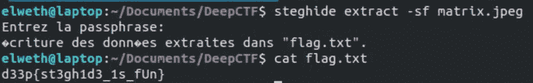

加油..！我们拿到旗子了。

**Flag:d33p { ST 3g h1 d 3 _ 1s _ fUn }**

iii)挑战名称— MindYou

首先下载 zip 文件并解压。Zip 文件包含损坏的图像。

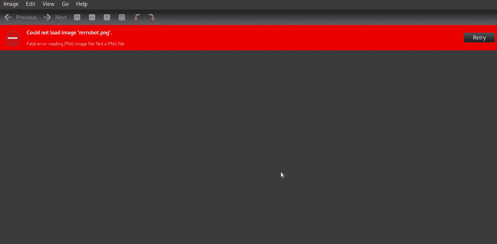

让我们修复图像。让我们检查图像文件的头。

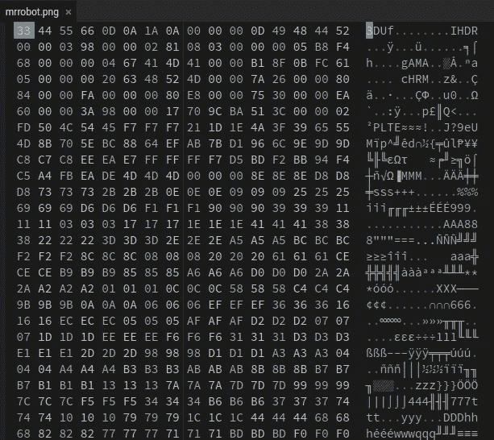

所以报头损坏，修复报头并试图找到标志。

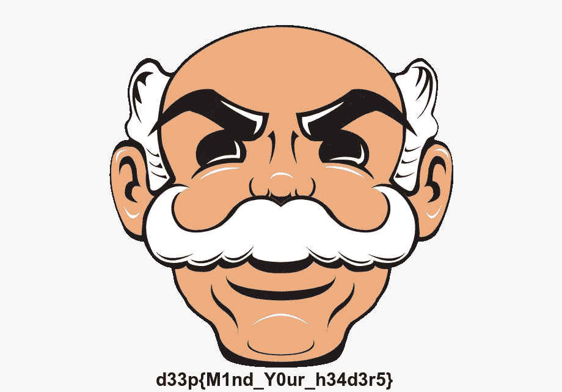

万岁…！我们拿到旗子了。

iv)挑战名称— Cr4ckm3

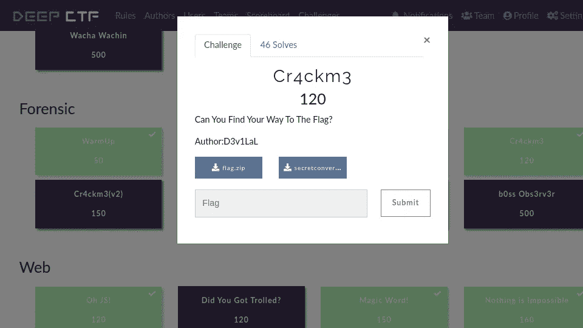

在这个挑战中，我们有 2 个文件，并且都被密码锁定。所以，我们必须找到密码。

因此，让我们使用 pdf2john 获取 pdf 哈希，将哈希保存在 file.hash 中，并使用开膛手 john 工具破解哈希。

# John-word list = ~/Documents/dictionary . txt hashes . hash

**密码:melisateamo**

现在，打开 pdf。我看不出有什么特别的地方，但是当我选择所有的文本时。我看到一些奇怪的东西。

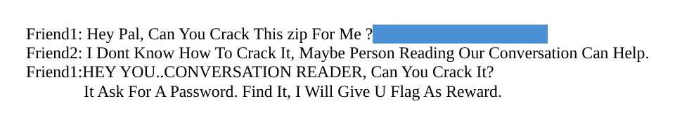

我复制了文本并粘贴到 sublime 中，得到了密码。

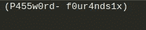

现在，使用这个密码打开 flag.txt 文件。瞧..！我们拿到旗子了。

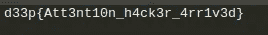

**Flag:d33p { att 3 nt 10n _ h4ck 3r _ 4r 1 v3d }**

我认为那篇文章写得太长了。哈哈哈…我不想让你睡觉。这是第一部分。我们将在第 2 部分增加更多的挑战。在评论框中给出你的建议和回应。喜欢就拍一下。因此，我们将在未来发布更多的评论。感谢所有阅读这篇文章的人。

**作者:**

cryptonic 007([http://instagram.com/cryptonic007](http://instagram.com/cryptonic007)

 [## 登录* Instagram

### 欢迎回到 Instagram。登录查看您的朋友、家人和兴趣爱好捕捉和分享了什么…

instagram.com](http://instagram.com/cryptonic007) 

德雷扬(http://instagram.com/dreycoding/)

 [## 登录* Instagram

### 欢迎回到 Instagram。登录查看您的朋友、家人和兴趣爱好捕捉和分享了什么…

instagram.com](http://instagram.com/dreycoding/) 

埃尔韦茨([https://twitter.com/Elweth_](https://twitter.com/Elweth_))

 [## 埃尔韦

### 来自 Elweth (@Elweth_)的最新推文:“# HackTheBox #多主扎根！https://t.co/3F9Roo2TaF"

twitter.com](https://twitter.com/Elweth_)