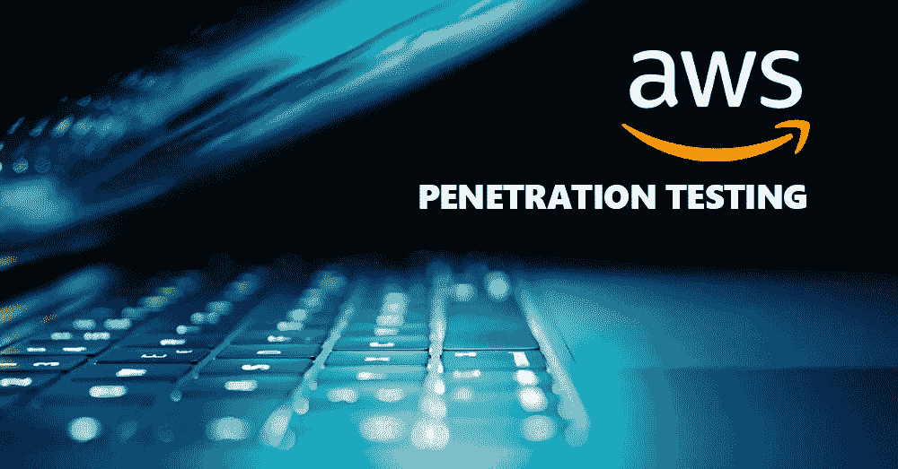
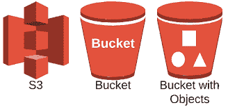
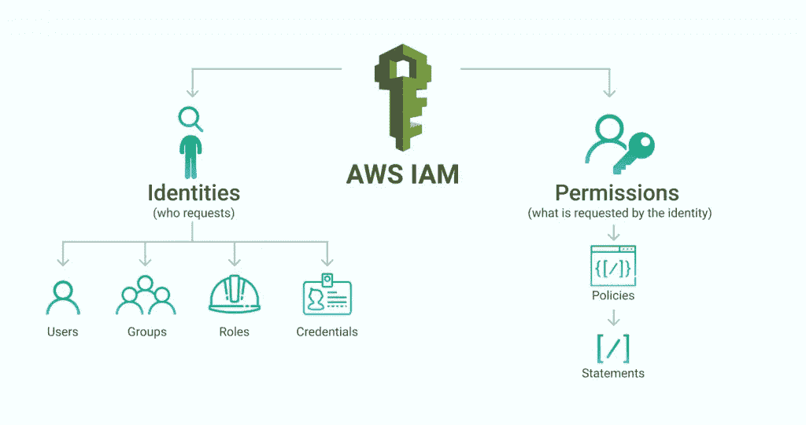
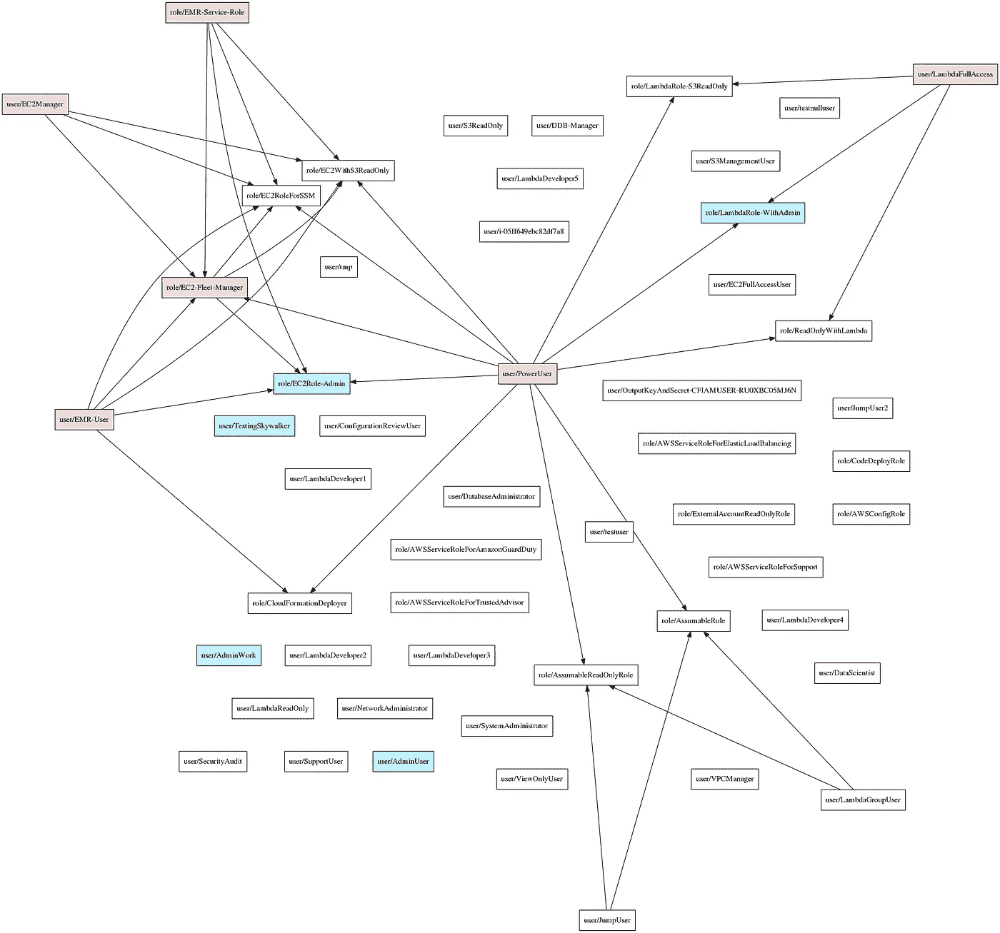
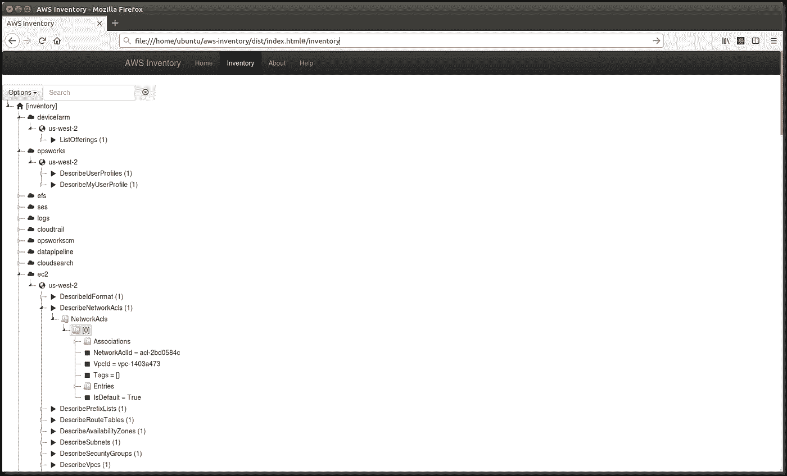
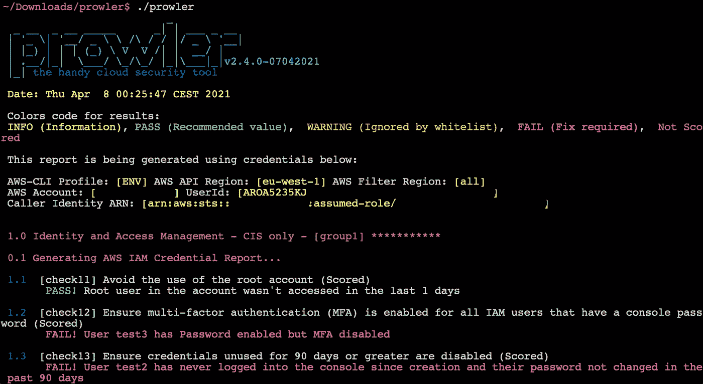
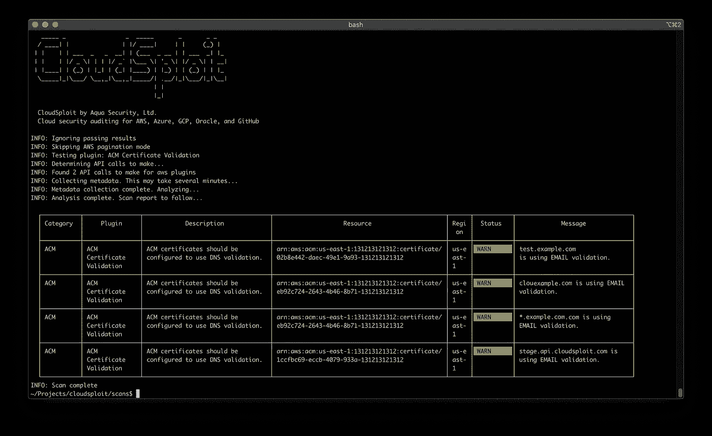
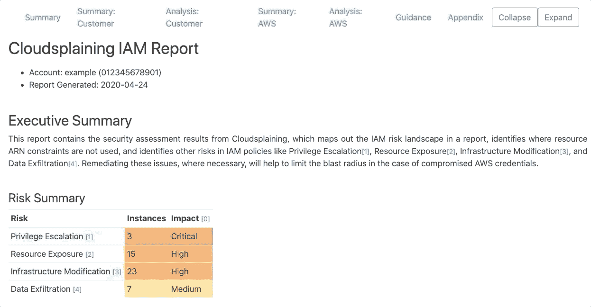
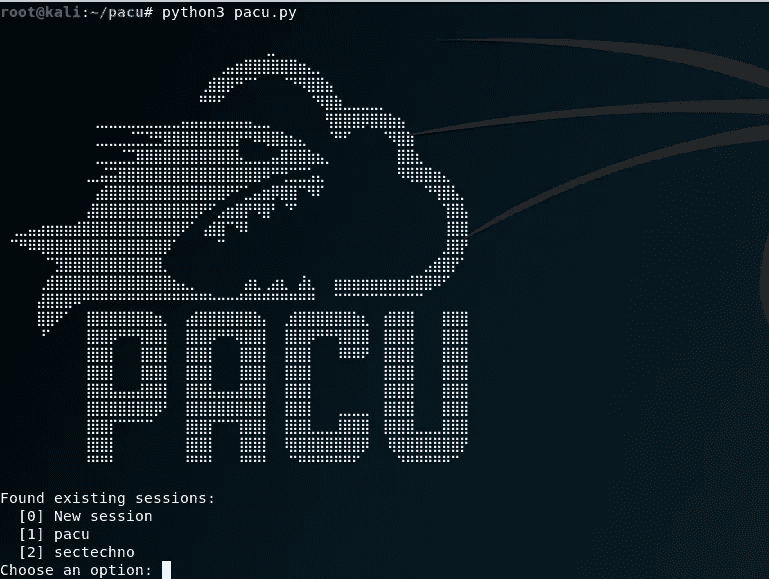

# 深入研究 AWS 渗透测试

> 原文：<https://infosecwriteups.com/deep-dive-into-aws-penetration-testing-a99192a26898?source=collection_archive---------0----------------------->

## AWS 渗透测试入门:第 1 部分

照片由 [immuniweb](https://www.immuniweb.com/resources/aws-penetration-testing/) 拍摄

在这篇博客中，我们将了解各种 AWS 服务、用于 AWS 服务的笔测试工具，以及如何开始使用 AWS Pentest。

**什么是 AWS 渗透测试？**
传统的 pen 测试流程与 AWS pen 测试方法完全不同。第一个也是最重要的因素是系统的所有权。AWS 是亚马逊的子公司，拥有该公司的基础设施。由于 pen 测试中使用的常规“道德黑客”会违反 AWS 的可接受政策，因此安全响应团队使用独特的流程。

最近发生了许多数据泄露事件，暴露了各种漏洞，如 s3 buckets、损坏的 AWS 基础设施等。
要理解 AWS 攻击，需要熟悉 AWS 提供的各种服务。

AWS 服务配置错误是造成大量数据泄露的原因。

# **对于 AWS 渗透测试，有四个主要方面需要关注:**

1.  您的 AWS 云的外部基础设施
2.  您在平台上托管/构建的应用程序
3.  AWS 云的内部基础设施
4.  AWS 配置审查

# **AWS 渗透测试方法**

AWS 平台的安全测试可分为两类:

1.  **云的安全**:云的安全是亚马逊(AWS)的责任，以确保他们的云平台安全，防止使用 AWS 服务的企业面临任何潜在的漏洞和网络威胁。所有可在任何步骤被利用来中断 AWS 服务器性能的零日和逻辑缺陷都包含在云安全中。
2.  **云中的安全性**:用户/责任公司有责任确保他们在 AWS 基础设施上部署的应用程序/资产不会受到任何类型的网络攻击。通过遵循所需的安全程序，用户/公司可以提高他们在 AWS 云上的应用程序的安全性。

> 在这一系列的博客文章中，我们将探讨如果没有正确设置这些服务，它们将如何被利用，以及对策。

# 让我们来看看 AWS 提供的一些服务。

# **1。S3 斗**

**S3 代表简单存储服务**

*   高度可扩展且容量几乎无限的存储服务。
*   作为容器的桶是服务中最重要的部分。
*   对象是存储桶中的内容，例如文件、备份、文档、照片、敏感文件、源代码、静态网站等等
*   你可以使用亚马逊 S3 在互联网上存储和检索任意数量的数据
*   对于 S3 存储桶，使用不同的访问控制技术
*   访问控制列表
*   基于存储桶的策略
*   与 IAM(身份和访问管理)相关的政策
*   可以使用 AWS CLI 和 HTTP 界面访问 S3 存储桶

[*http://s3.amazonaws.com/bucket_name*](http://s3.amazonaws.com/bucket_name)

*[*http://bucket _ name . S3 . Amazon AWS . com*](http://bucket_name.s3.amazonaws.com)*

# *2. **EC2***

**

*   *EC2 代表的是弹性云计算*
*   *云中使用最广泛的服务，提供安全且可调整大小的计算能力*
*   *在现收现付的基础上，它可以用于启动您需要的任意多的虚拟服务器*

*参考此链接详细了解 EC2[https://aws.amazon.com/ec2/](https://aws.amazon.com/ec2/)*

# *3.**身份和访问管理(IAM)***

**

*   *为了能够管理权限*
*   *能够分配角色、组和策略*
*   *可以将一个 web 服务与所有 Amazon 服务结合使用*
*   *可用于连接来自不同组织的联合应用程序\用户*
*   *管理从一个 AWS 帐户到另一个帐户的跨帐户访问*

*请参考此链接详细了解 IAM。[https://aws.amazon.com/iam/](https://aws.amazon.com/iam/)*

# *4. **AWS Lambda***

**

*   *FaaS(作为服务的功能)*
*   *无服务器功能和应用程序可用*
*   *作为对事件的反应，代码被执行*

*请参考此链接详细了解 AWS Lambda。[https://aws.amazon.com/lambda/](https://aws.amazon.com/lambda/)*

> *随着越来越多的企业迁移到云，数据泄露的风险每天都在增加，需要使用笔测试来防范数据泄露。*

# *在 AWS 中你能做什么样的笔测试？*

*AWS 允许企业全面测试其 AWS EC2 实例，同时消除与用户运营的服务的连续性中断相关的杂务，这些服务包含云产品并由用户控制。*

*对于供应商运营的服务(由单一第三方管理和配置的云产品)，AWS 将 pen-testing 限制在云环境的设置和部署上，忽略了底层基础设施。*

*AWS 提供各种 EC2(弹性云计算)领域的笔测试，包括:*

*   *应用编程接口*
*   *您公司的 web 应用程序位于其服务器上*
*   *编程语言*
*   *操作系统和虚拟机*

*以下是由于法律限制而无法测试的 AWS 云部分:*

*   *亚马逊网络服务(AWS)服务器*
*   *属于 AWS EC2 的其他公司的物理硬件、设施或底层基础设施*
*   *亚马逊的关系数据库服务(RDS)*
*   *其他供应商管理安全设备*

# ***AWS 控件将接受严格的安全性测试***

# ***1。治理***

*   *定义 AWS 边界并识别资产*
*   *管理访问的策略*
*   *应对风险进行识别、审查和评估*
*   *库存和文件*
*   *在风险评估中应考虑 AWS*
*   *信息技术(IT)安全和计划政策*
*   *了解 AWS 的使用/实施*

# *2.**网络管理***

*   *网络安全控制*
*   *有身体联系*
*   *授予和撤销访问权限*
*   *与环境隔绝*
*   *库存和文件*
*   *分层 DDoS 保护*
*   *恶意代码占了上风*

# *3.**加密控制***

*   *访问 AWS 控制台*
*   *对 AWS API 的访问*
*   *IPsec 隧道是一种互联网协议安全(IPSec)隧道*
*   *SSL 密钥的管理*
*   *静止时，保持别针安全*

# *4.**记录和监控***

*   *集中式日志存储*
*   *检查政策的充分性*
*   *检查来自身份和访问管理(IAM)的凭据报告*
*   *组合来自多个来源的数据*
*   *入侵的检测和响应*

> *在执行 AWS 渗透测试之前，您应该做一些事情。*

*   *定义渗透测试的范围，包括目标系统*
*   *自己做初步测试*
*   *决定你将运行哪种安全测试*
*   *概述利益相关者的期望以及笔式测试。业务(如果外包)*
*   *为了处理技术评估，创建一个时间表*
*   *定义一组在测试发现安全性已经受到威胁时要遵循的流程*
*   *获得相关方签署的许可进行 pen 测试*

# ***如何对亚马逊 Web 服务进行渗透测试？***

# *1.身份和访问管理*

*识别数据存储和应用程序的资产是渗透测试过程中的第一个也是最重要的阶段。以下是在识别资产时要记住的一些关键注意事项:*

1.  *根帐户的密钥已被删除。*
2.  *应实施双因素身份认证。*
3.  *不要自动执行或使用 root 帐户执行日常任务。*
4.  *仅允许服务帐户访问。*
5.  *每个用户只允许使用一个密钥。*
6.  *定期更改您的 SSH 和 PGP 密钥。*
7.  *删除所有不再活动的安全帐户。*

# *2.逻辑访问控制*

*在资产识别之后，下一步是处理云中的访问控制。这是一种为资源分配各种操作的方法。控制对 AWS 资源、进程和用户的访问是逻辑访问控制的主要过程。AWS 帐户的凭证必须保持安全可靠*

# *3.S3 水桶*

*在资产识别之后，下一步是处理云中的访问控制。这是一种为资源分配各种操作的方法。控制对 AWS 资源、进程和用户的访问是逻辑访问控制的主要过程。AWS 帐户的凭证必须保持安全可靠*

1.  *权限(对于 HTTP 方法，如 GET、PUT、DELETE 和 LIST)应该限制在特定的用户。*
2.  *应该启用 bucket 的日志记录和版本控制。*

# *4.数据库服务*

*数据库是几乎所有 web 服务的基本组件。采取必要的预防措施来保护应用程序的数据库也是至关重要的。以下是进行安全审计时需要牢记的基本注意事项:*

1.  *定期备份您的数据。*
2.  *将自动备份计时器设置为不超过一周。*
3.  *应该使用多 AZ 部署方法。*
4.  *访问仅限于特定的 IP 地址。*

# ***AWS 安全测试工具:***

*您可以使用许多工具来测试您的 AWS 集成服务。一套不同的工具可用于执行不同类型的测试。以下是其中的一些。*

# ***Pmapper***

*PMapper(主体映射器)是一个脚本和库，用于查找 AWS 帐户的 AWS 身份和访问管理(IAM)配置中的危险。*

**

*来源:https://github.com/nccgroup/PMapper*

# ***AWS-库存***

*一个 Python 脚本，用于查找在给定帐户中创建的所有 AWS 资源。*

**

*来源:[https://github.com/nccgroup/aws-inventory](https://github.com/nccgroup/aws-inventory)*

# ***Bucket_finder***

*使用 Ruby 脚本，可以对 S3 桶进行暴力攻击。*

*来源:[https://github.com/FishermansEnemy/bucket_finder](https://github.com/FishermansEnemy/bucket_finder)*

# ***小偷***

*prowler 是一个命令行工具，用于按照 CIS AMAZON Web Services Foundations 基准实现 AWS 安全最佳实践、审计和强化。*

**

*来源:[https://github.com/toniblyx/prowler](https://github.com/toniblyx/prowler)*

# ***雨层云***

*识别和利用亚马逊云基础设施的工具。这些工具是我为我的“在亚马逊云中旋转”演讲开发的 PoC，是使用伟大的 boto 库访问亚马逊的 API 开发的。*

*来源:[https://github.com/andresriancho/nimbostratus](https://github.com/andresriancho/nimbostratus)*

# ***CloudSploit***

*CloudSploit by Aqua 是一个开源项目，旨在允许检测云基础设施帐户中的安全风险，包括亚马逊网络服务(AWS)、微软 Azure、谷歌云平台(GCP)、甲骨文云基础设施(OCI)和 GitHub。这些脚本旨在返回一系列潜在的错误配置和安全风险。*

**

*来源:https://github.com/aquasecurity/cloudsploit*

# ***乌云密布***

*Cloudsplaining 是一个 AWS IAM 安全评估工具，它可以识别最低权限的违规行为，并生成按风险划分优先级的 HTML 报告。*

**

*来源:https://github.com/salesforce/cloudsplaining*

# ***Pacu***

*Pacu 是一个开源的 AWS 开发框架，旨在针对云环境进行攻击性安全测试。Pacu 由 **Rhino Security Labs** 创建和维护，允许渗透测试人员利用 aws 帐户中的配置缺陷，使用模块轻松扩展其功能。当前的模块支持一系列攻击，包括用户权限提升、IAM 用户后门、攻击易受攻击的 Lambda 函数等等。*

**

*来源:[https://github.com/RhinoSecurityLabs/pacu](https://github.com/RhinoSecurityLabs/pacu)*

*暂时就这些吧。S3 桶的利用，设置和笔测试 AWS Aurora RDS，设置 AWS CLI，评估和笔测试 Lambda 服务，评估 AWS API Gateway，了解您的 pentest 和 AWS 笔测试的未知因素将在即将到来的博客中讨论。*

> **感谢您阅读我的帖子；有什么建议请在下面留言:)**

*谢谢，*

*亚西尔·汗*

*这是我的推特账号 [@N3T_hunt3r](https://twitter.com/n3t_hunt3r?lang=en) 随时联系我。*

*特别感谢 [Jonathan Helmus](https://medium.com/@jonathanchelmus) ，他写了一本非常棒的书，书中详细解释了如何对主要 AWS 资源进行安全评估并保护它们。*

*参考:[https://www . packtpub . com/product/AWS-penetration-testing/9781839216923](https://www.packtpub.com/product/aws-penetration-testing/9781839216923)*