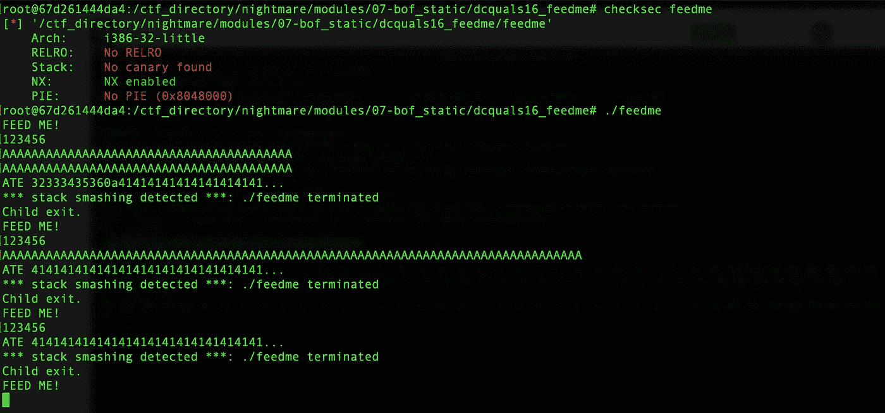
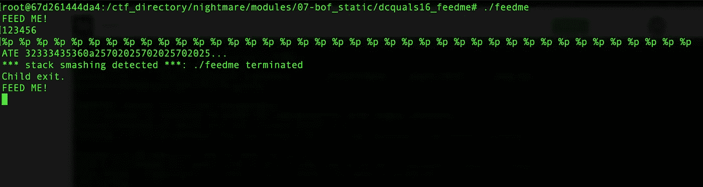
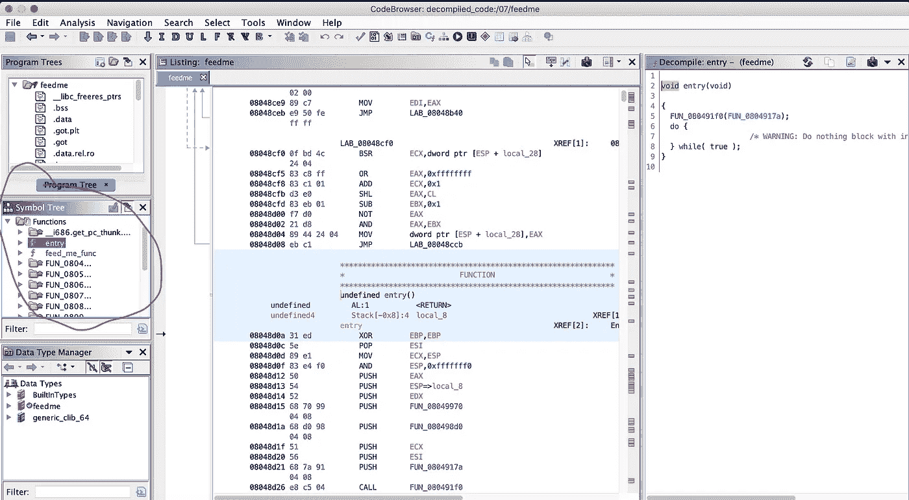
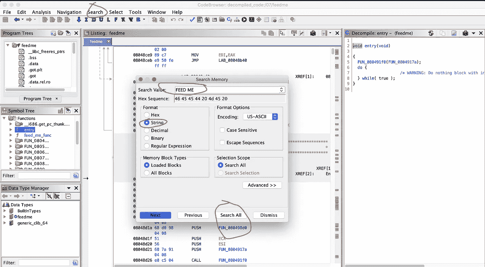
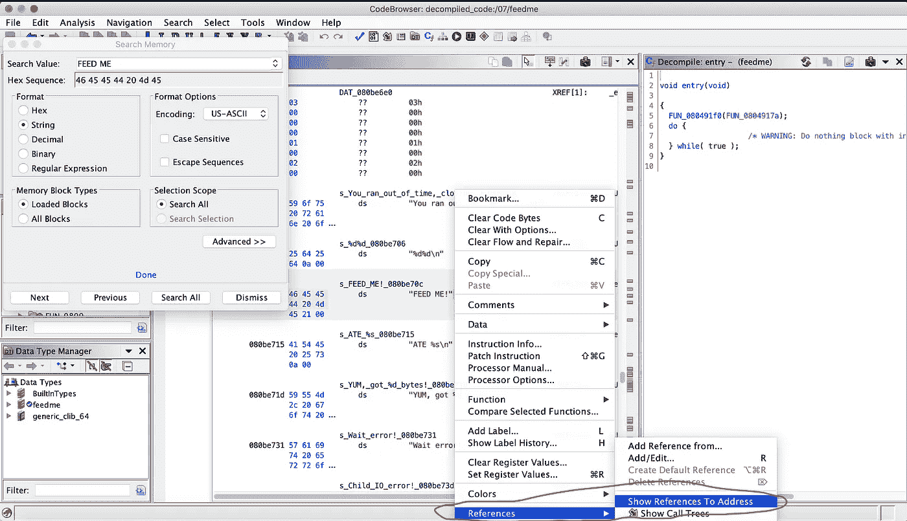
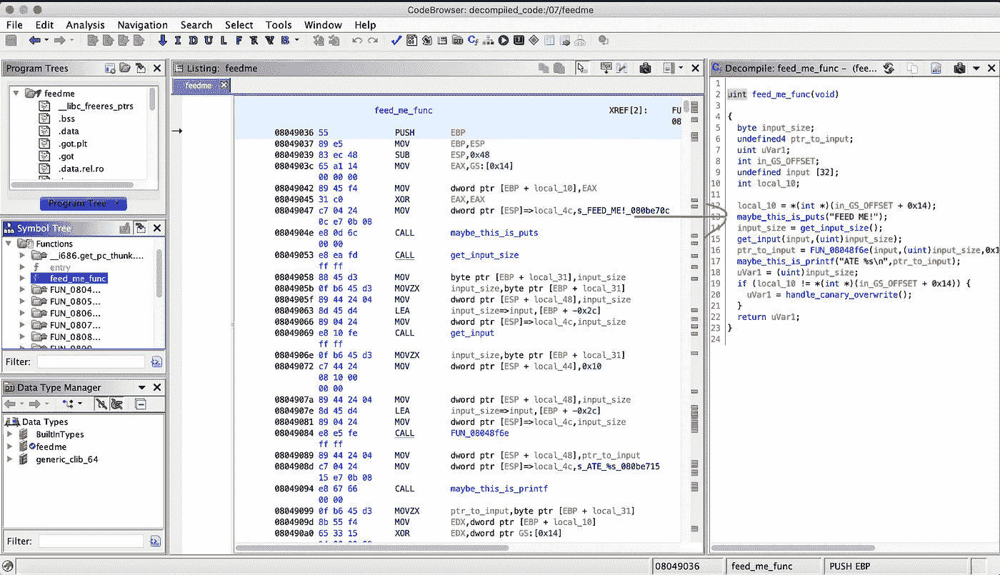
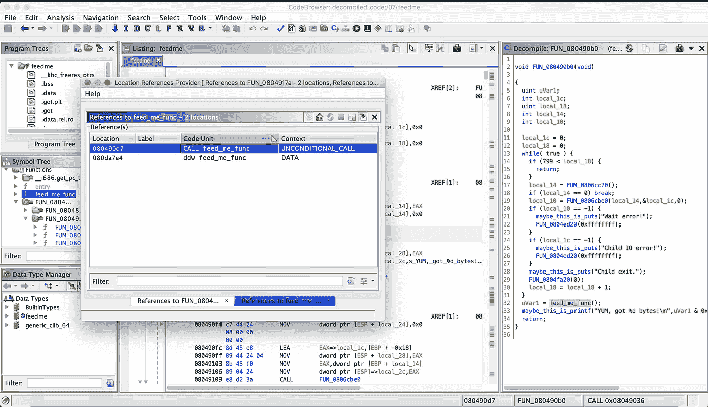
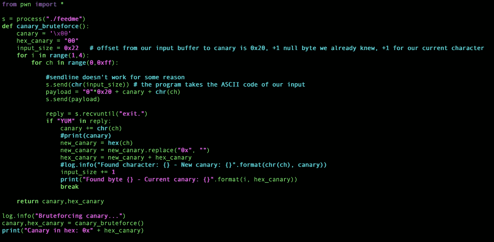
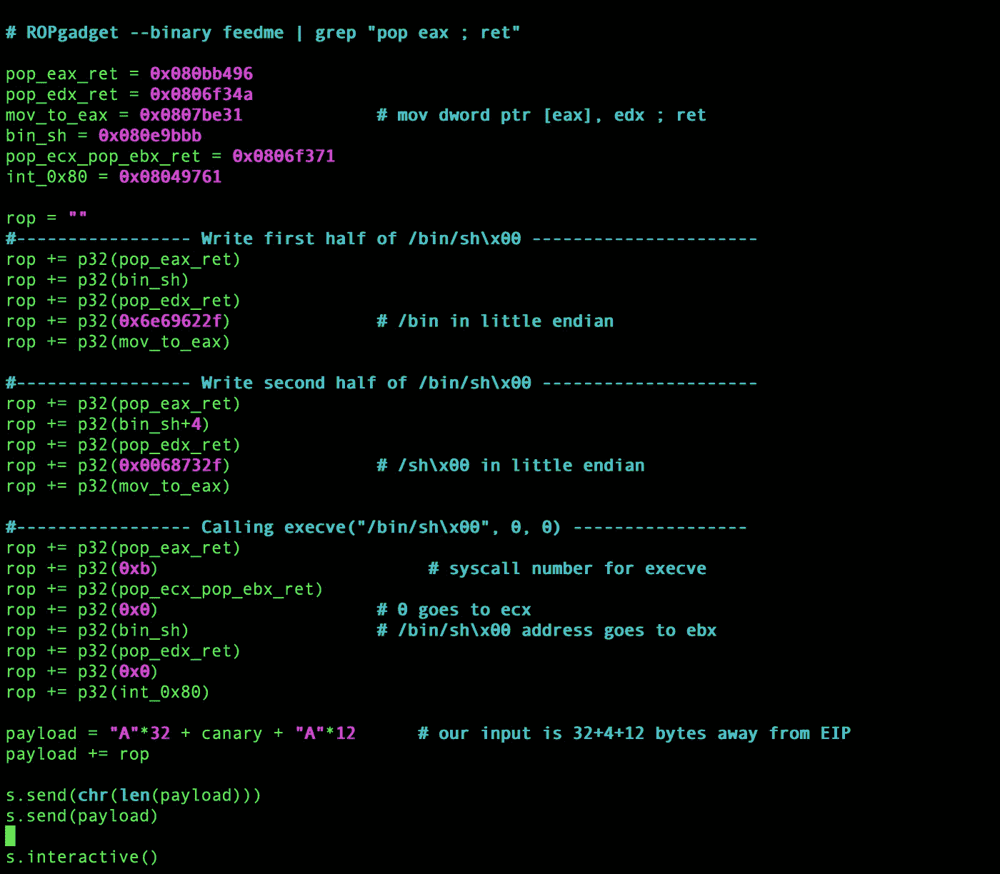
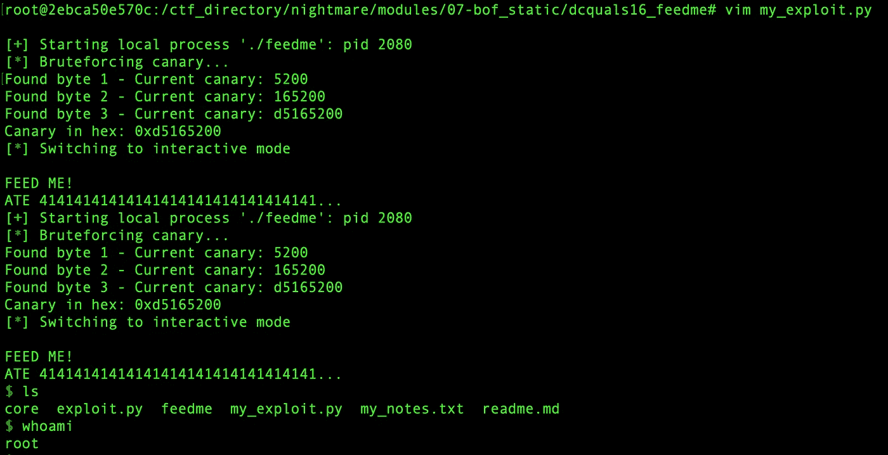

# DEFCON 2016 Quals 报道— feedme

> 原文：<https://infosecwriteups.com/defcon-2016-quals-writeup-feedme-4d90167b448d?source=collection_archive---------2----------------------->

嗨，伙计们，欢迎回到另一篇 CTF 评论。这次我将向你展示我是如何解决 DEFCON 2016 Quals 的 pwn 挑战 feedme 的。

先说一点历史:在解决了 picoCTF2019 ***除了*** 对于幽灵日记、Sice-scream、零到英雄的大部分 pwn 挑战后，我就厌烦了。主要是因为我是一个完全的新手:/——所以我还不能解决它们……然后一个想法出现在我的脑海中:让我们尝试解决过去 DEFCON 任务中的 1 pwn 挑战——一个就够了。于是我搜索了过去的 DEFCON 任务，偶然发现了这个:[https://github . com/guyinatuxedo/nightmare/tree/master/modules/07-BOF _ static/dcquals16 _ feed me](https://github.com/guyinatuxedo/nightmare/tree/master/modules/07-bof_static/dcquals16_feedme)

> 这个回购收集了从初学者到高级的过去事件的许多 pwn 挑战。我很高兴我找到了这个。于是喊出
> ***guyinatuxedo，noopnoop，数字寒*** 和 ***你走近*** 争夺这个奇妙的资源 ***。***

不要再耽搁了，让我们开始吧。

运行它:

我们可以给它两个输入。显然，我们打碎了堆栈金丝雀，但 *pwntools 检测不到金丝雀:(*...它说进程终止，子进程退出。然后我不停的“*砸*”:)它不停的催生另一个进程。所以我的猜测是程序一次又一次的分叉。

好像是堆栈 **bof** (缓冲区溢出)漏洞。因为它再次打印出我们的输入，所以我尝试使用格式字符串说明符来泄漏金丝雀，但是不起作用:

让我们在 Ghidra 中打开它，看看发生了什么:

我们得到了很多乐趣..功能。我们可以浏览所有这些文件，看看哪个打印出了字符串 *"FEED ME"* ，或者我们可以搜索对它的引用:

*   进入搜索= >内存= >选择字符串，然后输入 FEED ME:

*   然后双击表格中的位置。选择引用= >显示对地址的引用:

它将我们引向我们正在寻找的功能:

为了更容易理解，我重命名了这些函数。第一个函数只是打印出“喂我！”所以我猜是 ***放*** 。之后，通过使用一些动态分析，我发现第一个允许我们输入第二行输入的**大小=输入中第一个字符**的 ASCII 码。因此，如果我们输入“123456 ”,那么第二行的输入大小将是 49——在 ASCII 表中是“1”。然后我们给程序输入第二个输入。在那之后，我猜想下一个函数只是返回指向第二个输入的前 16 个字符的指针，因为它在下一行与格式说明符" *%s* "一起使用。

到目前为止，我们知道我们可以给它两个输入，大小在我们的控制之下，我们有一个堆栈金丝雀。

> 对于 Canary 来说，虽然每次同一个进程重启时金丝雀都不一样(同 GS，GS 重启)，但是同一个进程中每个线程的金丝雀都是一样的。还有就是通过 fork 函数打开子进程交互的类，**因为 fork 函数直接复制父进程的内存，所以创建的每个子进程的金丝雀都是一样的**。我们可以使用这个特性完全逐个字节地爆炸金丝雀。
> 
> [https://CTF-wiki . github . io/CTF-wiki/pwn/Linux/remediation/canary/](https://ctf-wiki.github.io/ctf-wiki/pwn/linux/mitigation/canary/)

好吧，我们可以强暴金丝雀。我想知道我们的尝试次数是否有限制。看看是谁在调用 **feed_me_func。**右键功能= >显示引用:

我是一个 noob，所以根据 while 循环，我猜想我们有 800 次尝试:D，我们也没有看到前面输出中的行" *YUM，got blah blah blah* "。这是因为当程序发现我们打碎了金丝雀，它就终止了。因此，如果我们不打碎金丝雀，我们会在输出中看到那条线。这非常有助于我们知道在我们的暴力中我们是否猜到了正确的字节(对于金丝雀)。

我们知道 ***NX 被启用*** 所以我们最好的射击是 ROP。注意，我们必须给程序正确的输入大小，因为只有当我们给它输入了我们说过的确切的字节数时，进程才会继续，否则它只会等待我们给它输入更多的字节。我花了 5 分钟才意识到:D

总之，计划是对金丝雀进行简单的逐字节暴力。这最多花费我们 256*3 = 768 次尝试(在 32 位中，金丝雀的最后一个字节将总是\x00 = >金丝雀看起来像 XXXXXX00)，我们有 800 次尝试(我猜是 xD)。然后用我们的 ROP 链覆盖 EIP。由于二进制文件是静态链接的，我们可以用 ROPgadgets 在其中搜索 ROP gadgets。

> 当您**静态地**将一个文件链接到一个可执行文件中时，该文件的内容会在链接时包含进来。换句话说，文件的内容被物理地插入到您将要运行的可执行文件中。

粗暴对待金丝雀

ROP 链

让我们运行它，并希望它的工作:D

哦——从没想过像我这样的菜鸟能解决 DEFCON 的一个挑战，甚至只是资格赛。

无论如何，这是一次很棒的经历，我从中学到了很多。非常感谢**噩梦**的作者创造了如此精彩的资源。希望这对您有所帮助，感谢您的阅读:)

如果你有任何问题，请随时给我发邮件(链接在下面)！黑客快乐！

推特:【https://twitter.com/pwnphofun 

github:[https://github.com/wechicken456](https://github.com/wechicken456)

不和谐:tuz#9881