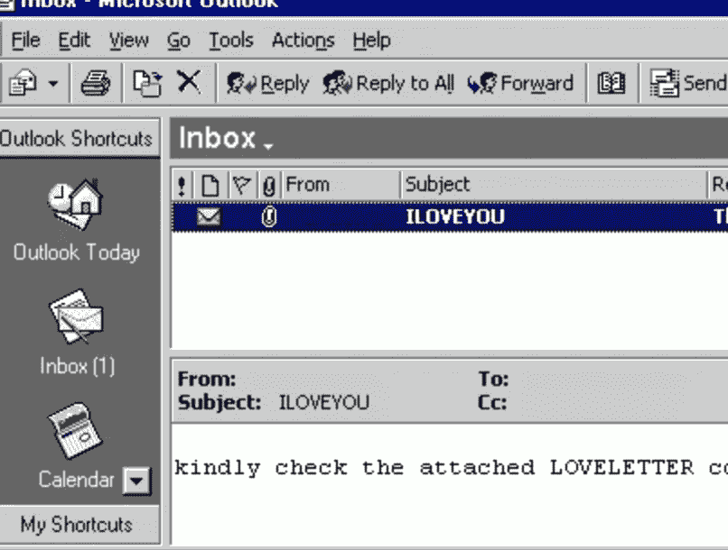

# 防御云中的勒索软件

> 原文：<https://infosecwriteups.com/defending-against-ransomware-in-the-cloud-a6ff2c1efcab?source=collection_archive---------0----------------------->

## 云对勒索软件的安全性是多还是少？

迈克尔·盖格在 [Unsplash](https://unsplash.com?utm_source=medium&utm_medium=referral) 上的照片

在我们进入云中勒索软件的话题之前，让我们先来上一堂历史课。

就恶意软件的发展而言，21 世纪初曾是美好的旧时光(*是的，我有那么老)*

我们有像宏病毒和 ILOVEYOu 病毒这样的东西，它们会在你的计算机上引起混乱，但没有什么是好的格式化和恢复不能解决的。

过去的美好时光

然而，在二十年多一点的时间里，恶意软件已经成为一个利润丰厚的行业，其危险程度足以让政府屈服，并完全扰乱大型企业的供应链。

> 恶意软件现在是一个价值数十亿美元的产业，在一场永无止境的猫捉老鼠的游戏中，它很容易与蓬勃发展的网络安全产业并驾齐驱。

在目前所有类型的恶意软件中，勒索软件尤其危险，攻击者通过勒索你的系统和数据来获取赎金，除非你付钱给他们。这是一个利润丰厚的行业，为网络犯罪分子创造了数十亿美元的收入，他们非常乐意继续利用公司，除非他们付钱

# 勒索软件带来了金钱

勒索软件给公司造成了数百万美元的损失，预计到 2031 年 总成本将超过[**2650 亿美元。**](https://www.cloudwards.net/ransomware-statistics/)

从这种攻击中恢复的成本可能很高，下面列出了几个例子:

*   *支付实际赎金(* ***郁闷常见*** *)*
*   *诉讼费*
*   *雇佣法医公司*
*   *恢复数据*
*   *来自监管机构的罚款*
*   *收回客户商誉的成本*

这种状态已经变得如此糟糕，甚至一度被认为非常危险的 DDOS 攻击本身；现在只是被用来分散注意力以掩盖真正的勒索软件攻击！

有这么多的损失和这么多的钱，你可以理解为什么网络犯罪分子在勒索软件攻击上投入了越来越多的精力，而云正日益成为一个目标。

# 云容易受到攻击吗？

简短的回答是肯定的

归根结底，云存储与本地存储一样容易受到勒索软件的攻击。

> 存储终究是存储，勒索软件不会区别对待，尤其是在云安全薄弱的情况下。

这种情况早在 2016 年的[就已经发生，并且在未来只会继续增长。](https://krebsonsecurity.com/2016/01/ransomware-a-threat-to-cloud-services-too/)

IDC 最近的一份报告发现，98%的公司在过去 18 个月中遭遇过数据泄露，他们越来越多地发现其云安全状况中的弱点。网络罪犯非常乐意利用的弱点。

随着成千上万的身份连接到云存储和[错误配置频繁发生](https://virtualizationreview.com/articles/2021/10/20/s3-ransomware.aspx)，黑客有足够的机会利用和启动勒索软件。

**大多数组织也完全不知道他们在云环境中给予 SaaS 应用程序的权限，这使得这种攻击更加容易。**

对本地的攻击也可以复制到云中，因为大多数使用云存储的公司都支持他们的云和本地存储之间的同步。

过去几年对数字化转型和云的大力推动意味着现在有数百万用户在云上，这使得云成为犯罪分子更诱人的目标。

由于有可能影响如此庞大的用户群，可以肯定的是，犯罪分子正忙于寻找新的独特方法来利用基于云的漏洞

# 如何保护您的云环境免受勒索软件的攻击

不幸的是，就像 on-prem 一样，没有单一的防范勒索软件的神奇方法。

然而，我们可以在下面列出一些每个人都应该遵循的常识:

*   实施 [**云安全态势管理解决方案**](https://medium.com/bugbountywriteup/cloud-security-tooling-series-what-the-heck-is-a-cspm-8f37f6b1db19) ，实时快速识别并修复云漏洞。尽快启用自动修复！
*   定期审核您的云权限(尤其是那些授予 SaaS 应用程序的权限)，因为这通常是一个盲点
*   找出你允许访问的 SaaS 应用程序的数量，并开始批准此类访问。这些应用程序可能会被滥用，从而在您的组织中获得潜在的立足点。
*   备份您的数据！( ***我不敢相信我是在 2022 年*** )写下这些的
*   围绕勒索软件实施安全意识计划，因为绝大多数攻击仍然是由于用户的错误而发生的。

所有主要的云提供商都发布了关于其特定平台的指南，因此请仔细阅读并将其应用到您的环境中:

 [## 勒索软件缓解:5 大防护和恢复准备措施| Amazon Web Services

### 在这篇文章中，我将介绍亚马逊网络服务(AWS)客户可以做的五件事来帮助保护和…

aws.amazon.com](https://aws.amazon.com/it/blogs/security/ransomware-mitigation-top-5-protections-and-recovery-preparation-actions/)  [## 防止勒索软件攻击的 5 大保护支柱|谷歌云博客

### 勒索软件，一种对用户或组织最重要的文件或数据进行加密的恶意软件…

cloud.google.com](https://cloud.google.com/blog/products/identity-security/5-pillars-of-protection-to-prevent-ransomware-attacks)  [## 在您的组织中快速配置勒索软件防御，以帮助阻止勒索软件…

### 注本指南将随着新信息的出现而更新。提供勒索软件保护和缓解…

learn.microsoft.com](https://learn.microsoft.com/en-us/security/compass/protect-against-ransomware) 

在可预见的未来，勒索软件将是一个巨大的问题，但好在有工具可以抵御这种威胁。云正在被大量采用，如果你真的想保护你的环境，那么请确保尽快实施上述建议

> 感谢阅读。如果你有兴趣了解更多关于云安全的知识，请查看我的[频道](https://www.youtube.com/@CloudSecurityGuy),我经常在那里谈论云安全和人工智能。

Taimur Ijlal 是一家**屡获殊荣的信息安全领导者**，在金融科技行业的网络安全和 IT 风险管理方面拥有 20 多年的国际经验。Taimur 可以在 [LinkedIn](https://www.linkedin.com/in/taimurijlal/) 或他的 YouTube 频道“[云安全家伙](https://www.youtube.com/c/CloudSecurityGuy)上联系，他定期在上面发布关于云安全、人工智能和一般网络安全职业建议的帖子。

*你可以通过下面的链接注册，每月只需 5 美元就可以获得所有的媒体报道:*

 [## 通过我的推荐链接加入 Medium—tai mur Ijlal

### 阅读 Taimur Ijlal(以及媒体上成千上万的其他作家)的每一个故事。您的会员费直接支持…

taimurcloud123.medium.com](https://taimurcloud123.medium.com/membership) 

## 来自 Infosec 的报道:Infosec 每天都有很多内容，很难跟上。[加入我们的每周简讯](https://weekly.infosecwriteups.com/)以 5 篇文章、4 个线程、3 个视频、2 个 GitHub Repos 和工具以及 1 个工作提醒的形式免费获取所有最新的 Infosec 趋势！