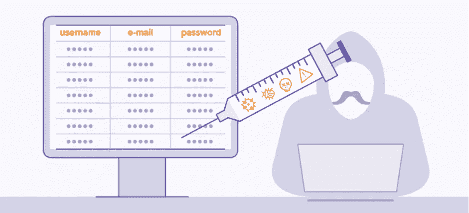
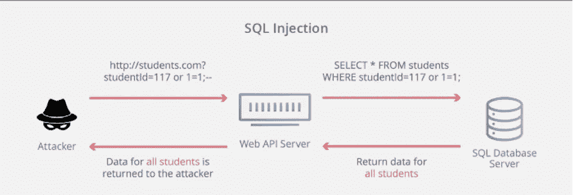

# SQL 注入权威指南

> 原文：<https://infosecwriteups.com/definitive-guide-to-sql-injection-df5ac445eef1?source=collection_archive---------2----------------------->

大卫·普帕扎在 [Unsplash](https://unsplash.com/@dav420?utm_source=unsplash&utm_medium=referral&utm_content=creditCopyText) 上的照片

# 介绍

手机或网络上有两种应用——静态和动态。静态网站只是一堆网页汇编在一起，每次给你看的都是一样的信息。它不根据用户类型/角色显示信息，也不与后端数据库交互。

另一方面，动态站点从后端数据库获取数据。根据网站类型的不同，它可以根据你的品味和偏好向你展示数据，比如脸书和 YouTube，或者像 medium.com 一样向你展示一篇文章。

有不同类型的数据库。我们可以根据它们存储数据的方式将它们分为两类。如果它们以行和列的形式存储数据，它被称为关系数据库或 SQL 数据库，如果它以对象的形式存储数据，它被称为非 SQL 数据库。

与非 SQL 数据库不同，SQL 数据库已经使用了很长一段时间，并且比非 SQL 数据库更受许多开发人员的青睐。

# 什么是 SQLi 漏洞？

[资料来源:Avast](https://www.avast.com/c-sql-injection#gref)

SQL 注入是一个漏洞，当攻击者可以从 SQL 数据库获取信息时，就会出现该漏洞。这通常是他们不应该接触到的信息。它的范围可以从访问凭据和敏感令牌到绕过身份验证、泄露数据和安装后门。

只有 SQL 类型的数据库容易受到这种攻击，称为 SQLi 漏洞。

[来源:Cloudflare](https://www.cloudflare.com/learning/security/threats/sql-injection/)

如果 web 应用程序接受 web 表单、输入参数(例如，搜索查询)、cookie 等，则会发生 SQL 注入。，而不验证它们并将其直接传递给数据库服务器。

数据库服务器将输入解释为代码而不是数据，并最终执行它。这可能会有严重的后果。下面提到了其中的一些。

绕过身份验证

篡改数据

电子欺骗

拒绝服务

数据泄漏

特权的提升

信息披露

# 我们如何在 Web 应用程序中检测它？

不是所有的网站都是一样的。有些接受用户的输入并即时显示输出，而有些接受用户的输入并不向用户返回任何内容。

**案例 web 应用程序基于输入查询返回一些输出。**

假设你在一个电子商务网站上。您输入搜索查询，web 应用程序将查询直接发送到 SQL 数据库服务器，而不执行任何验证并返回输出。您可以只输入一些非法字符，检查输出中的任何数据库错误，并与输入数据库中不存在的产品名称时的输出进行比较。

这被称为基于错误的检测。
可以是单引号**(’)**，双引号**(”**等。

如果它返回类似，你有一个 SQL 语法错误或其他一般性错误，viola，你发现了 SQL 注入。

然后，您可以尝试不同的有效负载来提取数据。寻找有效负载的最佳仓库之一是 [PayloadAllTheThings](https://github.com/swisskyrepo/PayloadsAllTheThings)

**案例 web 应用程序不返回任何输出**

在这种情况下，您可以通过触发响应延迟或检查布尔条件来检查 SQL 注入。

这被称为基于盲的检测。

例如，您发现一个接受 ID 号但不返回任何信息的端点。
设终点为:[**https://www.example.com/return_nothing?id=2**](https://www.example.com/return_nothing?id=2)

有两种方法来检查 SQL 注入。您可以导致延迟或检查条件是否为真。

但是您必须记住，不同的 SQL 数据库服务器接受相同操作的不同命令。这是您必须付出一点努力并精确定位正在使用的 SQL 数据库的地方。

现在让我们开始检查布尔条件。

**https://www.example.com/return_nothing?id=2'和 1=1 —** 因为 1=1 总是真的，所以如果 id=2 存在，你会得到一个 200-状态码返回。因为 1=1 为真，且 id=2 存在(即真)。所以，**真实，真实就是真实。**

但是如果你输入 https://www.example.com/return_nothing?id=2'**和 1=2 —** ，现在因为 1=2 不成立，你可能会收到一个 400 状态码。
因为 1=2 是假的，而 id=2 就存在(即真的)。所以，**假与真就是假**。

**补救**

SQL 注入可能非常可怕，会给你的网站造成重大损失，甚至进入你的网络。

因此，保护您的网站免受 SQL 注入攻击变得至关重要。防止 SQL 注入的一些方法有:

1.输入验证和消毒。永远不要相信用户的输入。应用 allowlist 和 blocklist 过滤器来保护自己免受 SQL 注入攻击。转义不安全的字符。

2.对参数化查询使用预处理语句
这是消除 SQL 查询的另一种有效方式。在这种方法中，语句已经写下，参数(用**表示？**这里)留给应用程序绑定值。例如:**插入到用户的值(？,?, ?)**

# 结论

随着技术的发展，新产品和服务不断推出。但通常情况下，其中存在未知的后门和漏洞，会危及整个系统的安全。

防火墙和入侵检测和预防系统的使用越来越普遍。但是，如果配置不正确，它们可以被绕过。

为了确保你的网站是安全的，让你的网站通过检查除了 SQL 注入以外的各种漏洞进行笔测。

*来自 Infosec 的报道:Infosec 上每天都会出现很多难以跟上的内容。* [***加入我们的每周简讯***](https://weekly.infosecwriteups.com/) *以 5 篇文章、4 个线程、3 个视频、2 个 Github Repos 和工具以及 1 个工作提醒的形式免费获取所有最新的 Infosec 趋势！*