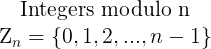
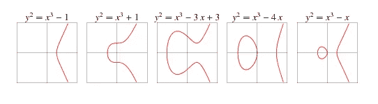
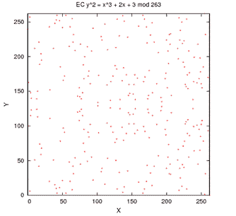
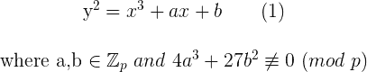
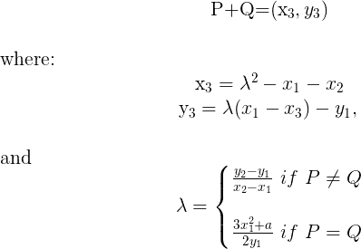
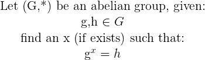
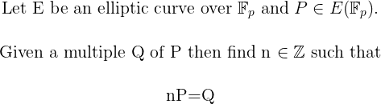
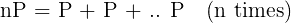

# 解密椭圆曲线密码

> 原文：<https://infosecwriteups.com/demystifying-elliptic-curves-for-cryptography-5e02060da51d?source=collection_archive---------0----------------------->

罗马法师在 [Unsplash](https://unsplash.com/search/photos/equation?utm_source=unsplash&utm_medium=referral&utm_content=creditCopyText) 上拍摄的照片

如果你曾经与密码学相关的学科有过哪怕是最轻微的接触，那么我打赌你已经听说过“椭圆曲线”这个术语。事实上，椭圆曲线正在主宰密码学领域，但对于数学家以外的人来说，这背后的逻辑可能不那么明显。因此，我写这篇文章是为了给有基本数学背景的人一个关于椭圆曲线的温和介绍，并解释为什么它们在密码学家中如此受欢迎。

# 抽象代数定义

让我们从抽象代数的一些术语的简要介绍开始。

**组**:组是一个抽象的数学对象，由一个*集合 S* 和一个*运算*○定义在 S 的元素对上(注意组的符号选择是任意的)，其中:

*   在操作○,即当 S 中的任意一对元素 *a，b* 的 *a○b = c* 时，则 *c* 也必须在*c*中
*   运算是*关联* (a ○ ( b ○ c)) = (( a ○ b ) ○ c)。
*   S 中存在一个*恒等元*e 使得: *e ○ a = a = a ○ e (f* 或 S 中的全 a)。
*   对于 s 中的每一个 *a* 都存在逆元 a⁻ *○ a = e = a ○ a* ⁻。
*   组的顺序是 s 中元素的个数。

**阿贝尔群:**阿贝尔群 G 是也满足交换律的群。即对于所有 a，b *∈ G，a ○ b = b ○ a*

下面是一个组的示例:

**域:**域 F 是具有加法和乘法两种闭运算的集合，其中:

*   *(F，+)* 是加法下的阿贝尔群
*   设 *F* = F-{0}，(F*，*)* 是乘法下的阿贝尔群
*   加法和乘法是兼容的。换句话说，它满足分配律:给定 *x，y，z ∈ F，(x+y)z = zx+zy*

# 椭圆曲线

当定义在实数上时，椭圆曲线就是如下图所示的曲线。

椭圆曲线

我明确说明了实数，因为在有限域中它看起来完全不同:

虽然椭圆曲线(EC)通常可以定义在任何有限域上，但在本文中，**为了简单起见，我们将只研究定义在 Zp(整数模 p)上的椭圆曲线，其中 *p* 是大于 3 的素数**。其原因是一个更技术性的特性，称为有限域的*特征*，当它等于 2 或 3 时，情况略有不同，但现在让我们忘记它。

形式上，在 **Z** p 上的椭圆曲线 E 由以下形式的方程定义:

以及一个特殊的点∞，称为无穷远处的*点。*

给定这些，我们可以定义一个集合 E( **Z** p)，它由满足等式(1)的所有点(x，y)(其中 x，y 在 **Z** p)中)和∞组成。

**点添加**

一般来说，椭圆曲线 E( **Z** p)上的两个点的相加给出了曲线上的第三个点，并且可以用简单的规则来定义。再正式一点，让 *P=(x₁，y₁)∈e(z****p****)*和 *Q=(x₂，y₂)∈e(z****p****)*其中 p≦-q 则:

更何况，如果 P=(x，y)*∈E(Z****P****)*那么(x，y) + (x，-y) = ∞(指向无穷远处)。事实上，点(x，-y)表示为-P，它是 P 的*逆*(几何上，它关于 x 轴对称于 P)

最后，将∞加到 E(Z **p** )中的任意点 P，我们总能得到 P。形式上:

P+∞=∞+P = P for all*∈E(Z****P****)*

从上面回到我们的*群*定义，加法运算、逆点和集合 E(Z **p** )形成一个以∞为单位元的群。这正是椭圆曲线与密码学相关的地方。这些由椭圆曲线形成的群就是用于构建椭圆曲线密码系统的群。

# 但是，为什么呢？

嗯，所有这些似乎都有道理，但有人会问，当我们可以清楚地使用有限域时，为什么还要麻烦椭圆曲线组呢？让我们用一个简单的真实世界的例子来解释原因。

## 离散对数问题

简单来说，离散对数问题定义如下:

离散对数问题(DLP)是在各种密码协议(DH、ElGamal、DSA)中使用的一个众所周知的问题，当然，这些协议的安全性是问题的难度的基础。

**现在问题的难度取决于 G 组**。话虽这么说，问题在(Z **n，** +)很容易，在(F **p，*** )或者很难(椭圆曲线群)。

## 椭圆曲线离散对数问题

如果上面的陈述提出了一些关于为什么在不同的群上更难的问题，那么让我们检查如何在椭圆曲线群上定义离散对数问题。

换句话说，我们正在寻找一个标量乘以 P，使得乘积等于 q。记住，我们定义了如何在椭圆曲线上进行点加法。乘以 *n* 因此是 *n* 次连续加法运算

这被认为是更可信的，因为用于解决该问题的已知算法实现了指数时间复杂度。相反，众所周知，DLP 可以用指数演算算法在亚指数时间内求解。

在密码环境中，**1024 位 DLP 密钥的安全性可以等效地用 160 位椭圆曲线密钥来实现**。

对于实际的加密技术来说，这是一个巨大的进步，当实现加密协议时，效率/内存使用需要优化(特别是对于特定的硬件实现)。