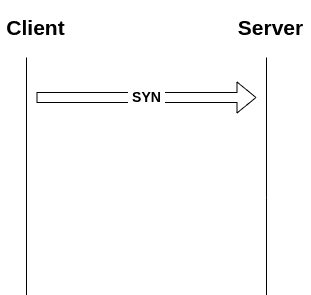
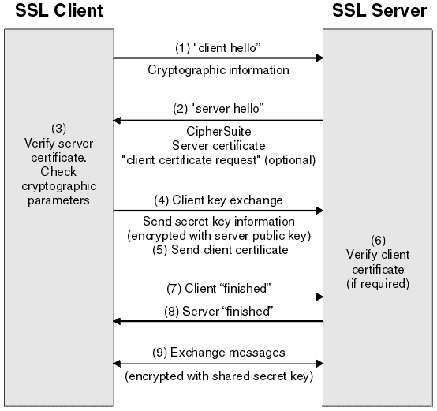
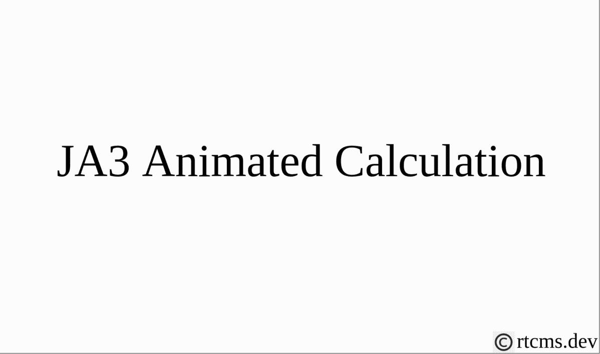
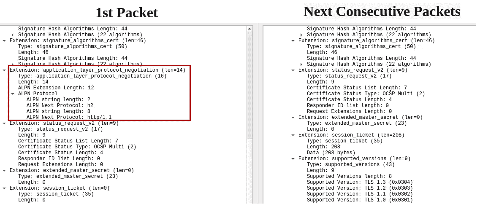
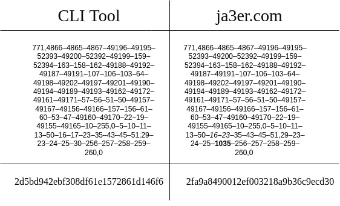
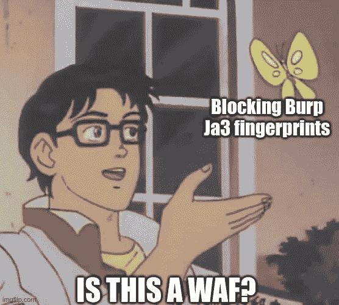

# 揭秘 JA3:一次一个握手

> 原文：<https://infosecwriteups.com/demystifying-ja3-one-handshake-at-a-time-c80b04ccb393?source=collection_archive---------0----------------------->

最近我在用 BurpSuite 浏览一个网站，发现这个网站屏蔽了我的请求。为了解开这个秘密，我无意中发现了一种不可思议的 TLS 指纹技术，叫做 JA3。

# 背景

对客户端进行指纹识别并根据一组特定的规则阻止它们并不新鲜。许多公司确实有智能的方法来识别客户(一个原因是检测机器人和恶意流量)，通过使用 cookie 来唯一地跟踪用户。2013 年斯诺登泄密后，[许多网站](https://www.eff.org/deeplinks/2013/11/encrypt-web-report-whos-doing-what)开始默认采用 HTTPS 版本。[许多应用](https://tlseminar.github.io/tls-outside-the-web/)像恶意软件，物联网设备也使用 TLS 安全地连接到服务器。因此，TLS 协议的流行和广泛应用导致了研究和发现新的方法来对用户进行独特的指纹识别。

## HTTPS 连接是如何工作的？

简而言之，HTTPS 是两种东西的结合:

*   TCP(传输控制协议)—三次握手
*   TLS(传输层安全性)客户端-服务器协商

TCP 握手，也称为三次握手，是客户端和服务器建立 TCP 会话的过程。下图说明了如何建立 TCP 连接。



TCP 三向握手

**TCP 三次握手**

*   客户端发送 SYN(同步序列号)，通知服务器开始通信。
*   服务器发送 SYN-ACK(确认)集。ACK —表示信号已被接收，并同步到序列号，它必须以该序列号开始下一个数据段
*   客户端用作为确认的 ACK 包进行响应，因此进一步的通信继续进行。

这发生在 OSI 模型 的 [**层 4。**](https://networkengineering.stackexchange.com/a/23539)

**TLS 客户端-服务器协商**

[TLS 握手](https://tls13.ulfheim.net/)是一系列步骤，在这些步骤中，客户端和服务器就加密算法、协议版本达成一致，并通过交换和验证密钥来相互认证。这个过程可以自我解释如下:



TLS 握手过程— [来源](https://www.ibm.com/docs/en/ibm-mq/7.5?topic=ssl-overview-tls-handshake)

注意，这个过程发生在 OSI 模型的 [**会话层(第 5 层)**](https://wentzwu.com/2020/08/21/what-osi-layer-does-tls-operate-and-why/) 中

**TLS 指纹识别的起源**

早期的 TLS 指纹研究来自于[李兄弟](https://twitter.com/synackpse) [博客](https://blog.squarelemon.com/tls-fingerprinting/)，后来，工程师在 [Salesforce](https://engineering.salesforce.com/tls-fingerprinting-with-ja3-and-ja3s-247362855967) [约翰·奥尔豪斯](https://twitter.com/4A4133)，[杰夫·阿特金森](https://twitter.com/4a7361)，[乔希·阿特金斯](mailto:josh@ascendantcom.com)即兴创作了 JA3 和 JA3S。JA3 可以被认为是现代的用户代理，以前用于通过 HTTP 连接跟踪用户。

# JA3

JA3 是在使用 TLS 连接服务器的客户机上执行的指纹识别机制。这是通过对在 TLS 协商过程的第一步中接收的 ClientHello 数据包执行一系列操作来完成的。

早些时候，许多网站基于用户代理来采集用户的指纹。在最近的时间里，它花了几秒钟来模仿它，JA3 fingerprint 是一个很少为人所知的指纹解决方案，被许多公司使用，如在其 bot 管理工具中使用的 [Cloudflare](https://github.com/cloudflare/cloudflare-docs/blob/production/products/bots/src/content/concepts/ja3-fingerprint.md#analytics) 。

## JA3 是如何计算的？

让我们首先研究 ClientHello 包，以理解 JA3 是如何计算的:

根据 TLSv1.2 的 [RFC5246](https://tools.ietf.org/html/rfc5246/) ，ClientHello 数据包定义为

```
struct {
          ProtocolVersion client_version;
          Random random;
          SessionID session_id;
          CipherSuite cipher_suites<2..2^16-2>;
          CompressionMethod compression_methods<1..2^8-1>;
          select (extensions_present) {
              case false:
                  struct {};
              case true:
                  Extension extensions<0..2^16-1>;
          };
      } ClientHello;
```

在那里

*   client_version —客户端支持的最高 TLS 协议版本
*   随机—客户端生成的随机结构。
*   session_id —客户端希望用于此连接的会话的 id。
*   cipher_suites —客户端支持的加密选项列表*，首先是客户端的首选项。*
*   compression_methods —客户端支持的压缩方法列表，*按客户端偏好排序。*
*   扩展—这是一个可选字段，客户可以请求扩展功能。

扩展字段可以有在 [RFC4492](https://datatracker.ietf.org/doc/html/rfc4492) 中定义的`EllipticCurve,EllipticCurvePointFormat`。因此，考虑到所有这些因素，我们可以有超过 [2 万亿种](https://httptoolkit.tech/blog/tls-fingerprinting-node-js/)的方式来发送 ClientHello 消息

```
**CipherPermutations = 20!
ExtensionPermutations = 15!
CurvePermutations = 4!
CurveFormatPermutations = 3!
TotalPermutations = 20! + 15! + 4! + 3! = 2432903315851008030**
```

独特的方式来单独识别和指纹客户。

JA3 是使用从如上定义的 ClientHello 分组中获取的以下 5 个参数来计算的:

```
SSLVersion,Cipher,SSLExtension,EllipticCurve,EllipticCurvePointFormat
```

> [*JA3*](https://github.com/salesforce/ja3#how-it-works) *收集客户端 Hello 包中以下字段的十进制字节值；* SSL 版本、接受的密码、扩展列表、椭圆曲线和椭圆曲线格式*。然后，它将这些值按顺序连接在一起，使用“，”分隔每个字段，使用“-”分隔每个字段中的每个值。*

随着 TLS 1.2 的升级， [RFC4492](https://datatracker.ietf.org/doc/html/rfc4492) 被修改为 [RFC8422](https://datatracker.ietf.org/doc/html/rfc8422) ，椭圆曲线字段被进一步称为 *supported_groups* ，因此我们使用 Wireshark 数据包中的该字段来计算 JA3。



来自 TLS **ClientHello** 数据包的 JA3 计算步骤

GREASE(生成随机扩展并保持可扩展性)是由谷歌推出的 IETF 草案[定义的一种技术，用于防止 TLS 生态系统中的可扩展性故障。它会在 ClientHello 数据包中引入无效的随机值，但不会产生任何影响，并确保所有新编写的代码都能处理意外值。对于 JA3 指纹的计算，我们忽略这一点。](https://tools.ietf.org/html/draft-davidben-tls-grease-00)

**BurpSuite！？两个指纹？**

在进一步调查时，我发现 BurpSuite 有如下两个指纹:

*   **第一包**—2d 5 BD 942 ebf 308 df 61 e 1572861d 146 f 6(771，4866–4865–4867–49196–49195–52393–49200–52392–49199–159–52394–163–158–162–49188–49192–49192
*   **下一个连续数据包**—EB 5 FDC 72 f 0a 76657 DC 6 ea 233190 C4 e1c(771，4866–4865–4867–49196–49195–52393–49200–52392–49199–159–52394–163–158–162–49188–49192–4992

以下是 Wireshark 数据包的实际差异(ClientHello 数据包的扩展文件部分)



BurpSuite 发送的两个数据包的差异

在第一个数据包中，我们可以观察到 RFC7301 中定义的一个名为*的附加字段。它包含客户端支持的协议 id 列表。*

如 [RFC7301](https://datatracker.ietf.org/doc/html/rfc7301#section-1) 中所定义:

"*当在单个服务器-
侧端口号(例如端口 443)上支持多个应用协议时，客户端和服务器需要
协商用于每个连接的应用协议。希望在不增加客户端和服务器之间的网络往返的情况下完成这种协商，因为每次往返都会降低最终用户的体验。此外，基于协商的
应用协议*允许证书选择将是
有利的

由于这个原因，为 BurpSuite 生成了两个 JA3 指纹，不像任何其他浏览器在每个包中实际发送*应用层协议协商*。为什么？[大概需要问问 BurpSuite 的创作者了。](https://twitter.com/0xrtt/status/1483135631782182913?s=20)

ja3er.com**—**这个网站**不应该被用来寻找你的 JA3 指纹**，因为它给出了一个错误的 JA3 值，正如这个 [Github 问题](https://github.com/salesforce/ja3/issues/71)和[这个 tweet](https://twitter.com/kingbase/status/1420683077878124545) 所描述的。为了让您有个概念，您可以检查如下所示的差异:



ja3er.com 生成的 JA3 指纹的差异

# JA3s 和 JARM

我们从客户端发送的 ClientHello 数据包收到的响应数据包是 ServerHello 数据包，这可用于使用 ServerHello 消息的以下字段计算唯一指纹:

`TLSVersion,Cipher,Extensions`

示例:

`md5(769,47,65281–0–11–35–5–16) =` 4835 b19f 14997673071435 CB 321 f 5445

服务器将对不同的客户端做出不同的响应，它们将始终对相同的客户端做出相同的响应。

到目前为止，JA3 和 JA3s 是更被动的指纹检测方法，但更积极的方法是 JARM。

在 JARM，我们发送 10 个特制的 TLS 数据包，以获得具有不同协议版本和密码的服务器的最独特的响应。此外，JARM 指纹散列是混合模糊散列；它使用可逆和不可逆散列算法的组合来产生 62 个字符的指纹，而不像 JA3、JA3S 那样使用 MD5。你可以在这里阅读关于 JARM[的更多信息。](https://engineering.salesforce.com/easily-identify-malicious-servers-on-the-internet-with-jarm-e095edac525a)

您可以使用 JARM 指纹在互联网上搜索服务器，以使用以下引擎找到特定恶意软件使用的 C&C 服务器之类的东西:

*   Shodan.io 在[这里](https://www.shodan.io/search?query=ssl.jarm%3A07d14d16d21d21d07c42d41d00041d24a458a375eef0c576d23a7bab9a9fb1)
*   [安全轨道](https://securitytrails.com/)
*   [二进制边缘](https://www.binaryedge.io/)
*   [RiskIQ](https://www.riskiq.com/blog/external-threat-management/jarm-incident-response/)
*   [帕洛阿尔托网络公司](https://medium.com/palo-alto-networks-developer-blog/fingerprinting-ssl-servers-using-jarm-and-python-6d03f6d38dec)
*   [Censys](https://censys.io/)
*   [360](https://wangzhan.360.cn/296.html)

## 含义和应用

JA3 和 JA3s 使用 MD5 散列来识别数据包，不像 JARM 使用模糊散列来识别发出请求的客户端。使用 MD5 有一些安全隐患，如哈希冲突，但是作者使用 MD5 来支持旧客户端，并建议记录整个字符串(MD5 哈希完成之前的字符串)以供进一步分析。此外，在某些情况下，一些浏览器可能有相同的 JA3 指纹，使它们难以识别。尽管如此，浏览器支持的密码顺序在最近的每一个版本中都有所改变，这使得指纹识别变得很容易。

此外，随着 **ECH —** [**加密客户端 Hello**](https://datatracker.ietf.org/doc/html/draft-ietf-tls-esni) 的引入，这种指纹识别只能在服务器端对分组进行解密之后执行，而不是由参与分组从客户端到服务器的明文传输的每个实体进行指纹识别。

一些令人兴奋的应用如下:

*   基于 JA3 指纹重定向特定于端点的流量，并通过扩展[这个](https://github.com/fooinha/nginx-ssl-ja3)项目只允许特定的 JA3 指纹。
*   拦截 Bot、DDOS 流量( [Cloudflare](https://developers.cloudflare.com/bots/concepts/ja3-fingerprint) 会这么做)，在某些情况下也会拦截连接。
*   JA3 广泛用于采集指纹，并追踪恶意软件 C&C。[https://sslbl.abuse.ch/](https://sslbl.abuse.ch/)包含恶意 JA3 指纹的签名，供蓝队在其网络中阻止这些指纹。
*   WAF 阻止 BurpSuite 流量，以防止被黑客攻击:D(在我的情况下)



如前所述，“*没有什么是防黑客攻击的*”，是的，你也可以模仿你的 TLS 应用程序发送的 JA3 指纹，如 [CU Cyber](https://cucyber.net/) 在 [their](https://medium.com/cu-cyber/impersonating-ja3-fingerprints-b9f555880e42) 中所解释的，使用一个叫做 [ja3transport](https://github.com/CUCyber/ja3transport) 的工具或使用另一个叫做 [CycleTLS](https://github.com/Danny-Dasilva/CycleTLS) 的项目

# 结尾部分

因此，在我的探索过程中，我发现我使用我的 BurpSuite 访问的网站可能使用 JA3 指纹识别机制来唯一地识别和阻止来自 BurpSuite 的 TLS 流量。你可以在 BurpSuite 上使用 [OWASP ZAP](https://www.zaproxy.org/) (它将浏览器的指纹发送到服务器)或者通过上面讨论的一些代理来代理你的流量，以绕过 WAF 设置的 JA3 限制。

**进一步探索:**

有待进一步探索的是:

*   针对 QUIC 客户的 JA3—[https://quicwg.org/base-drafts/rfc9001.html](https://quicwg.org/base-drafts/rfc9001.html)，[https://tools.ietf.org/id/draft-ietf-quic-tls-25.html](https://tools.ietf.org/id/draft-ietf-quic-tls-25.html)
*   用于 TLSv1.3 的 JA3，其中 [ClientHello 被加密](https://blog.cloudflare.com/encrypted-client-hello/)(验证是否可以在服务器端完成)

# 资源/参考:

请访问我的原始博客链接[这里](https://blog.rtcms.dev/2022/01/20/ja3/)获取撰写这篇博文的详尽资源/参考资料列表。

请在推特上关注我，了解更多这样有趣的博客——https://twitter.com/0xrtt

## Infosec Writeups 正在组织其首次虚拟会议和网络活动。如果你对信息安全感兴趣，这是最酷的地方，有 16 个令人难以置信的演讲者和充满力量的讨论会议。[查看更多详情并在此注册](https://iwcon.live/)。

[](https://iwcon.live/) [## IWCon - Infosec 书面报告虚拟会议

### 与世界上最优秀的信息安全专家建立联系。了解网络安全专家如何取得成功。将新技能添加到您的…

iwcon.live](https://iwcon.live/)