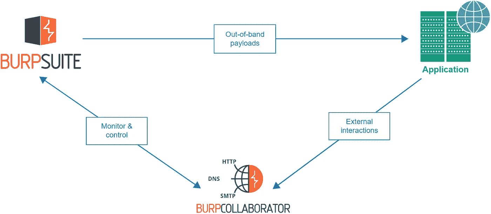
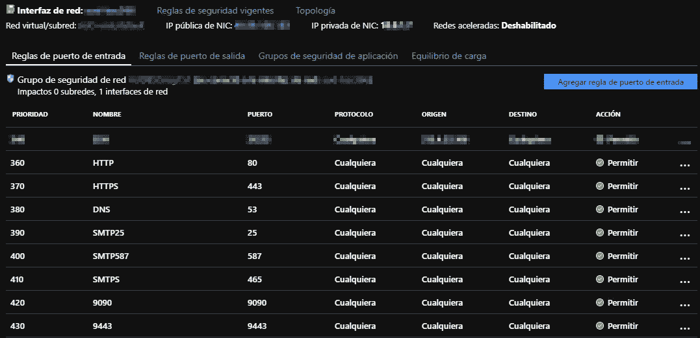
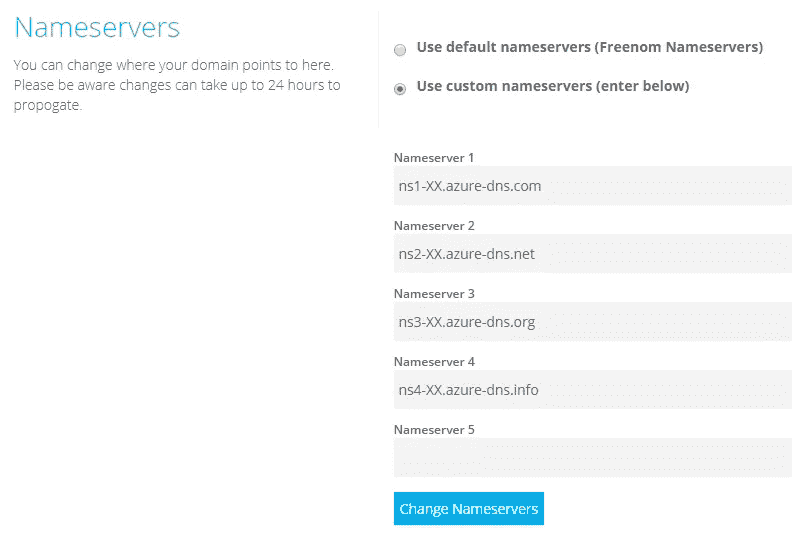
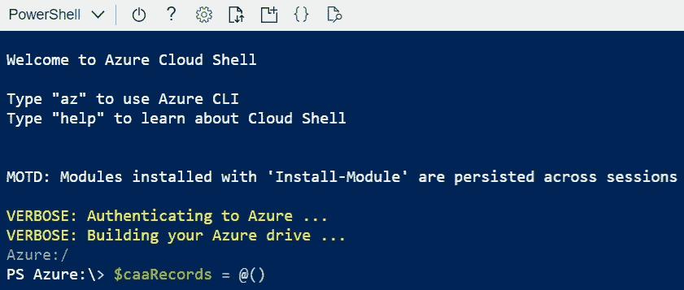
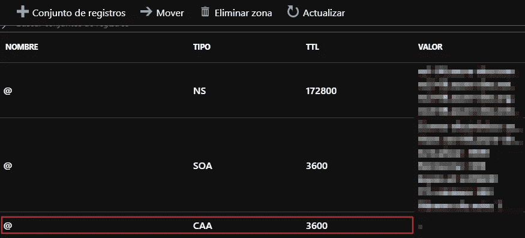
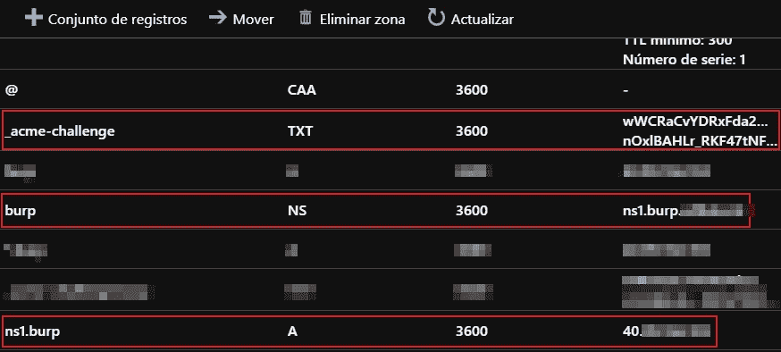
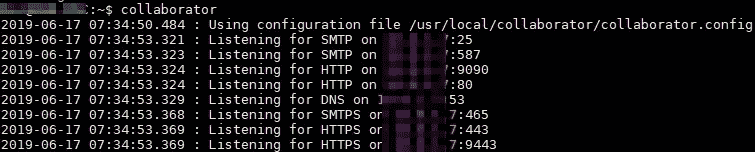
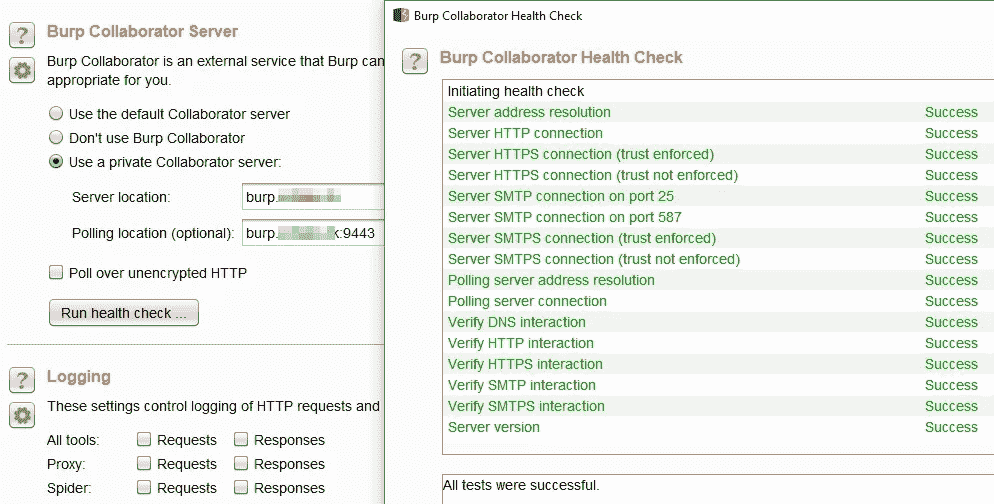

# 在 Azure 中部署私有的 Burp Collaborator 服务器

> 原文：<https://infosecwriteups.com/deploy-a-private-burp-collaborator-server-in-azure-f0d932ae1d70?source=collection_archive---------0----------------------->



不久前，我不得不建立一个私人的 Burp Collaborator 服务器，以避免我的客户的敏感信息泄露。我想澄清的是，本指南是根据 [**法比奥·皮雷斯**](https://twitter.com/fabiopirespt) 写的 的基础上的 [**，所有的优点都是你的。**](https://blog.fabiopires.pt/running-your-instance-of-burp-collaborator-server/)

如果您与 Burp 合作，但不知道什么是合作者，请先查看 [**本**](https://portswigger.net/burp/documentation/collaborator) 文档。

# 目录

1.  Azure 机器和端口转发
2.  获得一个免费的自定义域名
3.  制作 collaborator 配置文件
4.  创建生成和移动证书所需的文件
5.  从“让我们加密”获取证书
6.  运行协作者
7.  配置 Burp 套件以使用私有协作器
8.  确认

# 1.Azure 机器和端口转发

在 Azure 上部署一台 Linux 机器，打开以下端口，我用的是 Ubuntu Server 18.04。

*   端口 25 y 587 -> SMTP
*   端口 53 -> DNS
*   端口 80 -> HTTP
*   港口 443 -> HTTPS
*   港口 465 -> SMTPS
*   端口 9090 -> HTTP(轮询)
*   端口 9443 -> HTTPS(轮询)



Azure 网络管理面板

现在，是时候**记住机器的公共和私有 IP 地址**了。

更新

```
sudo apt-get update && sudo apt-get upgrade
```

安装 Java 运行时环境(JRE)

```
sudo apt-get install default-jre
```

创建一个文件夹来存储所有必需的文件

```
sudo mkdir -p /usr/local/collaborator
```

复制德打嗝套件专业版。jar 文件，并将其重命名为 collaborator.jar

```
sudo mv /usr/local/collaborator/burpsuite_pro_v1.7.37.jar /usr/local/collaborator/collaborator.jar
```

# 2.获得一个免费的自定义域名

[**Freenom**](https://www.freenom.com) 是一个免费的域名提供商，选择你的然后去域名管理员那里把域名服务器改成 Azure。



Freenom 域管理面板

从现在起，我们将不再需要访问 Freenom，我们将从 Azure 管理一切，请记住等待 DNS 传播的谨慎时间。

# 3.制作 collaborator 配置文件

我们记住了第一步中的公有和私有 IP 地址

创建 collaborator 配置文件

```
sudo nano /usr/local/collaborator/collaborator.config
```

代码:

```
{
  "serverDomain" : "burp.mydomain.tk",
  "workerThreads" : 10,
  "eventCapture": {
    "localAddress" : ["10.*.*.*"],
    "publicAddress" : "40.*.*.*",
    "http": {
      "ports" : 80
    },
    "https": {
      "ports" : 443
    },
    "smtp": {
      "ports" : [25, 587]
    },
    "smtps": {
      "ports" : 465
    },
    "ssl": {
      "certificateFiles" : [
        "/usr/local/collaborator/keys/privkey.pem",
        "/usr/local/collaborator/keys/cert.pem",
        "/usr/local/collaborator/keys/fullchain.pem" ]
    }
  },
  "polling" : {
    "localAddress" : "10.*.*.*",
    "publicAddress" : "40.*.*.*",
    "http": {
      "port" : 9090
    },
    "https": {
      "port" : 9443
    },
    "ssl": {
      "hostname" : "burp.mydomain.tk"
    }
  },
  "metrics": {
    "path" : "hackpuntes",
    "addressWhitelist" : ["0.0.0.0/24"]
  },
  "dns": {
    "interfaces" : [{
      "name": "ns1",
      "localAddress" : "10.*.*.*",
      "publicAddress" : "40.*.*.*"
    }],
    "ports" : 53
  },
  "logLevel" : "INFO"
}
```

更改路径、服务器域、主机名、本地地址和公共地址的值。

查看另一个 [**例子**](https://hackpuntes.com/desplegar-un-servidor-privado-de-burp-collaborator-en-azure/#4) 文件

# 4.创建生成和移动证书所需的文件

从步骤 2 中创建的 collaborator 文件夹中，**下载一个 certbot-auto 文件**

```
sudo wget [https://dl.eff.org/certbot-auto](https://dl.eff.org/certbot-auto)
```

所有用户的执行权限

```
sudo chmod a+x ./certbot-auto
```

现在，制作另一个文件来**移动证书**到正确的文件夹

```
sudo nano /usr/local/collaborator/configure_certs.sh
```

代码:

```
#!/bin/bash

CERTBOT_DOMAIN=$1
if [ -z $1 ];
then
    echo "Missing mandatory argument. "
    echo " - Usage: $0  &amp;amp;lt;domain&amp;amp;gt; "
    exit 1
fi
CERT_PATH=/etc/letsencrypt/live/$CERTBOT_DOMAIN/
mkdir -p /usr/local/collaborator/keys/

if [[ -f $CERT_PATH/privkey.pem &amp;amp;amp;&amp;amp;amp; -f $CERT_PATH/fullchain.pem &amp;amp;amp;&amp;amp;amp; -f $CERT_PATH/cert.pem ]]; then
        cp $CERT_PATH/privkey.pem /usr/local/collaborator/keys/
        cp $CERT_PATH/fullchain.pem /usr/local/collaborator/keys/
        cp $CERT_PATH/cert.pem /usr/local/collaborator/keys/
        echo "Certificates installed successfully"
else
        echo "Unable to find certificates in $CERT_PATH"
fi
```

查看另一个 [**例子**](https://hackpuntes.com/desplegar-un-servidor-privado-de-burp-collaborator-en-azure/#6) 文件

# 5.从“让我们加密”获取证书

在从 Let s Encrypt 请求证书之前，我们必须将其作为 CAA 添加到 Azure 中。否则，我们会得到 **DNS 问题:SERVFAIL 为**查找 CAA


错误 DNS 问题:SERVFAIL 查找

进入 Azure 的控制台


Azure 的顶部菜单

复制下面几行，用您的配置编辑它们，并在控制台中执行它们。



Azure 控制台

```
$caaRecords = @()
$caaRecords += New-AzureRmDnsRecordConfig -CaaFlag "0" -CaaTag "iodef" -CaaValue "me[@mydomain.tk](mailto:contacto@hackpuntes.com)"
$caaRecords += New-AzureRmDnsRecordConfig -CaaFlag "0" -CaaTag "issue" -CaaValue "letsencrypt.org"
New-AzDnsRecordSet -Name "@" -RecordType CAA -ZoneName "MYDOMAIN.TK" -ResourceGroupName [AZURE-DNS-ZONE] -Ttl 3600 -DnsRecords $caaRecords
```

查看 [**这个**](https://gist.github.com/GraafG/59961e637180154194994eea0661f3ae) 文件了解更多信息

在 DNS 区域中，我们现在将会看到如下内容



Azure 的 DNS 区域

是时候启动以下命令了

```
./certbot-auto certonly -d mydomain.tk -d *.mydomain.tk  --server [https://acme-v02.api.letsencrypt.org/directory](https://acme-v02.api.letsencrypt.org/directory) --manual --agree-tos --no-eff-email --manual-public-ip-logging-ok --preferred-challenges dns-01
```


让我们加密的验证

在我们继续之前，我们需要在 Azure DNS Zone 中添加前缀为 **_acme-challenge** 的两个 TXT 记录**和以前的值，我们还利用这一步骤将一个 **A 记录**添加到 IP 公共地址，并将另一个 **NS 记录**从 **burp.mydomain.tk** 添加到 **ns1.burp.mydomain.tk****



Azure DNS 区域

按回车键并等待此消息。


让我们加密的验证脚本

最后，移动证书

```
chmod +x /usr/local/collaborator/configure_certs.sh && /usr/local/collaborator/configure_certs.sh burp.mydomain.com
```

# 6.运行协作者

我们有两个启动 collaborator 的选项。第一种是通过别名的**，第二种是通过创建一个引导到系统的**服务**。如果您仅将此机器用于 Burp Collaborator，也许最推荐的选项是创建一个服务，否则，我建议您创建一个别名。**

**别名**

编辑**。bashrc** 文件并添加合作者别名

```
sudo nano .bashrc
```

添加新行

```
alias collaborator='sudo java -jar /usr/local/collaborator/collaborator.jar --collaborator-server --collaborator-config=/usr/local/collaborator.config'
```

打开一个新的终端并运行下一个命令

```
collaborator
```



运行协作者

**服务**

创建一个 **collaborator.service** 文件，并复制以下代码

```
sudo nano /etc/systemd/system/collaborator.service
```

代码:

```
[Unit]
Description=Burp Collaborator Server Daemon
After=network.target

[Service]
Type=simple
User=$USER
UMask=007
ExecStart=/usr/bin/java -Xms10m -Xmx200m -XX:GCTimeRatio=19 -jar /usr/local/collaborator/collaborator.jar --collaborator-server --collaborator-config=/usr/local/collaborator/collaborator.config
Restart=on-failure

# Configures the time to wait before service is stopped forcefully.
TimeoutStopSec=300

[Install]
WantedBy=multi-user.target
```

启用服务

```
systemctl enable collaborator
```

运行服务

```
systemctl start collaborator
```

# 7.配置 Burp 套件以使用私有协作器

在我们的 Burp 套件项目中，转到**项目选项- >杂项**，在 Burp Collaborator 服务器部分使用选项**“使用私有 Collaborator 服务器”**并插入您的域。按下**“运行健康检查”**按钮。该运行状况检查的结果应该是没有错误的绿线。



对打嗝套件进行健康检查

# 8.确认

*   法比奥·皮雷 的指导，这帮助了我写这篇文章。
*   我的 [**公司**](https://www.sidertia.com/Home) ，感谢他们为我提供了这个职位所需要的一切。
*   我的同事佩德罗、阿里纳斯和路易斯·米格尔帮助我学习英语写作。

西班牙语版[T5 这里 ](https://hackpuntes.com/desplegar-un-servidor-privado-de-burp-collaborator-en-azure/)

在 [**Twitter**](https://twitter.com/JJavierOlmedo) 和 [**LinkedIn**](https://www.linkedin.com/in/jjavierolmedo/) 上关注我

再见！

*关注* [*Infosec 报道*](https://medium.com/bugbountywriteup) *获取更多此类精彩报道。*