# 摧毁骗子门户— SBI 骗局

> 原文：<https://infosecwriteups.com/destroying-the-scammers-portal-sbi-scam-2169e21adeeb?source=collection_archive---------0----------------------->

向所有读者问好，

## 故事简介

昨晚，我的一个朋友发消息给我，说他收到了另一条以 SBI 积分为名的诈骗短信。

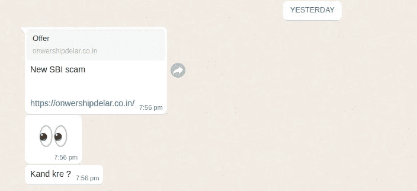

消息

所以，我们决定调查这个骗局。

在检查链接时，我发现该网站要求受害者下载并安装一个应用程序，以便在他们的卡上获得 5000 奖励积分。

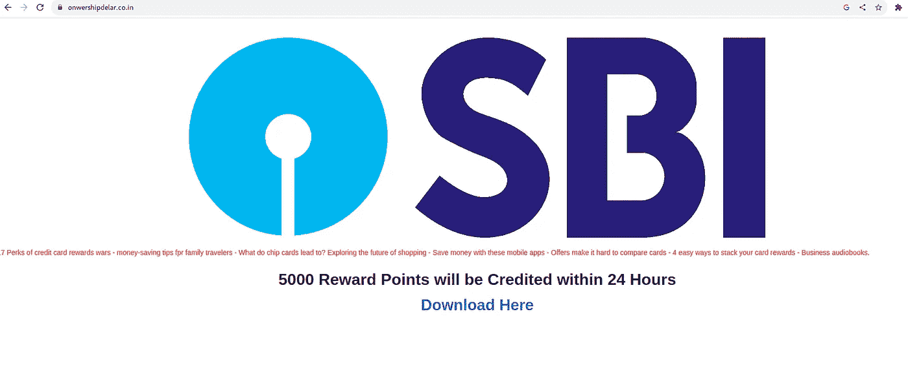

链接主页

## 剥削

我在测试模拟器上安装了应用程序，绕过了 SSL pin。

在启动时，它会要求用户提供他们的信用卡信息以及个人信息，以便在他们的信用卡上获得奖励积分。

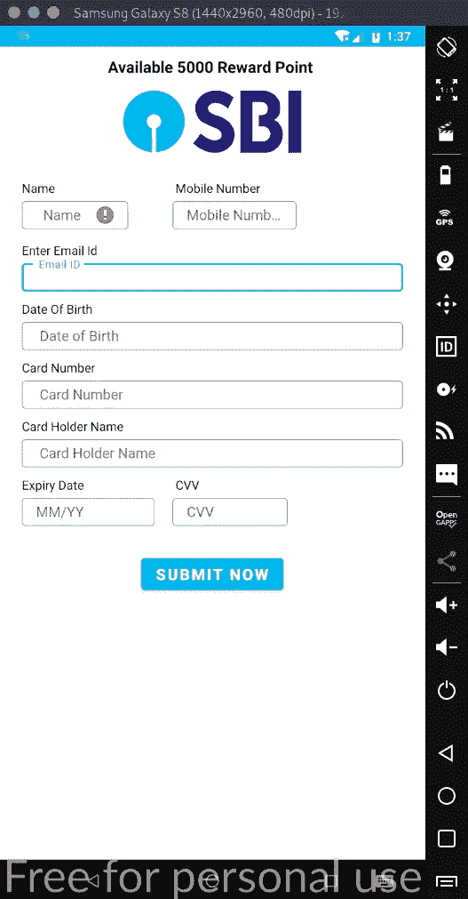

仿真器

在提交表单时，它会将所有细节发送给攻击者服务器。

此外，应用程序请求 SMS 权限才能运行。

如果我们看到反编译的代码，可以发现手机中的消息被发送到/api/message.php，表单数据被发送到/api/signup.php

在检查 URL 时，我发现它容易受到 SQL 注入的攻击，但是在插入查询时没有显示错误。

Mysql 版本大于 5.7，后端使用 PHP，不支持栈查询。这使得很难利用这个 API。

但是在检查了这个域上的一些东西之后，我发现了一个管理面板，位于/admin 的同一个域上。

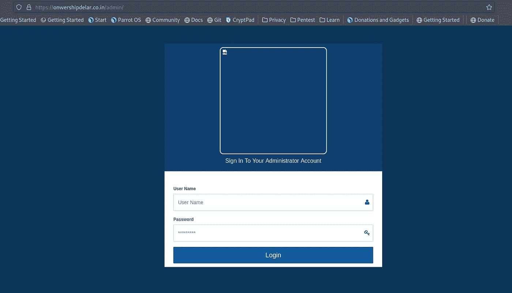

令人惊讶的是，管理面板在其登录页面上容易受到 SQL 注入的攻击。基本有效载荷，如

> 或者 1 = 1-
> 
> 或者' ' = '

工作，我进入了管理面板。

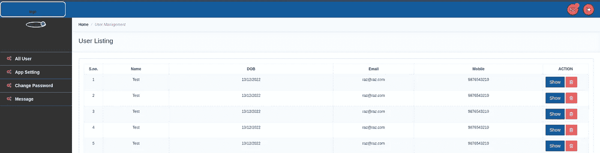

现在，我可以看到所有被网络钓鱼的用户以及登录到门户网站的所有消息。

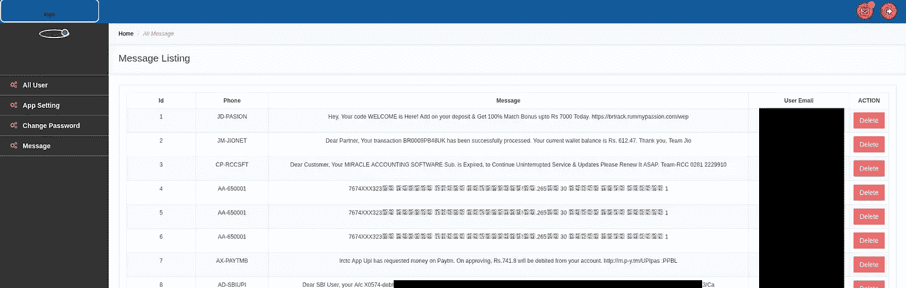

现在在管理面板上，有许多易受 SQLI 攻击的网址，所以人们可以从数据库中获取任何东西。

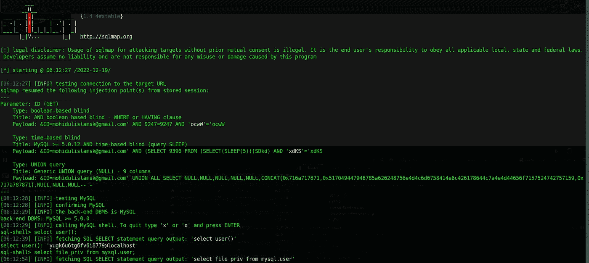

嗯，当前用户没有 root 权限，所以我不能删除数据库或任何记录。

记录的数据包括姓名、电子邮件、卡号、CVV、出生日期和到期日。当诈骗者使用钓鱼卡时，他也会收到发送给动态口令的消息。

因此，无需任何进一步的用户交互，攻击者就可以从门户读取 OTP 并轻松地进行交易。

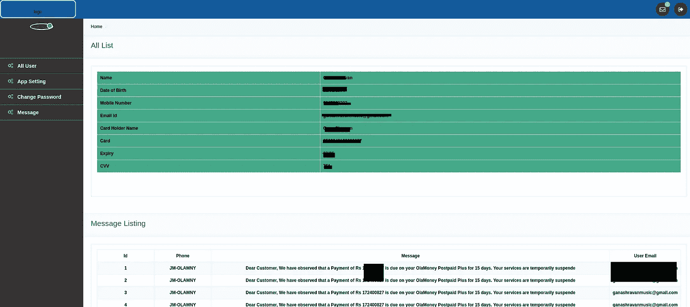

幸运的是，在管理面板中有一个选项可以删除已经记录的记录。

为了删除所有记录，我制作了一个带有管理 cookie 的小 python 脚本来请求删除门户上的所有记录。

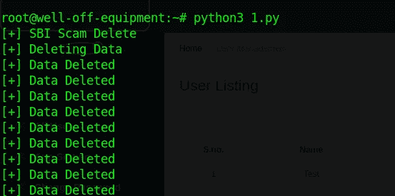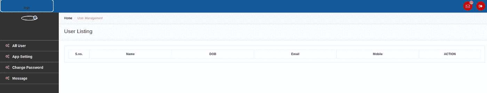

此外，为了防止其他用户通过该应用程序被钓鱼，我滥用了管理面板中的应用程序设置功能，并将警告消息设置为虚假的应用程序警报。

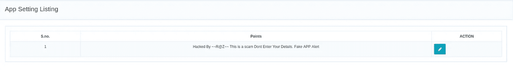

因此，任何人现在打开应用程序或页面都会看到我的消息如下。

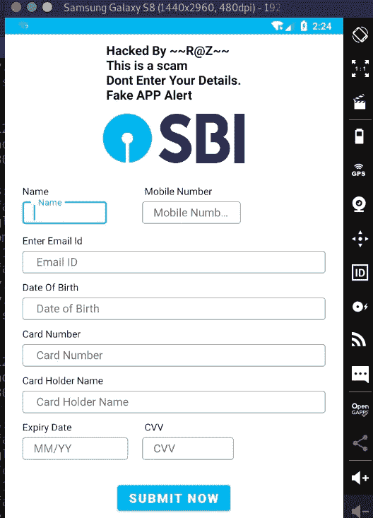

有数以千计的保存卡在门户网站上被删除使用上述脚本。

## 结论

*不安装任何可疑或不可信的应用程序。*

*不向任何应用程序提供您的个人信息/信用卡信息。*

不要向任何像 here 这样的应用程序提供可疑的权限，短信读取权限被滥用来获取 OTP。

## 信用

阿尼什·罗伊([aniroy](https://twitter.com/anir0y))

沙希瓦特·库马尔(@ [拉胡拉兹](https://twitter.com/rahullraz)

## 来自 Infosec 的报道:Infosec 每天都有很多内容，很难跟上。[加入我们的每周时事通讯](https://weekly.infosecwriteups.com/)以 5 篇文章、4 个线程、3 个视频、2 个 GitHub Repos 和工具以及 1 个工作提醒的形式免费获取所有最新的 Infosec 趋势！