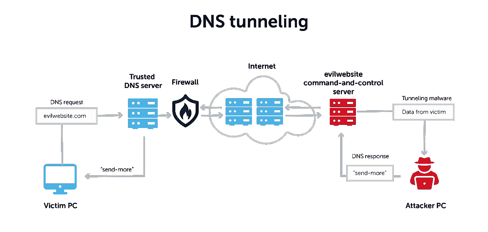
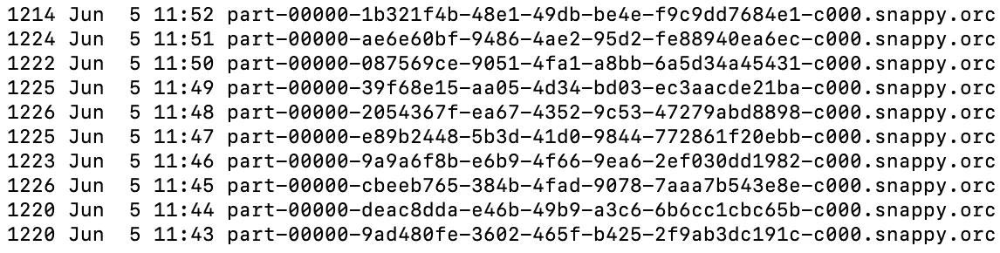
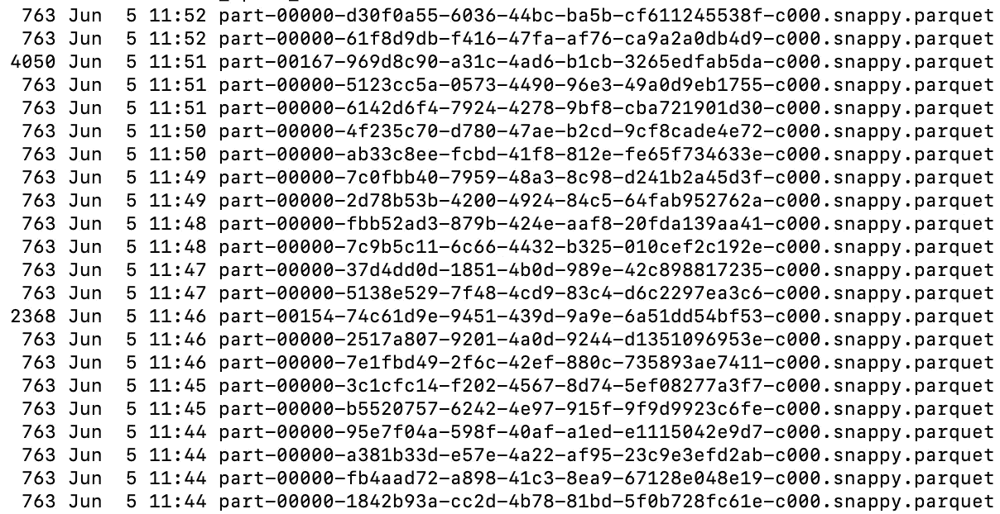
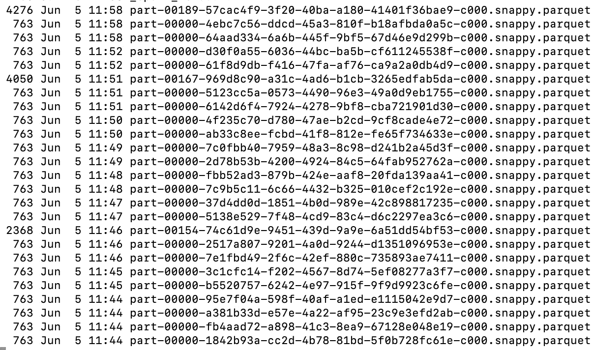
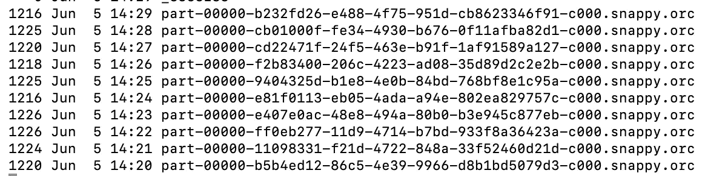

# 使用 Spark 结构化流检测 DNS 隧道

> 原文：<https://infosecwriteups.com/detecting-dns-tunneling-using-spark-structured-streaming-c7e2b6af0349?source=collection_archive---------0----------------------->

来源:[https://blue cat networks . com/blog/why-you-should-notice-to-DNS-tunneling/](https://bluecatnetworks.com/blog/why-you-should-pay-attention-to-dns-tunneling/)

## 从生成 DNS 日志到结构化流的端到端实施

# 域名服务器(Domain Name Server)

在我们开始描述 DNS 隧道以及如何使用 Spark 结构化流检测它之前，先简要说明一下 DNS。

DNS 代表域名系统，即使你可能没有明确地使用它，尽管你的机器在进入这个页面之前肯定使用过它。当你点击链接进入这个页面时，或者如果你在浏览器窗口中手动输入，你的机器使用 DNS 将域名 medium.com 转换成 IP 地址。有一个简洁的工具 [nslookup.io](https://www.nslookup.io/) 可以显示任何域的 A 和其他记录。这里是 medium.com 的详细情况。类似地，您的机器查找 medium.com 的记录，以找到 medium.com 的 IP 地址，并最终连接到它，以便您的浏览器可以呈现它。

# DNS 隧道

在企业中，通常不会对 DNS 流量进行高度过滤/监控。由于这一特性，即使协议本身不是为数据传输而设计的，它也是攻击者从受损机器发送或接收数据的绝佳选择。

> **DNS 隧道**是一种在 DNS 查询和响应中对其他程序或协议的数据进行编码的网络攻击方法。DNS 隧道通常包括数据有效负载，这些数据有效负载可以添加到受攻击的 DNS 服务器，并用于控制远程服务器和应用程序。
> 
> 来源:[https://www.infoblox.com/glossary/dns-tunneling](https://www.infoblox.com/glossary/dns-tunneling)

所以基本上，攻击者将数据本身编码在 DNS 查询和响应中。通常情况下，DNS 查询将由受危害系统上的恶意负载执行，并用于泄漏数据。DNS 响应将用于向受损机器发送命令。

# DNS 日志

为了检测 DNS 隧道，我们需要日志。对于这篇博文，我们将生成这些日志。根据您的企业使用的 DNS 解决方案，您的日志会有所不同。Infoblox 是企业十大 DNS 提供商之一。[捕获 DNS 查询和响应](https://docs.infoblox.com/display/NAG8/Capturing+DNS+Queries+and+Responses)提供了 DNS 查询的示例日志。以下是显示查询的 DNS 日志的格式:

> `<dd-mmm-YYYY HH:MM:SS.uuu> <client IP>#<port> query: <query_Domain name> <class name> <type name> <- or +>[SETDC] <(name server ip)>`
> 
> 其中
> `+ = recursion`
> `- = no recursion`
> `S = TSIG`
> `E = EDNS option set`
> `T = TCP query`
> `D = EDNS ‘DO’ flag set`
> `C = ‘CD’ message flag set`
> 
> DNS 查询消息示例:
> 
> `30-Apr-2013 13:35:02.187 client 10.120.20.32#42386: query: foo.com IN A + (100.90.80.102)`

对于 DNS 隧道，我们会对来自机器的大量 DNS 查询感兴趣。在此示例查询中，来自客户端 10.120.20.32 的是 foo.com。对于 DNS 隧道查询将有子域，因为攻击者会将数据编码到其中，而域(即 foo.com)和域的权威 DNS 服务器由攻击者控制。

## 正在生成 DNS 日志

我们将从一台机器上生成假的 DNS 查询日志数据。我们需要的是时间戳和查询更改来模拟 DNS 隧道攻击。例如，如果想要在 Y 分钟内识别特定域的 X 个唯一的查询，我们必须在生成数据时记住这一点。

> 上面的代码生成以下示例:
> 
> 12-May-2022 13:35:02.187 客户端 10.120.20.32#42386:查询:HsilYPOU1qHHgCA.foo.com 在 A+(100.90.80.102)

我们生成随机子域(在真实攻击中，它们会编码数据)来模拟 DNS 隧道。现在我们必须生成带有各种时间戳的数据来模拟多个 DNS 隧道查询。

## 结构化 DNS 日志

到目前为止，我们已经生成了非结构化日志。我们将解析它们，从中提取字段，并创建一个可以写入的 Spark 数据帧。

上面的代码按空间分割日志，然后使用这些部分来创建结构化数据。我们还使用 [tld](https://pypi.org/project/tld/) 库从查询中获取精确的 fld 和子域。

## 随着时间的推移生成 DNS 日志

现在让我们设置 X 和 y。让我们尝试在 10 分钟内检测 200 个不同的查询。这样 X=200，Y= 10 分钟。因此，我们需要以一定的频率生成数据，在 10 分钟内累计创建 200 个不同的查询。另一点是，我们不想一次生成所有数据，而是可能每分钟左右以“流式方式”生成，以模拟它在 DNS 解决方案提供商日志系统中的表现。

下面的代码在给定时间 Y=10 分钟内生成日志。方法 *dns_logs* 在给定域的开始和结束时间戳之间生成 *num_logs* 日志。我们调用 *generate_logs* ，它每分钟调用 *dns_logs* *，生成大约 20 个日志(*num _ logs _ per _ minute*= 200/10)。*

正在生成 DNS 日志

## 火花结构化流

现在我们有了生成数据的代码，让我们编写一些代码来使用 [Spark 结构化流](https://spark.apache.org/docs/latest/structured-streaming-programming-guide.html)读取数据，以最终检测 DNS 隧道。

首先，我们设置读取和写入数据的位置。将从临时目录中的 *dns_logs* 目录读取数据。我们在 temp 目录中创建一个*流*位置，用于存储来自流作业的其他写入。将被写入*流*位置的*输出*目录。为了从故障中恢复，我们需要提供一个检查点位置。为此，我们在同一个*流*位置提供了一个*检查点*目录。

以下是流式作业的完整代码:

请注意，如果流位置存在，我们会将其删除，但在生产作业中我们不会这样做。这仅用于测试目的。如果我们在生产中也这样做，我们将丢失输出数据以及要从中恢复的检查点。

我们正在使用[文件源](https://spark.apache.org/docs/latest/structured-streaming-programming-guide.html#creating-streaming-dataframes-and-streaming-datasets)进行流式作业。因为我们正在写入 orc 数据，所以我们使用它来读取它。为了处理迟到的数据，我们提供了 60 秒的[水印](https://spark.apache.org/docs/latest/structured-streaming-programming-guide.html#handling-late-data-and-watermarking)。在这种情况下，我们知道我们的数据最多会晚 60 秒到达，我们应该没问题，但是可能需要根据他们的系统进行更改。然后，我们按照 10 分钟的时间窗口和 5 分钟的幻灯片以及领域进行分组。这将为我们提供从每 5 分钟开始的 10 分钟窗口。例如，12:00–12:10、12:05–12:15、12:10–12:20 等等。我们选择 10 分钟，因为我们希望在 10 分钟内检测到唯一数量的子域查询。幻灯片帮助我们考虑这些事件开始时的情形，比如说在窗口中间。例如，如果我们没有幻灯片，我们的窗口将是 12:00–12:10、12:10–12:20 等等。在这种情况下，我们将无法检测查询是否一致地发生在 12:05–12:15 之间。我们可以有一个更细粒度的幻灯片来说明在任何时间点开始的事件，这将创建更多的*输出*数据，以及流作业保留在内存中的内容。因此，我们必须在生成的数据量和检测粒度之间取得平衡。分组之后，我们使用 *collect_set* 方法聚集所有唯一的*子域*。最后，我们设置检查点并以 *parquet* 格式写入输出。在这一点上，我们没有做完整的检测，因为我们只是在一段时间(窗口)内聚合所有唯一的子域 DNS 查询。让我们看看它是什么样子的。

生成的 DNS 日志

上面的截图显示了生成的 DNS 日志文件。正如我们所看到的，文件的生成间隔为 1 分钟，这是有意义的，因为我们的代码在生成数据之前会休眠一段时间。现在让我们看看流是什么样子的。

流式输出

我们看到生成了许多文件，但实际上，就数据而言，大多数文件都是空的(这些文件的大小为 763 字节)。读取所有这些数据会产生以下结果:

> [Row(domain='foo.com '，size=142，window = Row(start = datetime . datetime(2022，6，5，11，40)，end=datetime.datetime(2022，6，5，11，50))，
> 
> Row(domain='foo.com '，size=45，window = Row(start = datetime . datetime(2022，6，5，11，35)，end=datetime.datetime(2022，6，5，11，45)))]

这里发生的基本情况是，只有在 11:35 到 11:45 和 11:40 到 11:50 之间完成的窗口才是流式的。我们让流式作业运行，但我们仍然看不到更多的窗口。包含数据的文件的时间戳为 11:46 和 11:51，因此它是在窗口结束后 1 分钟生成的。因此，这里有几个问题或要点需要注意:

**为什么流式作业会在传入数据窗口之后的某个时间写入？**那是因为我们把水印设置为 60 秒。流式传输需要等待那么长时间才能看到最新的数据，一旦该时间过去，它将完成聚合并写入 sing。这将在[中详细解释，此处](https://spark.apache.org/docs/latest/structured-streaming-programming-guide.html#starting-streaming-queries)为附加模式(默认模式):

> 附加模式使用水印来删除旧的聚合状态。但是窗口聚合的输出被延迟到`withWatermark()`中指定的延迟阈值，因为根据模式语义，行只能在最终确定后(即越过水印后)添加到结果表中一次。
> 
> 来源:[https://spark . Apache . org/docs/latest/structured-streaming-programming-guide . html # starting-streaming-queries](https://spark.apache.org/docs/latest/structured-streaming-programming-guide.html#starting-streaming-queries)

因此，如果我们在 Y 周期内使用 Z 水印检测 X 个唯一查询，最终聚合将在 Y+Z 时间后写入。如果 Y 是 24 小时，Z 是 1 小时，那么最终结果将在窗口开始后的第 25 小时写入。假设 X 在窗口开始后的 N 小时内到达，但我们需要再等 Y-N+Z 小时才能检测到。这在很多网络安全场景中是不可接受的。稍后我们将使用 [**foreachBatch**](https://spark.apache.org/docs/latest/structured-streaming-programming-guide.html#using-foreach-and-foreachbatch) 来解决这个问题。

**为什么我们看不到其他窗口？**原因是不再有源数据传入，这将触发写操作。因此，我们再次开始日志生成过程，因为在现实世界中，我们通常会看到连续的数据传入数据。虽然稍后我们将能够通过 foreachBacth 解决它。

添加更多数据会触发流式作业

让我们看看这些文件的内容:

> [Row(domain='foo.com '，size=155，window = Row(start = datetime . datetime(2022，6，5，11，45)，end=datetime.datetime(2022，6，5，11，55))，
> 
> Row(domain='foo.com '，size=142，window = Row(start = datetime . datetime(2022，6，5，11，40)，end=datetime.datetime(2022，6，5，11，50))，
> 
> Row(domain='foo.com '，size=45，window = Row(start = datetime . datetime(2022，6，5，11，35)，end=datetime.datetime(2022，6，5，11，45)))]

最后我们看到了其他的窗口。但是我们在 11:45–11:55 窗口中最多只能看到 155 个唯一查询。

**为什么不将所有 200 条记录汇总起来？**如果我们查看生成的日志，它们从 11:43 开始，每分钟写一次，直到 11:52。而窗口对应于 11:45–11:55。所以它会丢弃时间戳小于 11:45 和大于 11:55 的日志。因此，理想情况下，我们必须设置一个比实际数量少一定百分比的阈值，但不能少到导致误报。此外，我们需要对幻灯片进行细化，目前为 5 分钟。

**但是我们在哪里设置这个门槛呢？**到目前为止，我们已经得到了聚合的结果，但是对于这个设置，我们需要编写另一个作业来查看最近的数据，并查看是否有任何记录的大小大于或等于阈值。我们将与每批的**再次解决这个问题。**

在我们实现 foreachBatch 之前，让我们先看看我们需要使用的输出模式，因为 append mode 会导致延迟。还有另外两种模式:更新和完成。

> 更新模式使用水印删除旧的聚合状态。
> 
> 完整模式不会删除旧的聚合状态，因为根据定义，该模式会保留结果表中的所有数据。
> 
> 来源:[https://spark . Apache . org/docs/latest/structured-streaming-programming-guide . html # starting-streaming-queries](https://spark.apache.org/docs/latest/structured-streaming-programming-guide.html#starting-streaming-queries)

因为完整模式不会删除旧的聚合数据，所以在每个触发器上都有不必要的数据要处理。因此，我们将使用更新模式，其代码如下:

代码与前一个类似，但对 *foreachBatch* 进行了更改。 *foreachBatch* 需要一个采用当前聚合数据帧和纪元 ID 的方法。我们为此实现了 *alert* 方法，目前在该方法中，如果有超过定义阈值的唯一 DNS 查询，我们就打印出数据。在这种情况下，我们将实际阈值的 90%定义为 200，也就是 180。

让我们来看看生成的 DNS 日志中的数据:

生成的 DNS 日志

下面是生成的警报。这是有意义的，因为在数据写入后会立即触发流式作业并创建警报。

> **历元** 16
> **当前时间**2022–06–05 14:28:58.771419
> **预警** [Row(domain='foo.com '，size=180，window = Row(start = datetime . datetime(2022，6，5，14，19)，end=datetime.datetime(2022，6，5，14，29))]
> 
> **历元**18
> 当前时间 2022–06–05 14:29:59.090905
> 预警 [Row(domain='foo.com '，size=196，window = Row(start = datetime . datetime(2022，6，5，14，20)，end=datetime.datetime(2022，6，5，14，30))]

使用 ***foreachBatch*** 方法解决以下问题:

1.  现在，即使有 60 秒的水印，如果没有最新数据，我们也不需要等待它来获得警报。最重要的是，当我们写入文件时，除了水印时间之外，我们只会在窗口完成后获得聚合数据。使用 foreachBatch，我们不需要等待，而是可以在每个触发器中获取聚合数据进行处理。
2.  当我们写入文件时，我们没有看到所有的窗口，因为在其他窗口完成后没有触发器。foreachBatch 的情况并非如此。
3.  我们不需要编写另一个作业来查看聚合数据，因为我们可以在 foreachBatch 方法本身中编写代码。

# 摘要

在这篇文章中，我试图从网络安全的角度简要解释 DNS 和 DNS 隧道，以及如何使用 Spark 结构化流来检测它。

Medium 是一个很好的平台，可以了解最新最棒的技术。如果你不是会员，请考虑使用我的推荐链接:[https://salilkjain.medium.com/membership](https://salilkjain.medium.com/membership)成为会员，我会收取你一部分会员费。在 [LinkedIn](https://www.linkedin.com/in/jainsalil/) 上与我联系。