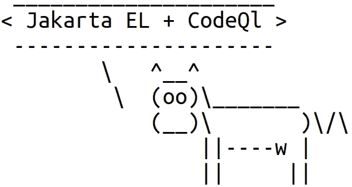

# 用 CodeQL 检测 Jakarta 表达式语言注入

> 原文：<https://infosecwriteups.com/detecting-jakarta-expression-language-injections-with-codeql-41c25d45cdb3?source=collection_archive---------3----------------------->

## 如何使用 CodeQL 查找 EL 注入并修复它们

最近我写了一篇关于[用 CodeQL](https://betterprogramming.pub/expression-language-injections-in-java-e08bd17addf4) 检测 JEXL 注射剂的帖子。JEXL 是一个为简单表达式语言(EL)提供解释器的库。这一次，我将讨论使用 Jakarta 表达式语言的注入，以及如何使用 CodeQL 找到它们。

# 雅加达表情语言是什么？

其中，Jakarta EE 包含了表达式语言(EL)的规范，并为解释器定义了 API。Jakarta EL 是一种特殊用途的编程语言，主要用于在 web 应用程序中嵌入和计算网页中的表达式。但是解释器可以简单地用在任何其他地方。这些 API 有多种实现方式，例如:

*   [朱尔](http://juel.sourceforge.net/)
*   [Apache Commons EL](https://commons.apache.org/dormant/commons-el/)

以下示例显示了如何使用 JUEL 运行表达式:

对了，雅加达 EE 过去是 Java EE。最初，EL 的 API 位于包`javax.el`中。在 Eclipse Foundation 接管 Java EE 之后，这个包被重命名为`jakarta.el`。

# 什么是表情语言注入？

EL 相当强大。特别是，它允许调用 JVM 中可用的方法。这很危险。如果使用不受信任的数据构建表达式，然后对其求值，在最坏的情况下，它可能允许攻击者运行任意代码。这就是所谓的表达式语言注入漏洞。

影响通常很大，因为攻击者可以在 JVM 内部甚至外部运行几乎任何代码。成功攻击的可能性取决于攻击者注入恶意表达式的方式。在最坏的情况下，应用程序会收到来自未经身份验证的远程用户的表达式。例如，它可以从 HTTP 请求中读取它。这很可能导致远程代码执行(RCE)。

下面是一个易受攻击的代码示例。它只是从一个 HTTP 请求中获取一个表达式，然后立即运行它(还是用 JUEL):

# 防止雅加达 EL 注射

如果可能的话，我宁愿避免在应用程序中使用 Jakarta EL。如果表达式确实是必需的，那么只有授权用户才能运行它们。在限制性的沙箱中评估表达式也不错，但不幸的是，Jakarta EL 规范没有为沙箱定义任何 API。因此，解释器不实现任何沙箱。代替 Jakarta EL，您可以考虑使用另一个允许定义沙箱的 EL。比如阿帕奇 JEXL。这篇文章有几个例子展示了如何用 JEXL 实现沙箱。

为了防止运行任意代码，在将传入的数据包含在表达式中之前，也可以对其进行检查。以下示例使用 Regex 模式来检查用户是否试图运行允许的表达式:

# 用于检测雅加达 EL 注射的 CodeQL 查询

[CodeQL](https://securitylab.github.com/tools/codeql) 是一个代码分析引擎。它允许您为代码编写查询来检测各种问题，包括安全问题。让我们看看它如何帮助我们检测雅加达 EL 注射。

CodeQL 可以搜索从源到指定接收器的数据流。在 Jakarta EL 注入的情况下，接收器是计算表达式的方法调用，例如，`ValueExpression.getValue()`、`MethodExpression.invoke()`、`ELProcessor.eval()`等。最有趣的数据源是远程用户可用的数据源。例如，HTTP 请求和网络套接字。从远程源到雅加达 EL 接收器之一的数据流可能是潜在的 EL 注入。我已经在[这个 CodeQL 查询](https://github.com/github/codeql/pull/5471)中实现了这个想法(它已经被添加到了[实验性的](https://github.com/github/codeql/blob/main/java/ql/src/experimental/Security/CWE/CWE-094/JakartaExpressionInjection.ql)查询集中)。让我们看看它是如何工作的。

首先，有一个配置用于跟踪从远程数据源到 Jakarta EL sinks 的污染数据:

它有三个主要组成部分:

*   `isSource()`谓词定义了数据源。它使用类`RemoteFlowSource`来描述网络套接字、HTTP 请求和 CodeQL 核心库知道的其他远程数据源。
*   `isSink()`谓词定义数据汇。它使用了类`ExpressionEvaluationSink`,该类列出了评估表达式的方法调用。
*   谓词告诉 CodeQL 引擎如何传播被感染的输入。

这里最有趣的是`ExpressionEvaluationSink`。让我们来看看:

首先，该类描述了立即计算表达式的方法:

*   `ValueExpression`中的`getValue()`和`setValue()`方法
*   `invoke()``MethodExpression`和`LambdaExpression`中的方法
*   `ELProcessor`中的`eval()`、`getValue()`和`setValue()`方法

接下来，这个类提到了方法`ELProcessor.setVarialbe()`,它不直接计算表达式，而是将表达式赋给一个变量。该查询假设在使用变量时，注入的代码可能会晚一点运行。

谓词`isAdditionalTaintStep()`定义了另外两种传播被感染数据的方法:

*   `TaintPropagatingCall`定义了创建`ValueExpression`、`MethodExpression`和`LambdaExpression`对象的方法调用。
*   `hasGetterFlow()`谓词定义了对可能保存被污染数据的对象上的 getters 的调用。当数据存储在复杂对象中时，该谓词有助于识别问题。然而，它没有考虑到数据是如何在这些对象内部流动的。因此，它可能会导致假阳性。

该查询在 OpenFaces 中检测到一个已知的 [RCE。](https://github.com/TeamDev-Archive/OpenFaces/issues/175)

# 参考

*   [雅加达表情语言](https://projects.eclipse.org/projects/ee4j.el)
*   [雅加达表达式语言 API](https://javadoc.io/doc/jakarta.el/jakarta.el-api/latest/index.html)
*   [OWASP:表达式语言注入](https://owasp.org/www-community/vulnerabilities/Expression_Language_Injection)