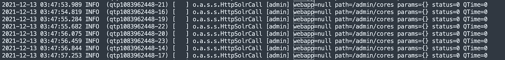

# 检测 Log4j 及其修复

> 原文：<https://infosecwriteups.com/detecting-log4j-its-remediation-58ab3a59c865?source=collection_archive---------3----------------------->

[亚历克斯·丘马克](https://unsplash.com/@ralexnder?utm_source=medium&utm_medium=referral)在 [Unsplash](https://unsplash.com/?utm_source=medium&utm_medium=referral)

本文致力于 log4j 以及攻击者如何在野外利用它。

# Log4j

Apache Log4j 是 Apache Software Foundation 的一个项目，是一个基于 Java 的日志记录工具。它是用 java 编写的，是位于 Java 日志系统中的一个包。它是几个 Java 日志框架的一部分。

发现了一个影响 Java 日志记录包 log4j 的 0 天漏洞，已为该漏洞提供了 CVE 号码 2021–44228。它允许攻击者在 web 服务器上远程执行代码，CVE 得分为满分 10 分，这使其成为最严重的漏洞之一。

Java 被认为是全球第一大开发平台，在超过 30 亿台设备上运行。运行 log4j 的设备数量就算没有几十亿，也可以算是几百万。这使得它成为对攻击者有吸引力的攻击面。

**有不同的方法可以利用这个漏洞。您可以在服务器端记录的一个头中注入有效负载，或者将其作为 URL 参数的一部分传递。**

一些常见的头是用户代理或自定义头，如 X-Forwarded-For 等。

# 我们来检测一下

我们可以访问这种攻击方法的日志文件，这使得我们更容易利用这一漏洞。

查看日志文件，我们发现/admin/cores 端点需要一个参数。由于之前没有传递任何参数，因此 param 参数为空(即 param={})

日志文件

现在我们有了这些知识，我们可以向/admin/cores 端点提供一个带有随机参数的有效负载。

滥用 log4j 0-day 的一般有效载荷是使用 JNDI。一般来说，JNDI 是一个目录服务的 API。你可以使用 LDAP 和 jndi 来调用你的攻击者的机器。

## 来自 Infosec 的报道:Infosec 每天都有很多内容，很难跟上。[加入我们的每周简讯](https://weekly.infosecwriteups.com/)以 5 篇文章、4 个线程、3 个视频、2 个 Github Repos 和工具以及 1 个工作提醒的形式免费获取所有最新的 Infosec 趋势！