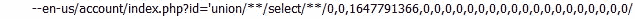
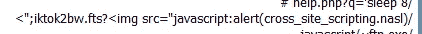
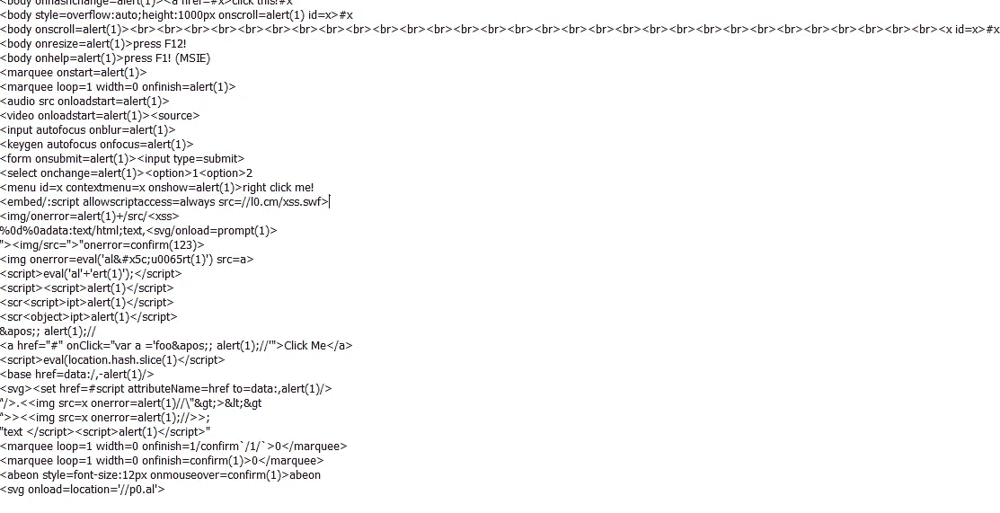
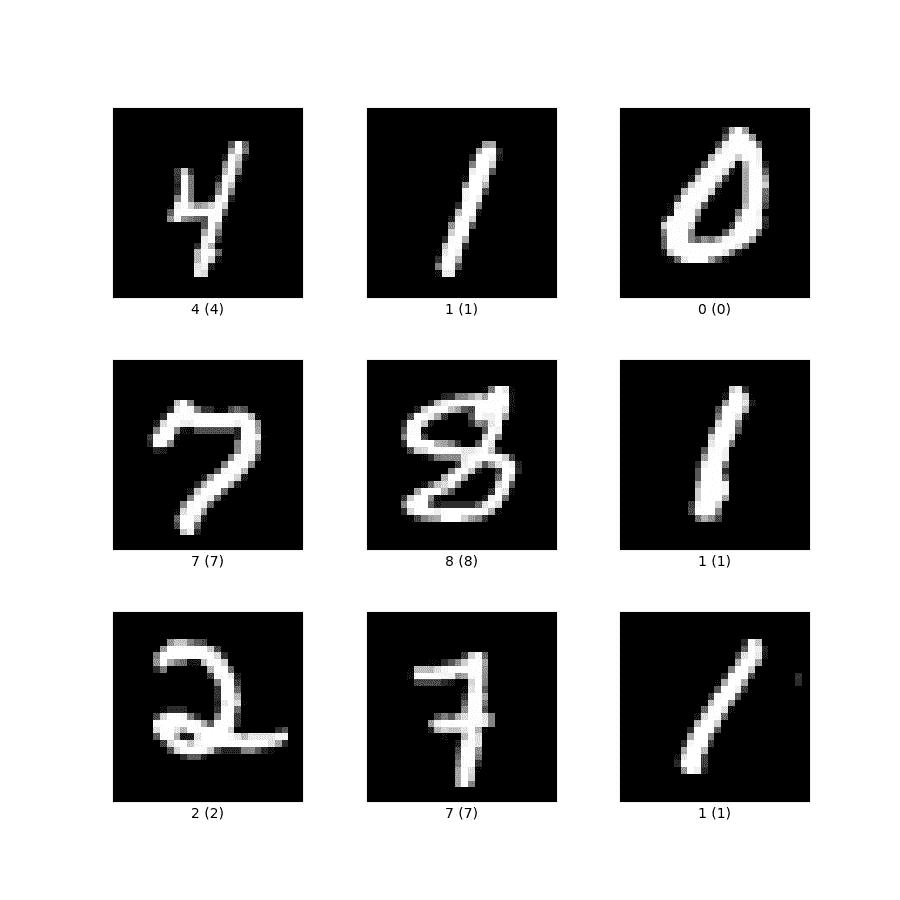
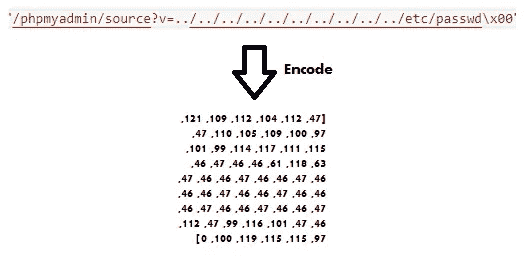
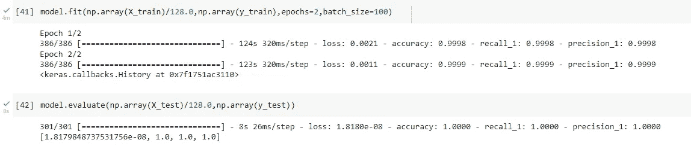

# 使用卷积神经网络检测 Web 攻击

> 原文：<https://infosecwriteups.com/detecting-web-attacks-using-a-convolutional-neural-network-c778c73e2e2a?source=collection_archive---------2----------------------->

**简介**

今天，我们将讨论卷积神经网络及其在网络安全领域的应用方式。正如你们中的一些人可能知道的，用于网络安全的机器学习应用程序在过去几年里变得非常流行。许多不同类型的模型用于检测不同类型的攻击。

我们今天重点关注的特定攻击媒介是 web 利用。由于现在大多数应用程序是 web 应用程序，并且由于它们暴露于万维网，许多网络攻击的目标是利用面向公众的 web 应用程序。web 利用技术的一些例子是诸如 SQL 注入之类的攻击，在这种攻击中，攻击者试图利用网页的输入，从而可以通过将 SQL 注入特定的输入区域来查询或更改敏感数据。



作者图片

在上面的示例中，一个特制的 URL 查询被发送到 web 服务器，以便利用它们的输入并查询敏感数据。

另一种类型的 web 利用技术是 XSS(跨站脚本),这种攻击使攻击者能够将客户端脚本插入其他用户查看的网页中。



作者图片

在上面的示例中，当攻击者试图发送包含 HTML 的字符串时，HTML 标记被传递到 URL 中，该字符串稍后将被另一个客户端解析，代码可能会在他的工作站上执行。

我建议使用机器学习模型来检测这些攻击。我将在 github 上找到的数据集上训练该模型。数据集包含网络攻击的样本。它包含的查询不是恶意的，有些是，我强烈建议检查一下。

[](https://github.com/faizann24/Fwaf-Machine-Learning-driven-Web-Application-Firewall) [## GitHub-faiz an 24/Fwaf-机器学习驱动-Web-应用-防火墙:机器学习驱动…

### 此时您不能执行该操作。您已使用另一个标签页或窗口登录。您已在另一个选项卡中注销，或者…

github.com](https://github.com/faizann24/Fwaf-Machine-Learning-driven-Web-Application-Firewall) 

正如您在下面看到的，这是数据集中一些查询的示例



作者图片

本质上，这些都只是针对一些网络应用程序的 URL。

我们将使用的模型是一个卷积神经网络来检测恶意请求。

**为什么是卷积神经网络？**

CNN 通常用于视觉领域。其用法的一个例子是在经典的 MNIST 问题中，它被用来对手写数字进行分类。



张量流图像

但想到的一个明显的问题是，如果一个 URL 具有恶意意图，如何使用这些神经网络进行分类？这是一个很好的问题，也很奇怪，因为图像本质上是矩阵，包含 0-255 之间的单元值，这些值改变了黑白的程度。这些值然后被输入到一个复杂的函数(神经网络)中，该函数输出关于图像的相关信息。例如，在 MNIST 问题中，神经网络必须知道如何对数字进行分类，因此图像作为输入给出，数字作为输出给出。关于卷积神经网络如何工作的更深入的解释，请查看本文:[https://towardsdatascience . com/convolutionary-Neural-Networks-explained-9cc 5188 c 4939](https://towardsdatascience.com/convolutional-neural-networks-explained-9cc5188c4939)

问题仍然存在，我们如何将 URL 的数据编码成卷积神经网络可以处理的数据？

本质上，我们要做的是使用每个字符的 Unicode 编码(Unicode 表中代表该字符的数字)。这将是我们预处理的一部分，因为神经网络并不真正理解单词，而是理解数字、向量和矩阵等数学对象的函数。神经网络然后学习基于该编码区分恶意和非恶意查询所必需的特征。



作者图片

与其他编码类型相比，这是**更好的选择**，例如字符嵌入、单词嵌入和明显的 hot 编码。它更好的原因是它的存储效率很高。普通的字符嵌入通常会将字符编码成某种向量，这已经比仅仅将字符嵌入其 Unicode 数字表示中的成本更高。更不用说在这种情况下更加困难的单词嵌入了，因为我们处理的是 URL，而不是句子。

我们将把编码的查询格式化成 28x28 矩阵，以便更容易与我们现有的 MNIST 神经网络一起使用(是的，我们采用几乎相同的架构)。

```
from keras.models import Sequential,Modelfrom keras.layers import Dense, Conv2D, Flatten, MaxPool2Dmodel = Sequential()model.add(layers.Input(shape=(28,28,1)))model.add(Conv2D(64, (5, 5), activation='relu', kernel_initializer='he_uniform'))model.add(layers.BatchNormalization())model.add(Conv2D(32, (5, 5), activation='relu'))model.add(layers.Dropout(0.2))model.add(MaxPool2D((3,3)))model.add(Flatten())model.add(Dense(100, activation='relu', kernel_initializer='he_uniform'))model.add(Dense(2, activation='softmax'))# compile modelmodel.compile(optimizer='adam', loss='categorical_crossentropy', metrics=['accuracy',metrics.Recall(),metrics.Precision()])
```

最后，数据集的预处理我们将使用我编写的生成数据集函数，该函数获取包含原始命令和标签的数据集，并将所有内容编码为 UNICODE 并附加标签。

```
def generate_dataset(df):tensorlist = []labelist = []# Generating our dataset sample by samplefor row in df.values:query = row[0]label = row[1]# Encode characters into their UNICODE valueurl_part = [ord(x) if (ord(x) < 129) else 0 for x in query[:784]]# Pad with zeroes the remaining data in order for us to have a full 28*28 image.url_part += [0] * (784 - len(url_part))maxim = max(url_part)if maxim > maxabs:maxabs = maximx = np.array(url_part).reshape(28,28)# label yif label == 1:y = np.array([0, 1], dtype=np.int8)else :y = np.array([1, 0], dtype=np.int8)tensorlist.append(x)labelist.append(y)return tensorlist,labelist
```

最后，现在我们有了数据集，一切都准备好了，应该是训练和测试模型的时候了。



作者图片

正如你所看到的，在仅仅 2 个时期内，神经网络已经表现得令人难以置信。

查看 github 上的代码:

【https://github.com/tentacool9/MLWAF/tree/master 