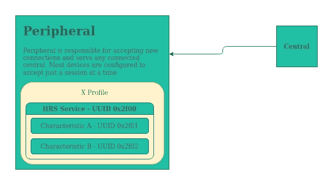
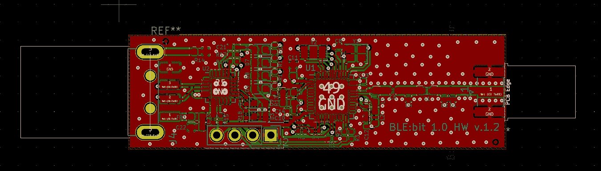
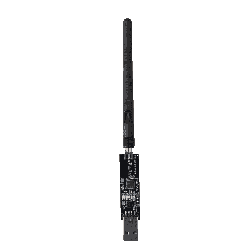

# 开发蓝牙应用|基础、工具和编码

> 原文：<https://infosecwriteups.com/develop-bluetooth-apps-fundamentals-tools-coding-4a08922a7cd6?source=collection_archive---------2----------------------->

这是一篇非常介绍蓝牙技术的文章。这是第一部分，请继续关注更长更全面的文章。


在蓝牙世界中，蓝牙技术已经发展到支持更节能的蓝牙子协议。因此，我们有蓝牙 classic，用于您的音频耳环或汽车音频系统，还有蓝牙 Low Energy，主要用于功耗受限的设备，如智能手表、手机或智能锁。

我将解释非常基础的 BLE，然后我将继续与一个完整的蓝牙应用程序。

# 协议

蓝牙低能耗协议非常简单。这里涉及到许多网络层，但是你现在不应该担心其中的任何一层。我们将使用应用层编写我们的应用程序，因为 BLE 控制器将为我们处理其余的工作。

在蓝牙生态系统中，有两种设备:**中央设备**和**外围设备**。

前者是连接到外围设备的设备，把它们看作是客户端——也就是你的智能手机。
后者是接受新连接的设备。把它们想象成服务器，也就是你的智能手表。

下图总结了这一概念:



*   在 BLE，有一些由蓝牙 SIG(负责蓝牙协议的官方组织)定义的规范。
*   此类配置文件有 HID 配置文件、心率配置文件、健康体温计配置文件、接近度配置文件等等。
*   每个简档定义了该设备必须服务的特定服务。每个服务可以有零个、一个或多个特征，通常一个服务有一到五个特征。
*   这些特征可以被认为是服务的输入/输出端点。
*   每个服务或特征都有一个唯一的 Id，即 UUID。
*   当一个外围设备想要被发现时，它处于广告模式。在这种模式下，广告分组由附近扫描外围设备的中央设备发送和接收。此类数据包包含设备特定的数据，如设备名称、蓝牙地址或电池电量。这些数据将在 BLE 系列的后续文章中进行分析，所以不要忘记关注。

# 实施



**使用的控制器:**开源 BLE:bit 设备—官方: [blebit.io](https://docs.blebit.io)
**场景:**设置一个中央设备和一个外围设备。这两台设备都将由我们的软件控制。目标是让两台计算机通过 BLE 进行通信。

在后面的文章中，我将向您展示如何与智能手表通信。

**设置外围设备**

因此，我们将首先设置外围设备。它将向客户端提供一些服务，并能够接受新的连接。

因为我们使用的是 BLE:Bit，所以我们将使用 BLE:Bit Java SDK。BLE:Bit 是编程访问和设置蓝牙连接的最简单的工具之一。此外，它还提供现成的工具，帮助 BLE 安全审计，侦察，枚举，调试或任何类型的 BLE 自动化，真的。

下面的代码创建了一些服务，添加了一些特征，并创建了控制器对象，完成后，它开始向附近的设备发布广告。



BLE:钻头工具

```
public class VerySimplePeripheral {

    public static void main(String[] args) 
    {   
        setupPeripheral();
    }

    private static void setupPeripheral()
    {
        try {
            /** Retrieve a BLE:Bit Peripheral controller **/
            PEController pe = BLEHelper.getPeripheralController(new PEBLEDeviceCallbackHandler());

            /** Create a connection parameter **/
            pe.sendConnectionParameters(new PEConnectionParameters());

            /** We won't make use of any pairing method **/
            pe.configurePairing(ConnectionTypesCommon.PairingMethods.NO_IO);

            /** Set peripheral's Bluetooth Address **/
            pe.sendBluetoothDeviceAddress("aa:bb:cc:dd:ee:ff", ConnectionTypesCommon.BITAddressType.STATIC_PRIVATE);

            /** Create HRS service **/
            BLEService heart_rate_service = new BLEService(UUID.fromString("0000180D-0000-1000-8000-00805F9B34FB").toString());

            /** Create advertisement data **/
            AdvertisementData adv_data = new AdvertisementData();
            adv_data.setFlags(AdvertisementData.FLAG_LE_GENERAL_DISCOVERABLE_MODE | AdvertisementData.FLAG_ER_BDR_NOT_SUPPORTED);
            pe.sendAdvertisementData(adv_data);

            /** Add BLE Characteristic Heart Rate Measurement **/
            String uuid_char = UUID.fromString("00002A37-0000-1000-8000-00805F9B34FB").toString();
            BLECharacteristic hr_measurement = new BLECharacteristic(uuid_char, "hello-world".getBytes());
            hr_measurement.enableRead();    // Enable read-requests
            hr_measurement.enableWrite();   // Enable write-requests

            /** Bind Characteristic to the service **/
            heart_rate_service.addCharacteristic(hr_measurement);

            /** Attach service to the controller device **/
            pe.sendBLEService(heart_rate_service);

            /** Let the controller know that 
             * we have finished with setting 
             * up the device **/
            pe.finishSetup();

        }catch(IOException e) {
            System.err.println(e.getMessage());
        }
    }
}
```

上面的代码显示了使用 BLE:Bit SDK 创建外设是多么容易。上述代码的分解:

1.  BLE:位控制器和适当的回调对象被创建
2.  设置连接和配对/安全参数
3.  地址和广告数据包集
4.  定义了 BLE 服务和特征
5.  设置完成—设备开始向附近的设备发布广告

在下一篇文章中，我们将介绍如何设置中央设备，以便外设可以与中央设备交换数据。不需要硬件知识，因为 BLE:位工具可以完全由软件控制，并通过 USB 连接。

在以后的文章中，我将介绍如何开发更高级的应用程序，以及如何与智能手表等设备进行通信。

有关蓝牙控制器的更多信息: [docs.blebit.io](https://docs.blebit.io)