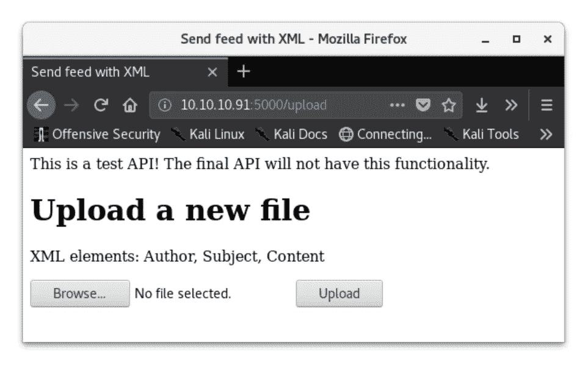
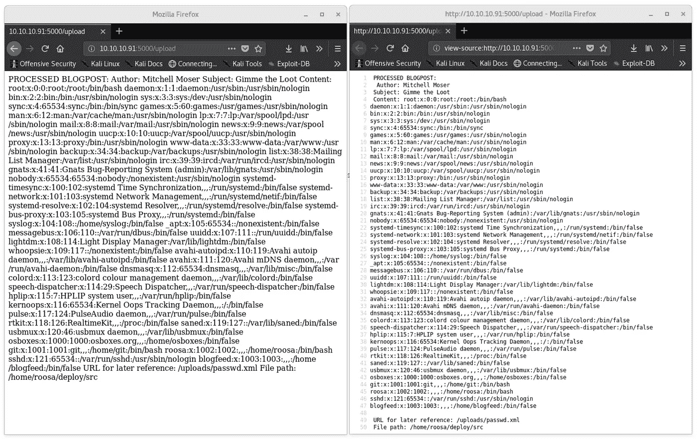
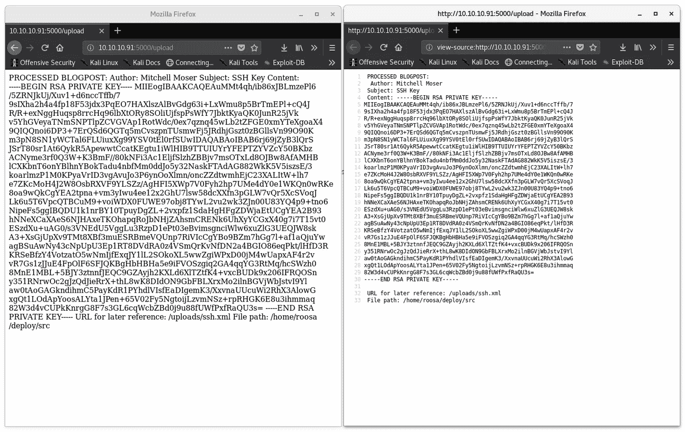
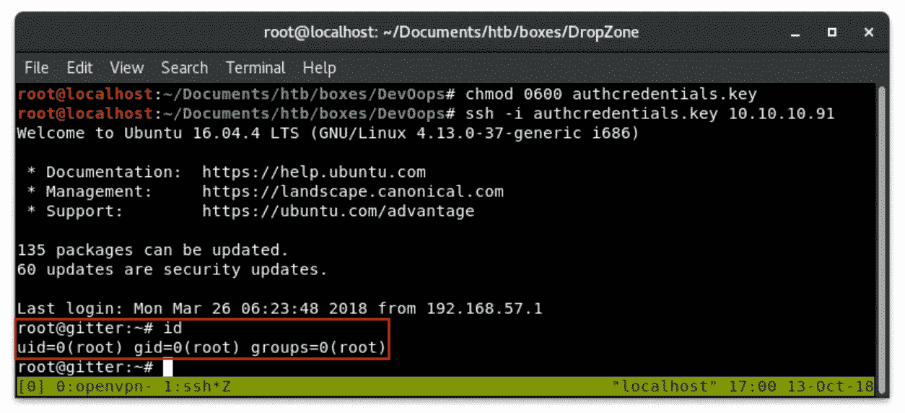

# DevOops —一个 XML 外部实体(XXE) HackTheBox 演练

> 原文：<https://infosecwriteups.com/devoops-an-xml-external-entity-xxe-hackthebox-walkthrough-fb5ba03aaaa2?source=collection_archive---------0----------------------->


# 摘要

DevOops 是一个运行 web 服务的 Linux 主机，其文件上传容易受到 [XML 外部实体处理](https://www.owasp.org/index.php/XML_External_Entity_(XXE)_Processing)的攻击。这被用来访问系统上的文件，以便枚举用户、读取 bash 历史和检索 SSH 密钥。通过从用户的 bash 历史记录中找到根 SSH 密钥，可以在主机上获得根 shell。

# 侦察

我开始在这台主机上进行侦察，通过`nmap`扫描检查服务版本，并在前 1000 个最常见的端口上运行默认脚本:

```
nmap -sV -sC 10.10.10.91
```

nmap

这返回了两个服务:端口 22 上的 SSH 和端口 5000 上的 HTTP。接下来，我决定用`gobuster`枚举 web 服务以返回额外的 web 目录:

```
gobuster -u [http://10.10.10.91:5000](http://10.10.10.91:5000) -w /usr/share/wordlists/dirbuster/directory-list-2.3-medium.txt
```

> `-u`指定网址
> 指定单词列表`-w`

gobuster

这返回了一个`/upload`目录。这个页面很有趣，因为它规定上传的文件必须是 XML 格式，并且包含三个特定的元素:Autor、Subject 和 Content。



/上传

# 最初的立足点

经过一点研究(大声喊出来 [OWASP](https://www.owasp.org/index.php/XML_External_Entity_(XXE)_Processing) 和 [w3schools](https://www.w3schools.com/xml/xml_dtd.asp) ，我能够构造一个有效的 XML 文档，它利用了 XML 外部实体处理(XXE)。XXE 利用弱配置的 XML 解析器来访问本地或远程内容。这种攻击在 2017 年发布的 OWASP 十大攻击中排名第四。外部实体可通过文件 URI 处理程序、内部文件共享、内部端口扫描、远程代码执行和拒绝服务攻击来泄露内部文件。

我的 XML 模板如下所示:

XML 模板

当这个文件上传到主机时，我被重定向到服务器上呈现的文件。因为我在`Content`字段中将`/etc/passwd`作为 XML 实体引用，所以这个文件也被加载到网页上。



凌乱|格式化

处理像这样返回“非预期”数据的 web 漏洞的一个非常方便的技巧是查看页面源，而不是“呈现”的页面。这对于其他信息泄露攻击是有用的，例如本地文件包含等。换行符有时只能在`view-source:`页面中处理。

现在我有了一个`/etc/passwd`的副本，我能够返回一个包含有效登录 shells 的用户列表:

```
grep -v “nologin\|false\|sync” passwd
```

该命令删除了`/etc/passwd`中包含`/bin/false`、`/bin/sync`和`/usr/sbin/nologin`的行，这些行不是交互式 shells。此命令返回了以下用户:

用户

这绝对缩小了范围！因此，现在我们有 3 个用户需要关注——如果我们考虑到可能需要将权限提升到`root`的话，还有 2 个。

# 本地枚举

这个主机上的初始立足点和本地枚举步骤相互渗透，因为我能够从 XXE 漏洞中获得大量有价值的信息。我开始在用户的主目录中寻找我能找到的所有文件。我甚至不用上箱子就能拿到`user.txt`旗！

user.txt

我可以使用下面的 XML 文档获取`roosa`帐户的 bash 历史记录:

这返回了一个非常长的命令历史，其中包含了一个有趣的`authcredentials.key`片段:

authcredentials.key

我不知道这个文件的完整路径，所以无法检索到那个密钥。然而，我能够从`roosa`的主目录中获取一个 SSH 密钥，这使我能够在主机上进行本地访问。

SSH 密钥 XML



SSH 密钥

# 权限提升

这是一个非常简单的权限提升，因为我已经通过 XXE 攻击在主机上做了大量的枚举。我使用 SSH 密钥登录主机:

```
ssh -i roosa.key roosa@10.10.10.91
```

从那里我找到了`authcredentials.key`文件，使用:

```
locate authcredentials.key
```

这返回了两个相同的文件，只有`roosa`有读写权限:

```
/home/roosa/deploy/resources/integration/authcredentials.key/home/roosa/work/blogfeed/resources/integration/authcredentials.key
```

这些文件包含一个 RSA 私钥，可用于以根用户身份访问机器。



根