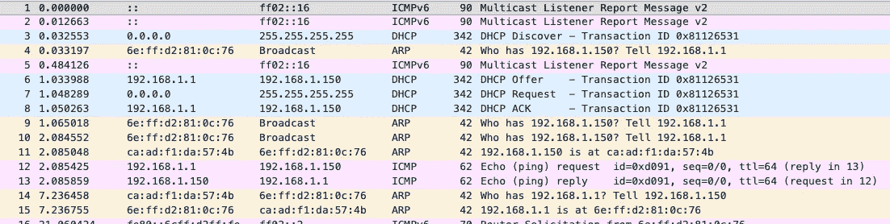
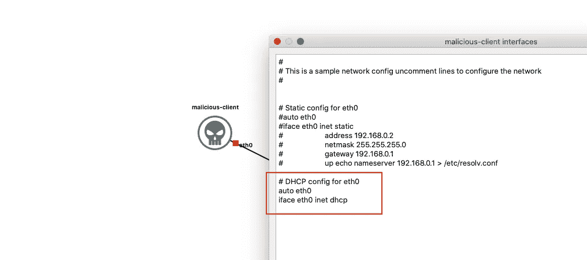
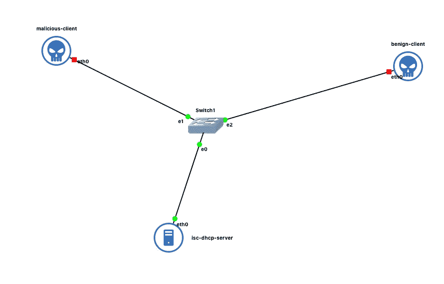
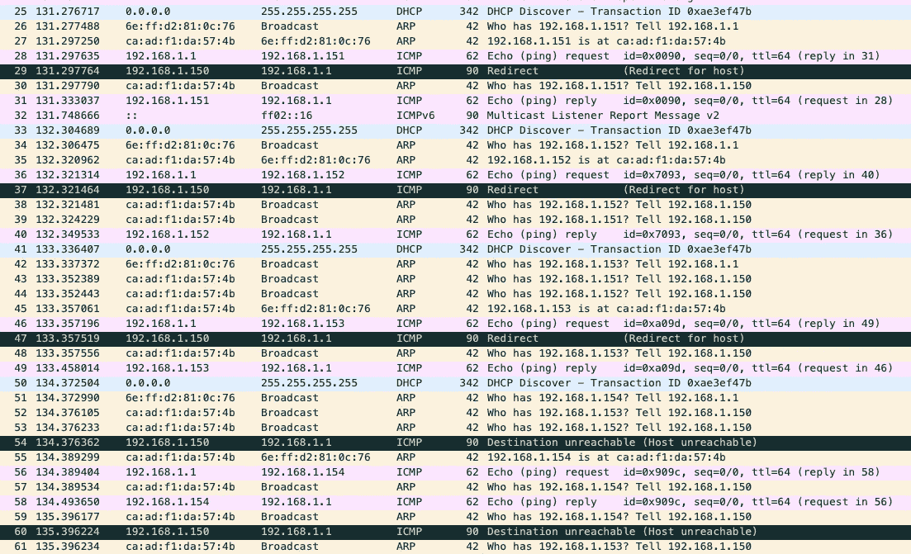

# 不发出任何 DHCP 请求的 DHCP 饥饿攻击

> 原文：<https://infosecwriteups.com/dhcp-starvation-attack-without-making-any-dhcp-requests-bef0022133c9?source=collection_archive---------2----------------------->


DHCP(动态主机配置协议)是一种网络协议，它为进入网络的主机提供 IP 地址和其他所需的详细信息，包括网关 IP、DNS IP。在 [RFC2131](https://tools.ietf.org/html/rfc2131) 中定义的 DHCP 协议涉及客户端和服务器之间的 4 个来回交易，即:

*   DHCP 发现—从客户端广播
*   DHCP 服务—从服务器广播
*   DHCP 请求—来自客户端的单播
*   DHCP ACK —来自服务器的单播

[维基百科惊人地解释了 DHCP 协议](https://en.wikipedia.org/wiki/Dynamic_Host_Configuration_Protocol)！

# DHCP 攻击

与 ARP 协议类似，由于其无法对进入网络的用户进行身份认证，对该协议的攻击也出现了多种类型。以下是一些众所周知的 DHCP 攻击:

*   **DHCP 窥探**:在这种攻击中，恶意客户端充当 DHCP 服务器，在客户端进入网络时为其提供服务。恶意客户端可以发送自定义网关和 DNS 服务器 IP，以将自己确立为中间人并执行 DNS 中毒。
*   **DHCP 饥饿**:在这种攻击中，恶意客户端发送多个 DHCP 请求，并持有 DHCP 池中存在的所有 IP 地址，从而不允许任何新主机加入网络。拒绝服务。

# DHCP 饥饿—协议剖析

下图显示了 DHCP 交易期间数据包捕获的屏幕截图。



DHCP 事务的数据包捕获

## ARP 在这里做什么？

DHCP 服务器广播一个 ARP 请求，然后是一个 ICMP 请求，以确保它要提供给 DHCP 的 IP 地址确实可用。尤里卡。

为什么需要发出 DHCP 请求来使 DHCP 池饥饿？大多数防御系统会寻找来自同一个 MAC 地址的重复 DHCP 请求。如果我回复了 DHCP 的 ARP 请求，让 DHCP 相信 IP 地址已经在用了怎么办？

因此，在本文中，让我们看看如何进行 ARP 欺骗来模拟一个不存在的客户端，使 DHCP 服务器相信从地址池中挑选出来提供 DHCP 服务的 IP 地址已经被另一个客户端占用。

# 实验

在这个实验中，让我们使用网络模拟工具 [GNS3](https://www.gns3.com/) 和 [Docker](https://www.docker.com/) 容器作为 DHCP 服务器、恶意客户端和良性客户端。

## DHCP 服务器

让我们从头开始创建一个 DHCP 服务器。登录到 GNS3 虚拟机(这是容器旋转的地方)。ISC DHCP 服务器软件用于在 ubuntu 容器[ [参考](https://www.tecmint.com/install-dhcp-server-in-ubuntu-debian/) ]中配置和运行 DHCP 服务器。

*   创建一个包含以下内容的 Dockerfile 文件:

*   通过运行`docker build -t dhcp-server .`构建 docker 映像。
*   然后，将构建的 docker 映像作为 GNS3 设备导入。[如何](https://docs.gns3.com/docs/emulators/docker-support-in-gns3/)？
*   将创建的设备拖入 GNS3 工作区。
*   通过右键单击并选择“启动”来启动服务器。双击节点以获得控制台。
*   导航到`/etc/dhcp`并将以下内容添加到`dhcpd.conf`文件中。

*   通过运行以下命令，为 DHCP 服务器创建一个空文件来保存租用的 IP 地址:

```
touch /var/lib/dhcp/dhcpd.lease
```

*   此外，通过运行以下命令为 DHCP 服务器分配一个 IP 地址:

```
ifconfig eth0 192.168.1.1/24
```

*   最后，通过运行命令`dhcpd`启动 DHCP 服务器。

## 恶意客户端和良性客户端

恶意客户端是安装了 [scapy](https://scapy.net/) ，`[ehlers/scapy](https://hub.docker.com/r/ehlers/scapy)`的 Linux 机器。将这个 docker 映像作为一个设备导入到 GNS3 中，并将它的一个实例拖到工作区中。右键单击工作区上的恶意客户端实例，并使用`edit config`取消 DHCP config 下的注释行。这会将实例配置为从 DHCP 服务器获取 IP 地址。



DHCP 客户端已启用

在我们启动恶意客户端之前，将一个 GNS3 默认交换机拖到工作区。然后，将恶意客户端和 DHCP 服务器连接到交换机。拖动另一个`ehlers/scapy`实例，它扮演一个良性客户端的角色。编辑配置，使其看起来类似于恶意客户端。设置完成后，网络看起来类似于下图:



网络拓扑结构

是时候了！

右键单击 DHCP 服务器和交换机之间的链路，开始数据包捕获。然后，启动恶意客户端。

观察 DHCP 事务的发生，恶意客户端成功获得 IP 地址。

## 攻击

通过双击恶意客户端获得一个控制台，并使用以下内容创建一个`arp_spoof.py` python 文件。

arp_spoof.py

代码执行 ARP 欺骗，在我的旧博客中有详细解释。简而言之，每个线程监听特定类型的请求，即 ARP 请求和 ICMP 请求，并相应地响应它们。当恶意节点回复 ARP 请求时，交换机认为与所讨论的 IP 地址(ARP 协议)相关联的 MAC 地址就是恶意节点的 MAC 地址。ARP 欺骗就是这样实现的。

通过点击以下命令运行 python 代码:

```
python arp_spoof.py
```

现在，启动良性客户端并观察！

# 观察

双击良性客户端以获得控制台。运行，`ifconfig`并观察良性客户端尚未收到 IP 地址！

## 为什么？

观察正在运行的数据包捕获。



ARP 和 IP 欺骗造成的 DHCP 饥饿

良性客户端不断地让 DHCP 发现，而 DHCP 服务器则忙于制作 DHCP 提供。DHCP 服务器无法在其 DHCP 地址池中找到可用的 IP 地址。它从 DHCP 地址池中找到一个 IP 地址，通过先发出 ARP 请求再发出 ICMP 请求来检查该地址是否已被另一台主机占用，这就是恶意客户端对这些消息做出响应的地方。因此，DHCP 服务器断定该 IP 地址已被占用，并跳到地址池中的下一个可用 IP 地址。这个过程无限重复，良性客户端没有 IP 地址。
因此，进行了 DHCP 饥饿攻击！

> 我都有，但是一个都不会用！— DHCP 服务器