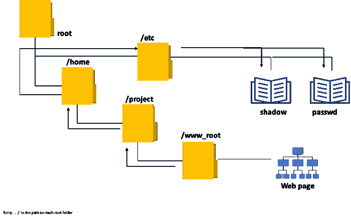

# 目录模糊化— Bug 赏金

> 原文：<https://infosecwriteups.com/directory-fuzzing-bug-bounty-3deb4dd3c32?source=collection_archive---------4----------------------->

## 让 python 自动完成你的 bug 奖励工作吧！

*图片由 c0d3x 版权所有。*

当你模糊一个子域时，你可能会发现管理面板甚至敏感文件。假设你在目录模糊化过程中发现了一个. git 目录，你可以使用这个 git 转储工具【https://github.com/arthaud/git-dumper[下载应用程序的源代码。此源代码可能包含凭据。你可以在网上找到许多与这个问题相关的文章。](https://github.com/arthaud/git-dumper)

# 领域👨‍💻

在开始之前，我们需要检查这个域是否是活的，因为对一个死域的大量请求只是浪费时间。让我们写一个脚本来检查我们想要测试的域。

> 代码:

将该代码保存为 whatever.py，该脚本向端口 **80** 和 **443** 发送请求以检查域状态。使用这个脚本，您只需点击 **robots.txt** 端点。让我们把重点放在 robots.txt 上，除此之外，端点的大小都太大了。另外，这只是用来填充除了块。 **Isdomainlive** 函数返回具有各自方案的域列表，如果可用，则返回 False。

# 起毛📂

> 代码:

如**第 4 行所示，**您将从 **dirsearch** Github 库下载目录 **wordlist** 。第一个是检查域名是否是活的。如果域是活的，那么模糊将开始。否则，它将只是去下一个子域。由于域和子域的数量，整个过程需要一段时间。如果你想在幕后运行这个脚本，你可以使用[屏幕](https://linuxize.com/post/how-to-use-linux-screen/)。

**快乐狩猎** **！！**