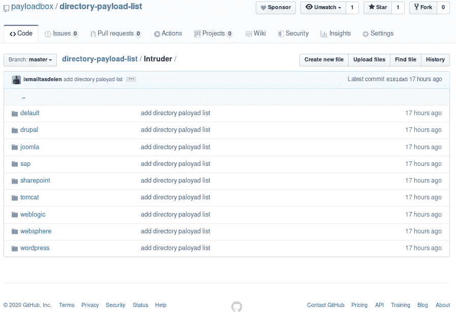

# 目录有效负载列表

> 原文：<https://infosecwriteups.com/directory-payload-list-via-payloadbox-433f689b8afd?source=collection_archive---------1----------------------->

## 负载箱


## 概述:

我们的目标是创建这个回购。一个常规的 web 应用程序是为目录测试创建有效负载列表。目录扫描对于 web 应用程序测试至关重要。可以通过目录列表访问可能的敏感数据。这就是它如此重要的原因。你可以支持这个 repo，为不同的 web 应用添加特殊的有效载荷列表，并支持它们。一切都在这里，❤



## Directroy 扫描仪工具的:

*   [Dirb](https://tools.kali.org/web-applications/dirb)
*   [捉鬼敢死队](https://tools.kali.org/web-applications/gobuster)
*   [Wfuzz](https://tools.kali.org/web-applications/wfuzz)
*   [恐怖分子](https://tools.kali.org/web-applications/dirbuster)
*   [打嗝套件入侵者功能](https://portswigger.net/burp/documentation/desktop/tools/intruder/using)

此最新版本包含以下列表中的有效负载信息。

*   系统默认值
*   drupal
*   网站架站软件
*   精力
*   sharepoint
*   雄猫
*   服务器
*   网络共享
*   wordpress 软件

## 参考资料:

[A6-安全错误配置](https://owasp.org/www-project-top-ten/OWASP_Top_Ten_2017/Top_10-2017_A6-Security_Misconfiguration)

[目录列表](https://portswigger.net/kb/issues/00600100_directory-listing)

[CWE-538:文件和目录信息曝光](https://cwe.mitre.org/data/definitions/538.html)

[CWE-548:通过目录列表暴露信息](https://cwe.mitre.org/data/definitions/548.html)

## 克隆现有存储库(使用 HTTPS 克隆)

```
[https://github.com/payloadbox/directory-payload-list.git](https://github.com/payloadbox/directory-payload-list.git)
```

## 克隆现有存储库(使用 SSH 克隆)

```
git@github.com:payloadbox/directory-payload-list.git
```

来源:[https://github.com/payloadbox/directory-payload-list](https://github.com/payloadbox/directory-payload-list)

## 来自 Infosec 的报道:Infosec 每天都有很多内容，很难跟上。[加入我们的每周简讯](https://weekly.infosecwriteups.com/)，以 5 篇文章、4 个线程、3 个视频、2 个 GitHub Repos 和工具以及 1 个工作提醒的形式免费获取所有最新的 Infosec 趋势！