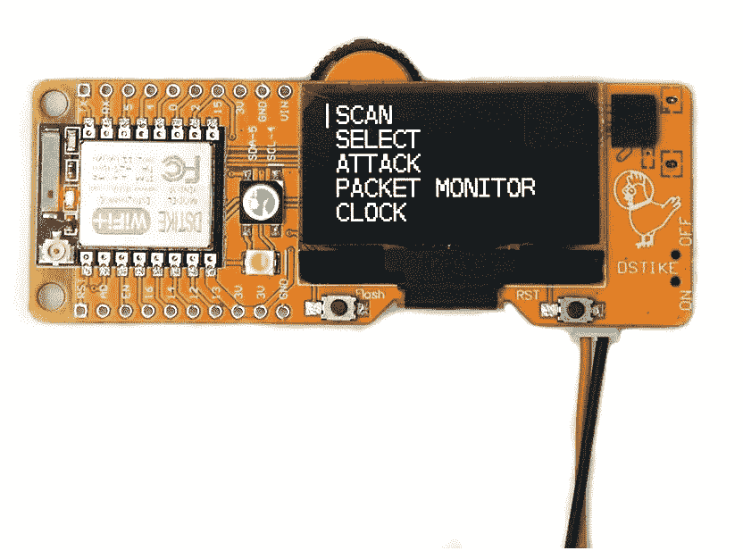
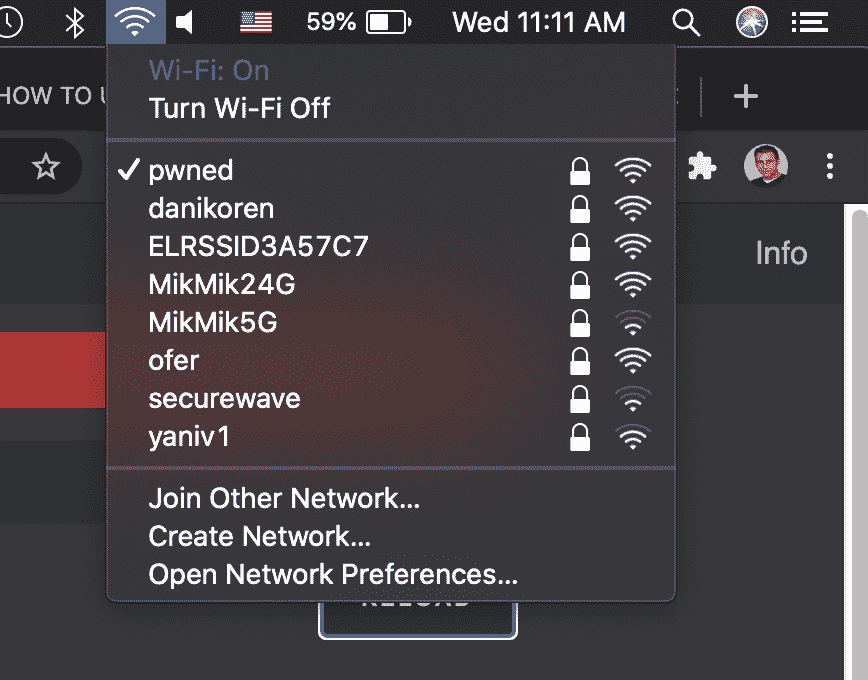
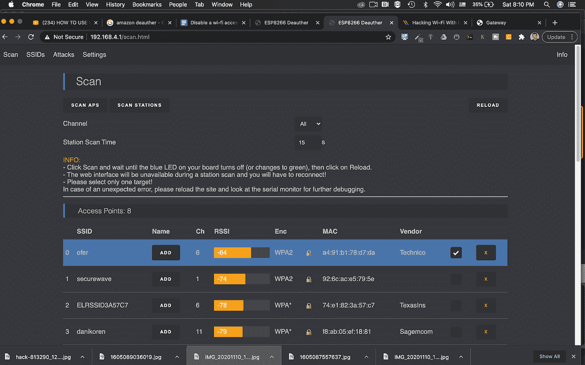
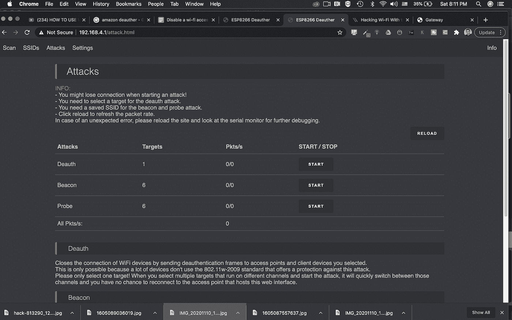
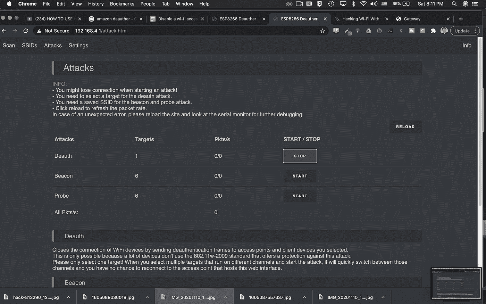
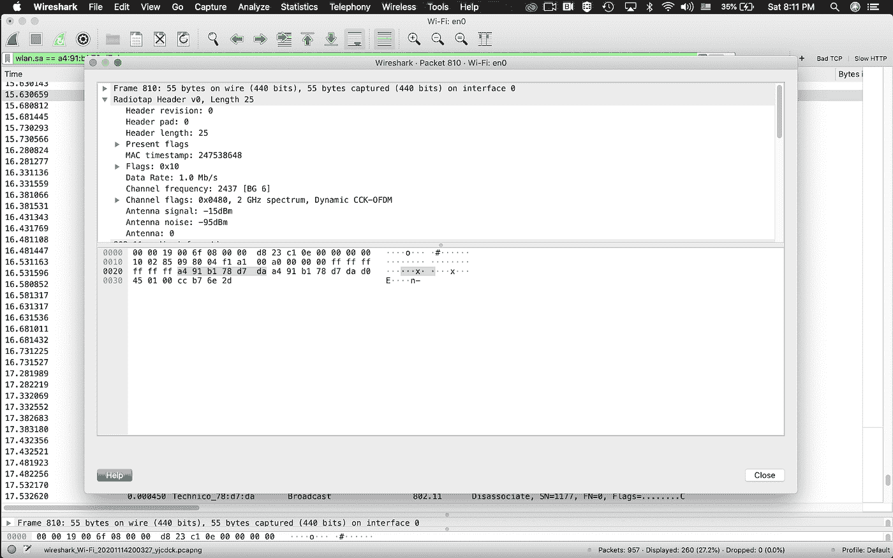
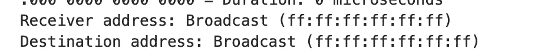

# 令人难以置信的方式在 2 分钟内禁用无线网络

> 原文：<https://infosecwriteups.com/disable-a-wi-fi-access-point-service-9f404fc2dc5f?source=collection_archive---------1----------------------->

## 看看 15 美元的微控制器会发生什么

**第二部分**

**跟随我的文章** [**“如何在 2 分钟内创建一个假接入点”**](https://medium.com/bugbountywriteup/creating-a-fake-wireless-acess-point-in-2-minutes-7ff3e8400658?source=friends_link&sk=29be82e2a4e9436813f8a50e42bef57d) **让我们看看如何使用我们的去认证器微控制器 https://amzn.to/36kKSWa 去认证接入点或在 2.4Ghz 广播或监听的电台。**

# **这样做，我们实际上使用了拒绝服务攻击，我们的无线接入点或工作站无法建立连接。**

deauth 攻击是在我的个人家庭装备上进行的，如果你计划进行一次攻击，请确保你有这样做的完全许可。此处描述仅用于教育目的

**在我们开始之前，让我们了解更多关于 Wi-Fi 过程的事实**

# **管理框架**

**在 wi-fi 世界中，我们有 3 种主要的帧类型**

*   管理框架
*   控制框架
*   数据帧

管理帧是**协商器**，它们主要用于协商初始连接并保持其稳定，它们被我们的无线站用来加入和离开 BSS(基本服务集)

# **以下是我站加入并关联无线接入点**的流程

**在我们的无线站点的探测请求和探测响应之后，我们进入认证和关联部分，在该部分的最后，我们的站点连接到无线路由器或接入点**

**当我们完成认证和关联状态时，我们的客户端可以发送数据帧。**

默认情况下，管理帧的速率是最低的，因为我们希望每个人都能听到它们，甚至是旧的 wi-fi 标准

当我们的工作站离开接入点时(例如，由于距离(覆盖区域)，它还没有接收到任何信号)，它会向接入点发送一个身份验证帧，告诉他，“**“我要离开了”**

另一方面，您的接入点或无线路由器可以出于多种原因向工作站发送**解除关联**帧，其中一个原因是工作站发送了错误的密码

**解除关联**帧断开连接，并将整个连接过程从头开始设置

现在让我们看看我们的 deauther 如何通过向选择的目标发送大量死亡帧来终止连接，在这种情况下，我们将攻击我自己的 wifi 网络

我使用的是 2.4Ghz 的 deauther，所以只有 2.4 GHz 的 wifi 网络会注意到攻击

# **那么让我们开始**

和以前一样。我们需要连接到 **pwned SSID** ，并在我们的 URL 字段中键入以下地址 192.168.4.1

在我们的 deauther admin 页面上，我们将选择希望从 deauth 帧发送到其客户端的接入点(因此没有人能够连接到它

我将选择我自己的家用路由器，然后我将转到第三部分“攻击”

出于我们的目的，我们将使用 deauth 攻击，所以让我们按下开始攻击，一旦我们这样做，我们可以随时停止攻击

# **接下来我们将使用 Wireshark** 查看我们的 wi-fi 流量

我们可以非常清楚地看到，我们的接入点发送了一个解除认证和解除关联的消息

**现在让我们通过双击来查看框架本身**

在帧的详细信息中，我们可以看到一个解除关联帧被发送到广播域，因此任何试图连接的人都会收到一个解除身份验证帧和一个已连接的人的解除关联帧

我拍下了这个过程的视频，所以在这里

**免责声明—此演示仅用于教育目的，请小心使用**

你可以订阅我在 youtube.com/fortitip 的频道或者参加我在 https://www.udemy.com/course/fortigate-admin-crash-course/?的 FortiGate 课程 referral code = 0b 534 DCF 7 a6 D8 BD 3417 e