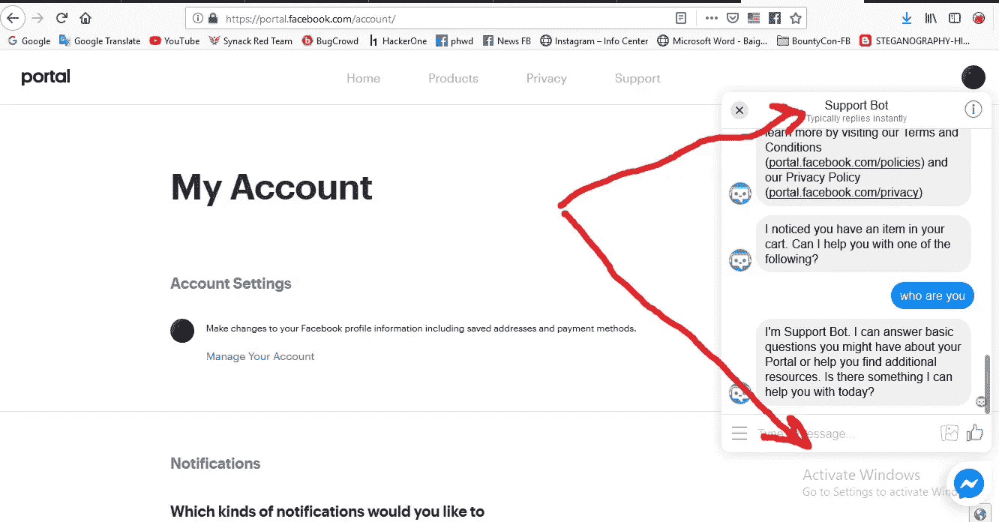
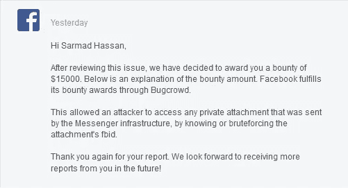

# 披露 Facebook Messenger 基础设施中的私人附件- 15，000 美元

> 原文：<https://infosecwriteups.com/disclose-private-attachments-in-facebook-messenger-infrastructure-15-000-ae13602aa486?source=collection_archive---------0----------------------->

大家好，今天我想和大家分享我目前为止在脸书发现的最关键的 bug，让我们开始吧:)

2019 年 1 月 22 日凌晨 4 点我正在抽烟，突然想到了 [**门户脸书**](https://portal.facebook.com/) 。

# 什么是门户脸书

脸书门户是来自脸书的视频通信设备。更多详情见此 [**链接**](https://portal.facebook.com/)

我之前已经测试过**portal.facebook.com**了，没有发现任何东西，但是当我再次打开网站，切换到**账户设置的时候，**我看到了以前没有看到的**新**的东西，见下图:

在门户网站脸书支持机器人聊天

然后我注意到您可以上传附件，例如，**图像、视频和文件**，当我看到我说我需要测试**这个上传功能**时，我上传了普通图像并用 Burpsuite 拦截了请求，以查看 post 请求中的参数类型，然后我看到了:

> POST/messaging/send/HTTP/1.1
> 主持人:【www.facebook.com】T21
> 
> client = mercury & action _ type = ma-type:user-generated-message & body = & periodic _ TTL _ mode = 0 & has _ attachment = true &**image _ ids[0]= 123**&message _ id = 111&offline _ threading _ id = 123

正如你在上面的请求中看到的，有一个有趣的参数**叫做 **image_ids[0]** ，它指的是我在门户网站脸书聊天上传的图片，我说如果我**把这个 ID** 改成**其他用户图片 ID** ，我能公开他的图片吗！！！？？其他附件(文件、视频、音频消息)呢！！在门户聊天中做了大量测试后，我注意到以下情况:**

*   我可以向其他用户披露通过聊天发送的任何附件，这些附件包括(**图像、文件、视频和音频消息**
*   它适用于所有脸书聊天基础设施(**脸书主聊天、信使、门户聊天和工作场所聊天**)
*   我能够从任何聊天(脸书主聊天，信使，工作场所和门户聊天)中重现这个错误，这没关系，因为**是相同的**
*   我不得不在 Burpsuite 的**代理标签**中保持请求活动，以成功重现 bug，将它发送到**中继器**会给我一个错误(直到现在也不知道为什么)

# 我的想法:

想象一下，如果一个恶意的黑客发现了这个漏洞，并创建了一个工具来暴力破解其他用户的 ID(图像 ID，视频 ID，文件 ID 和音频消息 ID)，更不用说我们谈论的是每天使用脸书聊天的数百万用户，想象一下，如果他泄露了一个非常重要的人的音频消息，照片或视频…例如，如果我们谈论的是**的隐私**，这真的很危险。

我直接向**脸书安全团队**报告了此事，他们给了我一笔可观的赏金 **15k，**非常感谢这些家伙的赏金:)

Also I would like to thanks my brothers [**Kassem Bazzoun**](https://www.facebook.com/Kassembazoun)**,**[**張啟元**](https://www.facebook.com/robots.tx) **and** [**Max Pasqua**](https://www.facebook.com/max.pasqua) for their great support :)

**时间表:**
2019 年 1 月 22 日—初始报告
2019 年 2 月 04 日—报告分类
2019 年 2 月 13 日—错误修复
2019 年 2 月 13 日—修复确认
2019 年 2 月 13 日—奖励 15k

**概念验证视频:**

**外卖:**

1-试着不时地测试你的目标，有时你会像我一样看到一些你从未见过的东西。

2-不要相信回应，得到一个错误并不意味着结束:)

谢谢你

萨尔马德·哈桑 ( [朱巴巴格达](https://twitter.com/JubaBaghdad)

*关注* [*Infosec 报道*](https://medium.com/bugbountywriteup) *获取更多此类精彩报道。*

 [## 信息安全报道

### 收集了世界上最好的黑客的文章，主题从 bug 奖金和 CTF 到 vulnhub…

medium.com](https://medium.com/bugbountywriteup)