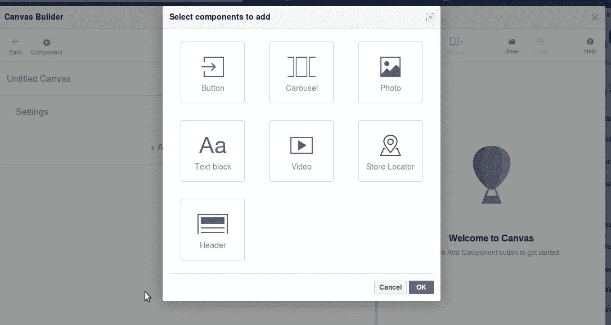
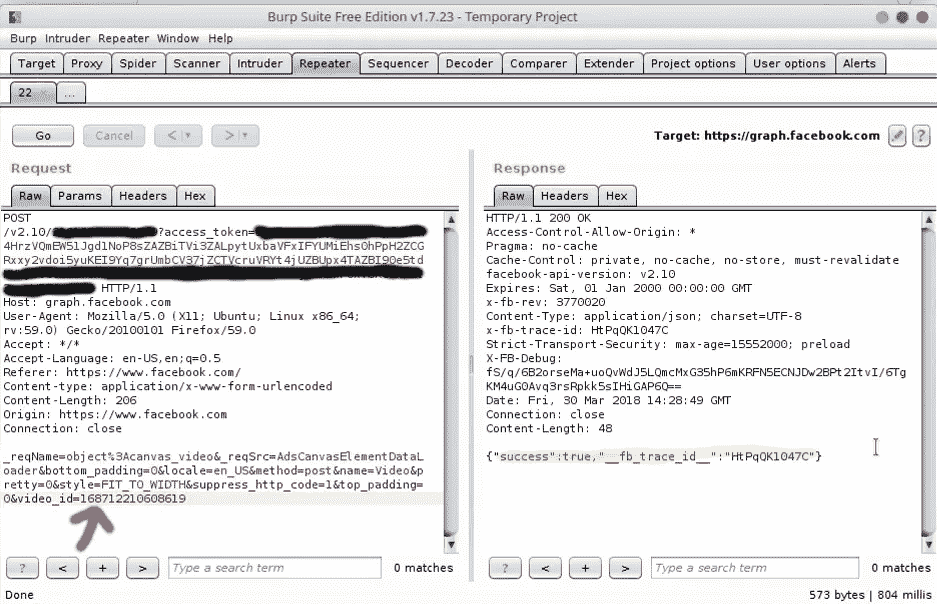
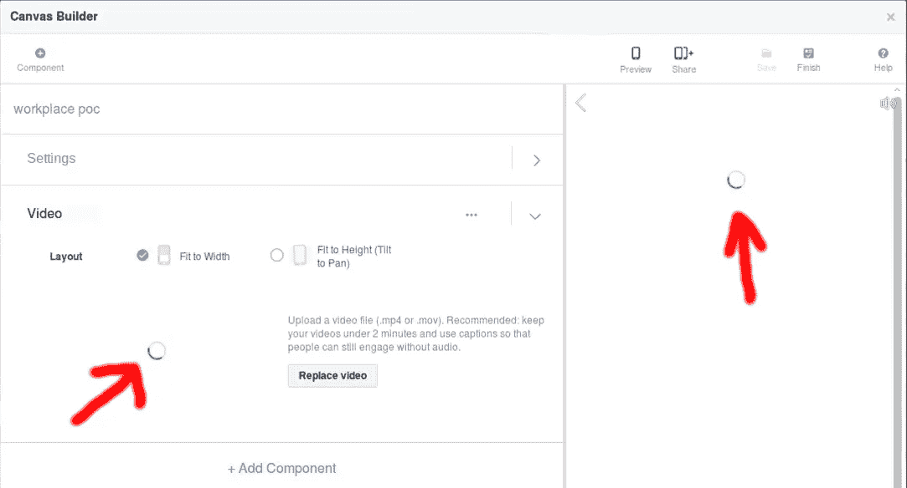
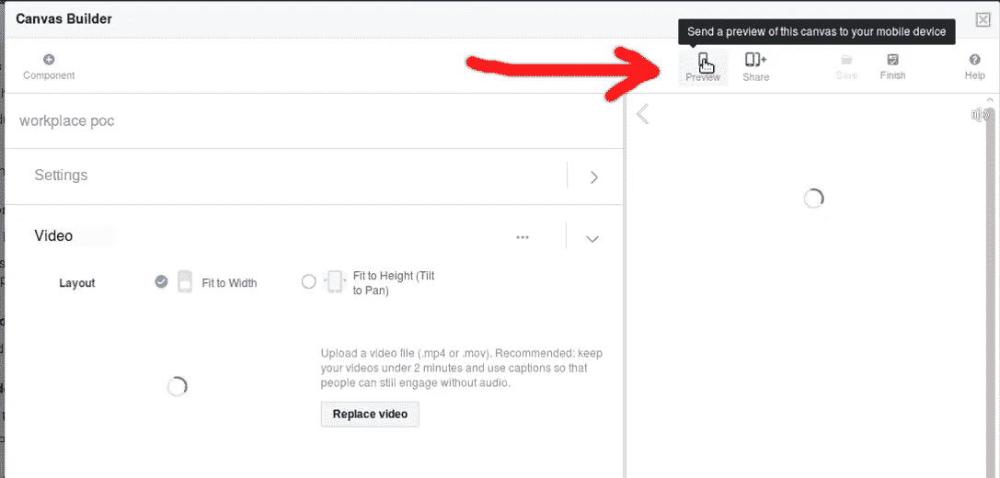
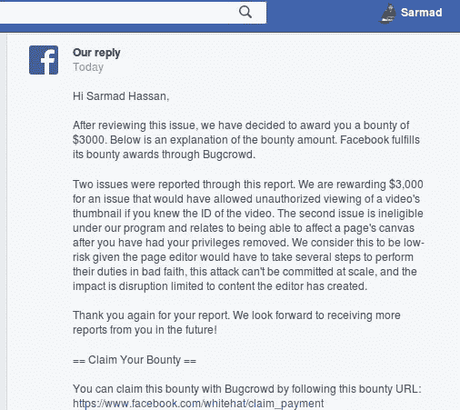

# 披露脸书工作场所的私人视频缩略图

> 原文：<https://infosecwriteups.com/disclose-private-video-thumbnail-from-facebook-workplace-52b6ec4d73b7?source=collection_archive---------1----------------------->

大家好，又是我**萨马德·哈桑(** [**朱巴巴格达**](https://twitter.com/JubaBaghdad) **)** ，我想和大家分享一下**我在**脸书**通过他们的 [**BugBounty 程序**](http://facebook.com/whitehat/dashboard) **发现的第二个 bug** 。**

这个故事开始于我决定测试脸书页面的时候，因为我通过阅读大量的评论知道，当猎人在页面上找到有效的 bug 时，脸书会支付丰厚的赏金。

所以像往常一样，**我为自己**创建了一个测试页面，我检查了页面上的每个选项，看看是否能找到一些有趣的东西，甚至是有趣的信息。这可能会导致我有效的错误。

过了一会儿，一个名为[**CANVAS**](https://www.facebook.com/business/learn/facebook-create-ad-canvas-ads)**的选项引起了我的注意，基本上**页面管理员甚至是广告商**都可以创建 **CANVAS** ，里面有一些上传照片或视频的选项**

****

**所以我上传了我的测试视频并保存了它，然后我编辑了我创建的**画布**，**之后我更改了画布的标题，然后用 Burpsuite** 截取它以查看这个画布的机制和它里面的参数，请求如下:**

**POST /v2.11/{My_Page_ID}？Access _ Token = { My _ page _ Access _ Token } HTTP/1.1
主机:graph.facebook.com
用户代理:
接受:*/*
接受-语言:en-US，en；q = 0.5
Referer:[https://www.facebook.com/](https://www.facebook.com/)Content-type:application/x-www-form-urlencoded
Content-Length:206
Origin:[https://www.facebook.com](https://www.facebook.com)
Connection:close**

**_ req name = object % 3a canvas _ Video & _ req src = AdsCanvasElementDataLoader & bottom _ padding = 0 & locale = en _ US & method = post & name = Video & pretty = 0 & style = FIT _ TO _ WIDTH & suppress _ http _ code = 1 & top _ padding = 0 &**Video _ id = 956034724555363****

**如你所见，上面有一个名为**video _ id = {视频 id }，**的参数，它负责我上传到画布中的视频**

**有一次我看到那个参数，就直接在我的虚拟盒子里打开了**我的第二个测试账号**，发了帖子上传了测试视频，复制了( **video_id)号****

**就像**:video-id = 130146294495198**，替换到前面提到的**video _ id = { video id }**中，boooooooooooom，视频成功上传到我的页面画布中，响应如下:**

****

**因此，我可以通过**“视频 id 号”**在我的画布中上传任何来自非我好友的用户的**公开视频，以及来自我好友**帖子的任何视频，如果他们**将帖子隐私设置为“仅供好友使用”****

**因为我们在 **(video_id=)** 参数中有一个 [**IDOR**](https://www.owasp.org/index.php/Insecure_Direct_Object_Reference_Prevention_Cheat_Sheet) bug，这意味着两个视频，**我的画布视频和我的第二个测试帐户的视频**有相同的 **video_id 号，**所以我说如果我删除我的画布视频，我的第二个测试帐户帖子中的视频也会被删除，因为逻辑上它们有相同的 **video_id** 号，但不幸的是**

**嗯，我现在该做什么，好吧，让我们跳出框框思考，我必须把这个错误从 **N/A 变成一个有效的错误。****

**第二天 [**脸书职场**](https://www.facebook.com/workplace) 子域进入我的脑海，因为我知道**脸书职场**的每个帖子都被认为是私人的，比如照片或视频，因为只有拥有相同电子邮件域的公司成员才能看到他们的帖子。**

**于是我在**我的职场测试账号**里发了一个视频帖子，看看我能否用 CANVAS IDOR bug(通过 video_id)公开视频，我从我的职场帖子里复制了 **(video_id)** 号**video _ id = 168712210608619**替换到我上面提到的请求里，boooooom，回应如下:**

****

**之后，我刷新页面，点击查看选项，看看我是否可以查看视频**(视频来自我的工作场所账户)**，但我再次看不到视频**，但我注意到一些有趣的事情**见下图:**

****

**正如你在上面的照片中看到的，视频有一个旋转的图标，这意味着视频上传成功，但有东西阻止它预览，我对自己说我真的很接近了，我有**来绕过这个狗屎****

**几分钟后，在我抽烟的时候**一个想法**出现在我的脑海里，我说如果我把我的画布发送到我的智能手机**会怎么样**(因为有一个选项可以将你的画布预览发送到你的移动设备)见下图:**

****

**当我将画布发送到我的智能手机时，我在手机中收到一个通知，告诉我**“您的画布已经可以预览了”**，我点击了它，booooooooom，我在我的设备中看到了视频，但我无法播放整个视频，我只能看到 [**视频缩略图，**](https://support.office.com/en-us/article/capture-or-change-a-video-thumbnail-bbf52fe0-3dd6-4bd7-b199-ccde413f6b1e) 我就像这样:**

**我直接向 [**脸书安全团队**](https://www.facebook.com/whitehat/dashboard) 报告了这个 bug，因为我知道这是一个有效的 bug，为什么！！嗯(从我的角度来看)**脸书工作场所**是为组织或公司设计的，正如我上面提到的，工作场所的每个帖子都被认为是私人的，只有公司或组织的成员才能看到它们的内容，**能够看到**工作场所帖子**中的视频缩略图**被认为是一个安全问题，因为想象这些视频包含私人信息，如会议地点、私人电子邮件、公司的私人标题，如价格、预算、产品销售数字或任何私人信息。这不应该被公众看到，更不用说视频本身的私人内容。**

****时间线:**
三月。2018 年 3 月 30 日—初次报告
4 月。2018 年 05 月——4 月的报告审判
。2018 年 4 月 10 日—由脸书
确定。2018 年 10 月—固定确认
五月。2018 年 03 月-奖励 3000 美元**

****

**我要感谢脸书安全团队的慷慨，谢谢你们**

****概念验证视频:****

****武道:****

**1-你必须知道你的目标，并检查它的每一个选项。**

**2-有时你需要跳出框框思考。**

**3-始终确保你的 bug 会影响应用程序。美国用户或其系统**

**4-始终关注视频和照片 ID，有机会看到流动在那里**

**5-最重要的事情是“玩得开心”。**

**谢谢你**

**萨尔马德·哈桑(朱巴巴格达)**